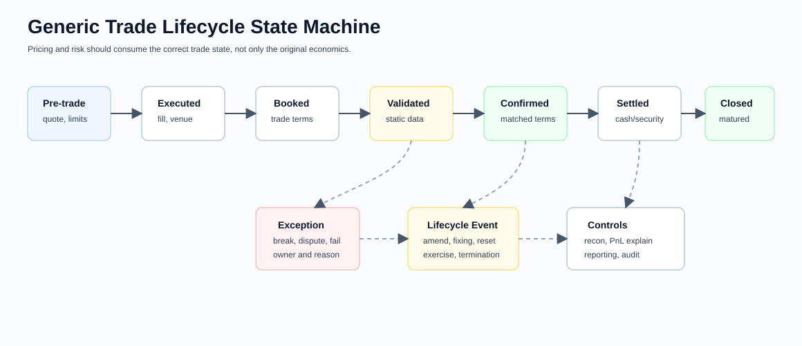

# Quantitative Developer Reference Library Overview

This repo is a practitioner-oriented reference for building, validating, and operating quantitative analytics. It is written for quant developers first: people who need to understand the math well enough to implement it correctly, connect it to market data, and defend the result in production.

## Purpose
- Provide a durable map of core products, pricing ideas, risk measures, and implementation patterns.
- Capture desk conventions and sanity checks that are easy to miss in pure theory notes.
- Keep the structure stable enough that the library can grow chapter by chapter without becoming inconsistent.

## Audience
- Quant developers building pricing, risk, market data, and PnL systems
- Engineering-minded front-office quants
- Practitioners preparing for interviews, design discussions, or production debugging

## How To Read The Library
- Start here once for notation, discounting language, and glossary.
- Use individual chapters as independent references after that.
- Read [01-options.md](01-options.md), [05-fixed-income.md](05-fixed-income.md), [06-interest-rates.md](06-interest-rates.md), and [10-numerical-methods.md](10-numerical-methods.md) together if you want the deepest first pass through implementation-heavy material.
- Read [11-market-data.md](11-market-data.md), [12-pricing-architecture.md](12-pricing-architecture.md), [13-risk-and-pnl.md](13-risk-and-pnl.md), and [14-testing-and-validation.md](14-testing-and-validation.md) as the engineering layer around the analytics.

## Lifecycle View

Every chapter has a pricing lens, a risk lens, and a lifecycle lens. The lifecycle lens asks whether the trade is quoted, executed, booked, confirmed, settled, amended, exercised, fixed, paid, defaulted, matured, or disputed. A model can be correct and still produce the wrong result if it is run against the wrong lifecycle state.

## Library Map

| File | Focus | Why It Matters |
| --- | --- | --- |
| [01-options.md](01-options.md) | Calls, puts, payoff mechanics, contract multipliers, Greeks, volatility surfaces | The most common entry point for pricing and hedging logic |
| [02-futures.md](02-futures.md) | Futures, forwards, basis, carry, margining, and rolling | Core mechanics for listed and OTC linear products |
| [03-equities.md](03-equities.md) | Cash equities, long/short PnL, dividends, financing, factors, execution | Links direct share exposure to real trading and portfolio systems |
| [04-fx.md](04-fx.md) | Spot, forwards, swaps, NDFs, pair orientation, and FX option conventions | Essential for multi-currency systems and collateral logic |
| [05-fixed-income.md](05-fixed-income.md) | Bonds, dated cashflows, clean/dirty price, yields, duration, spread measures | The foundation for rates and credit analytics |
| [06-interest-rates.md](06-interest-rates.md) | Swaps, FRAs, futures, caps/floors, swaptions, fixing logic, curve building | Multi-curve pricing is a quant dev core skill |
| [07-credit.md](07-credit.md) | CDS, default probability, recovery, credit curves, indices, tranche framing | Connects hazard-rate modelling to tradable default-risk products |
| [08-commodities.md](08-commodities.md) | Delivery months, storage, convenience yield, seasonality, location basis, optionality | Highlights where spot-carry intuition breaks |
| [09-cross-asset.md](09-cross-asset.md) | Hybrid payoffs, correlation, collateral, funding, exposure, xVA | Shows what changes once desks, currencies, and curves interact |
| [10-numerical-methods.md](10-numerical-methods.md) | Trees, PDE, Monte Carlo, interpolation, calibration | The implementation toolkit behind every product chapter |
| [11-market-data.md](11-market-data.md) | Symbology, cleaning, timeseries, curves, surfaces | Analytics fail when market state is wrong |
| [12-pricing-architecture.md](12-pricing-architecture.md) | Trade models, engines, dependencies, APIs | Turns formulas into maintainable systems |
| [13-risk-and-pnl.md](13-risk-and-pnl.md) | Greeks, scenarios, explain, controls | Bridges pricing output to daily desk workflows |
| [14-testing-and-validation.md](14-testing-and-validation.md) | Unit tests, numerical controls, model validation | Prevents silent regressions and false confidence |
| [15-performance-and-production.md](15-performance-and-production.md) | Latency, scaling, observability, resilience | Production quality is part of quantitative correctness |
| [16-portfolio-construction-and-backtesting.md](16-portfolio-construction-and-backtesting.md) | Factor models, optimization, backtests, transaction costs | Connects analytics to portfolio decisions and executable workflows |
| [17-inflation-products.md](17-inflation-products.md) | Inflation-linked bonds, CPI swaps, lags, seasonality, real-rate risk | Captures the index mechanics that make inflation products implementation-heavy |
| [18-volatility-products.md](18-volatility-products.md) | Variance swaps, VIX, volatility futures, dispersion, GARCH, regime models, realized variance | Extends option-surface knowledge into traded volatility, volatility forecasting, and correlation exposure |
| [19-financing-repo-and-securities-lending.md](19-financing-repo-and-securities-lending.md) | Repo, reverse repo, securities lending, collateral, haircuts, borrow cost | Makes financing and collateral explicit inputs to pricing and risk |
| [24-structured-credit-and-securitization.md](24-structured-credit-and-securitization.md) | ABS, MBS, CLOs, tranches, waterfalls, collateral performance | Extends credit into securitized pools and loss-priority structures |
| [25-convertibles-and-equity-linked-notes.md](25-convertibles-and-equity-linked-notes.md) | Convertible bonds, bond floor, parity, equity-linked notes | Connects equity optionality, credit, rates, and issuer features |
| [26-equity-swaps-and-total-return-swaps.md](26-equity-swaps-and-total-return-swaps.md) | Equity swaps, TRS, synthetic exposure, financing legs | Captures synthetic equity ownership and prime-brokerage style financing |
| [27-cross-currency-swaps.md](27-cross-currency-swaps.md) | Cross-currency swaps, basis, notional exchanges, collateral currency | Deepens multi-currency funding and curve dependency coverage |
| [28-rates-options-caps-floors-swaptions.md](28-rates-options-caps-floors-swaptions.md) | Caps, floors, swaptions, normal/Black vols, rates optionality | Adds deeper rates-volatility instrument coverage |
| [29-etfs-index-products-and-rebalances.md](29-etfs-index-products-and-rebalances.md) | ETFs, index products, NAV, creation/redemption, rebalances | Makes benchmark and basket mechanics explicit |
| [20-execution-microstructure-and-tca.md](20-execution-microstructure-and-tca.md) | VWAP, TWAP, execution benchmarks, slippage, impact, implementation shortfall, TCA | Connects portfolio decisions to realized trading cost |
| [21-regulatory-margin-capital.md](21-regulatory-margin-capital.md) | Initial margin, variation margin, SIMM, FRTB, stress, capital explain | Links risk analytics to regulatory and collateral requirements |
| [22-model-governance-and-ipv.md](22-model-governance-and-ipv.md) | Model inventory, validation, IPV, reserves, approvals, monitoring | Makes valuation control and model risk management part of the quant stack |
| [23-probability-statistics-and-regression.md](23-probability-statistics-and-regression.md) | Probability, statistics, OLS regression, diagnostics, beta estimation | Makes the statistical foundation explicit for risk, factors, signals, and validation |
| [30-trade-lifecycle-and-operations.md](30-trade-lifecycle-and-operations.md) | Execution, capture, confirmation, settlement, lifecycle events, reconciliations | Connects pricing and risk to the operational state of real trades |
| [31-statistical-arbitrage-and-pairs-trading.md](31-statistical-arbitrage-and-pairs-trading.md) | Pairs, cointegration, residual signals, hedge ratios, execution, model breaks | Connects statistical relationships to realistic long-short portfolio workflows |
| [32-dependence-modelling-and-copulas.md](32-dependence-modelling-and-copulas.md) | Copulas, tail dependence, joint simulation, calibration, dependence stress | Separates marginal risk from the dependence structure that creates joint losses |
| [33-event-driven-and-merger-arbitrage.md](33-event-driven-and-merger-arbitrage.md) | Cash and stock deals, spreads, collars, tenders, close/break scenarios, event states | Connects legal deal terms and catalysts to hedging, expected value, and lifecycle PnL |
| [34-capital-structure-relative-value.md](34-capital-structure-relative-value.md) | Issuer relationships across loans, bonds, CDS, converts, preferreds, and equity | Turns separate product analytics into one claims, recovery, basis, and hedge framework |
| [35-convertible-arbitrage.md](35-convertible-arbitrage.md) | Convertible terms, valuation, stock/credit hedges, borrow, financing, and PnL | Develops the complete strategy workflow behind hybrid equity-credit instruments |
| [36-warrants-rights-pipes-and-spacs.md](36-warrants-rights-pipes-and-spacs.md) | Warrants, rights, PIPEs, SPAC units, redemptions, dilution, and lifecycle events | Covers equity-linked financing instruments whose legal terms drive executable economics |
| [37-volatility-relative-value-and-event-volatility.md](37-volatility-relative-value-and-event-volatility.md) | Surface relative value, event variance, gamma scalping, dispersion, and correlation | Moves from volatility-product taxonomy to trade construction and daily PnL |
| [38-deal-level-risk-and-strategy-pnl.md](38-deal-level-risk-and-strategy-pnl.md) | Related hedges, reasonable-loss budgets, scenarios, liquidity, and PnL attribution | Organizes multi-leg positions around the economic idea rather than isolated security rows |
| [39-private-credit-distressed-and-real-estate-credit.md](39-private-credit-distressed-and-real-estate-credit.md) | Underwriting, covenants, workouts, recoveries, distressed debt, and real-estate credit | Adds illiquid credit, legal priority, and cashflow downside analysis |
| [40-point-in-time-data-and-event-systems.md](40-point-in-time-data-and-event-systems.md) | Bitemporal data, immutable events, as-of queries, corrections, lineage, and replay | Prevents future information and mutable history from corrupting research and risk |
| [41-production-quant-engineering.md](41-production-quant-engineering.md) | Typed models, SQL, distributed risk, testing, CI, deployment, and observability | Turns quantitative formulas into reproducible and operable systems |
| [42-fundamental-catalyst-equity-analysis.md](42-fundamental-catalyst-equity-analysis.md) | Statements, valuation bridges, estimates, catalysts, dilution, and point-in-time fundamentals | Connects company analysis to event-aware quantitative workflows |
| [43-prime-brokerage-counterparty-and-funding.md](43-prime-brokerage-counterparty-and-funding.md) | Stock loan, financing, margin, collateral, counterparty exposure, and liquidity | Makes executable carry, margin cash, and close-out risk explicit |
| [44-robust-portfolio-and-research-validation.md](44-robust-portfolio-and-research-validation.md) | Robust dependence, downside-aware optimization, multiple testing, and research controls | Reduces false discoveries and unstable portfolio conclusions |

## Shared Quantitative Conventions

### Risk-Neutral Pricing
Unless a chapter says otherwise, present values are written under a pricing measure with discounting separated from payoff generation:

$$
V(t) = \mathbb{E}^{\mathbb{Q}}\left[D(t, T) \cdot X_T \mid \mathcal{F}_t\right]
$$

where:
- $X_T$ is the terminal payoff or cashflow stream
- $D(t, T)$ is the discount factor implied by the collateral / discounting convention in force
- the chosen measure depends on the numeraire and is often implementation-specific

This matters because production systems should not hard-code "risk-free rate" into every formula. The correct discount curve depends on collateral, CSA terms, currency, and sometimes product type.

### Time
- Time to maturity is written as $\tau = T - t$ when the model uses continuous time.
- In code, never assume time is measured in calendar years by simple day count division unless the product convention actually does that.
- Day count convention, holiday calendar, business-day adjustment, and schedule generation are first-class data inputs, not formatting details.

### Curves
- Discount curve: maps dates to discount factors used for present valuing collateralized cashflows.
- Forward curve: maps dates or accrual periods to implied forward rates or forward prices.
- Credit curve: maps dates to hazard rates, survival probabilities, or quoted spreads.
- Dividend or borrow curve: maps dates to financing or carry assumptions for equities.
- Inflation curve, repo curve, commodity convenience-yield curve, and basis curves are all domain-specific variations of the same dependency pattern.

### Surfaces And Cubes
- Volatility surface: usually strike-maturity, delta-tenor, or moneyness-tenor.
- Vol cube: surface plus another axis such as swap tenor for swaptions.
- Correlation surface / skew / term structure: used when a single scalar correlation is too weak to explain observed prices.

### Measures, Numeraires, And Model State
- Choose state variables that match the product: spot, forward, short rate, Libor rate, hazard rate, variance process, inventory level, or factor vector.
- Choose a measure that simplifies simulation or valuation: money-market, terminal, forward, annuity, or stock numeraire are common examples.
- In architecture, separate immutable market observations from derived state such as interpolated nodes, calibrated parameters, and cached Jacobians.

## Notation

| Symbol | Meaning |
| --- | --- |
| $S_t$ | Spot price at time $t$ |
| $F(t, T)$ | Forward price or forward rate for settlement at $T$ |
| $K$ | Strike, fixed rate, or quoted contract level |
| $r$ | Continuously compounded rate when a single-rate simplification is used |
| $q$ | Dividend yield or carry yield in equity-style models |
| $\sigma$ | Volatility parameter or implied volatility quote |
| $P(t, T)$ | Discount factor from $t$ to $T$ |
| $L(T_i, T_{i+1})$ | Forward Libor / Ibor style rate over an accrual period |
| $N(x)$ | Standard normal CDF |
| $n(x)$ | Standard normal PDF |
| $\Delta, \Gamma, \nu, \Theta, \rho$ | First-line option Greeks: delta, gamma, vega, theta, rho |
| PV01 / DV01 | Present-value change for a one basis point rate move |

## Unit And Quote Discipline
- Rates can be quoted in percent while engines expect decimals. Make conversion explicit.
- Volatility is commonly quoted in percent, variance is dimensionless per unit time, and time scaling matters.
- A basis point is $10^{-4}$ in absolute rate units.
- Clean price and dirty price are different objects.
- Premium currency, reporting currency, and collateral currency may differ.
- Delta conventions are not universal across asset classes. Equity delta and FX delta are not interchangeable concepts.

## Cross-Chapter Glossary

| Term | Working Definition |
| --- | --- |
| Carry | Expected PnL from holding a position assuming unchanged market levels under a chosen roll convention |
| Roll-down | PnL from moving along a curve or surface as time passes |
| Basis | Difference between related quoted instruments that should not be forced into a single scalar spread |
| Calibration | Choosing model parameters to fit observable market prices or vol quotes |
| Explain | Decomposing realized or hypothetical PnL into risk-factor contributions |
| No-arbitrage | A set of constraints that prevent obviously inconsistent prices, such as negative densities or broken parity relationships |
| Point-in-time | Restricted to information that was actually available at a declared historical cutoff |
| Related hedge | Position included with a core trade to neutralize or bound a named risk while preserving the intended thesis |
| Sticky strike / sticky delta | Rules for how implied vol is assumed to move when spot moves, used for risk calculations and surface shocks |

## Common Sanity Checks
- Prices should satisfy trivial bounds before they hit a pricing engine.
- Parity identities should hold within tolerance when products are related by replication.
- Discount factors should be monotone non-increasing in maturity under standard assumptions.
- Survival probabilities should stay in $[0, 1]$ and decrease with time.
- Calendar, day count, and schedule changes should be explainable from conventions, not from hidden defaults.
- Bump sizes must be stable enough to avoid noise but small enough to approximate the intended derivative.

## Coverage Review And Expansion Areas
The library has broad first-pass coverage across probability and statistics, robust research validation, core pricing, traded products, event-driven and relative-value strategies, securitized/private/distressed credit, convertibles and convertible arbitrage, warrants/rights/PIPEs/SPACs, swaps, ETFs/index products, volatility relative value, fundamental catalyst analysis, deal-level risk, point-in-time data, distributed production engineering, portfolio workflow, prime-broker financing, execution, trade lifecycle, regulatory margin, and model governance.

The clearest next improvements are implementation-oriented:
- complete the runnable specifications in [CAPSTONE-PROJECTS.md](CAPSTONE-PROJECTS.md),
- add calibration case studies for curves, volatility surfaces, inflation curves, and credit curves,
- expand multi-asset stress exercises across market, liquidity, counterparty, borrow, and funding risk,
- add licensed or reproducibly generated data fixtures for each capstone,
- add crypto and digital-asset market structure only if the library scope expands into that asset class.

## Chapter Contract
Every chapter in this repo follows the same top-level structure:
1. What This Domain Covers
2. Product Taxonomy and Market Structure
3. Quoting and Market Conventions
4. Core Pricing Framework
5. Worked Instrument Example where concrete cashflows or payoff mechanics help
6. Key Risk Measures and Sensitivities
7. Required Data, Curves, Surfaces, and Calibration Objects
8. Numerical and Implementation Approaches
9. Production Pitfalls and Sanity Checks
10. Illustrative Code
11. References and Further Reading

## Recommended Reading Paths
- Build the core stack: [01-options.md](01-options.md) -> [10-numerical-methods.md](10-numerical-methods.md) -> [12-pricing-architecture.md](12-pricing-architecture.md)
- Build the statistics foundation: [23-probability-statistics-and-regression.md](23-probability-statistics-and-regression.md) -> [32-dependence-modelling-and-copulas.md](32-dependence-modelling-and-copulas.md) -> [13-risk-and-pnl.md](13-risk-and-pnl.md) -> [16-portfolio-construction-and-backtesting.md](16-portfolio-construction-and-backtesting.md)
- Build rates competency: [05-fixed-income.md](05-fixed-income.md) -> [06-interest-rates.md](06-interest-rates.md) -> [11-market-data.md](11-market-data.md)
- Build production judgment: [13-risk-and-pnl.md](13-risk-and-pnl.md) -> [14-testing-and-validation.md](14-testing-and-validation.md) -> [15-performance-and-production.md](15-performance-and-production.md)
- Build portfolio engineering judgment: [03-equities.md](03-equities.md) -> [16-portfolio-construction-and-backtesting.md](16-portfolio-construction-and-backtesting.md) -> [13-risk-and-pnl.md](13-risk-and-pnl.md)
- Build valuation-control judgment: [22-model-governance-and-ipv.md](22-model-governance-and-ipv.md) -> [14-testing-and-validation.md](14-testing-and-validation.md) -> [21-regulatory-margin-capital.md](21-regulatory-margin-capital.md)
- Build execution and financing judgment: [19-financing-repo-and-securities-lending.md](19-financing-repo-and-securities-lending.md) -> [20-execution-microstructure-and-tca.md](20-execution-microstructure-and-tca.md) -> [16-portfolio-construction-and-backtesting.md](16-portfolio-construction-and-backtesting.md)
- Build event and special-situations judgment: [33-event-driven-and-merger-arbitrage.md](33-event-driven-and-merger-arbitrage.md) -> [36-warrants-rights-pipes-and-spacs.md](36-warrants-rights-pipes-and-spacs.md) -> [38-deal-level-risk-and-strategy-pnl.md](38-deal-level-risk-and-strategy-pnl.md)
- Build capital-structure and convertible judgment: [07-credit.md](07-credit.md) -> [25-convertibles-and-equity-linked-notes.md](25-convertibles-and-equity-linked-notes.md) -> [34-capital-structure-relative-value.md](34-capital-structure-relative-value.md) -> [35-convertible-arbitrage.md](35-convertible-arbitrage.md)
- Build point-in-time production judgment: [11-market-data.md](11-market-data.md) -> [40-point-in-time-data-and-event-systems.md](40-point-in-time-data-and-event-systems.md) -> [41-production-quant-engineering.md](41-production-quant-engineering.md) -> [CAPSTONE-PROJECTS.md](CAPSTONE-PROJECTS.md)
- Build robust research judgment: [23-probability-statistics-and-regression.md](23-probability-statistics-and-regression.md) -> [32-dependence-modelling-and-copulas.md](32-dependence-modelling-and-copulas.md) -> [44-robust-portfolio-and-research-validation.md](44-robust-portfolio-and-research-validation.md)
