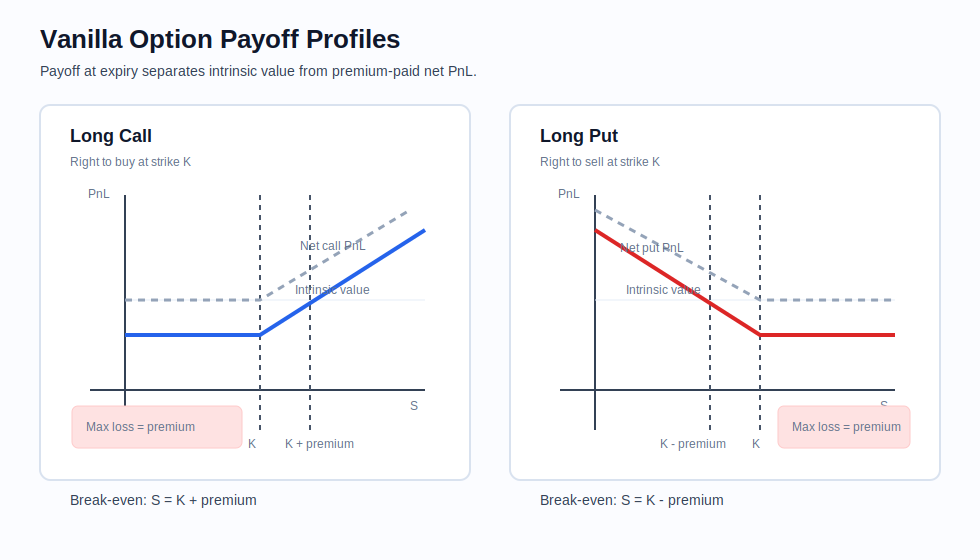
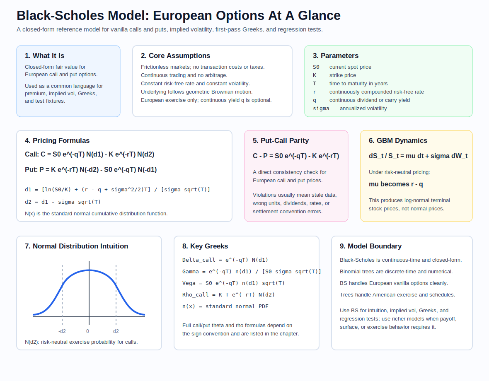
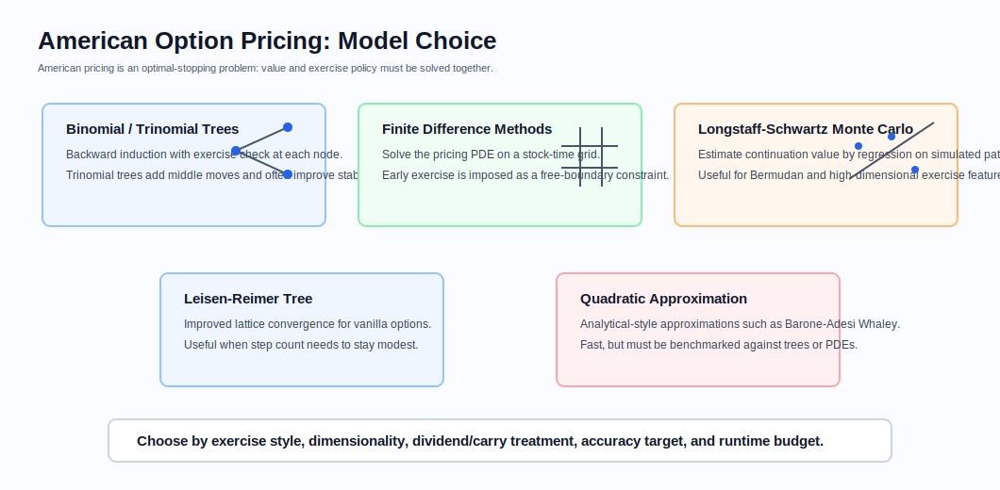
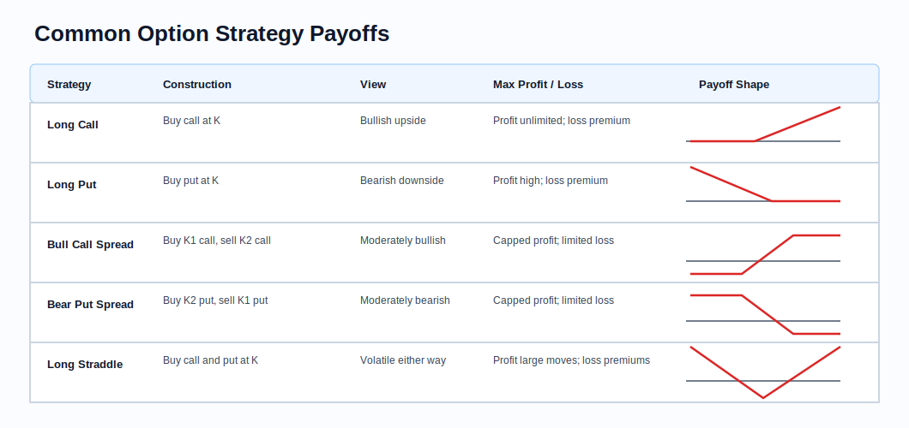
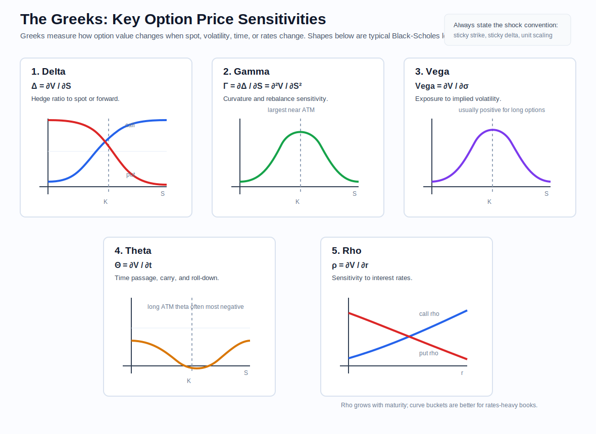
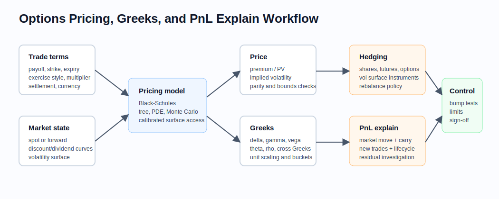

# Options Pricing and Risk Management

Related chapters: [10-numerical-methods.md](10-numerical-methods.md), [11-market-data.md](11-market-data.md), [12-pricing-architecture.md](12-pricing-architecture.md), and [13-risk-and-pnl.md](13-risk-and-pnl.md).

## What This Domain Covers
Options are contracts that give the buyer the right, but not the obligation, to trade an underlying asset at a fixed strike price. A call gives upside participation above the strike. A put gives downside protection or downside participation below the strike. The buyer pays a premium up front; the seller receives that premium and takes the opposite payoff risk.

For a quant developer, this means more than a payoff formula. You need surface construction, risk representation, hedge intuition, exercise logic, contract multipliers, expiry handling, and consistent market-data treatment. This chapter focuses on listed and OTC vanilla options first, then sketches the path to more complex exotics.

## Product Taxonomy and Market Structure
- European calls and puts: single exercise at expiry, often the cleanest starting point for analytics.
- American options: early exercise possible; this matters most for puts, discrete dividends, and commodity or rates exercise styles.
- Bermudan options: exercise only on a set of dates; common in callable fixed-income structures.
- Digitals, barriers, Asians, lookbacks, cliquets, and autocallables: exotics that expose path dependence, discontinuities, or multiple state variables.
- Listed options: standardized expiries, strikes, multipliers, clearing, and visible market microstructure.
- OTC options: customized notionals, schedules, barriers, settlement styles, and collateral terms.

Replication logic is central. A large part of options infrastructure is built around relationships between payoffs, not just direct valuation. Vanilla calls and puts span a basis for many structured payoffs, and risk reports often reduce exotic books back to vanilla hedges and benchmark Greeks.

## Worked Instrument Example: Equity Calls And Puts
Assume, hypothetically, Apple stock is trading at $277 today. A trader buys a 30-day listed call option with:
- strike: $300,
- quoted premium: $5.00 per share,
- equity option multiplier: 100 shares per contract,
- position size: 100 option contracts.

The phrase "one option contract" does not mean one share. For a standard US equity option, one contract usually controls 100 shares. A quoted premium of $5.00 therefore costs:

$$
5.00 \times 100 = 500
$$

per contract, before fees. For 100 contracts:

$$
5.00 \times 100 \times 100 = 50{,}000
$$

The buyer has paid $50,000 for the right to buy 10,000 Apple shares at $300 in 30 days. The call's intrinsic value at expiry is:

$$
\max(S_T - 300, 0) \times 10{,}000
$$

The net PnL after premium is:

$$
\left[\max(S_T - 300, 0) - 5\right] \times 10{,}000
$$

| Apple price at expiry | Call intrinsic value | Net PnL after $50,000 premium | Interpretation |
| --- | ---: | ---: | --- |
| $260 | $0 | -$50,000 | The call expires worthless; the stock moved down. |
| $277 | $0 | -$50,000 | The stock stayed below the strike; the right to buy at $300 has no value. |
| $300 | $0 | -$50,000 | At-the-strike at expiry still does not recover the premium. |
| $305 | $50,000 | $0 | Break-even: $300 strike plus $5 premium. |
| $330 | $300,000 | $250,000 | The call is valuable because buying at $300 is better than market at $330. |

A put is the mirror intuition: it gives the right to sell at the strike. If the trader instead buys a 30-day $250 put for $4.00 per share on 100 contracts, the premium is:

$$
4.00 \times 100 \times 100 = 40{,}000
$$

The put's net PnL at expiry is:

$$
\left[\max(250 - S_T, 0) - 4\right] \times 10{,}000
$$

| Apple price at expiry | Put intrinsic value | Net PnL after $40,000 premium | Interpretation |
| --- | ---: | ---: | --- |
| $220 | $300,000 | $260,000 | The put pays because selling at $250 is better than market at $220. |
| $246 | $40,000 | $0 | Break-even: $250 strike minus $4 premium. |
| $250 | $0 | -$40,000 | At-the-strike at expiry does not recover the premium. |
| $277 | $0 | -$40,000 | The stock stayed above the strike; the put expires worthless. |
| $310 | $0 | -$40,000 | Upside in the stock does not help a long put. |

This example is expiry-only. Before expiry, the option can still have time value because there is remaining uncertainty. That is why an out-of-the-money call or put can trade above zero before the final day.

### Visual Payoff Reference



Read the blue call line as upside participation after the strike and premium are recovered. Read the red put line as downside participation after the strike less premium break-even is crossed. The dashed lines show intrinsic value before premium.

## Quoting and Market Conventions
- Equity and index options are often discussed in implied-volatility terms, not premium terms.
- Strike grids, expiries, contract multipliers, exercise style, settlement type, and dividend treatment all matter operationally.
- Time-to-expiry must align with the exchange or confirmation convention, including expiry cut-off time.
- Equity index options often depend on dividend assumptions or an index forward; single-stock options may also need borrow or stock-loan inputs.
- Surface coordinates differ by asset class. Equity desks often think in strike or moneyness, while FX and rates desks often quote in delta space or tenor-by-tenor smile parameters.

Useful identities:

$$
C - P = S_0 e^{-qT} - K e^{-rT}
$$

for continuous dividend yield $q$. In production, discrete dividends, borrow, or multiple discounting curves modify the practical implementation but not the replication idea.

No-arbitrage bounds for European options:

$$
\max(S_0 e^{-qT} - K e^{-rT}, 0) \leq C \leq S_0 e^{-qT}
$$

$$
\max(K e^{-rT} - S_0 e^{-qT}, 0) \leq P \leq K e^{-rT}
$$

If quoted prices violate these, the issue is usually stale market data, inconsistent discounting/dividends, wrong units, or a broken surface interpolation.

## Core Pricing Framework

### Black-Scholes As The Reference Model
Black-Scholes gives a closed-form price for European vanilla calls and puts. It is used less because its assumptions are fully realistic and more because it gives the market a shared baseline for implied volatility, Greeks, parity checks, and regression tests.



Core assumptions:
- frictionless markets with no transaction costs or taxes,
- no arbitrage and continuous trading,
- constant risk-free rate and constant volatility,
- the underlying follows geometric Brownian motion,
- European exercise only,
- no dividends in the simplest form, or a continuous dividend/carry yield $q$ in the extended form.

Under the continuous-yield Black-Scholes setup:

$$
\frac{dS_t}{S_t} = (r - q)dt + \sigma dW_t
$$

the European option price satisfies:

$$
\frac{\partial V}{\partial t} + \frac{1}{2}\sigma^2 S^2 \frac{\partial^2 V}{\partial S^2} + (r-q)S\frac{\partial V}{\partial S} - rV = 0
$$

Closed-form vanilla prices:

$$
C = S_0 e^{-qT} N(d_1) - K e^{-rT} N(d_2)
$$

$$
P = K e^{-rT} N(-d_2) - S_0 e^{-qT} N(-d_1)
$$

$$
d_1 = \frac{\ln(S_0 / K) + (r - q + \sigma^2 / 2)T}{\sigma \sqrt{T}}, \qquad d_2 = d_1 - \sigma \sqrt{T}
$$

Parameter meanings:

| Symbol | Meaning |
| --- | --- |
| $S_0$ | Current spot price of the underlying |
| $K$ | Strike price |
| $T$ | Time to expiry in years under the chosen day-count |
| $r$ | Continuously compounded risk-free rate or discount rate in the pricing currency |
| $q$ | Continuous dividend, foreign-rate, borrow, or carry yield depending on asset class |
| $\sigma$ | Annualized volatility used by the model |
| $N(x)$ | Standard normal cumulative distribution function |

Useful intuition:
- $N(d_2)$ is often read as the risk-neutral probability that a European call finishes in the money.
- $N(d_1)$ is the share-adjusted hedge term that appears in call delta.
- $K e^{-rT}$ is the present value of the strike payment.
- $S_0 e^{-qT}$ is the carry-adjusted spot leg.
- As $\sigma \to 0$ or $T \to 0$, the option value collapses toward discounted intrinsic value.

The Black-Scholes model is not the truth. It is the common language used to convert premiums into implied volatility, generate first-pass Greeks, and anchor testing.

Compared with a binomial tree:

| Feature | Black-Scholes | Binomial tree |
| --- | --- | --- |
| Time model | Continuous time | Discrete time |
| Main vanilla use | European options | European and American options |
| Solution style | Closed form for vanilla calls and puts | Numerical backward induction |
| Primary inputs | $S_0$, $K$, $T$, $r$, $q$, $\sigma$ | $S_0$, $K$, $T$, $r$, $q$, $\sigma$, number of steps |
| Speed | Very fast | Slower, depends on step count |
| Limiting link | Reference formula | Converges toward Black-Scholes as steps increase under matching assumptions |

### Why Black-Scholes Is Not Enough
- Real smiles and skews imply non-constant volatility.
- Discrete dividends break the clean continuous-yield setup.
- Early exercise requires free-boundary logic.
- Barrier and digital payoffs are extremely sensitive to path behavior and interpolation choices.
- Long-dated products care about stochastic rates, stochastic dividends, or stochastic volatility.

### Implied Volatility And Surface Logic
Implied volatility solves:

$$
\text{ModelPrice}(S_0, K, T, \sigma_{\text{imp}}) = \text{MarketPrice}
$$

The inversion is usually cheap. The hard part is turning sparse, noisy quotes into a stable surface that:
- fits liquid quotes,
- avoids calendar and butterfly arbitrage where possible,
- responds sensibly under spot shocks,
- and exposes risks in the same coordinates traders use.

For implementation, surface design is a product decision as much as a numerical decision. Common choices include:
- direct interpolation in implied vol,
- interpolation in total variance,
- parameterized models such as SVI or SABR,
- local-vol extraction for path-dependent pricing,
- stochastic-vol models for dynamics and hedging realism.

### American And Bermudan Exercise
European replication logic gives bounds and intuition, but not exercise policy. American options are optimal-stopping problems. Common approaches:
- binomial or trinomial trees,
- finite-difference PDE with early exercise condition,
- Longstaff-Schwartz regression for Bermudan features in Monte Carlo settings.

Early exercise is usually only rational when carrying the option is worse than exercising it. For equity calls on non-dividend-paying stocks, early exercise is typically suboptimal. For puts, dividend-paying underlyings, and some commodity structures, it can matter materially.

### American Pricing Model Choice
American exercise adds a free-boundary problem: at each exercise opportunity, the model must compare immediate exercise value against continuation value. There is no single best numerical method; the correct choice depends on exercise dates, dimensionality, accuracy target, runtime, and product complexity.



Common choices:
- Binomial tree: widely used for vanilla American options; simple backward induction and direct exercise checks at every node.
- Trinomial tree: extends the tree with up, middle, and down moves; often improves convergence and numerical stability.
- Finite difference methods: solve the option PDE on a grid and impose the early-exercise constraint; useful for one- or two-factor problems where boundary behavior matters.
- Longstaff-Schwartz Monte Carlo: estimates continuation value by regression; useful for Bermudan or high-dimensional optionality.
- Leisen-Reimer tree: lattice variant designed to improve convergence for vanilla options with fewer steps.
- Quadratic approximations: fast analytical-style approximations such as Barone-Adesi Whaley; useful for speed, but should be benchmarked against trees or PDEs.

Practical model-selection checklist:
- Accuracy requirements and benchmark method.
- Early-exercise dates and dividend/carry treatment.
- Number of risk factors and path-dependent state variables.
- Runtime target for pricing, risk, and calibration.
- Stability of Greeks near the exercise boundary.

### Common Option Strategy Payoffs
Vanilla options combine into standard strategy payoffs. A quant developer should know the construction, market view, maximum loss, and payoff shape because these structures often appear in listed-option analytics, risk reports, payoff explain, and interviews.



| Strategy | Construction | Market View | Max Profit | Max Loss |
| --- | --- | --- | --- | --- |
| Long call | Buy call at strike $K$ | Bullish | Unlimited upside | Premium paid |
| Long put | Buy put at strike $K$ | Bearish | High, capped by strike less premium | Premium paid |
| Bull call spread | Buy lower-strike call, sell higher-strike call | Moderately bullish | Strike width less net premium | Net premium paid |
| Bear put spread | Buy higher-strike put, sell lower-strike put | Moderately bearish | Strike width less net premium | Net premium paid |
| Long straddle | Buy call and put at same strike | Volatility / large move | Large moves in either direction | Total premium paid |

Implementation cautions:
- Strategy PnL must include premiums, multipliers, fees, and assignment/exercise effects.
- Multi-leg strategies need consistent expiry, exercise style, settlement, and corporate-action handling.
- Max profit/loss statements are usually expiry-only; before expiry, volatility, rates, dividends, and early exercise can change mark-to-market behavior.

### Exotics Overview
- Digitals emphasize discontinuity risk and numerical smoothing issues.
- Barriers add path dependence and monitoring conventions.
- Asians reduce spot gamma but introduce averaging schedule dependence.
- Cliquets and ratchets require careful state tracking and payoff decomposition.
- Autocallables combine barriers, coupons, and callable logic, making them architecture-heavy as well as model-heavy.

## Key Risk Measures and Sensitivities

Greeks are local derivatives of option value with respect to a chosen market input. They are not universal constants: the number depends on the model, market-data state, quote convention, and shock convention. A useful first-order risk report should always state whether its Greeks are spot or forward based, premium or volatility based, sticky strike or sticky delta, and per unit or per market convention.



Local Taylor approximation:

$$
\Delta V \approx \Delta\,\Delta S + \frac{1}{2}\Gamma(\Delta S)^2 + \text{Vega}\,\Delta\sigma + \Theta\,\Delta t + \rho\,\Delta r
$$

This is a local approximation, not a stress model. It usually works for small moves and smooth payoffs, then breaks down around barriers, digitals, expiry, exercise boundaries, and large surface shocks.

### First-Line Greeks
- Delta: $\partial V / \partial S$, hedge ratio with respect to spot or a chosen forward proxy.
- Gamma: $\partial^2 V / \partial S^2$, curvature and rebalance sensitivity.
- Vega: sensitivity to implied volatility or surface node shocks.
- Theta: sensitivity to time passage under a specified calendar and carry assumption.
- Rho: rate sensitivity, often secondary in short-dated equity options but material in long-dated or multi-curve settings.

Reference behavior for long vanilla options:

| Greek | Mathematical definition | Long call intuition | Long put intuition | Common production convention |
| --- | --- | --- | --- | --- |
| Delta | $\partial V / \partial S$ | Positive, between 0 and 1 for a non-dividend European call | Negative, between -1 and 0 | Often reported in shares, contracts, or currency delta after multiplier and FX conversion |
| Gamma | $\partial^2 V / \partial S^2$ | Usually positive | Usually positive | Often largest near ATM and near expiry, but unstable extremely close to expiry |
| Vega | $\partial V / \partial \sigma$ | Usually positive | Usually positive | Usually quoted per 1 vol point, so divide analytic vega by 100 |
| Theta | $\partial V / \partial t$ or negative calendar decay depending on convention | Usually negative for long options | Usually negative for long options | Sign convention must be explicit: model theta vs one-day roll-down |
| Rho | $\partial V / \partial r$ | Usually positive for calls | Usually negative for puts | Less useful than curve-bucket PV01 for rates-heavy or long-dated books |

Moneyness and maturity patterns:
- Delta moves toward 1 for deep ITM calls, 0 for deep OTM calls, 0 for deep OTM puts, and -1 for deep ITM puts.
- ATM vanilla options have the highest gamma and vega under Black-Scholes-style assumptions.
- Gamma rises as expiry approaches for near-ATM options, which is why expiry risk can dominate small premium positions.
- Vega is highest for ATM options and usually increases with maturity for otherwise comparable vanillas.
- Theta decay is typically fastest near expiry for ATM options, but dividends, rates, borrow, and deep ITM exercise value can change the sign.
- Rho grows with maturity because discounting and forward effects have more time to matter.

### Black-Scholes Greek Formula Reference
For a European vanilla option with continuous dividend yield $q$:

$$
\phi(d_1) = \frac{1}{\sqrt{2\pi}}e^{-d_1^2/2}
$$

$$
\Delta_{\text{call}} = e^{-qT}N(d_1), \qquad
\Delta_{\text{put}} = e^{-qT}(N(d_1)-1)
$$

$$
\Gamma = \frac{e^{-qT}\phi(d_1)}{S_0\sigma\sqrt{T}}
$$

$$
\text{Vega} = S_0 e^{-qT}\phi(d_1)\sqrt{T}
$$

$$
\Theta_{\text{call}} =
-\frac{S_0 e^{-qT}\phi(d_1)\sigma}{2\sqrt{T}}
- rK e^{-rT}N(d_2)
+ qS_0 e^{-qT}N(d_1)
$$

$$
\Theta_{\text{put}} =
-\frac{S_0 e^{-qT}\phi(d_1)\sigma}{2\sqrt{T}}
+ rK e^{-rT}N(-d_2)
- qS_0 e^{-qT}N(-d_1)
$$

$$
\rho_{\text{call}} = KT e^{-rT}N(d_2), \qquad
\rho_{\text{put}} = -KT e^{-rT}N(-d_2)
$$

Theta above is derivative with respect to calendar time in the Black-Scholes PDE convention. Many desks report "one-day theta" as the PnL from rolling valuation date forward one business or calendar day while applying a defined market-data roll. Those numbers can differ because forwards, dividends, fixings, curves, and surface anchors roll too.

### Second-Order And Cross Greeks
- Vanna: sensitivity of delta to volatility or vega to spot.
- Volga / vomma: second derivative with respect to volatility.
- Charm: rate of change of delta with time.
- Color: rate of change of gamma with time.
- Cross-gammas: matter when products depend on multiple underlyings, vol factors, or rates.

Useful higher-order reference:

| Greek | Meaning | Why it matters |
| --- | --- | --- |
| Vanna | $\partial^2 V / \partial S \partial \sigma$ | Explains why delta changes when implied volatility or skew moves |
| Vomma / volga | $\partial^2 V / \partial \sigma^2$ | Important for large volatility shocks and volatility products |
| Charm | $\partial \Delta / \partial t$ | Explains delta drift through time, especially close to expiry |
| Color | $\partial \Gamma / \partial t$ | Helps manage expiry gamma and intraday rebalance risk |
| Speed | $\partial \Gamma / \partial S$ | Shows how quickly gamma changes as spot moves |
| Veta | $\partial \text{Vega} / \partial t$ | Tracks decay of volatility exposure |
| Vera | $\partial^2 V / \partial \sigma \partial r$ | Relevant for long-dated options where rates and vol interact |

### Desk Risk Representation
The practical question is rarely "what is the analytic Greek?" It is "what risk decomposition is used to hedge and explain PnL?" Common choices:
- spot Greeks from Black-Scholes,
- sticky-strike or sticky-delta surface risk,
- bucketed vega by expiry-strike node,
- scenario shocks to skew and term structure,
- laddered delta across multiple underlyings or correlation buckets.

A risk report is only useful if the surface shock convention matches the desk's mental model. Otherwise the reported vega is not hedgeable.

Greek unit checklist:
- Delta can be reported per option, per contract, in shares, in underlying currency, or after FX conversion. State the multiplier.
- Gamma can be reported per one underlying unit, per 1% spot move, or as cash gamma. Do not aggregate mixed conventions.
- Vega from a formula is usually per 1.00 absolute volatility move; traders often expect per 1 vol point.
- Theta can be annualized, one calendar day, one business day, or a full market-data roll. State the day-count and roll rule.
- Rho can be per 1.00 rate move, per 1 bp, or bucketed by curve tenor. Rates desks usually need bucketed curve risk, not one scalar rho.

Greek validation checklist:
- Compare analytic Greeks to bumped-and-repriced finite differences for representative ITM, ATM, and OTM options.
- Use central differences for smooth payoffs, one-sided or smoothed methods near discontinuities, and scenario repricing near barriers.
- Verify sign and scale after applying contract multiplier, quantity, premium currency, and reporting currency.
- Test near expiry separately; gamma, theta, and digital-like behavior are most likely to expose unstable assumptions there.
- Reconcile local Greeks to daily PnL explain, then investigate residuals rather than accepting them as model noise.

## Required Data, Curves, Surfaces, and Calibration Objects
- Spot or forward level, with reliable timestamping and market source.
- Discount curve in premium currency.
- Dividend assumptions, borrow curve, or stock-loan inputs where relevant.
- Volatility surface quotes with metadata: quote type, strike/delta convention, expiry, cut-off, settlement style.
- Corporate actions, contract multipliers, calendars, and exercise schedules.
- Calibration parameters for SVI, SABR, local vol, or stochastic-vol models if used beyond vanilla analytics.

Strong dependency pattern:
- [11-market-data.md](11-market-data.md) defines how quotes become validated market state.
- [12-pricing-architecture.md](12-pricing-architecture.md) defines how pricing engines consume that market state.
- [13-risk-and-pnl.md](13-risk-and-pnl.md) defines how shock conventions become reported risk.



## Numerical and Implementation Approaches
- Closed-form Black-Scholes is the baseline for vanilla pricing, regression tests, and implied-vol inversion.
- Trees are useful for early exercise, callable features, and intuition about exercise boundaries.
- Finite-difference methods handle early exercise and local state constraints well but need stable grids and boundary conditions.
- Monte Carlo is flexible for path-dependent structures, especially with variance reduction and regression for optionality.
- Adjoint algorithmic differentiation is attractive once the book is large and risk throughput matters.
- Approximation methods for American options should be benchmarked regularly against a slower but trusted tree or PDE implementation.

Implementation guidance:
- Keep payoff definitions separate from model dynamics.
- Separate quote-space objects from calibrated surface-space objects.
- Version surface-building logic; traders notice when "the same" surface changes because interpolation changed.
- Build parity, monotonicity, and limit-case checks into market-data ingestion and pricing tests, not only into docs.

## Production Pitfalls and Sanity Checks
- Wrong time units: days vs year fractions will silently poison theta and vega.
- Dividend handling errors: continuous-yield shortcuts often fail on single-stock books with discrete dividends.
- Surface extrapolation: naive extrapolation can create negative densities or unstable vegas.
- Sticky assumption mismatch: risk runs become unusable if front office expects sticky delta and the engine reports sticky strike.
- American exercise bugs: a tree can look stable while still being wrong because schedule dates or dividend dates are misaligned.
- Barrier monitoring conventions: continuous vs discrete monitoring is not a cosmetic detail.
- Finite-difference and tree grids: convergence should be tested against known cases, not assumed.

Minimum sanity-check set:
- put-call parity within tolerance,
- intrinsic value at expiry,
- monotone price in strike for calls and puts,
- non-negative time value for appropriate products,
- gamma mostly positive for vanilla longs,
- stable implied-vol inversion across the liquid quote set.

## Illustrative Code
```python
import math
from dataclasses import dataclass


def normal_cdf(x: float) -> float:
    return 0.5 * (1.0 + math.erf(x / math.sqrt(2.0)))


@dataclass(frozen=True)
class VanillaResult:
    price: float
    delta: float
    gamma: float
    vega: float
    theta: float
    rho: float


def black_scholes_vanilla(
    spot: float,
    strike: float,
    expiry: float,
    rate: float,
    dividend: float,
    vol: float,
    option_type: str,
) -> VanillaResult:
    if expiry <= 0.0:
        intrinsic = max(spot - strike, 0.0) if option_type == "call" else max(strike - spot, 0.0)
        delta = 1.0 if option_type == "call" and spot > strike else 0.0
        delta = -1.0 if option_type == "put" and spot < strike else delta
        return VanillaResult(price=intrinsic, delta=delta, gamma=0.0, vega=0.0, theta=0.0, rho=0.0)

    sigma_root_t = vol * math.sqrt(expiry)
    d1 = (math.log(spot / strike) + (rate - dividend + 0.5 * vol * vol) * expiry) / sigma_root_t
    d2 = d1 - sigma_root_t
    disc_r = math.exp(-rate * expiry)
    disc_q = math.exp(-dividend * expiry)
    pdf_d1 = math.exp(-0.5 * d1 * d1) / math.sqrt(2.0 * math.pi)

    if option_type == "call":
        price = spot * disc_q * normal_cdf(d1) - strike * disc_r * normal_cdf(d2)
        delta = disc_q * normal_cdf(d1)
        theta = (
            -spot * disc_q * pdf_d1 * vol / (2.0 * math.sqrt(expiry))
            - rate * strike * disc_r * normal_cdf(d2)
            + dividend * spot * disc_q * normal_cdf(d1)
        )
        rho = strike * expiry * disc_r * normal_cdf(d2)
    else:
        price = strike * disc_r * normal_cdf(-d2) - spot * disc_q * normal_cdf(-d1)
        delta = disc_q * (normal_cdf(d1) - 1.0)
        theta = (
            -spot * disc_q * pdf_d1 * vol / (2.0 * math.sqrt(expiry))
            + rate * strike * disc_r * normal_cdf(-d2)
            - dividend * spot * disc_q * normal_cdf(-d1)
        )
        rho = -strike * expiry * disc_r * normal_cdf(-d2)

    gamma = disc_q * pdf_d1 / (spot * sigma_root_t)
    vega = spot * disc_q * pdf_d1 * math.sqrt(expiry)
    return VanillaResult(price=price, delta=delta, gamma=gamma, vega=vega, theta=theta, rho=rho)


def put_call_parity_gap(call_price: float, put_price: float, spot: float, strike: float, expiry: float, rate: float, dividend: float) -> float:
    lhs = call_price - put_price
    rhs = spot * math.exp(-dividend * expiry) - strike * math.exp(-rate * expiry)
    return lhs - rhs
```

This snippet is deliberately small. A production implementation would separate quote conventions, premium currency, exercise style, calendar logic, and surface access from the pricing formula itself.

## References and Further Reading
- Hull, J. *Options, Futures, and Other Derivatives*
- Gatheral, J. *The Volatility Surface*
- Haug, E. *The Complete Guide to Option Pricing Formulas*
- Glasserman, P. *Monte Carlo Methods in Financial Engineering*
- Wilmott, Howison, and Dewynne. *The Mathematics of Financial Derivatives*
