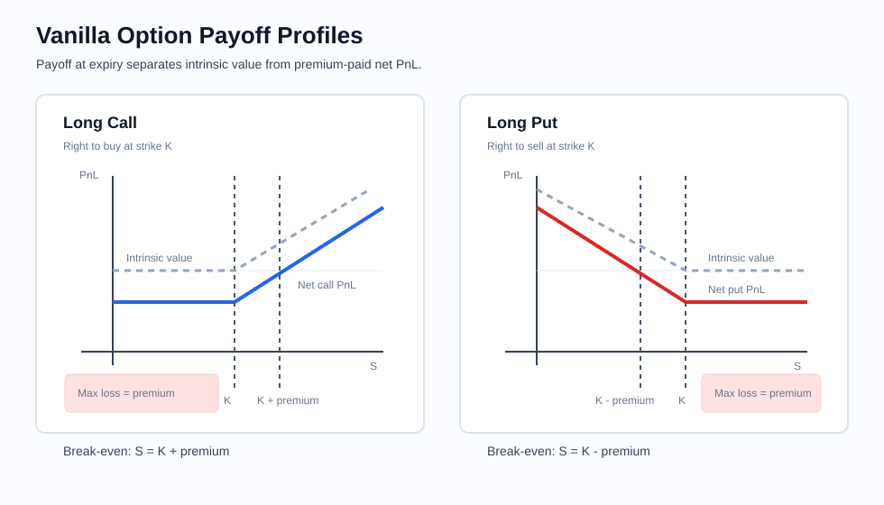
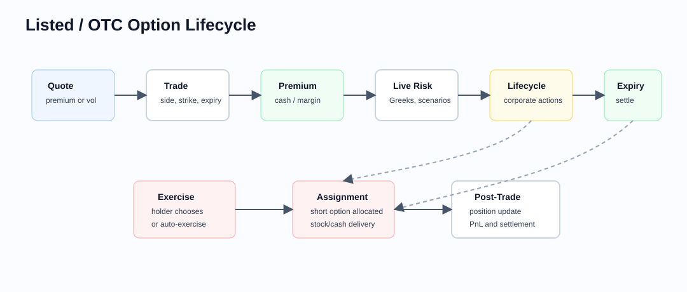
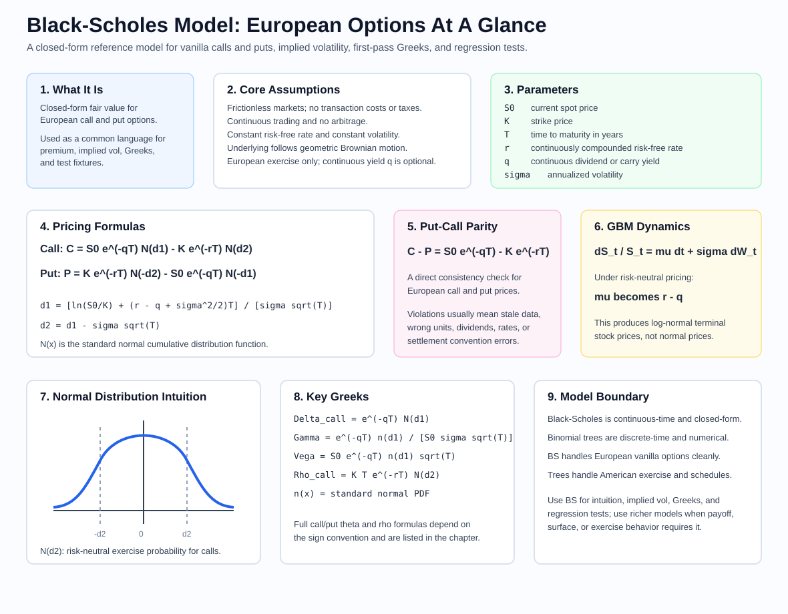
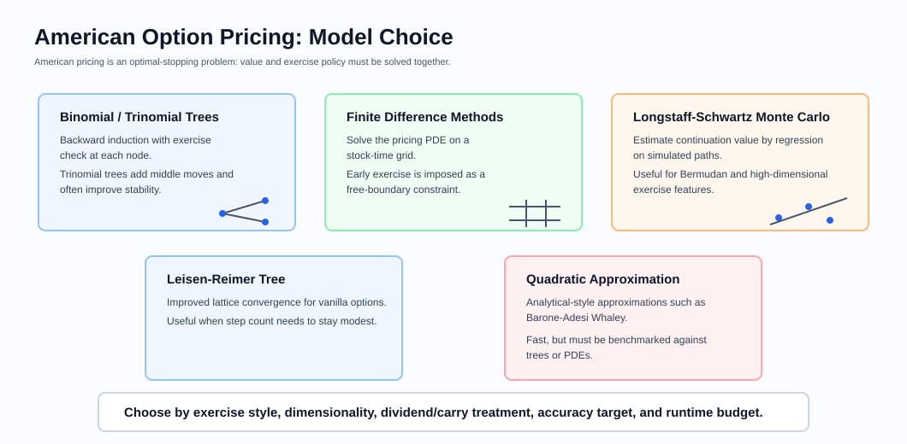
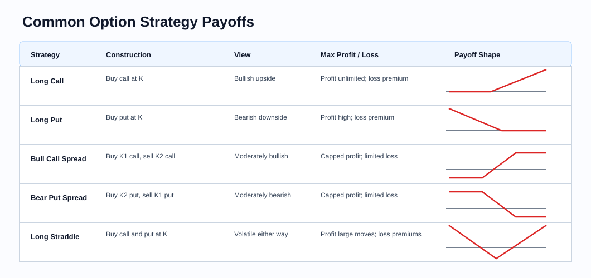
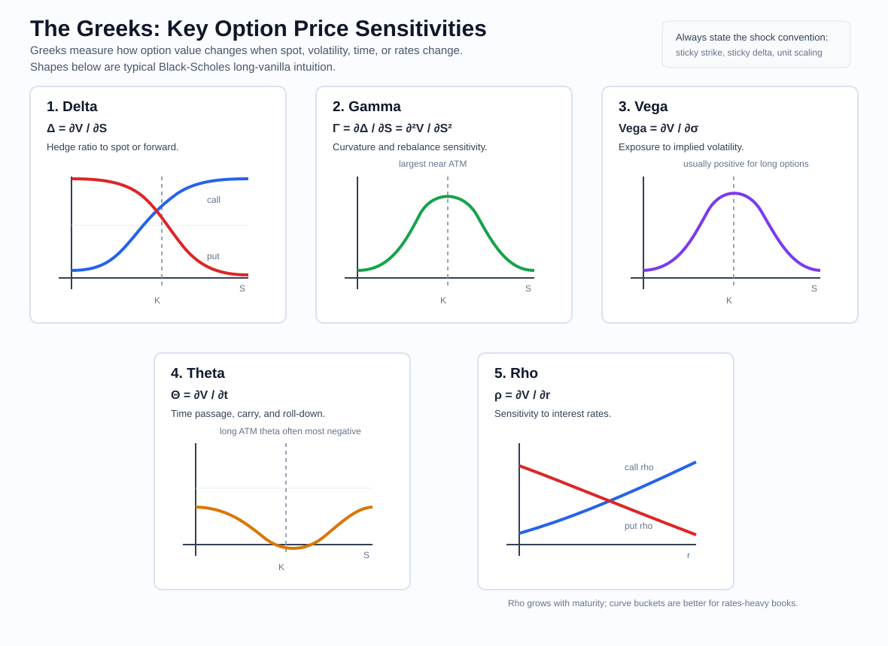
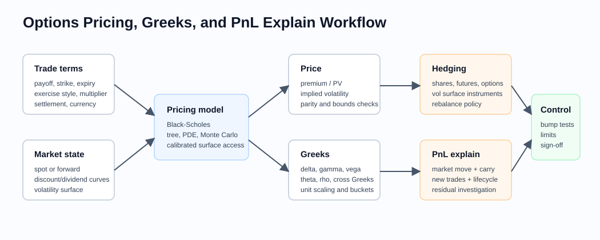

# Options Pricing and Risk Management

Related chapters: [10-numerical-methods.md](10-numerical-methods.md), [11-market-data.md](11-market-data.md), [12-pricing-architecture.md](12-pricing-architecture.md), and [13-risk-and-pnl.md](13-risk-and-pnl.md).

## What This Domain Covers
An option is a contract that gives one side a choice.

A call gives the buyer the right, but not the obligation, to buy an underlying asset at a fixed strike price. A put gives the buyer the right, but not the obligation, to sell at a fixed strike price. The buyer pays a premium for that choice. The seller receives the premium and takes the opposite payoff risk.

That one idea explains most of the chapter:

- The payoff is asymmetric because the buyer can walk away.
- The premium exists because that choice has value before expiry.
- The value depends on uncertainty, so volatility becomes central.
- Risk reports focus on how the option value changes when spot, volatility, time, rates, or dividends move.

For a quant developer, options are not just a formula. A production options system needs payoff logic, contract multipliers, calendars, exercise rules, volatility surfaces, Greeks, market-data conventions, risk shock conventions, and validation checks.

## Product Taxonomy and Market Structure
Start with exercise style:

- European options can be exercised only at expiry. They are the cleanest starting point for pricing.
- American options can be exercised any time before expiry. This adds an exercise decision at every point in time.
- Bermudan options can be exercised only on specified dates. This is common in callable rates and structured products.

Then separate the payoff shape:

- Vanilla calls and puts are the basic building blocks.
- Spreads, straddles, strangles, collars, and covered positions combine vanilla options.
- Digitals, barriers, Asians, lookbacks, cliquets, and autocallables add discontinuities, path dependence, or multiple state variables.

Finally separate the trading venue:

- Listed options have standardized strikes, expiries, multipliers, clearing, and visible market microstructure.
- OTC options can customize notional, settlement, barrier rules, calendars, collateral, and termination terms.

The reason this taxonomy matters is practical. A European vanilla call can often be priced with a closed-form benchmark. An American put needs exercise logic. A barrier option needs path and monitoring rules. An OTC structure needs confirmation terms. The analytics cannot be correct unless the trade representation captures the product type.

## Worked Instrument Example: Equity Calls And Puts
Assume a stock trades at USD 277. A trader buys a 30-day listed call option with:

- strike: USD 300,
- quoted premium: USD 5.00 per share,
- equity option multiplier: 100 shares per contract,
- position size: 100 option contracts.

The first implementation trap is the multiplier. One standard US equity option contract usually controls 100 shares. A quoted premium of USD 5.00 therefore costs:

$$
5.00 \times 100 = 500
$$

per contract. For 100 contracts:

$$
5.00 \times 100 \times 100 = 50{,}000
$$

The trader has paid USD 50,000 for the right to buy 10,000 shares at USD 300. At expiry, the call is valuable only if the stock is above USD 300:

$$
\text{Call intrinsic value} = \max(S_T - 300, 0) \times 10{,}000
$$

The net PnL after paying the premium is:

$$
\left[\max(S_T - 300, 0) - 5\right] \times 10{,}000
$$

| Stock price at expiry | Call intrinsic value | Net PnL after USD 50,000 premium | Interpretation |
| --- | ---: | ---: | --- |
| USD 260 | USD 0 | USD -50,000 | The call expires worthless. |
| USD 277 | USD 0 | USD -50,000 | The stock stayed below the strike. |
| USD 300 | USD 0 | USD -50,000 | At the strike, the premium is still lost. |
| USD 305 | USD 50,000 | USD 0 | Break-even: strike plus premium. |
| USD 330 | USD 300,000 | USD 250,000 | Upside after the break-even flows to the buyer. |

A put is the mirror idea. It gives the buyer the right to sell at the strike. If the trader buys a 30-day USD 250 put for USD 4.00 per share on 100 contracts, the premium is:

$$
4.00 \times 100 \times 100 = 40{,}000
$$

The put's expiry PnL is:

$$
\left[\max(250 - S_T, 0) - 4\right] \times 10{,}000
$$

| Stock price at expiry | Put intrinsic value | Net PnL after USD 40,000 premium | Interpretation |
| --- | ---: | ---: | --- |
| USD 220 | USD 300,000 | USD 260,000 | The put pays because selling at USD 250 is valuable. |
| USD 246 | USD 40,000 | USD 0 | Break-even: strike minus premium. |
| USD 250 | USD 0 | USD -40,000 | At the strike, the premium is still lost. |
| USD 277 | USD 0 | USD -40,000 | The put expires worthless. |
| USD 310 | USD 0 | USD -40,000 | Upside in the stock does not help a long put. |

This is only the expiry story. Before expiry, even an out-of-the-money option can be worth more than zero because there is still time for the stock to move. That extra value is time value. Pricing models are mostly about estimating that time value consistently.

### Visual Payoff Reference



Read the payoff diagram as the expiry endpoint. It tells you the final shape, but it does not explain the full price before expiry. Before expiry, volatility, time, rates, dividends, and early-exercise features all matter.

### Visual Lifecycle Reference



The option lifecycle matters because premium settlement, margin, expiry, exercise, assignment, corporate-action adjustments, and final settlement can change the live position before a pricing model is even called.

## Quoting and Market Conventions
Once the payoff is clear, the next question is how the market quotes and stores the instrument.

Equity options may appear to quote in premium, but traders often discuss them in implied volatility. The premium is the dollar price. The implied volatility is the volatility input that makes a chosen model reproduce that premium. Volatility becomes the common language because options with different strikes and expiries are easier to compare in vol space than in raw premium space.

Several conventions must be explicit:

- Strike, expiry, contract multiplier, settlement type, and exercise style define the contract.
- Time to expiry must use the correct calendar, day count, and expiry cut-off.
- Dividends, borrow, and stock-loan inputs affect single-stock forwards and early exercise.
- Index options often need index-forward and dividend assumptions.
- FX and rates options may quote smiles in delta or tenor space rather than simple strike space.

Two useful European no-arbitrage relationships anchor the data checks.

Put-call parity with continuous dividend yield $q$:

$$
C - P = S_0 e^{-qT} - K e^{-rT}
$$

European option bounds:

$$
\max(S_0 e^{-qT} - K e^{-rT}, 0) \leq C \leq S_0 e^{-qT}
$$

$$
\max(K e^{-rT} - S_0 e^{-qT}, 0) \leq P \leq K e^{-rT}
$$

If a liquid quote violates these checks, the first suspects are stale market data, wrong dividend assumptions, bad discounting, incorrect units, or a broken surface interpolation.

## Core Pricing Framework
The expiry payoff is easy. The hard question is: what is the option worth before expiry?

A pricing model answers that by describing how the underlying might evolve, discounting future payoffs, and enforcing no-arbitrage logic. The simplest production baseline is Black-Scholes.

### Black-Scholes As The Reference Model
Black-Scholes prices European vanilla calls and puts under a stylized market model. It is not used because its assumptions are perfectly realistic. It is used because it gives the market a shared baseline for implied volatility, Greeks, parity checks, and regression tests.



Core assumptions:

- frictionless markets,
- no arbitrage and continuous trading,
- constant rate and volatility,
- geometric Brownian motion for the underlying,
- European exercise,
- no dividends in the simplest form, or continuous carry yield $q$ in the extended form.

Under the continuous-yield setup:

$$
\frac{dS_t}{S_t} = (r - q)dt + \sigma dW_t
$$

the European option price satisfies:

$$
\frac{\partial V}{\partial t} + \frac{1}{2}\sigma^2 S^2 \frac{\partial^2 V}{\partial S^2} + (r-q)S\frac{\partial V}{\partial S} - rV = 0
$$

Closed-form vanilla prices:

$$
C = S_0 e^{-qT} N(d_1) - K e^{-rT} N(d_2)
$$

$$
P = K e^{-rT} N(-d_2) - S_0 e^{-qT} N(-d_1)
$$

$$
d_1 = \frac{\ln(S_0 / K) + (r - q + \sigma^2 / 2)T}{\sigma \sqrt{T}}, \qquad d_2 = d_1 - \sigma \sqrt{T}
$$

Parameter meanings:

| Symbol | Meaning |
| --- | --- |
| $S_0$ | Current spot price |
| $K$ | Strike |
| $T$ | Time to expiry in years under the chosen day count |
| $r$ | Continuously compounded discount rate in the pricing currency |
| $q$ | Dividend, foreign-rate, borrow, or carry yield depending on asset class |
| $\sigma$ | Annualized volatility |
| $N(x)$ | Standard normal cumulative distribution function |

Useful intuition:

- $K e^{-rT}$ is the present value of paying the strike later.
- $S_0 e^{-qT}$ is the carry-adjusted spot leg.
- $N(d_2)$ is often read as a risk-neutral finishing probability for a European call.
- $N(d_1)$ appears in the hedge ratio.
- As volatility or time goes to zero, the model price collapses toward discounted intrinsic value.

### Why Black-Scholes Is Not Enough
Black-Scholes gives the first language, not the final implementation.

Real markets have volatility smiles and skews, which means volatility is not constant across strike and maturity. Single stocks have discrete dividends and borrow. American options have early exercise. Barriers and digitals are sensitive to paths and monitoring conventions. Long-dated products can depend on stochastic rates, stochastic dividends, stochastic volatility, or correlation.

So the production workflow often becomes:

1. Use Black-Scholes to translate premiums into implied volatility.
2. Build a volatility surface from market quotes.
3. Use the surface to price and risk vanilla and more complex products.
4. Validate prices, Greeks, and surface behavior against market and no-arbitrage checks.

### Implied Volatility And Surface Logic
Implied volatility is the volatility that makes the model price equal the market price:

$$
\text{ModelPrice}(S_0, K, T, \sigma_{\text{imp}}) = \text{MarketPrice}
$$

The inversion is usually straightforward. The difficult part is turning sparse, noisy quotes into a stable surface that:

- fits liquid quotes,
- avoids obvious calendar and butterfly arbitrage,
- behaves sensibly under spot moves,
- exposes risk in the same coordinates traders use.

Common surface choices include direct implied-vol interpolation, total-variance interpolation, SVI or SABR parameterizations, local volatility, and stochastic-volatility models such as Heston. The right choice depends on the product, desk convention, and risk workflow.

### American And Bermudan Exercise
European options have no exercise decision before expiry. American and Bermudan options do.

At each possible exercise point, the model compares:

$$
\text{exercise value} \quad \text{versus} \quad \text{continuation value}
$$

If exercising now is better than holding the option, the holder exercises. This turns pricing into an optimal-stopping problem.

In the classical frictionless model with non-negative rates and no dividends or stock-borrow frictions, early exercise of an American equity call is suboptimal. Negative rates, dividends, hard-to-borrow economics, or other market frictions can change that conclusion. For puts, dividend-paying stocks, commodities, and callable rates structures, early exercise can matter materially.



Common approaches:

- Binomial tree: simple backward induction and exercise checks at every node.
- Trinomial tree: adds a middle branch and can improve stability.
- Finite difference methods: solve the PDE on a grid with an early-exercise constraint.
- Longstaff-Schwartz Monte Carlo: estimates continuation value by regression for Bermudan or high-dimensional products.
- Leisen-Reimer and other lattice variants: improve convergence for vanilla cases.
- Quadratic approximations: fast approximations that should be benchmarked against trees or PDEs.

Model choice depends on exercise dates, dimensionality, accuracy target, runtime, and Greek stability near the exercise boundary.

### Common Option Strategy Payoffs
Vanilla options combine into standard strategy payoffs. These structures matter because they show up in trading books, risk explain, and interviews.



| Strategy | Construction | Market View | Max Profit | Max Loss |
| --- | --- | --- | --- | --- |
| Long call | Buy call at strike $K$ | Bullish | Unlimited upside | Premium paid |
| Long put | Buy put at strike $K$ | Bearish | High, capped by strike less premium | Premium paid |
| Bull call spread | Buy lower-strike call, sell higher-strike call | Moderately bullish | Strike width less net premium | Net premium paid |
| Bear put spread | Buy higher-strike put, sell lower-strike put | Moderately bearish | Strike width less net premium | Net premium paid |
| Long straddle | Buy call and put at same strike | Volatility / large move | Large moves either way | Total premium paid |

Expiry payoff diagrams are useful, but they do not describe all mark-to-market behavior before expiry. Volatility, rates, dividends, borrow, time decay, and early exercise can all change the live value.

### Exotics Overview
Once the vanilla workflow is understood, exotics are best viewed as extra state variables or extra path rules:

- Digitals add discontinuity risk.
- Barriers add path dependence and monitoring conventions.
- Asians add averaging schedules.
- Lookbacks depend on historical extrema.
- Cliquets and ratchets require stateful payoff decomposition.
- Autocallables combine barriers, coupons, callable logic, and correlation exposure.

The key engineering pattern is to keep payoff definition, model dynamics, market data, and event schedules separate. Mixing them makes validation and debugging much harder.

## Key Risk Measures and Sensitivities
Pricing answers "what is it worth?" Greeks answer "what will change the value?"

Greeks are local derivatives of option value with respect to market inputs. They are not universal constants. They depend on model, market-data state, quote convention, shock convention, and reporting units.



A local Taylor approximation is:

$$
\Delta V \approx \Delta\,\Delta S + \frac{1}{2}\Gamma(\Delta S)^2 + \text{Vega}\,\Delta\sigma + \Theta\,\Delta t + \rho\,\Delta r
$$

This works best for small moves and smooth payoffs. It breaks down around barriers, digitals, expiry, exercise boundaries, and large surface shocks.

### First-Line Greeks
Think of the main Greeks as the first set of trader questions:

- Delta: if spot moves, how much does the option value move?
- Gamma: if spot moves again, how much does delta change?
- Vega: if implied volatility moves, how much does the option value move?
- Theta: if time passes, what happens to the option value under the chosen roll convention?
- Rho: if rates move, how much does the option value move?

Reference behavior for long vanilla options:

| Greek | Mathematical definition | Long call intuition | Long put intuition | Production convention |
| --- | --- | --- | --- | --- |
| Delta | $\partial V / \partial S$ | Usually positive | Usually negative | May be per option, contract, share, currency, or percent move |
| Gamma | $\partial^2 V / \partial S^2$ | Usually positive | Usually positive | Often largest near ATM and near expiry |
| Vega | $\partial V / \partial \sigma$ | Usually positive | Usually positive | Traders usually expect per 1 vol point |
| Theta | $\partial V / \partial t$ or calendar decay | Usually negative | Usually negative | Sign and roll convention must be explicit |
| Rho | $\partial V / \partial r$ | Usually positive | Usually negative | Long-dated and rates-heavy books need curve buckets |

Quick practitioner summary:

| Greek | Measures | Primary risk | When it matters most | Common use |
| --- | --- | --- | --- | --- |
| Delta | Price sensitivity to the underlying | Directional exposure | All market conditions | Delta hedging and directional risk reporting |
| Gamma | Change in delta as the underlying moves | Curvature / rebalance risk | ATM options and near expiry | Hedge frequency and nonlinear risk control |
| Theta | Value change as time passes | Time decay / carry | Short-dated options and income strategies | Carry explain and option-income monitoring |
| Vega | Price sensitivity to implied volatility | Volatility exposure | Long-dated options and high-vol regimes | Vol trading, vol hedging, and surface risk |
| Rho | Price sensitivity to rates | Interest-rate exposure | Long-dated, rates-sensitive products | Rate-risk management and curve-bucket checks |

The trading intuition is useful but incomplete. A book can be delta-neutral and still lose money through gamma, vega, theta, skew, or jump risk. Greeks should therefore be read together, under a stated shock convention, rather than treated as isolated facts.

### Black-Scholes Greek Formula Reference
For a European vanilla option with continuous dividend yield $q$:

$$
\phi(d_1) = \frac{1}{\sqrt{2\pi}}e^{-d_1^2/2}
$$

$$
\Delta_{\text{call}} = e^{-qT}N(d_1), \qquad
\Delta_{\text{put}} = e^{-qT}(N(d_1)-1)
$$

$$
\Gamma = \frac{e^{-qT}\phi(d_1)}{S_0\sigma\sqrt{T}}
$$

$$
\text{Vega} = S_0 e^{-qT}\phi(d_1)\sqrt{T}
$$

$$
\Theta_{\text{call}} =
-\frac{S_0 e^{-qT}\phi(d_1)\sigma}{2\sqrt{T}}
- rK e^{-rT}N(d_2)
+ qS_0 e^{-qT}N(d_1)
$$

$$
\Theta_{\text{put}} =
-\frac{S_0 e^{-qT}\phi(d_1)\sigma}{2\sqrt{T}}
+ rK e^{-rT}N(-d_2)
- qS_0 e^{-qT}N(-d_1)
$$

$$
\rho_{\text{call}} = KT e^{-rT}N(d_2), \qquad
\rho_{\text{put}} = -KT e^{-rT}N(-d_2)
$$

These formulas return vega per 1.00 absolute volatility change and rho per 1.00 absolute rate change. A desk vega per one volatility point multiplies the formula value by $0.01$; a rho per one basis point multiplies it by $0.0001$. Position quantity, contract multiplier, and reporting currency are separate scaling layers.

Theta is especially easy to misunderstand. The formula above is model theta. Many desks report one-day theta as the PnL from rolling valuation date forward while applying a defined market-data roll. Those numbers can differ because forwards, dividends, fixings, curves, and surface anchors also roll.

### Theta, Gamma, and the Rent for Convexity
For a European vanilla under Black-Scholes, the pricing PDE gives the exact model identity:

$$
\Theta + (r-q)S\Delta-rV
=-\frac{1}{2}\Gamma S^2\sigma_{\text{imp}}^2
$$

When rates and carry are ignored, this becomes the desk shorthand:

$$
-\Theta \approx \frac{1}{2}\Gamma S^2\sigma_{\text{imp}}^2
$$

This is why theta is often described as the rent paid to own gamma. The identity is conditional, not a promise of trading profit. It assumes the same model, volatility, time clock, carry treatment, and Greek units on both sides. Real PnL also contains discrete-hedging error, jumps, surface moves, vanna and volga, financing, dividends, transaction costs, and model residual.

For a small interval $\Delta\tau$ measured on the same annualization clock as volatility, after option carry, option financing, and hedge financing are booked consistently—or under the zero-rate, zero-carry shorthand—a locally delta-hedged long option has the remaining gamma/theta approximation:

$$
\Delta\Pi_{\Delta\text{-hedged}}
\approx
\frac{1}{2}\Gamma
\left[(\Delta S)^2-S^2\sigma_{\text{imp}}^2\Delta\tau\right]
$$

or, defining the one-step annualized move

$$
\widehat\sigma_{\text{step}}
=\frac{|\Delta S|}{S\sqrt{\Delta\tau}},
$$

$$
\Delta\Pi_{\Delta\text{-hedged}}
\approx
\frac{1}{2}\Gamma S^2\Delta\tau
\left(\widehat\sigma_{\text{step}}^2-\sigma_{\text{imp}}^2\right).
$$

The local daily break-even absolute move is therefore:

$$
|\Delta S|_{\text{BE}}
\approx S\sigma_{\text{imp}}\sqrt{\Delta\tau}
\approx \sqrt{\frac{-2\Theta_{\Delta\tau}}{\Gamma}},
$$

where the second equality is the zero-carry shorthand and $\Theta_{\Delta\tau}<0$ is the long option's decay over that exact interval. The first expression is an implied one-standard-deviation move under the model clock. It is not the same as an expiry premium break-even, an expected absolute move, or a guarantee that a path with that close-to-close move breaks even after hedging.

For $S=100$, $\sigma_{\text{imp}}=25\%$, and one trading-variance day $\Delta\tau=1/252$:

$$
|\Delta S|_{\text{BE}}
=100(0.25)\sqrt{\frac{1}{252}}
=1.575.
$$

If gamma is $0.035$ option-value units per $1^2$ move, the matching zero-carry theta is about $-0.0434$ per share for that variance day. A $1 move gives approximately $0.5(0.035)(1)^2-0.0434=-0.0259$ per share; a $2 move gives approximately $0.0266$. Apply quantity, multiplier, and currency conversion only after the per-unit convention is verified. See [examples/theta-gamma-daily-breakeven.md](examples/theta-gamma-daily-breakeven.md) for executable checks.

### How Gamma Is Monetized by Rehedging
A delta hedge turns changes in option delta into trades in the underlying:

- A **long-gamma** position becomes more positively delta-exposed after spot rises, so the hedge sells underlying after the rise. After spot falls, its delta decreases, so the hedge buys underlying after the fall. Repeated oscillations can therefore realize a sell-higher, buy-lower hedge PnL.
- A **short-gamma** position requires the opposite response: buy underlying after rises and sell after falls. The hedge chases the market and can lose heavily when a move is large, one-directional, gapped, or impossible to execute.

The phrase "gamma scalping" does not mean that every long-gamma position earns money. The realized hedge gains must exceed theta, spread, fees, market impact, slippage, and surface effects. Hedge frequency is itself a control: more frequent hedging tracks local gamma more closely but incurs more cost, while less frequent hedging leaves larger gap and path exposure.

Short-gamma carry has a structurally asymmetric distribution. Quiet intervals can produce repeated small theta gains, while a single discontinuous move produces a convex loss that grows roughly with $(\Delta S)^2$ locally and cannot be repaired by a hedge executed after the gap. Position limits should therefore be set from full-revaluation stress losses and executable liquidity, not from average daily theta or a historical win rate.

### Decay by Moneyness, Tenor, and Clock
Time decay is nonlinear. For a near-ATM, zero-rate Black-Scholes option, time value is approximately proportional to $\sqrt{T}$ for small $\sigma\sqrt{T}$, so the currency decay per unit of time accelerates as expiry approaches. Fixed-strike options away from the forward behave differently:

- Near-ATM short-dated options concentrate gamma and lose remaining time value rapidly as expiry approaches.
- Far out-of-the-money options can lose most economically relevant time value earlier if the probability of reaching the strike collapses.
- Deep in-the-money options are dominated by intrinsic value and carry; their remaining time value can be small.
- Moneyness is not static. A spot or forward move can pull a strike into the gamma peak or push it out of it, changing decay abruptly.

At comparable forward moneyness, Black-Scholes gives the useful scaling:

$$
\Gamma_{\text{ATM}}\propto \frac{1}{S\sigma\sqrt{T}},
\qquad
\text{Vega}_{\text{ATM}}\propto S\sqrt{T}.
$$

Front expiries therefore tend to carry more gamma per option and more expiry/pin risk, while back expiries tend to carry more vega and surface-model exposure. "Gamma is highest ATM and near expiry" is a local statement, not a complete book comparison: notionals, multipliers, forwards, skew, event variance, and strike grids must first be normalized.

There is also no universal rule that a weekend equals exactly three ordinary theta days. Systems may use calendar time, business time, exchange-session time, or a calibrated variance clock. A Friday-to-Monday roll can include:

- closed-market time decay and residual weekend jump risk;
- a different forward, curve, dividend, borrow, or fixing state;
- scheduled-event time entering or leaving an expiry;
- an implied-volatility re-mark under sticky-strike, sticky-delta, total-variance, or another desk convention.

Markets may mark some implied volatilities down before a weekend, leave them firm for event risk, or reprice them on Monday; none is universal. A premium held approximately constant while the model time-to-expiry falls will mechanically imply a higher volatility, so "vol was up" need not mean the option became more expensive. Reports should show premium PnL, clock decay, surface re-mark, and event-variance roll separately.

Distinguish the two quantities explicitly:

$$
\Theta_{\text{model}}
=\left.\frac{\partial V}{\partial t}\right|_{\text{stated market state and coordinates}},
$$

$$
\text{One-day roll PnL}
=V(t+\Delta t;\mathcal{M}_{\text{rolled}})
-V(t;\mathcal{M}_t).
$$

The second is a revaluation policy, not merely a derivative. Its result depends on what $\mathcal{M}_{\text{rolled}}$ holds fixed, ages, rebuilds, or removes. Store the theta sign, unit, day-count basis, valuation timestamps, surface coordinates, and roll recipe with the risk number.

### Second-Order And Cross Greeks
After delta, gamma, vega, theta, and rho, desks often track higher-order effects:

| Greek | Meaning | Why it matters |
| --- | --- | --- |
| Vanna | Sensitivity of delta to volatility, or vega to spot | Explains skew-driven delta changes |
| Vomma / volga | Second derivative with respect to volatility | Important for large vol shocks |
| Charm | Change of delta with time | Important near expiry |
| Color | Change of gamma with time | Helps manage expiry gamma |
| Speed | Change of gamma with spot | Shows how quickly curvature moves |
| Veta | Change of vega with time | Tracks decay of volatility exposure |
| Cross-gamma | Curvature across multiple underlyings or factors | Important for hybrids and correlation books |

### Desk Risk Representation
The practical risk question is not "what is the analytic Greek?" It is "what risk decomposition helps the desk hedge and explain PnL?"

Common choices:

- spot Greeks from Black-Scholes,
- sticky-strike or sticky-delta surface risk,
- bucketed vega by expiry and strike,
- skew and term-structure scenarios,
- laddered delta across underlyings,
- cross-gammas for multi-asset books.

A risk report is useful only if the shock convention matches the desk's mental model. A vega number under the wrong surface assumption can be technically computed and still not hedgeable.

Greek validation checklist:

- Compare analytic Greeks to bumped-and-repriced finite differences.
- Use central differences for smooth payoffs and scenario repricing near discontinuities.
- Verify scale after multiplier, quantity, premium currency, and reporting currency.
- Test near expiry separately.
- Reconcile Greeks to daily PnL explain and investigate residuals.

## Required Data, Curves, Surfaces, and Calibration Objects
An option pricer needs more than spot, strike, and volatility.

At minimum:

- spot or forward level with timestamp and source,
- discount curve in premium currency,
- dividend, borrow, or foreign-rate curve where relevant,
- volatility surface quotes and quote metadata,
- expiry calendar and cut-off time,
- contract multiplier,
- settlement type,
- exercise schedule,
- corporate actions and adjustment rules.

Strong dependency pattern:

- [11-market-data.md](11-market-data.md) defines how quotes become validated market state.
- [12-pricing-architecture.md](12-pricing-architecture.md) defines how pricing engines consume that market state.
- [13-risk-and-pnl.md](13-risk-and-pnl.md) defines how shock conventions become reported risk.



The main idea is dependency discipline. If the trade needs dividends, borrow, surface nodes, calendars, and settlement rules, those dependencies should be explicit. Hidden defaults create reconciliation breaks.

## Numerical and Implementation Approaches
The numerical method should follow the product:

- Closed-form Black-Scholes is the baseline for European vanilla pricing, implied-vol inversion, and regression tests.
- Trees are useful for early exercise and simple callable features.
- Finite-difference methods handle low-dimensional state problems and exercise boundaries.
- Monte Carlo is flexible for path-dependent and high-dimensional structures.
- Longstaff-Schwartz adds regression-based continuation values for Bermudan-style optionality.
- Adjoint algorithmic differentiation can improve risk throughput on large books.

Compared with a binomial tree:

| Feature | Black-Scholes | Binomial tree |
| --- | --- | --- |
| Time model | Continuous time | Discrete time |
| Main vanilla use | European options | European and American options |
| Solution style | Closed form | Backward induction |
| Inputs | $S_0$, $K$, $T$, $r$, $q$, $\sigma$ | Same inputs plus step count |
| Speed | Very fast | Slower, depends on steps |
| Link | Reference formula | Converges toward Black-Scholes under matching assumptions |

Implementation guidance:

- Keep payoff definitions separate from model dynamics.
- Separate quote-space objects from calibrated surface-space objects.
- Version surface-building logic.
- Build parity, monotonicity, and limit-case checks into ingestion and pricing tests.
- Benchmark approximation methods against a slower trusted method.

## Production Pitfalls and Sanity Checks
Most options bugs are not caused by forgetting the Black-Scholes formula. They are caused by conventions, units, dates, and hidden assumptions.

Common pitfalls:

- Wrong time units: days vs year fractions.
- Wrong multiplier or position sign.
- Continuous-dividend shortcut used where discrete dividends matter.
- Sticky-strike risk reported when the desk expects sticky-delta risk.
- Surface extrapolation creating unstable vegas or negative densities.
- American exercise dates misaligned with dividend dates.
- Barrier monitoring convention missing or wrong.
- Greeks aggregated across mixed units.
- Near-expiry gamma and theta accepted without special testing.
- Analytic theta compared with a one-day market-data roll without documenting what rolled.
- Trading-day implied moves compared with calendar-day theta or a differently annualized realized-volatility series.
- Short-gamma limits sized from collected premium or average carry instead of gap loss and hedge liquidity.

Minimum sanity-check set:

- put-call parity within tolerance,
- intrinsic value at expiry,
- monotone call and put prices in strike,
- non-negative time value where appropriate,
- mostly positive gamma for vanilla long options,
- stable implied-vol inversion across liquid quotes,
- bumped Greeks close to analytic Greeks for representative cases.
- theta-gamma PDE reconciliation after rates, carry, units, and the variance clock are aligned,
- explicit Friday-to-Monday and holiday-roll tests with event/no-event cases,
- full-revaluation spot-gap tests whose losses remain within limits even when the first post-gap hedge is delayed or unavailable.

## Illustrative Code
```python
import math
from dataclasses import dataclass


def normal_cdf(x: float) -> float:
    return 0.5 * (1.0 + math.erf(x / math.sqrt(2.0)))


@dataclass(frozen=True)
class VanillaResult:
    price: float
    delta: float
    gamma: float
    vega: float
    theta: float
    rho: float


def black_scholes_vanilla(
    spot: float,
    strike: float,
    expiry: float,
    rate: float,
    dividend: float,
    vol: float,
    option_type: str,
) -> VanillaResult:
    if option_type not in {"call", "put"}:
        raise ValueError("option_type must be 'call' or 'put'")
    if not all(math.isfinite(value) for value in (spot, strike, expiry, rate, dividend, vol)):
        raise ValueError("all Black-Scholes inputs must be finite")
    if spot <= 0.0 or strike <= 0.0:
        raise ValueError("spot and strike must be positive")
    if expiry < 0.0:
        raise ValueError("expiry cannot be negative")
    if expiry == 0.0:
        intrinsic = max(spot - strike, 0.0) if option_type == "call" else max(strike - spot, 0.0)
        delta = 1.0 if option_type == "call" and spot > strike else 0.0
        delta = -1.0 if option_type == "put" and spot < strike else delta
        return VanillaResult(price=intrinsic, delta=delta, gamma=0.0, vega=0.0, theta=0.0, rho=0.0)
    if vol <= 0.0:
        raise ValueError("vol must be positive before expiry in this reference implementation")

    sigma_root_t = vol * math.sqrt(expiry)
    d1 = (math.log(spot / strike) + (rate - dividend + 0.5 * vol * vol) * expiry) / sigma_root_t
    d2 = d1 - sigma_root_t
    disc_r = math.exp(-rate * expiry)
    disc_q = math.exp(-dividend * expiry)
    pdf_d1 = math.exp(-0.5 * d1 * d1) / math.sqrt(2.0 * math.pi)

    if option_type == "call":
        price = spot * disc_q * normal_cdf(d1) - strike * disc_r * normal_cdf(d2)
        delta = disc_q * normal_cdf(d1)
        theta = (
            -spot * disc_q * pdf_d1 * vol / (2.0 * math.sqrt(expiry))
            - rate * strike * disc_r * normal_cdf(d2)
            + dividend * spot * disc_q * normal_cdf(d1)
        )
        rho = strike * expiry * disc_r * normal_cdf(d2)
    else:
        price = strike * disc_r * normal_cdf(-d2) - spot * disc_q * normal_cdf(-d1)
        delta = disc_q * (normal_cdf(d1) - 1.0)
        theta = (
            -spot * disc_q * pdf_d1 * vol / (2.0 * math.sqrt(expiry))
            + rate * strike * disc_r * normal_cdf(-d2)
            - dividend * spot * disc_q * normal_cdf(-d1)
        )
        rho = -strike * expiry * disc_r * normal_cdf(-d2)

    gamma = disc_q * pdf_d1 / (spot * sigma_root_t)
    vega = spot * disc_q * pdf_d1 * math.sqrt(expiry)
    return VanillaResult(price=price, delta=delta, gamma=gamma, vega=vega, theta=theta, rho=rho)


def put_call_parity_gap(call_price: float, put_price: float, spot: float, strike: float, expiry: float, rate: float, dividend: float) -> float:
    lhs = call_price - put_price
    rhs = spot * math.exp(-dividend * expiry) - strike * math.exp(-rate * expiry)
    return lhs - rhs
```

This snippet is deliberately small. A production implementation would separate quote conventions, premium currency, exercise style, calendar logic, market-data access, and volatility-surface construction from the pricing formula.

## References and Further Reading
- Hull, J. *Options, Futures, and Other Derivatives*
- Gatheral, J. *The Volatility Surface*
- Haug, E. *The Complete Guide to Option Pricing Formulas*
- Glasserman, P. *Monte Carlo Methods in Financial Engineering*
- Wilmott, Howison, and Dewynne. *The Mathematics of Financial Derivatives*
