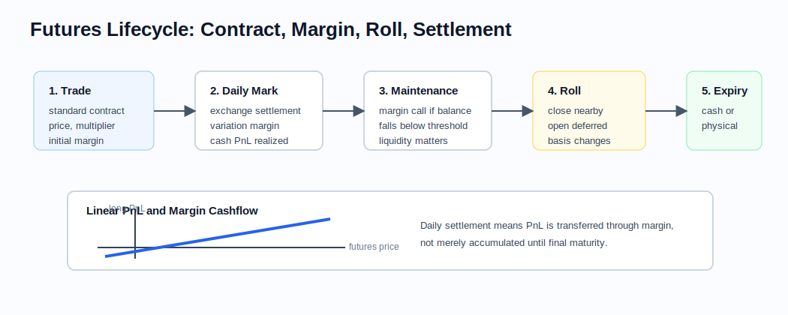

# Futures and Forwards

Related chapters: [04-fx.md](04-fx.md), [05-fixed-income.md](05-fixed-income.md), [08-commodities.md](08-commodities.md), and [11-market-data.md](11-market-data.md).

## What This Domain Covers
Futures and forwards are the simplest way to make a promise about a future price.

One side agrees to buy later at a price fixed today. The other side agrees to sell. There is no optionality: if the reference price moves up, the long benefits and the short loses; if it moves down, the opposite happens.

That linear payoff makes the product look simple, but the implementation story is richer. A listed future has a contract multiplier, expiry cycle, margin process, roll behavior, and sometimes delivery logic. An OTC forward has settlement terms, collateral terms, carry assumptions, and counterparty exposure. The quant developer's job is to keep the clean linear intuition while still modelling the operational details that drive PnL.

## Product Taxonomy and Market Structure
The first question is where the promise trades and how it settles.

- OTC forwards: customized notional, maturity, settlement, and collateral terms.
- Exchange-traded futures: standardized contract size, expiry cycle, margining, and daily variation settlement.
- Equity index futures, commodity futures, bond futures, short-rate futures, and FX futures all share linear payoffs but differ materially in carry and delivery logic.
- Physically delivered contracts require deliverable-grade logic, while cash-settled contracts rely on an index or fixing methodology.

## Quoting and Market Conventions
- Forwards are quoted as outright forward price or forward points over spot.
- Futures are quoted in contract units defined by the exchange; understanding the point value is mandatory for risk and PnL.
- Bond futures require conversion factors, cheapest-to-deliver logic, and delivery-option awareness.
- Short-rate futures may quote as price = 100 - rate, which flips intuition for price vs rate moves.
- Rolling a futures position changes contract, liquidity point, and often the relevant carry assumptions.

## Core Pricing Framework
The pricing story starts with carry: what does it cost or earn to hold the underlying until the future date?

In a simple carry model:

$$
F_0(T) = S_0 e^{(r + u - y)T}
$$

where $u$ is storage or financing cost and $y$ is income or convenience yield. Variants:
- equity index forward: carry comes from funding minus dividends,
- FX forward: carry comes from domestic minus foreign rates,
- commodity forward: storage and convenience yield dominate,
- futures on margined exchanges may differ from forwards due to daily settlement and convexity effects.

For fixed-income futures, the core pricing object is often the implied repo or cheapest-to-deliver package rather than a clean carry formula.

## Worked Instrument Example: Equity Index Future
Assume an equity index future is bought at 5,000 with:
- contract multiplier: $50 per index point,
- position size: 10 contracts,
- current futures price after one week: 5,080.

The PnL for the long futures position is:

$$
(5{,}080 - 5{,}000) \times 50 \times 10 = 40{,}000
$$

If the future instead falls to 4,920:

$$
(4{,}920 - 5{,}000) \times 50 \times 10 = -40{,}000
$$

There is no option-like right to walk away. A long future benefits from price increases and loses from price decreases. A short future has the exact opposite PnL. For exchange-traded futures, this gain or loss is usually settled through daily variation margin rather than paid only at final maturity.

### Visual Lifecycle Reference



The key implementation distinction is that listed futures realize gains and losses through daily margin cashflows, while OTC forwards usually accumulate value until settlement or collateral exchange.

## Key Risk Measures and Sensitivities
- Delta to spot or relevant cash instrument.
- Carry and roll-down exposure over the holding horizon.
- Basis risk between futures and the hedged physical or OTC position.
- Curve risk for rate and bond futures.
- Calendar-spread risk between nearby and deferred contracts.

## Required Data, Curves, Surfaces, and Calibration Objects
- Contract specifications: multiplier, tick size, expiry, first notice date, last trade date, settlement method.
- Spot price or reference cash market.
- Financing, dividend, repo, storage, or convenience-yield assumptions depending on asset class.
- Deliverable basket metadata and conversion factors for bond futures.
- Roll calendars and liquidity rules for analytics that use continuous futures series.

## Numerical and Implementation Approaches
- Use direct pricing formulas for simple forwards.
- Treat listed futures as explicit instruments in market data, not just derived forwards.
- Build continuous-series analytics carefully; back-adjusted, ratio-adjusted, and panama-style stitching solve different problems.
- For bond futures, compute invoice price, net basis, and cheapest-to-deliver explicitly.

## Production Pitfalls and Sanity Checks
- Mixing futures and forwards as if daily margining never matters.
- Ignoring contract multipliers in PnL and risk aggregation.
- Incorrect handling of roll dates, especially when a strategy trades front-month liquidity but risk is reported on a continuous series.
- Using spot carry formulas for commodity contracts where storage constraints are binding.
- Failing to distinguish trade date, first notice date, and last trade date.

## Illustrative Code
```python
import math


def fair_forward_price(spot: float, expiry: float, funding_rate: float, income_yield: float = 0.0, storage_cost: float = 0.0) -> float:
    carry = funding_rate + storage_cost - income_yield
    return spot * math.exp(carry * expiry)


def futures_pnl(entry_price: float, current_price: float, multiplier: float, contracts: int) -> float:
    return (current_price - entry_price) * multiplier * contracts
```

## References and Further Reading
- Hull, J. *Options, Futures, and Other Derivatives*
- Chance and Brooks. *Introduction to Derivatives and Risk Management*
- Exchange rulebooks for product-specific contract definitions
