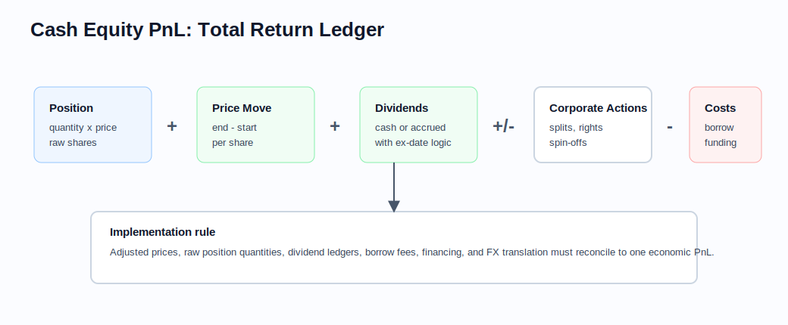

# Cash Equities and Equity Analytics

Related chapters: [01-options.md](01-options.md), [02-futures.md](02-futures.md), [11-market-data.md](11-market-data.md), [13-risk-and-pnl.md](13-risk-and-pnl.md), and [16-portfolio-construction-and-backtesting.md](16-portfolio-construction-and-backtesting.md).

## What This Domain Covers
Cash equities are ownership claims in companies, quoted one share at a time.

A long position is the cleanest story in finance: buy shares, benefit if the price rises, lose if it falls, and receive the economics that belong to the owner. A short position flips the exposure but adds another layer: borrow availability, borrow cost, dividend payments, and financing.

Equities look simpler than derivatives because there is no payoff formula to solve. In practice, equity systems are hard because the economics live in the ledger: trades, dividends, splits, rights, spin-offs, borrow, financing, benchmark membership, and execution costs all have to line up. This chapter follows that ledger view.

## Product Taxonomy and Market Structure
Start by asking what kind of equity exposure the system is holding.

- Common and preferred shares
- ETFs and index trackers
- ADRs and cross-listed instruments
- Cash baskets, program trades, and index rebalances
- Margin-financed long and short positions

The market structure layer matters: auctions, fragmented venues, dark pools, market makers, and corporate actions all feed directly into analytics and PnL.

## Quoting and Market Conventions
- Prices are quoted per share; risk and PnL depend on lot size and position size.
- Total return includes dividends, splits, rights, spin-offs, and financing costs for shorts.
- Short inventory and borrow fees materially affect realized economics.
- Benchmark-relative language is common: beta, active weight, tracking error, sector neutrality.

## Core Pricing Framework
For cash equities, the "model" is usually not a stochastic pricing equation. It is an economic ledger that must not lose or double-count anything.

For many applications, the "pricing model" is simply marked market value plus corporate actions and financing:

$$
\text{EquityValue}_t = N_t \cdot S_t + \text{AccruedDividends} - \text{FinancingCost}
$$

What matters is not closed-form valuation but the consistency of:
- adjusted vs unadjusted prices,
- total-return vs price-return series,
- cash ledger treatment,
- stock borrow and rebate logic,
- benchmark and factor mapping.

Factor models and cost models turn cash equities into a risk and optimization problem rather than a derivative-pricing problem.

## Worked Instrument Example: Long And Short Stock
Assume a portfolio buys 1,000 shares at $50. The stock later trades at $56 and pays a $0.40 dividend per share during the holding period.

The long-position PnL is:

$$
1{,}000 \times (56 - 50 + 0.40) = 6{,}400
$$

If the stock instead falls to $45 with the same dividend:

$$
1{,}000 \times (45 - 50 + 0.40) = -4{,}600
$$

For a short position of 1,000 shares initiated at $50 and covered at $45, the price move is profitable, but the trader may owe the dividend and borrow cost:

$$
1{,}000 \times (50 - 45 - 0.40) - \text{borrow cost}
$$

The core implementation point is that price PnL, dividends, splits, borrow, and financing belong in the same economic ledger. A clean equity system does not treat corporate actions as comments on a price series.

### Visual Ledger Reference



This ledger view is the safest way to reason about adjusted prices, raw share quantities, dividends, borrow, financing, and corporate actions without double-counting or dropping economics.

## Key Risk Measures and Sensitivities
- Price delta to each name
- Beta to benchmark or sector factors
- Factor exposures: size, value, momentum, quality, industry, country
- Liquidity and market-impact risk
- Short-borrow and financing exposure

## Required Data, Curves, Surfaces, and Calibration Objects
- Clean instrument identifiers and corporate-action history
- Real-time and end-of-day prices, volumes, and auction prints
- Shares outstanding, float, sector classifications, and benchmark memberships
- Borrow availability and financing curves for prime-style analytics
- Factor exposures, covariance matrices, and transaction-cost estimates for portfolio tools

## Numerical and Implementation Approaches
- Use adjusted and unadjusted price series deliberately; never mix them casually.
- Make corporate actions replayable so historical PnL can be reproduced.
- For factor risk, separate exposure estimation, covariance estimation, and portfolio aggregation.
- For execution models, prefer simple models with clear diagnostics over complex models that cannot be calibrated reliably.

## Production Pitfalls and Sanity Checks
- Split-adjusted prices used with raw position quantities.
- Dividends treated inconsistently between risk and ledger systems.
- Benchmark files and sector mappings drifting without versioning.
- Borrow cost omitted from short portfolio carry.
- Survivorship bias in historical analytics.

## Illustrative Code
```python
def cash_equity_pnl(quantity: float, start_price: float, end_price: float, dividends: float = 0.0, borrow_cost: float = 0.0) -> float:
    return quantity * (end_price - start_price + dividends) - borrow_cost
```

## References and Further Reading
- Grinold and Kahn. *Active Portfolio Management*
- Kissell. *The Science of Algorithmic Trading and Portfolio Management*
- Exchange and index-provider methodology documents
