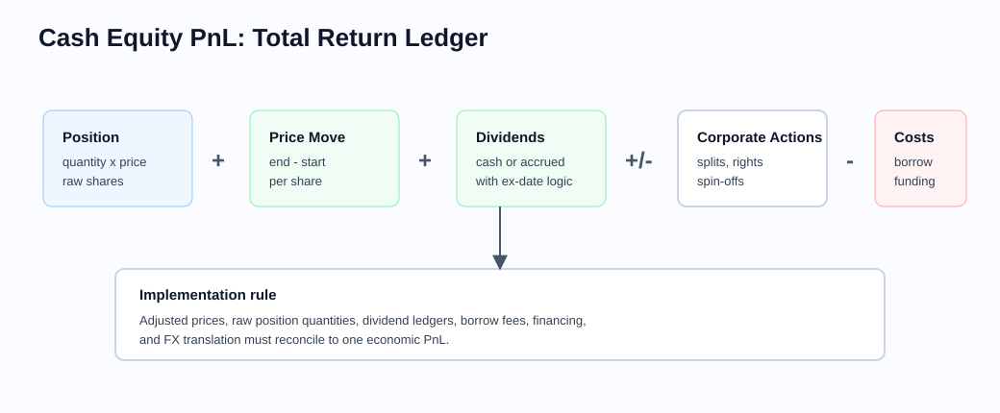
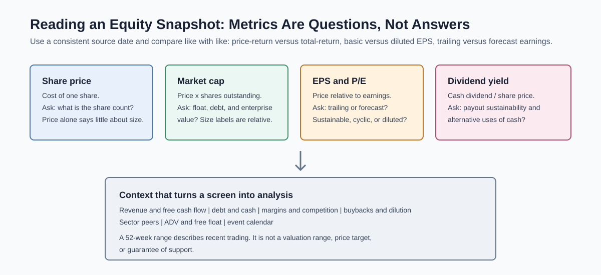

# Cash Equities and Equity Analytics

Related chapters: [01-options.md](01-options.md), [02-futures.md](02-futures.md), [11-market-data.md](11-market-data.md), [13-risk-and-pnl.md](13-risk-and-pnl.md), and [16-portfolio-construction-and-backtesting.md](16-portfolio-construction-and-backtesting.md).

## What This Domain Covers
Cash equities are ownership claims in companies, quoted one share at a time.

A long position is the cleanest story in finance: buy shares, benefit if the price rises, lose if it falls, and receive the economics that belong to the owner. A short position flips the exposure but adds another layer: borrow availability, borrow cost, dividend payments, and financing.

Equities look simpler than derivatives because there is no payoff formula to solve. In practice, equity systems are hard because the economics live in the ledger: trades, dividends, splits, rights, spin-offs, borrow, financing, benchmark membership, and execution costs all have to line up. This chapter follows that ledger view.

## Product Taxonomy and Market Structure
Start by asking what kind of equity exposure the system is holding.

- Common and preferred shares
- ETFs and index trackers
- ADRs and cross-listed instruments
- Cash baskets, program trades, and index rebalances
- Margin-financed long and short positions

The market structure layer matters: auctions, fragmented venues, dark pools, market makers, and corporate actions all feed directly into analytics and PnL.

## Quoting and Market Conventions
- Prices are quoted per share; risk and PnL depend on lot size and position size.
- Total return includes dividends, splits, rights, spin-offs, and financing costs for shorts.
- Short inventory and borrow fees materially affect realized economics.
- Benchmark-relative language is common: beta, active weight, tracking error, sector neutrality.

## Core Pricing Framework
For cash equities, the "model" is usually not a stochastic pricing equation. It is an economic ledger that must not lose or double-count anything.

For many applications, the "pricing model" is simply marked market value plus corporate actions and financing:

$$
\text{EquityValue}_t = N_t \cdot S_t + \text{AccruedDividends} - \text{FinancingCost}
$$

What matters is not closed-form valuation but the consistency of:
- adjusted vs unadjusted prices,
- total-return vs price-return series,
- cash ledger treatment,
- stock borrow and rebate logic,
- benchmark and factor mapping.

Factor models and cost models turn cash equities into a risk and optimization problem rather than a derivative-pricing problem.

## Worked Instrument Example: Long And Short Stock
Assume a portfolio buys 1,000 shares at $50. The stock later trades at $56 and pays a $0.40 dividend per share during the holding period.

The long-position PnL is:

$$
1{,}000 \times (56 - 50 + 0.40) = 6{,}400
$$

If the stock instead falls to $45 with the same dividend:

$$
1{,}000 \times (45 - 50 + 0.40) = -4{,}600
$$

For a short position of 1,000 shares initiated at $50 and covered at $45, the price move is profitable, but the trader may owe the dividend and borrow cost:

$$
1{,}000 \times (50 - 45 - 0.40) - \text{borrow cost}
$$

The core implementation point is that price PnL, dividends, splits, borrow, and financing belong in the same economic ledger. A clean equity system does not treat corporate actions as comments on a price series.

### Visual Ledger Reference



This ledger view is the safest way to reason about adjusted prices, raw share quantities, dividends, borrow, financing, and corporate actions without double-counting or dropping economics.

## Reading An Equity Snapshot
An equity quote screen is a starting point for questions, not a valuation conclusion. Price tells you what one share costs; the other fields explain the scale of the company, how the market values its earnings, how much cash it distributes, and where the current price sits in its recent trading range.

A useful reading order is: **price -> company size -> earnings -> valuation -> distributions -> liquidity and risk**. Each field should answer one question and lead to the next; no single field settles the investment case.



### Market Capitalization And Company Size

Market capitalization is the market value of all shares outstanding:

$$
\text{Market cap} = \text{share price} \times \text{shares outstanding}
$$

It is a measure of equity value, not the price of the whole business. Enterprise value is often more useful when comparing operating businesses because it also considers debt, preferred equity, minority interests, and cash. Free-float market cap is another useful variant: it excludes shares that are unavailable for normal public trading and is common in index construction.

Terms such as large cap, mid cap, and small cap are relative labels, not universal size bands. The boundary changes by country, currency, index provider, and market cycle. In practice, market cap is a clue to liquidity, analyst coverage, index membership, and business maturity; it does not determine whether the stock is cheap, safe, or likely to outperform.

| Relative Size Label | What It Usually Suggests | What It Does Not Prove |
| --- | --- | --- |
| Large cap | Among the largest companies in the chosen market; often more liquid and widely researched | Low risk, good value, or strong future returns |
| Mid cap | Between the largest and smallest listed companies; often a mix of established operations and growth | A fixed monetary range across countries or index providers |
| Small or micro cap | Smaller listed companies; often less liquid, less researched, and more exposed to company-specific events | That the shares are cheap or the business is early-stage |

### Earnings Per Share And P/E

Basic earnings per share (EPS) allocates profit attributable to common shareholders across a weighted average number of common shares:

$$
\text{basic EPS} = \frac{\text{net income available to common shareholders}}{\text{weighted average common shares}}
$$

Diluted EPS adjusts the denominator, and sometimes the numerator, for instruments such as options, convertibles, and restricted stock that could increase the share count. The distinction matters when a company has meaningful potential dilution.

The price-to-earnings ratio compares the current share price with earnings per share:

$$
\text{trailing P/E} = \frac{\text{current share price}}{\text{trailing twelve-month EPS}}
$$

$$
\text{forward P/E} = \frac{\text{current share price}}{\text{forecast next-twelve-month EPS}}
$$

Trailing P/E uses reported history. Forward P/E uses an estimate and is therefore sensitive to the forecast source and revision date. A high P/E can mean the market expects growth, temporarily depressed earnings, or an expensive valuation. A low P/E can mean value, low expected growth, cyclical peak earnings, financial risk, or a reporting-quality concern. P/E is undefined when EPS is zero and usually not useful when EPS is negative; do not turn either case into a false valuation signal.

### Dividends And Dividend Yield

Dividend yield is annual cash dividends per share divided by current share price:

$$
\text{dividend yield} = \frac{\text{annual dividends per share}}{\text{current share price}}
$$

It is a cash-distribution measure, not a measure of total shareholder return. A stock with no dividend yield may be retaining cash to invest in the business, but it may also have limited distributable cash, debt-reduction needs, a buyback policy, a different capital-allocation priority, or simply no dividend policy. The conclusion must come from the company's cashflows, investment opportunities, balance sheet, and stated policy, not the yield alone.

Dividend dates matter operationally. On the ex-dividend date, a new buyer typically does not receive the declared dividend; price often adjusts lower by roughly the dividend amount, all else equal. A long holder receives the dividend. A short seller generally compensates the share lender for it. Total-return analytics must include this cashflow explicitly.

### Other Useful Fields

- **52-week range**: a descriptive high-low range over the prior year, not a valuation band or support/resistance guarantee.
- **Average daily volume (ADV)**: a liquidity proxy that helps estimate whether a proposed order is large relative to normal trading.
- **Free float**: shares available to public investors; it can be much lower than shares outstanding.
- **Book value and price-to-book**: can be useful for financial firms or asset-heavy businesses, but less informative for firms whose value is mostly intangible.
- **Revenue, margins, free cash flow, debt, and cash**: context needed before interpreting EPS or P/E in isolation.

## Worked Instrument Example: Reading A Fictional Stock
Assume ExampleCo has:
- share price: USD 80,
- shares outstanding: 250m,
- trailing twelve-month EPS: USD 4.00,
- consensus next-twelve-month EPS: USD 5.00,
- annual dividend per share: USD 1.20,
- 52-week range: USD 60 to USD 92.

Its market cap is:

$$
80 \times 250{,}000{,}000 = \text{USD }20\text{bn}
$$

Its trailing P/E, forward P/E, and dividend yield are:

$$
\frac{80}{4.00} = 20.0, \qquad \frac{80}{5.00} = 16.0, \qquad \frac{1.20}{80} = 1.5\%
$$

The numbers tell a coherent but incomplete story: the market is valuing the business at 20 times reported EPS and 16 times forecast EPS, while paying a 1.5% cash yield. The 52-week range says USD 80 is between the recent low and high; it does not say whether the stock should be bought. An analyst would next examine the source and durability of forecast EPS growth, free cash flow, debt, competitive position, and the liquidity needed to trade the desired size.

## Key Risk Measures and Sensitivities
- Price delta to each name
- Beta to benchmark or sector factors
- Factor exposures: size, value, momentum, quality, industry, country
- Liquidity and market-impact risk
- Short-borrow and financing exposure

## Required Data, Curves, Surfaces, and Calibration Objects
- Clean instrument identifiers and corporate-action history
- Real-time and end-of-day prices, volumes, and auction prints
- Shares outstanding, float, sector classifications, and benchmark memberships
- Reported and forecast EPS, dividend history, payout policy, debt, cash, and enterprise-value inputs for fundamental screens
- Borrow availability and financing curves for prime-style analytics
- Factor exposures, covariance matrices, and transaction-cost estimates for portfolio tools

## Numerical and Implementation Approaches
- Use adjusted and unadjusted price series deliberately; never mix them casually.
- Make corporate actions replayable so historical PnL can be reproduced.
- For factor risk, separate exposure estimation, covariance estimation, and portfolio aggregation.
- For execution models, prefer simple models with clear diagnostics over complex models that cannot be calibrated reliably.

## Production Pitfalls and Sanity Checks
- Split-adjusted prices used with raw position quantities.
- Dividends treated inconsistently between risk and ledger systems.
- Benchmark files and sector mappings drifting without versioning.
- Borrow cost omitted from short portfolio carry.
- Survivorship bias in historical analytics.

## Illustrative Code
```python
def cash_equity_pnl(quantity: float, start_price: float, end_price: float, dividends: float = 0.0, borrow_cost: float = 0.0) -> float:
    return quantity * (end_price - start_price + dividends) - borrow_cost
```

## References and Further Reading
- Grinold and Kahn. *Active Portfolio Management*
- Kissell. *The Science of Algorithmic Trading and Portfolio Management*
- Exchange and index-provider methodology documents
