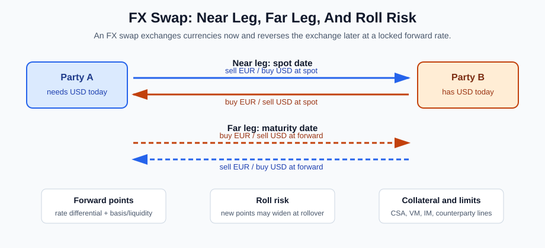
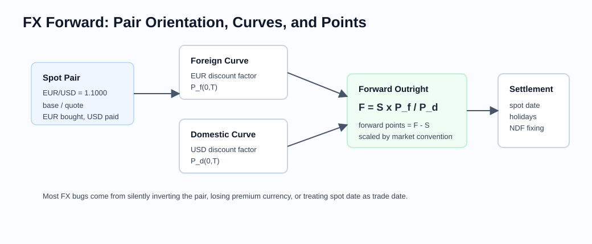
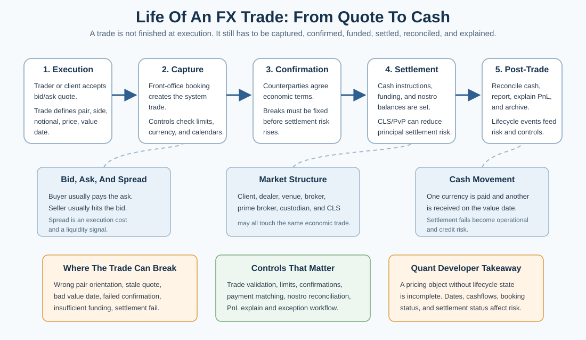

# Foreign Exchange

Related chapters: [02-futures.md](02-futures.md), [06-interest-rates.md](06-interest-rates.md), [09-cross-asset.md](09-cross-asset.md), [11-market-data.md](11-market-data.md), and [30-trade-lifecycle-and-operations.md](30-trade-lifecycle-and-operations.md).

## What This Domain Covers
FX is the market where every trade is two-sided by design: you are always buying one currency and selling another.

The simplest story is spot conversion. A forward moves that exchange to a future date. A swap combines near and far exchanges. An FX option adds choice: the right, but not the obligation, to exchange at a strike.

The danger is that the notation looks harmless. EUR/USD and USD/EUR are reciprocal prices, but they are not interchangeable implementation objects. Premium currency, settlement lag, holiday calendars, delta convention, and reporting currency all change the answer. This chapter is about keeping the currency story explicit from trade capture to risk.

## Product Taxonomy and Market Structure
The product type tells you whether the exchange happens now, later, repeatedly, or only if an option is exercised.

- Spot FX
- FX forwards and non-deliverable forwards
- FX swaps and cross-currency swaps
- Vanilla FX options, risk reversals, and butterflies
- Structured and barrier products

## Quoting and Market Conventions
- Currency pairs are ordered; EUR/USD and USD/EUR are not just reciprocals in implementation terms.
- Spot date is usually not trade date. Settlement lag and holiday calendars are part of the product definition.
- Forward points quote the difference between spot and forward, not the outright forward.
- NDFs settle the difference to a fixing in a settlement currency rather than exchanging notionals.
- FX option markets quote volatility by delta convention, often alongside ATM, risk reversal, and butterfly structures.

Let $S_{b/q}$ mean units of quote currency $q$ per one unit of base currency $b$. Covered interest parity in simple form is:

$$
F_{b/q}(T) = S_{b/q} \frac{P_b(0, T)}{P_q(0, T)}
$$

where $P_b$ and $P_q$ are discount factors in the base and quote currencies. Thus EUR/USD is USD per EUR, and the familiar constant-rate form is $F=S\exp[(r_q-r_b)T]$. Naming base and quote explicitly avoids the ambiguous phrase "domestic over foreign," whose meaning changes with the payoff and reporting perspective.

## Core Pricing Framework
The core pricing idea is interest-rate parity: the future exchange rate should reflect the relative discounting of the two currencies.

The linear products follow discounting and no-arbitrage carry logic. Options add:
- premium currency choice,
- domestic vs foreign discount curves,
- delta conventions,
- smile parameterization in quote space.

For vanilla FX options, a Black-style framework often uses the forward as the underlying state variable with domestic discounting and foreign carry. The pricing formula is straightforward; the difficult part is surface construction from market quotes.

### FX Swaps
An FX swap combines two exchanges of currency:

- near leg: exchange currencies on the spot or near date,
- far leg: reverse the exchange on a later date at a pre-agreed forward rate.

Economically, this is short-term funding in one currency against another currency. A treasurer may use it to raise USD today against EUR and lock the future reversal. A trading desk may use it to manage currency funding, settlement needs, or forward exposure.

The far-leg rate is usually expressed through forward points:

$$
\text{Forward points} = F - S
$$

where $S$ is the spot rate and $F$ is the outright forward rate in the same currency-pair orientation. Under a clean covered-interest-parity setup, those points reflect the interest-rate differential between the two currencies. In real markets, cross-currency basis, liquidity, balance-sheet cost, and counterparty limits can also affect where swaps trade.



The important implementation distinction is that an FX swap is not "just a forward" in operational form. It has two legs, two settlement dates, two currency cashflows on each leg, and often collateral, margin, netting, and counterparty-limit effects.

Practical risks:
- roll risk: if the swap is rolled repeatedly, future forward points may be worse than expected,
- liquidity risk: short-tenor swap markets can gap during funding stress,
- collateral and margin risk: CSA terms, variation margin, initial margin, or clearing rules can create cash needs,
- counterparty risk: credit lines may be reduced when funding is most valuable,
- basis risk: observed swap points may include cross-currency basis, not only risk-free rate differentials.

## Worked Instrument Example: FX Forward
Assume EUR/USD spot is 1.1000, meaning 1 euro costs 1.1000 US dollars. A company needs to buy EUR 10,000,000 in three months and enters a forward at 1.1050.

At maturity, the company pays:

$$
10{,}000{,}000 \times 1.1050 = 11{,}050{,}000
$$

US dollars and receives EUR 10,000,000. If spot at maturity is 1.1300, the forward is favorable because buying euros in the spot market would cost:

$$
10{,}000{,}000 \times 1.1300 = 11{,}300{,}000
$$

The economic benefit is USD 250,000 before discounting and credit effects. If spot at maturity is 1.0800, the forward is unfavorable because spot purchase would cost only USD 10,800,000, so the forward is USD 250,000 worse than market.

The long EUR/USD forward benefits when EUR strengthens versus USD. The opposite side benefits when EUR weakens. Implementation must preserve which currency is bought, which is sold, and which currency is used for settlement and reporting.

### Visual Forward Reference



The diagram highlights why pair orientation, spot date, discount curves, forward points, settlement currency, and reporting currency must be explicit objects rather than implied string handling.

### FX Trade Lifecycle
An FX trade is operationally simple enough to understand, but important enough to deserve a lifecycle view. The quote is only the start. The trade still needs to be captured, validated, confirmed, funded, settled, reconciled, and explained.



For spot and forwards, the critical lifecycle fields are pair orientation, side, notional, price, trade date, value date, settlement instructions, counterparty, and confirmation status. For FX swaps, the same discipline applies twice: once for the near leg and once for the far leg.

The lifecycle matters for risk because a trade can be economically executed but operationally incomplete. A failed confirmation, wrong value date, insufficient funding, or settlement break can create exposure that does not look like ordinary delta or vega risk. See [30-trade-lifecycle-and-operations.md](30-trade-lifecycle-and-operations.md) for the broader operational pattern across products.

## Key Risk Measures and Sensitivities
- Spot delta in the chosen FX convention
- Forward delta and premium-adjusted delta
- Forward-points and roll sensitivity for FX swaps
- Vega by expiry and smile bucket
- Cross-gamma between currency pairs in multi-FX books
- Curve risk to domestic and foreign discount curves
- Funding, collateral, and counterparty-limit risk for swap books

## Required Data, Curves, Surfaces, and Calibration Objects
- Spot rates with timestamp and market source
- Domestic and foreign curves
- Holiday calendars and settlement conventions for both currencies
- FX swap near/far dates, near/far rates, cashflow directions, forward points, and rollover policy
- FX option smile data: ATM, risk reversal, butterfly, or direct vol grid
- Fixing calendars and settlement rules for NDFs

## Numerical and Implementation Approaches
- Normalize pair orientation early and preserve it consistently.
- Convert quote-space smiles into strike-space surfaces with explicit convention objects.
- Keep premium currency explicit in trade representation and PnL.
- Represent FX swaps as two dated currency exchanges rather than collapsing them into one scalar rate.
- Separate covered-interest-parity points from observed market basis or liquidity adjustments.
- Reuse rates infrastructure for discounting and forward projection wherever possible.

## Production Pitfalls and Sanity Checks
- Inverted currency pair logic in risk aggregation.
- Treating spot date as trade date in forward accrual calculations.
- Treating an FX swap as margin-free because the near and far notionals offset economically.
- Ignoring roll risk when a short-dated swap is repeatedly renewed.
- Assuming forward points are only an interest-rate differential during funding stress.
- Mixing premium-adjusted and unadjusted deltas.
- Ignoring holiday calendars for broken-dated forwards or NDF fixings.
- Misreporting PnL because reporting currency conversion is applied inconsistently.

## Illustrative Code
```python
def fx_forward(spot: float, domestic_df: float, foreign_df: float) -> float:
    return spot * foreign_df / domestic_df


def forward_points(spot: float, forward: float, points_scale: float = 10000.0) -> float:
    return (forward - spot) * points_scale


def fx_swap_far_rate(spot: float, points: float, points_scale: float = 10000.0) -> float:
    return spot + points / points_scale
```

## References and Further Reading
- [CME Group: Understanding FX Quote Conventions](https://www.cmegroup.com/education/courses/introduction-to-fx/understanding-fx-quote-conventions)
- Clark. *Foreign Exchange Option Pricing*
- Reiswich and Wystup. *FX Volatility Smile Construction*
- Market convention guides from major FX dealers and clearing venues
