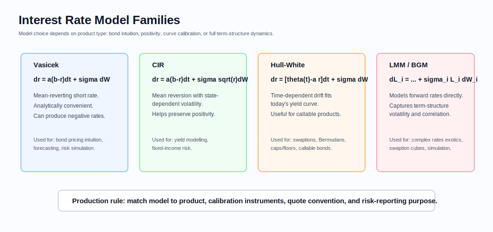
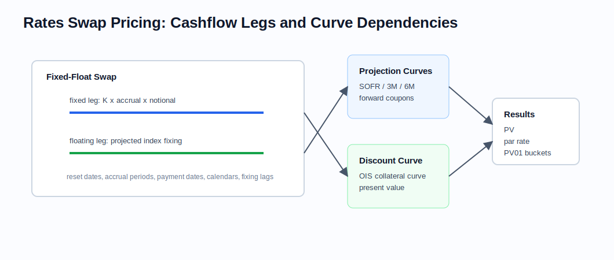

# Interest Rates and Rate Derivatives

Related chapters: [05-fixed-income.md](05-fixed-income.md), [09-cross-asset.md](09-cross-asset.md), [10-numerical-methods.md](10-numerical-methods.md), [11-market-data.md](11-market-data.md), and [12-pricing-architecture.md](12-pricing-architecture.md).

## What This Domain Covers
Rates products trade the cost of money through time.

A vanilla swap is a clean story: one side pays fixed coupons, the other pays floating coupons. Caps, floors, and swaptions add optionality on future rates. Cross-currency and basis products add another layer of curve relationships.

Rates is where a lot of quant infrastructure complexity becomes unavoidable. The products are schedule-heavy, conventions vary by currency and tenor, and modern pricing separates discount curves from projection curves. This chapter builds the story from cashflow schedules to curve dependencies to model choice.

## Product Taxonomy and Market Structure
The product type tells you which part of the rates stack you are touching: cash, forwards, swaps, options, or callable structures.

- Deposits and short-end instruments
- FRAs and futures on short rates
- OIS swaps and vanilla fixed-float swaps
- Basis swaps, cross-currency swaps, and inflation swaps
- Caps, floors, swaptions, Bermudan swaptions, and callable structures
- Legacy Ibor-linked products and fallback-sensitive books

## Quoting and Market Conventions
- OIS discounting is standard for collateralized pricing in many markets.
- Forward projection depends on the floating index tenor; this is why multiple curves exist.
- Fixed-leg conventions vary by currency: payment frequency, day count, business-day adjustment, and calendar.
- Futures and swap quotes are not interchangeable without explicit conversion and convexity adjustment.
- Swaptions are often quoted in Black or normal vol, and the correct choice matters especially in low or negative-rate regimes.
- IMM dates, stubs, broken periods, and fixing lags must be treated as instrument definition, not post-processing.

Par swap rate identity:

$$
K_{\text{par}} = \frac{P(0, T_0) - P(0, T_n)}{\sum_{i=1}^{n} \alpha_i P(0, T_i)}
$$

for a simple single-curve setup with accrual fractions $\alpha_i$. Multi-curve systems generalize the projection side while preserving the annuity intuition.

## Core Pricing Framework

### Single-Curve Intuition
Start with the old one-curve world because it gives the right intuition.

Before the financial crisis, many systems projected and discounted off one curve. That is still useful for intuition:
- discount factors define present value,
- forward rates are implied by adjacent discount factors,
- swap PV is fixed-leg PV minus floating-leg PV.

Simple forward rate relation:

$$
L(T_i, T_{i+1}) = \frac{1}{\alpha_i} \left(\frac{P(0, T_i)}{P(0, T_{i+1})} - 1\right)
$$

### Multi-Curve Reality
Modern systems separate:
- discount curve, usually OIS by collateral currency,
- projection curves by tenor, such as 1M, 3M, 6M,
- basis relationships between tenors and sometimes currencies.

This changes architecture. A trade no longer depends on "the rate curve" but on a dependency graph of curves and conventions.

### Derivative Pricing
- Vanilla swaps: discounted cashflows using projected floating coupons.
- Caps and floors: caplets and floorlets priced with Black or Bachelier style formulas on forward rates.
- Swaptions: option on a swap rate, often using annuity measure intuition.
- Bermudan swaptions and callable exotics: trees, lattice methods, or Monte Carlo / regression depending on model choice.

Model families commonly encountered:
- Black/Bachelier for quoted vanilla volatility,
- Hull-White or GSR for callable rates products,
- SABR for smile interpolation,
- LMM for term-structure dynamics.

### Interest Rate Model Families
Interest rate models are used for curve-consistent pricing, risk simulation, derivatives valuation, and scenario generation. The right model depends on whether the goal is short-rate intuition, positivity, exact fit to today's curve, or multi-rate term-structure dynamics.



Common families:
- Vasicek: mean-reverting short-rate model. It is analytically convenient and useful for intuition, but can generate negative rates.
- CIR: mean-reverting short-rate model with volatility proportional to $\sqrt{r_t}$. It is often used when rate positivity matters.
- Hull-White: extends Vasicek with a time-dependent drift so the model can fit today's initial yield curve. It is commonly used for callable bonds, Bermudan swaptions, caps/floors, and swaption-style products.
- Libor Market Model / BGM: models forward rates directly and is used when the joint dynamics of many forward rates matter, especially for complex rates exotics.

Implementation cautions:
- A model that prices one product class well may be unsuitable for another.
- Calibration instruments must match the intended pricing use: cap/floor vols, swaption cube, callable bond prices, or historical risk scenarios.
- Short-rate models and market models expose different state variables, so risk and scenario interfaces differ.
- Negative-rate regimes require care when choosing Black, normal, shifted-lognormal, or short-rate dynamics.

## Worked Instrument Example: Fixed-Float Interest Rate Swap
Assume a company enters a 5-year USD swap with:
- notional: $10,000,000,
- fixed rate paid by the company: 4.00% per year,
- floating leg received: SOFR-based rate,
- annualized current floating expectation for the next period: 5.00%,
- one-year accrual period for this simplified example.

For the next payment period, the fixed payment is:

$$
10{,}000{,}000 \times 4.00\% = 400{,}000
$$

The floating receipt is:

$$
10{,}000{,}000 \times 5.00\% = 500{,}000
$$

The net cashflow to the fixed-rate payer is +$100,000 for that period before discounting. If the floating rate fixes at 3.00%, the floating receipt is $300,000 and the net cashflow is -$100,000.

The payer swap benefits when floating rates rise relative to the fixed rate. A receiver swap benefits when rates fall. In production, each coupon uses its own accrual fraction, fixing date, projection curve, payment date, and discount factor.

### Visual Swap Reference



The diagram separates schedule mechanics from curve dependencies: projection curves create future floating coupons, while the discount curve turns both legs into present value.

## Key Risk Measures and Sensitivities
- PV01 by curve and by tenor bucket
- Key-rate duration or bucketed zero-rate sensitivities
- Basis risk between discount and projection curves
- Vega by expiry-tenor point for caps/floors and swaptions
- Convexity and second-order curve effects
- Fixing risk and fallback risk for legacy benchmark transitions

## Required Data, Curves, Surfaces, and Calibration Objects
- Instrument definitions with exact schedules, fixing rules, and calendars
- OIS discount curve
- Projection curves by tenor
- Historical fixings and fallback logic for floating coupons
- Cap/floor vol surfaces and swaption cubes
- Calibration parameters for Hull-White, SABR, or other desk models
- Model-family configuration for Vasicek, CIR, Hull-White/GSR, SABR, or LMM/BGM where used
- CSA or collateral metadata for discounting currency and collateral rate assumptions

## Numerical and Implementation Approaches
- Bootstrap discount and forward curves from the most liquid instrument set available for each currency.
- Keep curve construction modular: instrument helpers, interpolation, solver, and validation should be separable.
- Represent schedules and accrual periods as explicit objects reused across pricing and risk.
- Use Black or normal vol consistently with the desk quote convention.
- Prefer curve-aware bumping so bucketed risk respects the actual bootstrap dependency graph.

Useful implementation split:
- market quotes,
- standardized instrument helpers,
- bootstrapped node representation,
- interpolation/extrapolation rules,
- curve bundle consumed by pricing engines.

## Production Pitfalls and Sanity Checks
- Discounting off the wrong collateral curve.
- Using the wrong day count or fixing lag for one currency while most cases still pass.
- Treating quoted swap rate as if it were a directly observable model state across all risk calculations.
- Ignoring historical fixings and repricing old coupons from today's curve.
- Mixing Black and normal vol in calibration or reporting.
- Curve shocks that break the bootstrap but still produce a number.

Minimum checks:
- bootstrap instruments reprice within tolerance,
- discount factors are monotone under standard assumptions,
- par swap rates reconstructed from the curve match input quotes,
- risk on a receive-fixed swap has sensible sign under parallel rate bumps,
- fallback or fixing-sensitive trades reprice correctly across fixing dates.

## Illustrative Code
```python
def par_swap_rate(discount_factors, accrual_fractions):
    if len(discount_factors) != len(accrual_fractions) + 1:
        raise ValueError("Need start and end discount factors plus one accrual per coupon period.")
    annuity = sum(alpha * df for alpha, df in zip(accrual_fractions, discount_factors[1:]))
    return (discount_factors[0] - discount_factors[-1]) / annuity


def pv01(notional: float, accrual_fractions, discount_factors) -> float:
    annuity = sum(alpha * df for alpha, df in zip(accrual_fractions, discount_factors[1:]))
    return notional * annuity * 1.0e-4


def vasicek_short_rate_step(rate: float, mean_reversion: float, long_run_mean: float, dt: float, shock: float, volatility: float) -> float:
    return rate + mean_reversion * (long_run_mean - rate) * dt + volatility * shock
```

## References and Further Reading
- Brigo and Mercurio. *Interest Rate Models*
- Andersen and Piterbarg. *Interest Rate Modeling*
- Henrard. *Interest Rate Modelling in the Multi-Curve Framework*
- Hagan et al. on SABR and practical smile modelling
