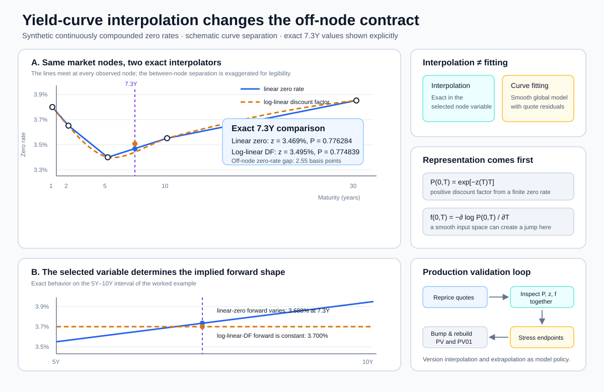
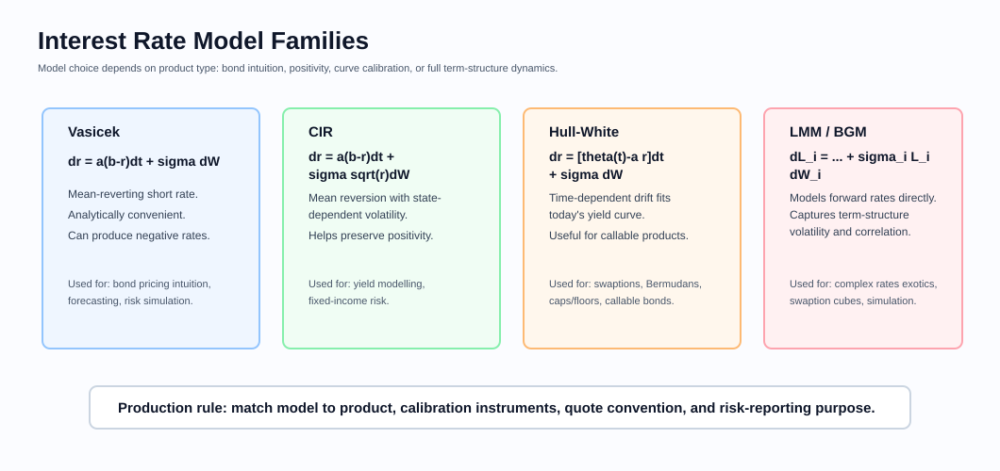
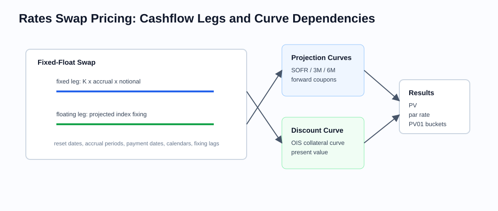
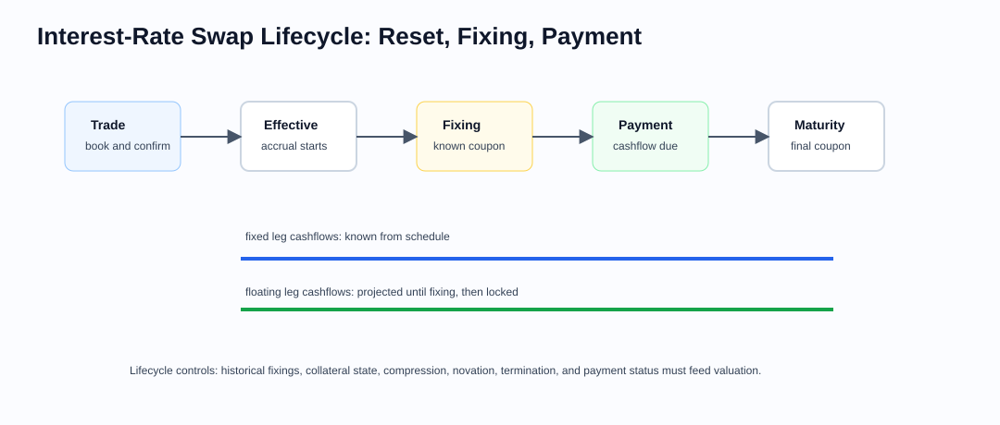

# Interest Rates and Rate Derivatives

Related chapters: [05-fixed-income.md](05-fixed-income.md), [09-cross-asset.md](09-cross-asset.md), [10-numerical-methods.md](10-numerical-methods.md), [11-market-data.md](11-market-data.md), and [12-pricing-architecture.md](12-pricing-architecture.md).

## What This Domain Covers
Rates products trade the cost of money through time.

A vanilla swap is a clean story: one side pays fixed coupons, the other pays floating coupons. Caps, floors, and swaptions add optionality on future rates. Cross-currency and basis products add another layer of curve relationships.

Rates is where a lot of quant infrastructure complexity becomes unavoidable. The products are schedule-heavy, conventions vary by currency and tenor, and modern pricing separates discount curves from projection curves. This chapter builds the story from cashflow schedules to curve dependencies to model choice.

## Product Taxonomy and Market Structure
The product type tells you which part of the rates stack you are touching: cash, forwards, swaps, options, or callable structures.

- Deposits and short-end instruments
- FRAs and futures on short rates
- OIS swaps and vanilla fixed-float swaps
- Basis swaps, cross-currency swaps, and inflation swaps
- Caps, floors, swaptions, Bermudan swaptions, and callable structures
- Legacy Ibor-linked products and fallback-sensitive books

## Quoting and Market Conventions
- OIS discounting is standard for collateralized pricing in many markets.
- Forward projection depends on the floating index tenor; this is why multiple curves exist.
- Fixed-leg conventions vary by currency: payment frequency, day count, business-day adjustment, and calendar.
- Futures and swap quotes are not interchangeable without explicit conversion and convexity adjustment.
- Swaptions are often quoted in Black or normal vol, and the correct choice matters especially in low or negative-rate regimes.
- IMM dates, stubs, broken periods, and fixing lags must be treated as instrument definition, not post-processing.

Par swap rate identity:

```math
K_{\text{par}} = \frac{P(0, T_0) - P(0, T_n)}{\sum_{i=1}^{n} \alpha_i P(0, T_i)}
```

for a simple single-curve setup with accrual fractions $\alpha_i$. Multi-curve systems generalize the projection side while preserving the annuity intuition.

## Core Pricing Framework

### Single-Curve Intuition
Start with the old one-curve world because it gives the right intuition.

Before the financial crisis, many systems projected and discounted off one curve. That is still useful for intuition:
- discount factors define present value,
- forward rates are implied by adjacent discount factors,
- swap PV is fixed-leg PV minus floating-leg PV.

Simple forward rate relation:

```math
L(T_i, T_{i+1}) = \frac{1}{\alpha_i} \left(\frac{P(0, T_i)}{P(0, T_{i+1})} - 1\right)
```

### Multi-Curve Reality
Modern systems separate:
- discount curve, usually OIS by collateral currency,
- projection curves by tenor, such as 1M, 3M, 6M,
- basis relationships between tenors and sometimes currencies.

This changes architecture. A trade no longer depends on "the rate curve" but on a dependency graph of curves and conventions.

### Curve Construction Between Market Nodes: Interpolation Versus Fitting
Market quotes arrive at a finite set of maturities, but a trade can pay on almost any date. If the curve has solved 5-year and 10-year nodes, a cashflow at 7.3 years still needs a discount factor. The off-node rule is therefore part of the pricing model, not a cosmetic chart setting. In a sequential bootstrap, the rule is evaluated while later nodes are being solved, so bootstrapping and interpolation are coupled.

For continuously compounded zero rates, the core representations are linked by:

```math
P(0,T)=e^{-z(T)T},
\qquad
z(T)=-\frac{\log P(0,T)}{T},
\qquad
f(0,T)=-\frac{\partial \log P(0,T)}{\partial T}
=z(T)+Tz'(T).
```

These identities use one stated compounding convention. A production curve may expose several quote conventions, but it must transform them into one internally consistent state before interpolation.

An **interpolator** passes through the constructed nodes in its selected variable. A **curve fit** estimates a smooth or parsimonious representation and may leave residuals at those observations. Neither label determines quality by itself: pricing curves normally require quote repricing within tolerance, while fitted curves can be useful for estimation, reporting, or deliberately smoothing noisy observations.

| Method | Contract between nodes | Implied-forward and risk behavior |
| --- | --- | --- |
| Piecewise-linear zero rate | Interpolate $z(T)$, then derive $P(0,T)$ | Zero rates are continuous, but changes in slope generally make $f(0,T)=z(T)+Tz'(T)$ jump at knots. |
| Log-linear discount factor | Interpolate $\log P(0,T)$ | Discount factors remain positive and the instantaneous forward is constant inside each interval, with possible jumps at knots. |
| Piecewise-linear discount factor | Interpolate $P(0,T)$ directly | Positive endpoint discount factors remain positive between adjacent nodes; $f(0,T)=-P'(0,T)/P(0,T)$ varies inside the interval and can jump when the segment slope changes. |
| Natural cubic spline | Join cubic pieces and impose zero second derivative at the endpoints in the selected variable | The selected variable is twice continuously differentiable, but the endpoint condition is numerical rather than financial; overshoot and implausible derived forwards remain possible. |
| Monotone cubic / PCHIP | Use local slopes to preserve monotone data shape in the selected variable | Reduces spline overshoot and is local, but shape preservation of zero rates or discount factors does not by itself guarantee a well-behaved forward curve. |
| B-spline basis | Represent the curve with basis functions and chosen knots | Can underpin exact interpolation or penalized/least-squares fitting. Degree, knots, boundary conditions, and smoothing penalty determine locality and stability. |
| Forward-based monotone-convex construction | Build the curve from interval forwards with explicit shape controls | Designed to control forward behavior more directly, but still requires discount-factor positivity, a stated continuity class, quote repricing, and bump-stability tests for the actual input set. |
| Nelson-Siegel / Svensson | Estimate a small set of global level, slope, curvature, and decay parameters | Produces a smooth parametric fit and usually does not pass through every observation exactly. Parameter and residual stability matter as much as appearance. |



#### Worked Off-Node Story: Pricing At 7.3 Years
Take synthetic continuously compounded zero-rate nodes of 3.40% at 5 years and 3.55% at 10 years. At 7.3 years, the interval weight is $w=(7.3-5)/(10-5)=0.46$.

Linear interpolation in zero-rate space gives:

```math
z_{\text{linear zero}}(7.3)
=3.40\%+0.46(3.55\%-3.40\%)
=3.469\%,
```

and therefore $P(0,7.3)=e^{-0.03469\times7.3}\approx0.776284$. Log-linear discount-factor interpolation instead uses $\log P(0,5)=-0.1700$ and $\log P(0,10)=-0.3550$:

```math
\log P(0,7.3)=-0.1700+0.46(-0.3550+0.1700)=-0.2551,
```

so $P(0,7.3)\approx0.774839$ and $z(7.3)\approx3.4945\%$. Both methods reproduce the two nodes exactly, yet their off-node zero rates differ by about 2.55 basis points. On this interval, log-linear discount factors imply a constant 3.70% instantaneous forward, while linear zero rates imply 3.688% at 7.3 years and a forward that changes across the interval.

The difference does not prove that one method is universally closer to an unobservable true curve. It proves that the interpolation space is a model choice with PV and risk consequences. The complete arithmetic and executable checks are in [examples/yield-curve-interpolation-comparison.md](examples/yield-curve-interpolation-comparison.md). To start from quotes rather than supplied nodes, follow the [deposit/swap bootstrap and rebuilt quote-risk example](examples/curve-bootstrap-and-quote-risk.md), which verifies every calibration residual before valuing off-node cashflows.

A controlled construction workflow tells the story in this order:

1. Define instruments, calendars, compounding, day counts, and the internal curve variable.
2. Bootstrap nodes with the interpolator active, then reprice every calibration instrument to its market quote within tolerance.
3. Inspect discount factors, zero rates, and forwards together. Require positive discount factors; do not impose decreasing discount factors blindly because negative forward rates can make them rise over an interval.
4. Bump one market quote, rebuild the whole curve, and inspect node Jacobians, locality, PV, and PV01 for discontinuities or unstable amplification.
5. Specify extrapolation independently from interpolation and stress the first and last liquid points.
6. For fitted curves, report quote residuals and parameter stability rather than presenting visual smoothness as validation.

### Derivative Pricing
- Vanilla swaps: discounted cashflows using projected floating coupons.
- Caps and floors: caplets and floorlets priced with Black or Bachelier style formulas on forward rates.
- Swaptions: option on a swap rate, often using annuity measure intuition.
- Bermudan swaptions and callable exotics: trees, lattice methods, or Monte Carlo / regression depending on model choice.

Model families commonly encountered:
- Black/Bachelier for quoted vanilla volatility,
- Hull-White or GSR for callable rates products,
- SABR for smile interpolation,
- LMM for term-structure dynamics.

### Interest Rate Model Families
Interest rate models are used for curve-consistent pricing, risk simulation, derivatives valuation, and scenario generation. The right model depends on whether the goal is short-rate intuition, positivity, exact fit to today's curve, or multi-rate term-structure dynamics.



Common families:
- Vasicek: mean-reverting short-rate model. It is analytically convenient and useful for intuition, but can generate negative rates.
- CIR: mean-reverting short-rate model with volatility proportional to $\sqrt{r_t}$. It is often used when rate positivity matters.
- Hull-White: extends Vasicek with a time-dependent drift so the model can fit today's initial yield curve. It is commonly used for callable bonds, Bermudan swaptions, caps/floors, and swaption-style products.
- Libor Market Model / BGM: models forward rates directly and is used when the joint dynamics of many forward rates matter, especially for complex rates exotics.

Implementation cautions:
- A model that prices one product class well may be unsuitable for another.
- Calibration instruments must match the intended pricing use: cap/floor vols, swaption cube, callable bond prices, or historical risk scenarios.
- Short-rate models and market models expose different state variables, so risk and scenario interfaces differ.
- Negative-rate regimes require care when choosing Black, normal, shifted-lognormal, or short-rate dynamics.

## Worked Instrument Example: Fixed-Float Interest Rate Swap
Assume a company enters a 5-year USD swap with:
- notional: USD 10,000,000,
- fixed rate paid by the company: 4.00% per year,
- floating leg received: SOFR-based rate,
- annualized current floating expectation for the next period: 5.00%,
- one-year accrual period for this simplified example.

For the next payment period, the fixed payment is:

```math
10{,}000{,}000 \times 4.00\% = 400{,}000
```

The floating receipt is:

```math
10{,}000{,}000 \times 5.00\% = 500{,}000
```

The net cashflow to the fixed-rate payer is USD 100,000 for that period before discounting. If the floating rate fixes at 3.00%, the floating receipt is USD 300,000 and the net cashflow is USD -100,000.

The payer swap benefits when floating rates rise relative to the fixed rate. A receiver swap benefits when rates fall. In production, each coupon uses its own accrual fraction, fixing date, projection curve, payment date, and discount factor.

### Visual Swap Reference



The diagram separates schedule mechanics from curve dependencies: projection curves create future floating coupons, while the discount curve turns both legs into present value.

### Visual Lifecycle Reference



Swap lifecycle state controls whether a floating coupon is projected or already fixed, whether a payment is forecast or paid, and whether collateral, compression, novation, or termination events should be reflected.

## Key Risk Measures and Sensitivities
- PV01 by curve and by tenor bucket
- Key-rate duration or bucketed zero-rate sensitivities
- Basis risk between discount and projection curves
- Vega by expiry-tenor point for caps/floors and swaptions
- Convexity and second-order curve effects
- Fixing risk and fallback risk for legacy benchmark transitions

## Required Data, Curves, Surfaces, and Calibration Objects
- Instrument definitions with exact schedules, fixing rules, and calendars
- OIS discount curve
- Projection curves by tenor
- Historical fixings and fallback logic for floating coupons
- Cap/floor vol surfaces and swaption cubes
- Calibration parameters for Hull-White, SABR, or other desk models
- Model-family configuration for Vasicek, CIR, Hull-White/GSR, SABR, or LMM/BGM where used
- CSA or collateral metadata for discounting currency and collateral rate assumptions

## Numerical and Implementation Approaches
- Bootstrap discount and forward curves from the most liquid instrument set available for each currency.
- Keep curve construction modular: instrument helpers, interpolation, solver, and validation should be separable.
- Represent schedules and accrual periods as explicit objects reused across pricing and risk.
- Use Black or normal vol consistently with the desk quote convention.
- Prefer curve-aware bumping so bucketed risk respects the actual bootstrap dependency graph.

Useful implementation split:
- market quotes,
- standardized instrument helpers,
- bootstrapped node representation,
- interpolation/extrapolation rules,
- curve bundle consumed by pricing engines.

## Production Pitfalls and Sanity Checks
- Discounting off the wrong collateral curve.
- Using the wrong day count or fixing lag for one currency while most cases still pass.
- Treating quoted swap rate as if it were a directly observable model state across all risk calculations.
- Ignoring historical fixings and repricing old coupons from today's curve.
- Mixing Black and normal vol in calibration or reporting.
- Curve shocks that break the bootstrap but still produce a number.

Minimum checks:
- bootstrap instruments reprice within tolerance,
- discount factors stay positive, and any increase with maturity is consistent with the curve's negative-forward-rate region rather than a bootstrap defect,
- zero rates, discount factors, and implied forwards remain finite and economically explainable under the selected interpolation policy,
- single-quote bumps produce stable curve Jacobians, PV, and PV01 rather than unexplained non-local oscillation,
- extrapolation remains controlled beyond the first and last liquid nodes,
- par swap rates reconstructed from the curve match input quotes,
- risk on a receive-fixed swap has sensible sign under parallel rate bumps,
- fallback or fixing-sensitive trades reprice correctly across fixing dates.

## Illustrative Code
```python
def par_swap_rate(discount_factors, accrual_fractions):
    if len(discount_factors) != len(accrual_fractions) + 1:
        raise ValueError("Need start and end discount factors plus one accrual per coupon period.")
    annuity = sum(alpha * df for alpha, df in zip(accrual_fractions, discount_factors[1:]))
    return (discount_factors[0] - discount_factors[-1]) / annuity


def fixed_coupon_pvbp(notional: float, accrual_fractions, discount_factors) -> float:
    """PV of one basis point on the fixed coupon leg, not a full curve PV01."""
    if len(discount_factors) != len(accrual_fractions) + 1:
        raise ValueError("Need start and end discount factors plus one accrual per coupon period.")
    annuity = sum(alpha * df for alpha, df in zip(accrual_fractions, discount_factors[1:]))
    return notional * annuity * 1.0e-4


def vasicek_short_rate_step(rate: float, mean_reversion: float, long_run_mean: float, dt: float, standard_normal: float, volatility: float) -> float:
    if dt <= 0.0:
        raise ValueError("dt must be positive")
    return (
        rate
        + mean_reversion * (long_run_mean - rate) * dt
        + volatility * (dt ** 0.5) * standard_normal
    )
```

## References and Further Reading
- Brigo and Mercurio. *Interest Rate Models*
- Andersen and Piterbarg. *Interest Rate Modeling*
- Henrard. *Interest Rate Modelling in the Multi-Curve Framework*
- Hagan and West. [*Interpolation Methods for Curve Construction*](https://bank.uni-hohenheim.de/uploads/media/Hagan_and_West__2006__-_Interpolation_Methods_for_Curve_Construction.pdf).
- Fritsch and Carlson. [“Monotone Piecewise Cubic Interpolation”](https://doi.org/10.1137/0717021).
- European Central Bank. [*Technical Notes: Theoretical Background of the Yield Curve Methodology*](https://www.ecb.europa.eu/stats/financial_markets_and_interest_rates/euro_area_yield_curves/shared/pdf/technical_notes.pdf), including the Nelson-Siegel-Svensson specification.
- Hagan et al. on SABR and practical smile modelling
