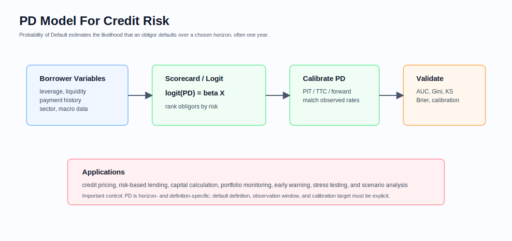
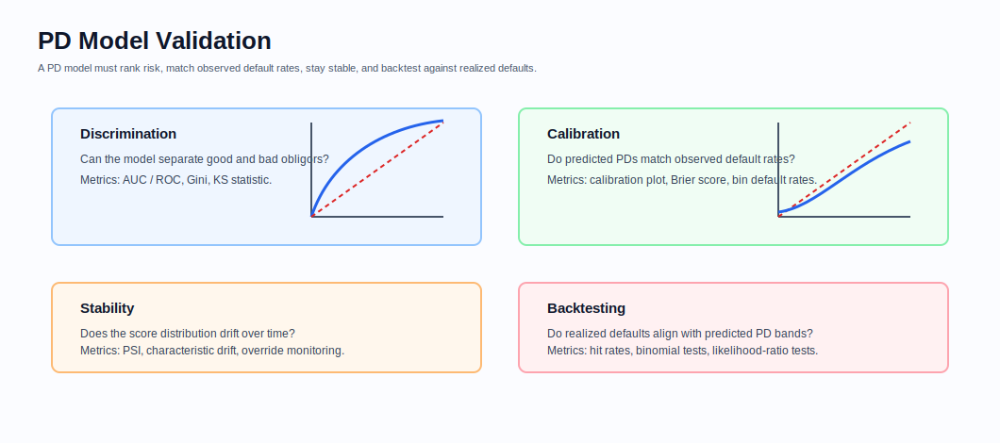
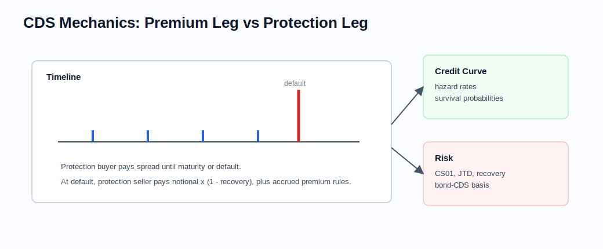

# Credit Instruments

Related chapters: [05-fixed-income.md](05-fixed-income.md), [09-cross-asset.md](09-cross-asset.md), [11-market-data.md](11-market-data.md), and [13-risk-and-pnl.md](13-risk-and-pnl.md).

## What This Domain Covers
Credit products transfer exposure to whether a borrower or reference entity defaults, when that default happens, and how much value is recovered after default. They combine fixed-income cashflow mechanics with default timing and recovery assumptions. The asset class is implementation-heavy because the same issuer can trade through bonds, CDS, indices, and structured credit products with different conventions.

## Product Taxonomy and Market Structure
- Single-name CDS
- CDS indices and tranches
- Corporate and sovereign credit bonds
- Loan and leveraged-credit exposures
- First-to-default and basket-style structures

## Quoting and Market Conventions
- CDS can quote as running spread, upfront plus running coupon, or index points.
- Recovery assumptions are explicit model inputs.
- Standard coupons and IMM-like roll dates matter operationally.
- Bond spread measures are not interchangeable with CDS spread.

## Core Pricing Framework
Reduced-form credit models use hazard rates or survival probabilities:

$$
Q(0, T) = \exp\left(-\int_0^T \lambda(u) du\right)
$$

CDS pricing balances premium leg and protection leg under a recovery assumption. Bond pricing adds default-adjusted expected cashflows and, often, liquidity premia not captured by a simple hazard-rate model.

### Probability Of Default Models
Probability of Default (PD) is the probability that an obligor defaults over a defined horizon, often one year. It is a core input to credit pricing, expected loss, regulatory capital, portfolio monitoring, and stress testing.

$$
PD = P(\text{default within horizon} \mid \text{information available today})
$$

Common PD types:
- Point-in-time (PIT) PD: captures current borrower and macro conditions at a specific point in time.
- Through-the-cycle (TTC) PD: averages through the economic cycle and is often used for long-run capital views.
- Forward PD: conditional on future macroeconomic or scenario assumptions.

Common modelling approaches:
- Statistical default-rate approach: defaulted obligors divided by total obligors in a segment, or exposure-weighted default rates when the model explicitly targets exposure loss behavior.
- Scorecard or regression approach: borrower and macro variables mapped to PD.
- Market-implied approach: default probabilities inferred from CDS spreads or bond spreads.
- Structural approach: default linked to firm value relative to liabilities.

For logistic regression scorecards:

$$
\log\left(\frac{PD_i}{1-PD_i}\right) = \beta_0 + \beta_1 x_{i,1} + \cdots + \beta_k x_{i,k}
$$

or:

$$
PD_i = \frac{1}{1 + e^{-z_i}}
$$

where $z_i$ is the borrower score. Higher scores should map consistently to higher or lower risk depending on score orientation.



Typical variables include:
- financial ratios: leverage, liquidity, profitability, coverage,
- behavioral data: payment history, delinquency, utilization, tenure,
- demographic or firmographic data: sector, region, firm size,
- macro variables: unemployment, rates, GDP, house prices, commodity prices.

Model validation focuses on:
- discrimination: ability to rank good and bad borrowers,
- calibration: predicted PD bands match observed default rates over the same horizon and population,
- stability: performance and score distributions remain consistent over time,
- backtesting: realized defaults are consistent with predicted PD bands.



## Worked Instrument Example: Single-Name CDS Protection
Assume an investor buys 5-year CDS protection on $10,000,000 notional with:
- annual running spread: 100 bps,
- assumed recovery rate after default: 40%,
- default event after one year.

Ignoring accrual, discounting, and settlement timing for the moment, the annual premium paid by the protection buyer is:

$$
10{,}000{,}000 \times 1.00\% = 100{,}000
$$

If the reference entity defaults and the recovery value is 40%, the protection payment is approximately:

$$
10{,}000{,}000 \times (1 - 40\%) = 6{,}000{,}000
$$

The protection buyer pays periodic spread and receives a large payment if default occurs. The protection seller receives the spread but is short default risk. A CDS valuation engine therefore needs premium-leg cashflows, accrued premium on default, default probabilities, discount factors, and recovery assumptions.

### Visual CDS Reference



CDS pricing is easiest to reason about as two legs: expected premium payments while the name survives, and expected protection payments if default occurs.

## Key Risk Measures and Sensitivities
- CS01 by name and bucket
- Jump-to-default exposure
- Recovery sensitivity
- PD, hazard-rate, and scorecard sensitivity
- Index tranche correlation and base-correlation exposures
- Basis risk between bond and CDS positions

## Required Data, Curves, Surfaces, and Calibration Objects
- CDS quotes, standard coupons, accrual conventions, and roll dates
- Bond prices and spread measures
- Recovery assumptions and possibly stochastic-recovery model parameters
- Credit curves by issuer and seniority
- Borrower financial, behavioral, demographic, and macro variables for PD models
- PD model calibration, validation, override, and monitoring outputs
- Correlation surfaces for tranche analytics where relevant

## Numerical and Implementation Approaches
- Bootstrap hazard curves from liquid CDS points.
- Keep PIT, TTC, and forward PD definitions separate; mixing them creates capital, pricing, and monitoring errors.
- Validate PD models for discrimination, calibration, stability, and backtesting before using them in pricing or capital.
- Align bond analytics with fixed-income schedule generation and accrued-interest logic.
- Keep default event handling explicit in trade representation and scenario engines.
- Use scenario tools for wrong-way risk and spread gap moves even when the pricing model is simple.

## Production Pitfalls and Sanity Checks
- Survival probabilities outside $[0, 1]$ due to bad interpolation.
- Mixing spread measures across bonds and CDS without a documented mapping.
- Missing accrued premium logic in CDS settlement.
- Recoveries hard-coded globally when books actually use name- or sector-specific assumptions.
- Logistic scorecard outputs used without calibration to observed default rates.
- High AUC accepted as sufficient even when predicted PD levels are miscalibrated.

## Illustrative Code
```python
import math


def survival_probability(hazard_rate: float, expiry: float) -> float:
    return math.exp(-hazard_rate * expiry)


def expected_loss(notional: float, default_probability: float, recovery: float) -> float:
    return notional * default_probability * (1.0 - recovery)


def logistic_pd(score: float) -> float:
    return 1.0 / (1.0 + math.exp(-score))
```

## References and Further Reading
- O'Kane. *Modelling Single-name and Multi-name Credit Derivatives*
- Duffie and Singleton. *Credit Risk*
- ISDA CDS standard model documentation
