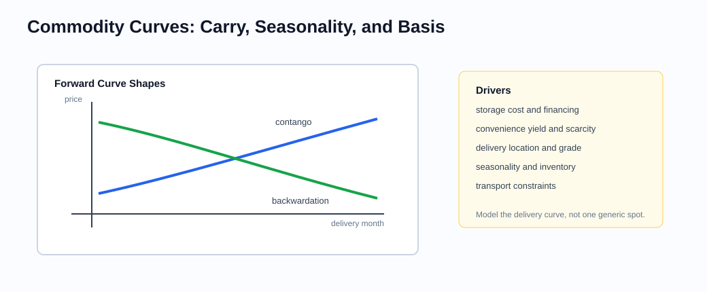
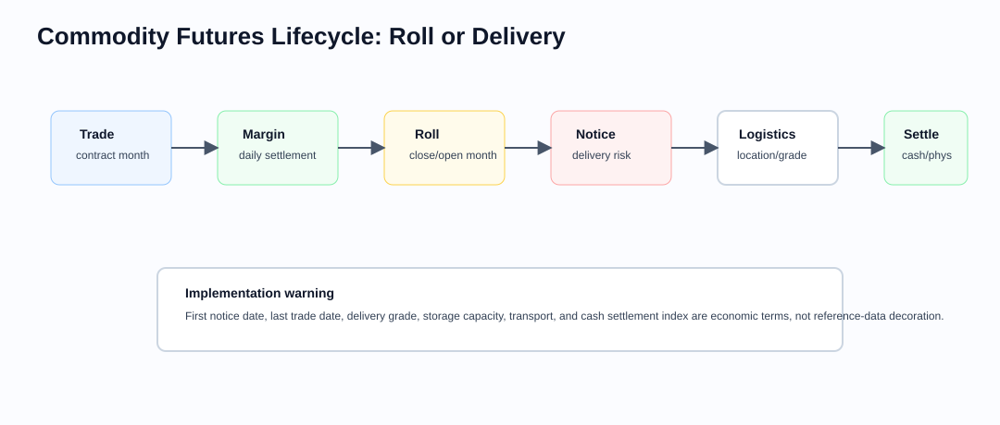

# Commodity Derivatives

Related chapters: [01-options.md](01-options.md), [02-futures.md](02-futures.md), [09-cross-asset.md](09-cross-asset.md), [11-market-data.md](11-market-data.md), [13-risk-and-pnl.md](13-risk-and-pnl.md), [18-volatility-products.md](18-volatility-products.md), and [37-volatility-relative-value-and-event-volatility.md](37-volatility-relative-value-and-event-volatility.md).

## What This Domain Covers
Commodities are financial contracts tied to physical reality.

A crude oil future, a gas forward, a power option, or a grain contract is not just a price on a screen. It is tied to delivery month, location, grade, storage, transportation, weather, seasonality, and sometimes physical constraints that cannot be arbitraged away.

That is why commodity analytics feel familiar at first and then quickly become different. The same forward-pricing language appears, but inventory, scarcity, storage optionality, and local basis can matter as much as volatility. This chapter keeps the physical story visible behind the financial contract.

## Product Taxonomy and Market Structure
The first question is what physical exposure the contract is really referencing.

- Energy, metals, agricultural, and freight-linked products
- Spot, forwards, and listed futures
- Swing options, storage options, spread options, and transportation optionality
- Physically settled vs cash-settled contracts

Option supply comes from participants with different constraints. The label "theta seller" is not a complete strategy description:

| Participant | Typical option activity | Residual risk |
| --- | --- | --- |
| Producer | Overwrite calls against expected production or buy puts to protect a floor | Production shortfall, delivery-month, grade, location, and basis mismatch |
| Consumer or processor | Buy calls or collars against input costs | Volume mismatch, product-yield and crack/spread risk |
| Systematic volatility seller | Sell straddles, strangles, options, or variance under a rules-based mandate | Short gamma, gap, crowding, margin, and liquidity risk |
| Dealer recycling structured flow | Hedge or warehouse customer option and structured-product inventory | Sign-changing gamma, skew, correlation, barrier, funding, and model risk |
| Market maker | Quote both sides and dynamically hedge inventory | Adverse selection, jump timing, spread, and hedge execution |

A producer's written call can be economically covered by physical output and still be financially short gamma. If output is lower than forecast, the deliverable month differs, or the local basis breaks, the hedge can become partly or wholly uncovered. Do not infer a participant's motive or risk sign from public flow labels alone.

## Quoting and Market Conventions
- Contract units and delivery locations are part of the economics.
- Nearby and deferred contracts can embed strong seasonal effects.
- Quality, grade, and location basis matter.
- Storage and transport optionality can dominate simple financial carry relationships.
- Trading session, notice dates, last-trade time, settlement window, delivery period, and holiday calendar must be timestamped explicitly.
- Exchange price-limit, expanded-limit, velocity-logic, and reopening rules are contract- and date-specific reference data, not universal commodity constants.
- Futures and forwards may need a signed-price domain. Do not impose an equity-like zero floor on data, scenarios, storage, or PnL.

## Core Pricing Framework
The carry formula is a useful starting point, but commodities often teach you why a simple formula is not the whole story.

Commodity forward curves are often described through cost of carry:

$$
F_0(T) = S_0 e^{(r + u - y)T}
$$

but convenience yield $y$ is not just a nuisance parameter. It reflects scarcity and inventory value, and can make backwardation economically reasonable. Many real commodity books are better thought of as optimization or inventory problems with embedded optionality.

Commodity options are commonly written on futures, so the risk variable is the relevant delivery-month future $F$, not a generic spot series. Under a lognormal Black-76 convention, the model requires positive futures and strikes. That domain restriction is an assumption of the model, not an economic law.

On April 20, 2020, the NYMEX May 2020 WTI Light Sweet Crude Oil futures contract settled at **-$37.63 per barrel**, one day before it expired. This was a particular near-expiry futures settlement under acute delivery, storage, liquidity, and positioning pressure. It did not mean that every physical crude-oil spot price or every WTI delivery month was negative, and it was not itself an option settlement. The event shows that a physically deliverable futures obligation can have negative value when the marginal cost of accepting delivery exceeds the commodity's immediate value. See the [CFTC interim report and summary](https://www.cftc.gov/PressRoom/PressReleases/8315-20).

Production controls must therefore:

- accept, persist, shock, and reconcile signed futures prices rather than clamp them to zero;
- avoid applying $\log(F/K)$ models when $F$ or $K$ is non-positive;
- select a model whose state space matches the contract, such as a normal/Bachelier model, a defensible shifted model, or direct numerical valuation;
- verify current exchange rules for negative prices, strikes, settlement, exercise, and downstream cash-settled products;
- test vendor feeds, schemas, margin, scenario engines, and user interfaces with negative prices.

No pricing model substitutes for delivery controls. Notice dates, position limits, storage access, broker liquidation policy, and the ability to trade before expiry remain first-order risks.

## Worked Instrument Example: Crude Oil Future
Assume a trader buys 20 crude oil futures contracts at $78 per barrel. Each contract represents 1,000 barrels, so the position references:

$$
20 \times 1{,}000 = 20{,}000
$$

barrels. If the futures price rises to $82, the PnL is:

$$
(82 - 78) \times 20{,}000 = 80{,}000
$$

If the futures price falls to $74, the PnL is:

$$
(74 - 78) \times 20{,}000 = -80{,}000
$$

The same price move can have different meaning across delivery months. A front-month crude contract may react to immediate inventory scarcity, while a deferred contract may react more to long-term supply expectations. That is why commodity systems usually model a delivery curve, not a single spot-like number.

### Visual Curve Reference



Commodity risk is usually delivery-month, location, and grade specific. The curve shape carries information about storage, scarcity, convenience yield, seasonality, and basis.

### Visual Lifecycle Reference



Commodity lifecycle controls decide whether a position is rolled, cash-settled, or exposed to physical delivery, notice periods, logistics, grade, storage, and transport constraints.

## Commodity Options, Scheduled Events, and Gaps
Commodity variance is not spread uniformly through the calendar. Some releases are scheduled, but the surprise, revisions, market depth, and hedge response are not known in advance.

| Event family | Typical affected risk | Implementation requirement |
| --- | --- | --- |
| USDA World Agricultural Supply and Demand Estimates (WASDE) | Grain and oilseed levels, spreads, skew, and nearby volatility | Store official release timestamp, report vintage, revisions, crop/marketing year, and affected sessions |
| EIA Weekly Petroleum Status Report | Crude, gasoline, distillate, refinery, inventory, and location-sensitive curve risk | Use the official release and holiday schedule; map the release to delivery months and crack/calendar spreads |
| OPEC or OPEC+ meeting, communiqué, or press conference | Crude level, term structure, spreads, and cross-grade basis | Version expected and actual timestamps; allow rescheduling, unscheduled headlines, and staged communications |
| Weather, crop condition, outage, strike, sanctions, or shipping disruption | Product- and location-specific jumps, often outside the most liquid session | Preserve source time and uncertainty; scenario the physical transmission path rather than applying one parallel shock |

WASDE is a monthly scheduled release, while the EIA petroleum report is normally weekly but has holiday exceptions; production systems should ingest the live [USDA WASDE calendar](https://www.usda.gov/about-usda/general-information/staff-offices/office-chief-economist/commodity-markets/wasde-report) and [EIA release schedule](https://www.eia.gov/petroleum/supply/weekly/schedule.php), not hard-code "second Tuesday" or "every Wednesday." OPEC-related event times can change and important information can arrive through unscheduled comments before or after a formal meeting.

An event timestamp needs a time zone, expected/confirmed status, publication source, revision history, and affected trading session. A report after an option's last-trade cut-off does not belong in that option's variance bucket merely because both share the same calendar date.

For a futures option with gamma to $F$, after discount carry and financing are handled consistently, a local delta-hedged approximation is:

$$
\Delta\Pi
\approx
\frac{1}{2}\Gamma_F
\left[(\Delta F)^2-F^2\sigma_{\text{imp}}^2\Delta\tau\right]
+\text{Vega}\,\Delta\sigma
+\text{surface and hedge residual}.
$$

This decomposition is useful for normal trading intervals. Around a report, limit move, or weekend gap, reprice the entire structure under signed futures levels, curve reshaping, skew/volatility changes, elapsed time, and executable hedge assumptions. A hedge placed after the release cannot monetize the path that occurred before the first fill.

### Limit and Locked-Market States
A displayed exchange limit is not a bound on economic loss. Depending on the contract and date, a market can enter a limit-up/down, expanded-limit, paused, or locked state. In a locked market:

- the official mark may sit at the limit while the latent clearing price lies beyond it;
- bids or offers needed to rebalance a short-gamma hedge may be absent;
- correlated contracts or OTC markets may move while the listed hedge is unavailable;
- variation margin can be due before the position can be reduced;
- reopening can gap again after limits expand.

Scenario engines should represent `hedge_available`, fill size, fill price, limit state, and reopening shock separately. Assuming a fill at the limit price precisely when the hedge is most urgent understates both PnL and liquidity risk.

### Overnight, Weekend, and Holiday Risk
Many commodity futures trade for long hours, but maintenance windows, weekends, holidays, thin sessions, and fragmented physical information still create discontinuities. Weather forecasts, geopolitical decisions, outages, and policy announcements can arrive while the primary hedge is closed or illiquid.

There is no universal rule that Friday-to-Monday option decay equals three ordinary trading sessions or that implied volatility must be marked down on Friday. The model may age calendar time while retaining weekend jump variance; the market may move event variance between expiries; and a holiday can shift a scheduled government report. Attribute clock decay, event-variance roll, curve move, surface re-mark, and hedge slippage separately.

### Tail-First Short-Option Sizing
Consider a hypothetical futures option straddle that expires immediately after a scheduled report:

- futures and strike: $75 per barrel;
- short one call and one put;
- total premium received: $4 per barrel;
- contract multiplier: 1,000 barrels.

At expiry, PnL per short straddle is:

$$
\operatorname{PnL}_{1}(F_T)
=1{,}000\left[4-|F_T-75|\right].
$$

| Post-event futures price | Absolute move | PnL per short straddle |
| ---: | ---: | ---: |
| $60 | $15 | -$11,000 |
| $67 | $8 | -$4,000 |
| $75 | $0 | $4,000 |
| $83 | $8 | -$4,000 |
| $90 | $15 | -$11,000 |

If the pre-add-on loss budget is $110,000 and the $\pm15$ move is the worst approved scenario, the mechanical cap is ten straddles:

$$
N_{\max}
=\left\lfloor\frac{110{,}000}{11{,}000}\right\rfloor
=10.
$$

That is a starting cap, not a target. Fees, remaining time value, volatility and skew repricing, basis, price limits, concentration, margin, and a delayed or unavailable hedge require additional reserves or a smaller position. Premium already received and a high historical percentage of profitable report days do not make the tail loss smaller. The executable calculation and checks are in [examples/commodity-option-event-gap.md](examples/commodity-option-event-gap.md).

## Key Risk Measures and Sensitivities
- Delta to nearby and deferred curve points
- Calendar-spread and crack/spread risk
- Volatility and correlation exposure for spread options
- Inventory and location basis exposure
- Seasonal risk across delivery months
- Gamma, theta, vega, skew, and event variance by delivery month and strike
- Overnight/weekend gap delta and the first executable post-gap hedge
- Exchange-limit, locked-market, margin, delivery, and liquidation scenarios
- Physical coverage ratio for overwrites after volume, grade, location, and timing haircuts

## Required Data, Curves, Surfaces, and Calibration Objects
- Contract specifications, delivery locations, and quality definitions
- Forward curves by location and grade
- Storage, transport, and inventory assumptions
- Volatility surfaces for options and spread products
- Correlation assumptions for cross-commodity exposures
- Point-in-time event calendars with expected, confirmed, revised, and actual timestamps
- Exchange session, settlement, price-limit, expanded-limit, notice, expiry, and delivery rules by effective date
- Negative-price-capable quote, curve, scenario, margin, and PnL schemas
- Executable depth and proxy-hedge mappings for closed, thin, or locked primary markets

## Numerical and Implementation Approaches
- Use explicit curve objects by delivery month rather than over-smoothing seasonal structure.
- Model storage and swing optionality with dynamic programming, trees, or Monte Carlo depending on complexity.
- Preserve contract metadata throughout the stack; location and grade are not attributes you can safely strip.
- Build an event engine that maps versioned release timestamps to sessions, expiries, delivery months, and curve/spread scenarios.
- Use full repricing for event gaps and limit states; local gamma/theta approximations are diagnostics, not tail valuations.
- Choose option models whose state space admits the signed prices and strike domain allowed by the contract.
- Replay hedge rules against executable quotes, size, session state, price limits, and proxy basis rather than settlement marks alone.

## Production Pitfalls and Sanity Checks
- Treating commodity forwards as if they were equity forwards with a cosmetic convenience-yield term.
- Ignoring location basis in aggregated risk.
- Building continuous futures series that erase seasonal structure.
- Missing operational constraints such as storage capacity or transport lag in valuation of physical optionality.
- Hard-coding government-release weekdays or OPEC meeting times without holiday, postponement, and revision handling.
- Treating a written producer call as fully covered without stressing production, grade, location, and delivery-month mismatch.
- Clamping negative futures prices to zero or feeding them into a lognormal model.
- Treating a daily price limit as the maximum possible loss or assuming the full hedge fills at the limit.
- Charging quiet-session theta through a weekend or event while omitting the retained jump variance.
- Sizing systematic short volatility from premium income, Sharpe ratio, or win rate without a full-revaluation gap budget.

Minimum controls include:

- contract multiplier, delivery unit, currency, grade, and location reconciliation;
- curve monotonicity checks only where economically appropriate, without smoothing away seasonality;
- signed-price serialization and valuation tests, including zero crossings;
- event-time-to-expiry mapping tests around time zones, cut-offs, holidays, and revised releases;
- full-revaluation up/down gap scenarios with volatility, skew, curve-shape, and basis changes;
- locked-market tests with no primary hedge, partial proxy fills, expanded limits, and reopening gaps;
- overwrite coverage after conservative volume and basis haircuts;
- worst-scenario loss, margin, and liquidity consumption within approved limits before the trade is sized.

## Illustrative Code
```python
from math import floor


def simple_carry_forward(spot: float, expiry: float, rate: float, storage_cost: float, convenience_yield: float) -> float:
    import math
    return spot * math.exp((rate + storage_cost - convenience_yield) * expiry)


def short_straddle_expiry_pnl(
    futures_at_expiry: float,
    strike: float,
    premium_per_unit: float,
    multiplier: float,
) -> float:
    if multiplier <= 0.0 or premium_per_unit < 0.0:
        raise ValueError("invalid contract economics")
    payoff = abs(futures_at_expiry - strike)
    return multiplier * (premium_per_unit - payoff)


def tail_first_contract_cap(loss_budget: float, scenario_unit_pnls: list[float]) -> int:
    if loss_budget <= 0.0 or not scenario_unit_pnls:
        raise ValueError("loss budget and scenarios are required")
    worst_loss = max(-pnl for pnl in scenario_unit_pnls)
    if worst_loss <= 0.0:
        raise ValueError("scenario set contains no loss; expand the tails")
    return floor(loss_budget / worst_loss)


scenario_prices = [60.0, 67.0, 75.0, 83.0, 90.0]
unit_pnls = [
    short_straddle_expiry_pnl(price, 75.0, 4.0, 1_000.0)
    for price in scenario_prices
]
assert unit_pnls == [-11_000.0, -4_000.0, 4_000.0, -4_000.0, -11_000.0]
assert tail_first_contract_cap(110_000.0, unit_pnls) == 10
```

## References and Further Reading
- Eydeland and Wolyniec. *Energy and Power Risk Management*
- Geman. *Commodities and Commodity Derivatives*
- Clewlow and Strickland on energy derivatives modelling
- [CFTC interim report on NYMEX WTI trading around April 20, 2020](https://www.cftc.gov/PressRoom/PressReleases/8315-20)
- [USDA World Agricultural Supply and Demand Estimates](https://www.usda.gov/about-usda/general-information/staff-offices/office-chief-economist/commodity-markets/wasde-report)
- [EIA Weekly Petroleum Status Report schedule](https://www.eia.gov/petroleum/supply/weekly/schedule.php)
- Related example: [examples/commodity-option-event-gap.md](examples/commodity-option-event-gap.md)
