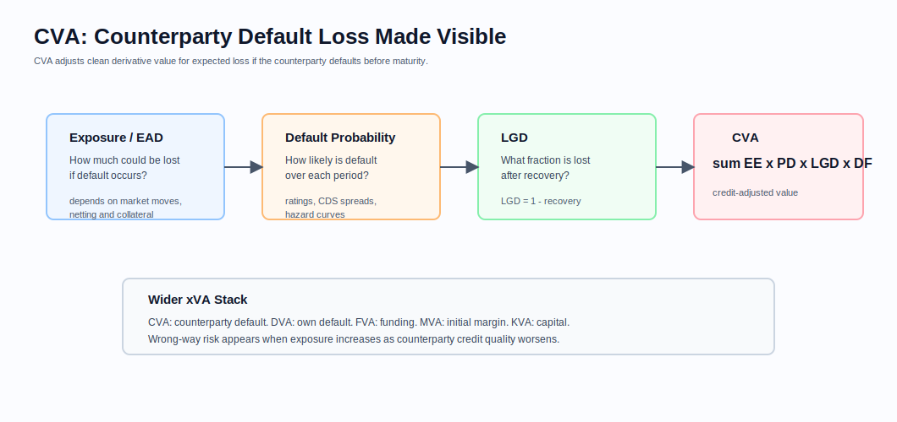
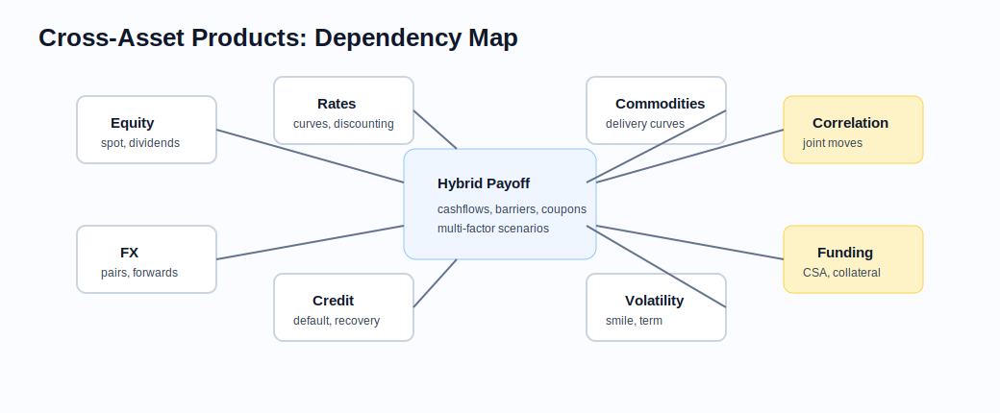

# Cross-Asset and XVA Framing

Related chapters: [04-fx.md](04-fx.md), [06-interest-rates.md](06-interest-rates.md), [07-credit.md](07-credit.md), [12-pricing-architecture.md](12-pricing-architecture.md), and [13-risk-and-pnl.md](13-risk-and-pnl.md).

## What This Domain Covers
Cross-asset products depend on more than one market stack or require valuation layers such as collateral, funding, counterparty credit, and correlation. A trade might reference equity and FX together, rates and credit together, or a whole portfolio under one netting set. The challenge is often architectural before it is mathematical.

## Product Taxonomy and Market Structure
- Quanto and hybrid options
- Cross-currency products
- Structured products with equity-rate, FX-rate, or credit-rate interaction
- xVA adjustments layered onto OTC derivatives portfolios
- Multi-asset portfolios requiring joint scenario and stress frameworks

## Quoting and Market Conventions
- Funding, collateral, and reporting currencies can differ.
- Correlation is rarely a single stable scalar across maturities and regimes.
- xVA desks often consume sensitivities and exposure profiles generated elsewhere rather than raw trade prices.
- Netting set, CSA terms, and counterparty hierarchy affect practical valuation adjustments.

## Core Pricing Framework
The cross-asset layer typically combines:
- a base trade valuation under the relevant product model,
- exposure modeling through time,
- discounting and collateral assumptions,
- counterparty and funding adjustments.

Representative adjustments:
- CVA: expected discounted loss from counterparty default.
- DVA: own-default adjustment.
- FVA / ColVA / MVA: funding, collateral, and initial-margin related adjustments.

Joint dynamics matter when payoff or exposure depends on multiple risk factors. Correlation and wrong-way risk cannot be bolted on casually after the fact.

### CVA And The Wider xVA Stack
CVA, or Credit Valuation Adjustment, reduces the clean value of a derivative portfolio for expected counterparty default loss. It matters because a trade can be profitable under market risk but still lose value if the counterparty defaults before paying.

At a high level:

$$
\text{CVA} \approx \sum_t EE_t \times PD_t \times LGD_t \times DF_t
$$

where:
- $EE_t$ is expected positive exposure,
- $PD_t$ is default probability over the period,
- $LGD_t = 1 - \text{recovery rate}$,
- $DF_t$ is the discount factor.



The three essential ingredients are exposure, probability of default, and loss given default. Real CVA engines also need netting agreements, collateral terms, close-out rules, wrong-way risk, discounting, market-implied default curves, and exposure simulation.

The wider xVA stack usually includes:
- CVA: counterparty credit valuation adjustment,
- DVA: debit valuation adjustment for own default,
- FVA: funding valuation adjustment,
- MVA: margin valuation adjustment,
- KVA: capital valuation adjustment.

Production systems should keep clean price and valuation adjustments separate, then report both the components and the all-in value.

### Visual Dependency Reference



This map is a reminder that hybrid valuation depends on the dependency graph: clean price engines, volatility inputs, correlation assumptions, funding, collateral, and counterparty terms all interact.

## Worked Instrument Example: Quanto Equity Payoff
Assume a USD investor buys a one-year quanto note linked to a European stock index. The index return is paid in USD at a fixed FX conversion, so the investor gets equity exposure without direct EUR/USD conversion at maturity.

If the index starts at 4,000 and ends at 4,400, the index return is:

$$
\frac{4{,}400 - 4{,}000}{4{,}000} = 10\%
$$

On $5,000,000 notional, the payoff linked to the return is:

$$
5{,}000{,}000 \times 10\% = 500{,}000
$$

If the index falls to 3,800, the linked return is -5%, or -$250,000 before any capital-protection feature. The pricing problem is not just an equity calculation. The desk also needs equity volatility, FX volatility, the equity-FX correlation, discounting curves, and the exact rule that says whether FX is fixed, floating, capped, or embedded in the payoff.

## Worked Instrument Example: Simple CVA
Assume:
- expected exposure: USD 1,000,000,
- one-year default probability: 2%,
- recovery rate: 40%,
- discount factor: 1.00 for simplicity.

Then:

$$
LGD = 1 - 40\% = 60\%
$$

$$
\text{CVA} = 1{,}000{,}000 \times 2\% \times 60\% = 12{,}000
$$

The clean derivative value would be reduced by roughly USD 12,000 in this simplified setup. Real portfolios use time-dependent exposure profiles and default curves rather than one scalar exposure and one scalar default probability.

## Key Risk Measures and Sensitivities
- Correlation delta or scenario-based dependence risk
- Funding and collateral sensitivities
- Counterparty spread or hazard risk
- CVA, DVA, FVA, MVA, and KVA component sensitivities
- Cross-gammas across asset classes
- Exposure profile shifts under market scenarios

## Required Data, Curves, Surfaces, and Calibration Objects
- Underlying curves, surfaces, and fixings from all participating asset classes
- Counterparty credit data and recovery assumptions
- Default probability or hazard-rate curves
- CSA terms, netting-set mappings, thresholds, and margin rules
- Exposure profiles such as expected exposure, PFE, and effective expected exposure
- Correlation inputs or joint-factor model parameters
- Exposure simulation configuration and scenario definitions

## Numerical and Implementation Approaches
- Decompose clean price engines from valuation-adjustment layers.
- Use simulation frameworks that can generate pathwise exposures across asset classes and counterparties.
- Keep trade-level dependencies explicit so missing market factors fail loudly.
- Prefer scenario frameworks over false precision when correlation or funding models are weakly identified.

## Production Pitfalls and Sanity Checks
- Treating xVA as a scalar add-on independent of netting and collateral.
- Mixing clean and all-in valuations in the same report.
- Ignoring wrong-way risk where exposure and counterparty health are clearly linked.
- Double-counting curve shocks across asset silos in enterprise scenarios.

## Illustrative Code
```python
def cva(exposures, default_probabilities, loss_given_default, discount_factors):
    return sum(e * dp * lgd * df for e, dp, lgd, df in zip(exposures, default_probabilities, loss_given_default, discount_factors))


def loss_given_default(recovery_rate: float) -> float:
    return 1.0 - recovery_rate
```

## References and Further Reading
- Gregory. *The xVA Challenge*
- Green. *XVA*
- Brigo, Morini, and Pallavicini. *Counterparty Credit Risk*
