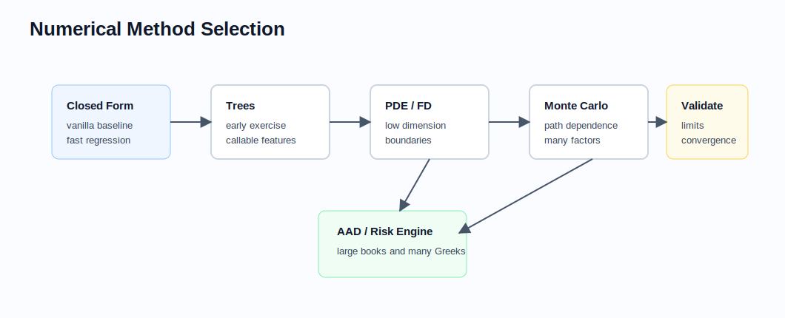

# Numerical Methods for Quant Developers

Related chapters: [01-options.md](01-options.md), [05-fixed-income.md](05-fixed-income.md), [06-interest-rates.md](06-interest-rates.md), [12-pricing-architecture.md](12-pricing-architecture.md), and [14-testing-and-validation.md](14-testing-and-validation.md).

## What This Domain Covers
Numerical methods are the bridge between models and production numbers. Most pricing libraries are not limited by whether the math is known; they are limited by whether interpolation, simulation, solvers, and sensitivity calculations are stable enough to support trading and risk.

## Product Taxonomy and Market Structure
This is a methods chapter rather than an asset-class chapter, but the same patterns recur:
- closed-form formulas for benchmark products,
- root-finding for implied parameters,
- interpolation and extrapolation for curves and surfaces,
- lattices and PDEs for low-dimensional state problems,
- Monte Carlo for path-dependent and high-dimensional products,
- regression, variance reduction, and adjoints for scalable risk.

## Quoting and Market Conventions
- Numerical methods must preserve the quote-space object traders care about, even if the engine works in a transformed space.
- Tolerances should reflect market materiality; machine precision is rarely the correct business target.
- Interpolation choices can change desk marks and should be versioned like model changes.
- Random seeds and path configurations are part of reproducibility, not debugging decoration.

## Core Pricing Framework



The method choice should follow the payoff and workflow: closed form for benchmarks, trees or PDEs for low-dimensional exercise and boundary behavior, Monte Carlo for path dependence and many factors, and AAD when risk throughput dominates.

### Root-Finding
Used for implied volatility, yield, spread, and calibration problems. Good practice:
- start with a bracket whenever possible,
- reject impossible target prices early,
- cap iteration counts and return convergence diagnostics.

### Interpolation And Extrapolation
Common objects:
- discount curves,
- forward curves,
- vol surfaces and cubes,
- hazard curves,
- correlation term structures.

Interpolation space matters. Examples:
- linear in discount factors,
- linear in zero rates,
- linear in log discount factors,
- linear in total variance,
- monotone cubic or arbitrage-aware spline variants.

### Trees And PDE
Trees and PDE methods work best when the state dimension is low and exercise or boundary behavior matters. Key ideas:
- stable grids,
- sensible boundaries,
- convergence checks under refinement,
- free-boundary handling for early exercise.

### Monte Carlo
Monte Carlo approximates:

$$
V \approx \frac{1}{N} \sum_{i=1}^{N} D_i \cdot X_i
$$

and improves with:
- antithetic paths,
- control variates,
- stratification or quasi-random sequences,
- regression for early exercise,
- pathwise or adjoint sensitivities.

Monte Carlo is used when analytical solutions are unavailable or too restrictive. In finance it is common for:
- path-dependent options,
- multi-asset or high-dimensional payoffs,
- VaR, Expected Shortfall, and stress simulations,
- counterparty exposure and CVA,
- portfolio risk and scenario analysis.

Key interview points:
- It uses random sampling to estimate an expectation.
- Accuracy improves slowly at roughly $1/\sqrt{N}$, so variance reduction matters.
- More paths reduce sampling error but increase runtime.
- Results should include confidence intervals or standard errors, not only point estimates.
- Random seeds, path count, time grid, model dynamics, and discounting assumptions are part of the reproducibility contract.

### Calibration
Calibration turns observed quotes into model parameters by minimizing error:

$$
\min_{\theta} \sum_j w_j \left(\text{ModelQuote}_j(\theta) - \text{MarketQuote}_j\right)^2
$$

The hard problem is not only minimizing the objective. It is controlling parameter stability, regularization, and sensitivity to stale or inconsistent quotes.

## Key Risk Measures and Sensitivities
- Finite-difference Greeks
- Pathwise Greeks
- Likelihood-ratio or score-function estimators
- Adjoint algorithmic differentiation for large portfolios
- Sensitivity of calibrated parameters to input quotes

Quant developers should think about risk method choice as a throughput and stability decision:
- finite differences are easy to reason about but expensive and noisy,
- pathwise/AAD methods scale better but require careful implementation discipline.

## Required Data, Curves, Surfaces, and Calibration Objects
- Well-defined market inputs with units and quote conventions
- Solver tolerances and stopping rules
- Interpolation and extrapolation policies
- Random-number generator configuration and seeds
- Benchmark datasets or closed-form comparators for verification

## Numerical and Implementation Approaches
- Keep numerical policies explicit and injectable rather than hidden in utility functions.
- Build small benchmark cases with known answers for every method family.
- Separate calibration data preparation from the optimizer itself.
- Prefer monotone or arbitrage-aware interpolation when financial shape constraints matter.
- Expose convergence diagnostics to logs and tests; a returned number without diagnostics is often not enough.

## Production Pitfalls and Sanity Checks
- Finite-difference bumps too small to overcome floating-point noise.
- Interpolation that is smooth but financially nonsensical.
- Monte Carlo runs that appear stable because the random seed accidentally hides variance.
- Monte Carlo estimates reported without standard error, confidence interval, path count, seed, or convergence diagnostics.
- Calibration overfitting sparse quotes and producing unstable out-of-sample risk.
- PDE boundaries chosen for convenience rather than asymptotic correctness.
- Invisible solver failures swallowed and replaced with stale cached results.

Minimum checks:
- convergence under grid/path refinement,
- benchmark agreement with closed-form cases where available,
- monotonicity and arbitrage constraints on interpolated objects,
- stable risk under reasonable bump-size variation,
- calibration residuals reported alongside fitted parameters.

## Illustrative Code
```python
import math
import random


def monte_carlo_call(spot: float, strike: float, expiry: float, rate: float, vol: float, paths: int, seed: int = 0) -> float:
    if paths <= 0:
        raise ValueError("paths must be positive")
    rng = random.Random(seed)
    discount = math.exp(-rate * expiry)
    drift = (rate - 0.5 * vol * vol) * expiry
    diffusion = vol * math.sqrt(expiry)
    payoff_sum = 0.0
    simulated_paths = 0

    for _ in range((paths + 1) // 2):
        z = rng.gauss(0.0, 1.0)
        for shock in (z, -z):
            if simulated_paths == paths:
                break
            terminal = spot * math.exp(drift + diffusion * shock)
            payoff_sum += max(terminal - strike, 0.0)
            simulated_paths += 1

    return discount * payoff_sum / simulated_paths
```

## References and Further Reading
- Glasserman. *Monte Carlo Methods in Financial Engineering*
- Duffy. *Finite Difference Methods in Financial Engineering*
- Joshi. *C++ Design Patterns and Derivatives Pricing*
- Giles and Glasserman on adjoint and pathwise risk methods
