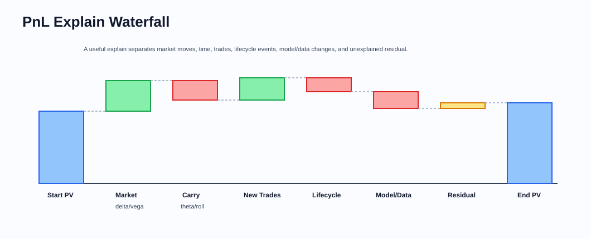
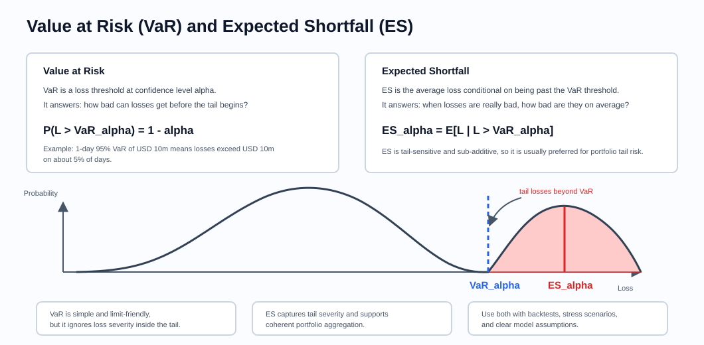
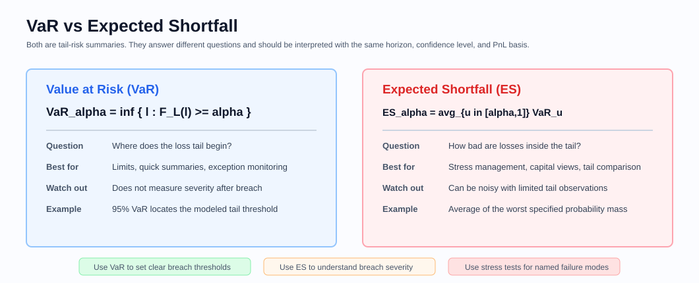
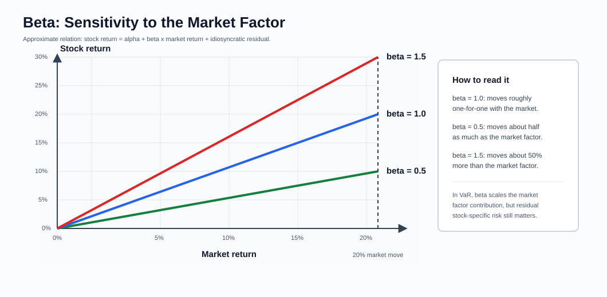
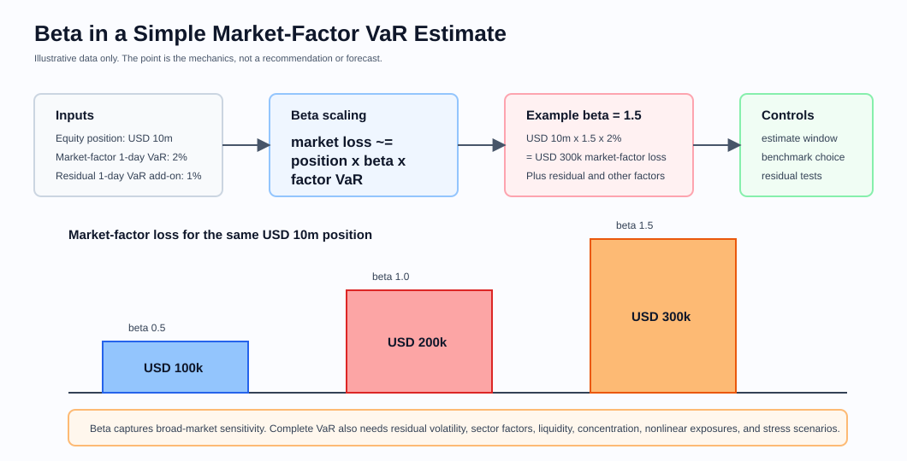
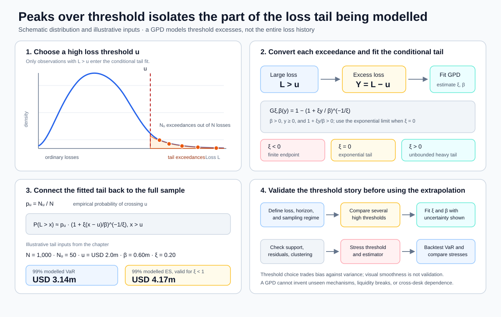
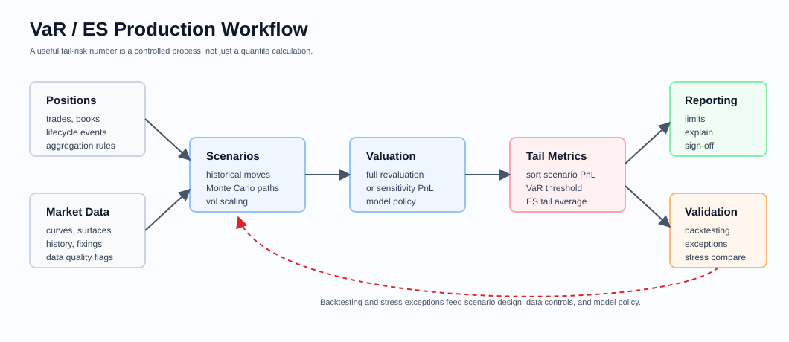

# Risk and PnL

Related chapters: [01-options.md](01-options.md), [06-interest-rates.md](06-interest-rates.md), [09-cross-asset.md](09-cross-asset.md), [12-pricing-architecture.md](12-pricing-architecture.md), [14-testing-and-validation.md](14-testing-and-validation.md), [16-portfolio-construction-and-backtesting.md](16-portfolio-construction-and-backtesting.md), [18-volatility-products.md](18-volatility-products.md), and [45-time-series-forecasting-and-state-space-models.md](45-time-series-forecasting-and-state-space-models.md).

## What This Domain Covers
Pricing tells you where the book stands. Risk and PnL explain how that position can move and why it actually moved.

This is the daily conversation between a trading desk, risk team, finance, and control functions. A price without risk is not actionable. A PnL number without explain is not trustworthy. A risk report that cannot be reconciled to market moves is just a spreadsheet with authority.

This chapter follows the desk workflow: define risk factors, measure sensitivities, run scenarios, estimate tail loss, explain PnL, and investigate residuals.

## Product Taxonomy and Market Structure
The workflow moves from local changes to portfolio-level stories.

- Sensitivity-based risk
- Scenario and stress risk
- VaR and expected shortfall style portfolio views
- Daily PnL explain
- Intraday explain and what-if analysis
- Control reports and sign-off workflows

## Quoting and Market Conventions
- Risk only makes sense relative to a shock convention.
- PnL explain must align with the official marks and market-data cut used for reporting.
- Bucket definitions, scenario definitions, and aggregation currencies are part of the product contract for risk systems.

## Core Pricing Framework
PnL explain starts by asking which market factors moved and how the portfolio was exposed to them.

Common decomposition:

$$
\text{PnL} \approx \sum_i \frac{\partial V}{\partial x_i}\Delta x_i + \frac{1}{2}\sum_{i,j}\frac{\partial^2 V}{\partial x_i \partial x_j}\Delta x_i \Delta x_j + \text{carry} + \text{new trades} + \text{residual}
$$

The practical challenge is not writing the formula. It is:
- defining the risk factors $x_i$,
- matching them to market-data moves,
- deciding how recalibration is handled,
- explaining residuals.

### Visual PnL Explain Reference



A good explain separates start value, market moves, carry, new trades, lifecycle events, model or data changes, and residual. The residual is a diagnostic, not a bucket to ignore.

## Key Risk Measures and Sensitivities
- Delta, gamma, vega, theta, rho
- PV01, CS01, and key-rate buckets
- Cross-gammas and correlation risk
- Scenario loss under historical or hypothetical shocks
- Value at Risk (VaR) and Expected Shortfall (ES)
- Beta and factor exposure for equity VaR
- Carry and roll-down
- Residual or unexplained PnL

### Value at Risk and Expected Shortfall



VaR and ES summarize the loss tail of a portfolio distribution over a fixed horizon. They are portfolio-level measures: the result depends on the position set, valuation models, market-data history, risk-factor mapping, holding period, confidence level, and aggregation currency.



Let $L$ be portfolio loss over the horizon and let $\alpha$ be the confidence level.

$$
\operatorname{VaR}_\alpha(L)
:=
\inf\{\ell:F_L(\ell)\geq\alpha\}
$$

VaR is the lower loss quantile at the chosen confidence level. A 1-day 95% VaR of USD 10m means that, under the model and data window, USD 10m is the smallest threshold whose cumulative loss probability is at least 95%. For a continuous distribution with no probability mass at the quantile, losses exceed that threshold with probability $1-\alpha$; for a discrete or empirical distribution, that equality need not hold. VaR is useful for summary reporting, trading limits, and quick comparison across books, but it does not say how severe losses are once the threshold has been breached.

$$
\operatorname{ES}_\alpha(L)
:=
\frac{1}{1-\alpha}
\int_\alpha^1 \operatorname{VaR}_u(L)\,du
$$

Expected Shortfall, also called conditional VaR in some systems, averages the worst $1-\alpha$ probability mass of the loss distribution. When the distribution is continuous at VaR, this reduces to $E[L\mid L>\operatorname{VaR}_\alpha]$. With atoms or finite empirical samples, the calculation must include the appropriate fraction of observations at the VaR threshold rather than silently dropping or double-counting that mass. ES is more tail-sensitive than VaR and is a coherent risk measure under the usual axioms, including sub-additivity. That makes ES better suited to stress management, capital-style views, and portfolios where diversification can break down in the tail.

### Beta in Equity VaR

Beta provides one practical bridge from a single equity position to a broad market risk factor. It therefore belongs inside the equity-VaR story, between the portfolio loss definition and the full historical or scenario revaluation.

Beta measures how sensitive a stock or portfolio return is to a benchmark return:

$$
r_i = \alpha_i + \beta_i r_m + \epsilon_i
$$

Here $r_i$ is the stock or portfolio return, $r_m$ is the benchmark market return, $\beta_i$ is the market sensitivity, and $\epsilon_i$ is residual stock-specific return. A beta of 1.0 means the position tends to move broadly in line with the benchmark. A beta of 0.5 means it tends to move about half as much. A beta of 1.5 means it tends to move about 50% more than the benchmark.



In a simple factor VaR approximation, beta scales the market-factor shock:

$$
\Delta V_{\text{market}} \approx \text{position value} \times \beta \times \Delta r_m
$$

Illustrative market-factor VaR example:

| Position value | Market-factor 1-day VaR | Beta | Approximate market-factor loss |
| ---: | ---: | ---: | ---: |
| USD 10m | 2% | 0.5 | USD 100k |
| USD 10m | 2% | 1.0 | USD 200k |
| USD 10m | 2% | 1.5 | USD 300k |



Beta is useful, but it is not a complete risk measure:
- It is estimated from historical returns, so it can change across regimes.
- It depends on the benchmark, lookback window, return frequency, currency, and regression method.
- It captures broad-market sensitivity, not company-specific risk such as leverage, earnings events, management decisions, valuation risk, borrow pressure, or liquidity.
- It is a linear approximation, so it will miss nonlinear payoffs, option-like exposures, and gap risk.
- A beta-based VaR should be reconciled with full historical simulation, stress scenarios, and realized PnL exceptions.

Common implementation choices:
- Historical simulation: revalue or approximate the current portfolio under historical market moves.
- Parametric or variance-covariance: assume a distribution for risk-factor moves and map sensitivities into a portfolio loss distribution.
- Monte Carlo simulation: generate market scenarios from a calibrated model and value the portfolio under each scenario.
- Filtered historical simulation: rescale historical returns using current volatility or regime estimates.

### Historical, Parametric, And Monte Carlo Method Contracts

**Historical simulation** applies observed historical risk-factor changes to today's positions. It preserves empirical co-movement and tails present in the selected window, but it cannot contain a state that never occurred, and old scenarios may be economically inconsistent with today's levels, instruments, or market structure. Full revaluation is preferable for nonlinear books; sensitivity approximation should report its error.

For a linear portfolio with factor exposure vector \(b\), factor covariance \(\Sigma\), zero mean, and normally distributed PnL, portfolio standard deviation is:

$$
\sigma_P=\sqrt{b^\top\Sigma b}.
$$

If \(z_\alpha=\Phi^{-1}(\alpha)\), normal parametric loss measures are:

$$
\operatorname{VaR}_\alpha=z_\alpha\sigma_P,
\qquad
\operatorname{ES}_\alpha
=
\sigma_P\frac{\phi(z_\alpha)}{1-\alpha}.
$$

The normal approximation is transparent and fast, but linear mapping misses gamma and optionality, while a thin-tailed distribution can materially understate skew, jumps, volatility clustering, and dependence changes. Delta-gamma or full-revaluation parametric approaches require an explicit approximation and distributional contract.

**Monte Carlo VaR** draws joint risk-factor scenarios from a calibrated model, maps them to market states, reprices the current portfolio, converts scenario PnL to loss, and takes empirical quantiles and tail means. Monte Carlo permits nonlinear revaluation and hypothetical dynamics, but results inherit every model, calibration, dependence, discretization, variance-reduction, and random-number choice. A fixed seed makes a run reproducible; it does not make the estimate accurate.

**Filtered historical simulation** rescales historical shocks using a volatility or regime estimate. It can make the scenario distribution more responsive to current conditions, but adds model and procyclicality risk. Persist the original shock, scale factor, filter state, and resulting scenario.

**Stress testing and scenario analysis** ask a different question. A named scenario combines coherent moves in spot, curves, volatility, correlation, liquidity, basis, funding, and market access. It need not have an estimated probability. VaR and ES should be compared with historical and hypothetical stress losses, not used to replace them.

### Extreme Losses With Peaks Over Threshold And The GPD

The normal model tells a useful central story, but a risk manager is often asking a narrower question: once a loss is already unusually large, how quickly does the remaining tail decay? Extreme value theory addresses that question without claiming that one distribution describes the whole PnL history.

Let $L$ be loss and choose a high threshold $u$. Keep the $N_u$ observations for which $L>u$ and convert them into excesses $Y=L-u$. For a sufficiently high threshold and a broad class of underlying distributions, the conditional distribution of those excesses can be approximated by a generalized Pareto distribution (GPD):

$$
G_{\xi,\beta}(y)
=
1-\left(1+\frac{\xi y}{\beta}\right)^{-1/\xi},
\qquad
\beta>0,
\quad
y\geq0,
\quad
1+\frac{\xi y}{\beta}>0.
$$

For $\xi=0$, the continuous limit is $G(y)=1-\exp(-y/\beta)$. The shape parameter $\xi$ controls tail behavior: $\xi>0$ gives an unbounded heavy tail, $\xi=0$ gives an exponential-type tail, and $\xi<0$ gives a finite maximum excess $-\beta/\xi$ and therefore a fitted loss endpoint $u-\beta/\xi$. The GPD mean exists only for $\xi<1$ and its variance only for $\xi<1/2$; a fitted value outside those ranges is a warning about which summaries are mathematically defined, not a software error to suppress.



If the empirical threshold-exceedance probability is $p_u=N_u/N$, then for $x>u$:

$$
P(L>x)
\approx
p_u
\left(1+\frac{\xi(x-u)}{\beta}\right)^{-1/\xi}.
$$

For $\xi=0$, the continuous limit is $P(L>x)\approx p_u\exp(-(x-u)/\beta)$.

For a confidence level $\alpha>1-p_u$ and $\xi\neq0$, this gives the tail quantile:

$$
\operatorname{VaR}_{\alpha}
\approx
u+\frac{\beta}{\xi}
\left[
\left(\frac{1-\alpha}{p_u}\right)^{-\xi}-1
\right].
$$

When $\xi=0$, the limit is $u+\beta\log\!\left(p_u/(1-\alpha)\right)$. If $\xi<1$, the corresponding continuous-tail ES is:

$$
\operatorname{ES}_{\alpha}
\approx
\frac{\operatorname{VaR}_{\alpha}+\beta-\xi u}{1-\xi}.
$$

#### Worked Tail Story: From 1,000 Losses To A 99% Estimate

Suppose 1,000 comparable daily losses contain 50 observations above a USD 2.0 million threshold, so $p_u=5\%$. When losses are measured in USD millions, a fitted GPD has scale $\beta=0.6$ and shape $\xi=0.20$. The 99% quantile lies inside the fitted tail because $99\%>95\%=1-p_u$:

| Stage | Result | Meaning |
| --- | ---: | --- |
| Historical sample | 1,000 days | The population to which the estimate applies |
| Threshold | USD 2.0m | Only larger losses enter the GPD fit |
| Exceedances | 50 days, or 5% | Connects the conditional GPD to the unconditional loss tail |
| GPD parameters | $\beta=0.6$ USD m, $\xi=0.20$ | Illustrative fitted scale and shape |
| 99% VaR | USD 3.14m | Modelled loss quantile |
| 99% ES | USD 4.17m | Modelled average loss in the worst 1% |

The calculation is a model-based extrapolation, not a claim that a USD 4.17 million average has been directly observed. The threshold creates a bias-variance trade-off: too low contaminates the tail fit with ordinary observations; too high leaves too little data. A production workflow therefore tells the story in this order:

1. Align positions, loss definition, horizon, and sampling regime.
2. Explore several high thresholds. Look for an approximately linear mean-residual-life plot and stability of $\xi$ and the threshold-adjusted scale $\beta_u-\xi u$; raw $\beta_u$ is expected to change as the threshold changes. Do not select one threshold solely because it gives the desired capital number.
3. Fit $\xi$ and $\beta$ with a constrained method such as maximum likelihood, check support and residual diagnostics, and show uncertainty using profile likelihood or an appropriate bootstrap.
4. Recalculate VaR and ES across plausible thresholds and estimation methods.
5. Backtest quantile exceedances and compare the result with empirical losses and named stress scenarios.

The classical likelihood story treats excesses as identically distributed and sufficiently independent. Volatility clustering or event clusters reduce the effective information in the tail. Depending on the use case, validation may require declustering or extremal-index analysis, a block bootstrap, volatility filtering before POT fitting, and separate regime fits. GPD fitting does not manufacture information about unprecedented mechanisms, broken liquidity, changing positions, or dependence across desks. Confidence intervals can be wide because only the tail observations identify the model. Report the threshold, exceedance count, parameter uncertainty, dependence treatment, and sensitivity alongside the point estimate.

### Worked Method Example: Normal Parametric VaR And ES

Assume a portfolio has zero expected daily PnL and estimated daily standard deviation USD \(1.5\) million. At \(99\%\) confidence:

$$
z_{0.99}\approx2.326,
\qquad
\phi(z_{0.99})\approx0.02665.
$$

Therefore:

$$
\operatorname{VaR}_{0.99}
\approx
2.326\times1.5
=
USD\ 3.49\text{ million},
$$

$$
\operatorname{ES}_{0.99}
\approx
1.5\times\frac{0.02665}{0.01}
=
USD\ 4.00\text{ million}.
$$

The result is conditional on the normal, zero-mean, one-day model. A historical or Monte Carlo estimate should not be forced to match it: differences may reveal skew, fat tails, nonlinear revaluation, sampling error, or inconsistent positions and horizons. The calculation and a compact simulation comparison are reproduced in [examples/parametric-monte-carlo-var.md](examples/parametric-monte-carlo-var.md).



Production checks:
- Use the same position population, valuation date, market-data cut, and aggregation currency as official risk reporting.
- Version the confidence level, horizon, historical window, weighting scheme, and scenario generation method.
- Backtest VaR breaches against realized PnL and investigate exception clusters.
- Compare ES against the worst historical and stress losses; ES should not hide named scenario exposure.
- Report approximation error when using sensitivities instead of full revaluation, especially for nonlinear books.

## Required Data, Curves, Surfaces, and Calibration Objects
- Official trade population and positions
- End-of-day or intraday market snapshots
- Risk-factor mappings and bucket definitions
- Scenario libraries and shock rules
- Historical fixings and prior-day marks for explain
- Calibration policies that determine which parameters move with the market
- VaR method specification: confidence, horizon, window, weighting, decay, return definition, missing-data policy, and PnL mapping
- Historical shock set, filtered-shock scales, scenario provenance, and current-to-history risk-factor mapping
- Monte Carlo model family, parameters, dependence, discretization, random-number generator, seed policy, path count, and convergence diagnostics
- Named stress library with shock units, cross-factor coherence, liquidity overlays, governance owner, version, and effective date

## Numerical and Implementation Approaches
- Keep risk-factor definitions stable and versioned.
- Distinguish between market moves, time roll, trade activity, and model changes in explain.
- Run both local sensitivities and scenario tools; each catches different failure modes.
- Align explain calculations with the same pricing engines used for official marks, or document the approximation explicitly.
- Treat scenario generation and portfolio valuation as separate stages connected by a versioned scenario schema.
- For empirical VaR and ES, define quantile interpolation and tail inclusion at finite sample sizes. Report the number of tail observations supporting ES.
- For Monte Carlo, monitor quantile and ES convergence across path batches, seeds, time steps, and variance-reduction choices.
- Reconcile sensitivity-based, full-revaluation, and official risk results on representative linear and nonlinear portfolios.
- Backtest with a PnL definition consistent with the risk forecast, separating clean/hypothetical PnL from fees, new trades, and intraday activity where required.

## Production Pitfalls and Sanity Checks
- Reporting Greeks that cannot reproduce observed PnL because the shock convention is different.
- Recalibrated parameters changing silently between start-of-day and end-of-day explains.
- Aggregation currency conversions applied inconsistently.
- Residual PnL accepted as normal when it actually signals missing risk factors or stale data.
- New trades and lifecycle events mixed into market-move explain.
- Mixing PnL and loss signs or reporting a quantile without defining interpolation.
- Applying square-root-of-time scaling through jumps, serial dependence, options, or changing positions without validation.
- Using today's constituents with historical returns or applying historical percentage shocks to factors whose economics require absolute moves.
- Reporting parametric precision while omitting skew, fat tails, nonlinear mapping, or covariance uncertainty.
- Using too few Monte Carlo paths for stable ES or treating repeated pseudorandom paths as independent model evidence.
- Backtesting against an inconsistent PnL series and explaining clustered breaches as chance.
- Allowing VaR diversification to hide a named stress, liquidity, basis, or market-closure risk.

## Illustrative Code
```python
def first_order_explain(sensitivities: dict[str, float], market_moves: dict[str, float]) -> float:
    return sum(sensitivities.get(name, 0.0) * move for name, move in market_moves.items())


def normal_var_es(
    pnl_standard_deviation: float,
    confidence: float,
    expected_pnl: float = 0.0,
) -> tuple[float, float]:
    from math import exp, pi, sqrt
    from statistics import NormalDist

    if pnl_standard_deviation <= 0:
        raise ValueError("PnL standard deviation must be positive")
    if not 0.5 < confidence < 1.0:
        raise ValueError("confidence must be between 0.5 and 1")

    z_score = NormalDist().inv_cdf(confidence)
    density = exp(-0.5 * z_score**2) / sqrt(2.0 * pi)
    value_at_risk = -expected_pnl + z_score * pnl_standard_deviation
    expected_shortfall = (
        -expected_pnl
        + pnl_standard_deviation * density / (1.0 - confidence)
    )
    return value_at_risk, expected_shortfall


def gpd_tail_var_es(
    threshold: float,
    exceedance_probability: float,
    scale: float,
    shape: float,
    confidence: float,
) -> tuple[float, float]:
    from math import expm1, isfinite, log

    if not all(isfinite(value) for value in (threshold, scale, shape)):
        raise ValueError("threshold, scale, and shape must be finite")
    if scale <= 0:
        raise ValueError("scale must be positive")
    if not 0.0 < exceedance_probability < 1.0:
        raise ValueError("exceedance_probability must be between zero and one")
    if not 1.0 - exceedance_probability < confidence < 1.0:
        raise ValueError("confidence must place the quantile above the threshold")
    if shape >= 1.0:
        raise ValueError("GPD expected shortfall is infinite when shape >= 1")

    tail_ratio = (1.0 - confidence) / exceedance_probability
    if abs(shape) < 1e-12:
        value_at_risk = threshold + scale * log(1.0 / tail_ratio)
    else:
        value_at_risk = (
            threshold
            + scale / shape * expm1(-shape * log(tail_ratio))
        )

    expected_shortfall = (
        value_at_risk + scale - shape * threshold
    ) / (1.0 - shape)
    return value_at_risk, expected_shortfall


tail_var, tail_es = gpd_tail_var_es(
    threshold=2.0,
    exceedance_probability=0.05,
    scale=0.6,
    shape=0.2,
    confidence=0.99,
)
assert abs(tail_var - 3.1392) < 1e-4
assert abs(tail_es - 4.1740) < 1e-4
```

## References and Further Reading
- PnL explain and market-risk methodology documents used by trading and risk teams
- Jorion. *Value at Risk*.
- McNeil, Frey, and Embrechts. *Quantitative Risk Management*.
- Glasserman. *Monte Carlo Methods in Financial Engineering*.
- Pickands. [“Statistical Inference Using Extreme Order Statistics”](https://doi.org/10.1214/aos/1176343003), the foundational peaks-over-threshold limit result.
- NIST. [Generalized Pareto conditional mean exceedance reference](https://www.itl.nist.gov/div898/software/dataplot/refman1/auxillar/cme.htm), including the GPD support and shape interpretation.
- Basel market-risk standards and applicable local implementation rules.
- Links: [12-pricing-architecture.md](12-pricing-architecture.md), [14-testing-and-validation.md](14-testing-and-validation.md)
