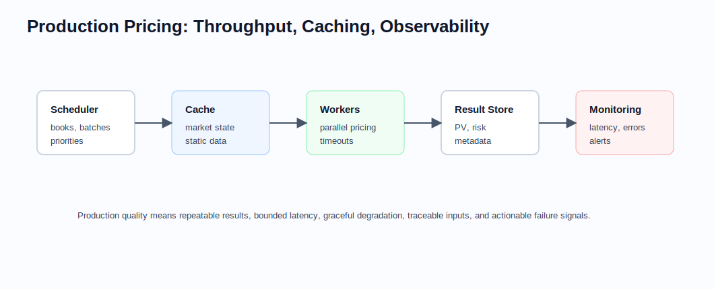

# Performance and Production

Related chapters: [11-market-data.md](11-market-data.md), [12-pricing-architecture.md](12-pricing-architecture.md), [13-risk-and-pnl.md](13-risk-and-pnl.md), and [14-testing-and-validation.md](14-testing-and-validation.md).

## What This Domain Covers
Quant systems are judged when the market is open, the book is large, and someone needs the number now.

A model that works in a notebook is not finished. It has to run fast enough, reproduce yesterday's result, expose its diagnostics, handle bad inputs, fail clearly, and recover under load. Performance and production quality are therefore part of quantitative correctness, not an afterthought.

This chapter tells the production story: latency, throughput, caching, observability, determinism, scaling, and operational resilience.

## Product Taxonomy and Market Structure
Different workflows ask for different production qualities.

- Low-latency pricing services
- Intraday risk engines
- End-of-day batch and overnight valuation
- Scenario grids and stress infrastructure
- Calibration farms and distributed compute workflows

## Quoting and Market Conventions
- Performance requirements depend on business use: pre-trade quoting, intraday risk, end-of-day official marks, and exposure simulation have different latency targets.
- Reproducibility requirements differ too, but every workflow needs a defined contract.
- Cache invalidation must respect market-data version and convention changes, not only timestamps.

## Core Pricing Framework
Performance work begins by naming the bottleneck.

Performance work usually targets one or more of:
- lower latency per trade,
- higher throughput per portfolio,
- lower memory footprint,
- better horizontal scaling,
- more deterministic runtime.

The best gains often come from architecture:
- pre-resolved schedules and static data,
- immutable shared market snapshots,
- vectorized or batched evaluation,
- calibration reuse,
- parallelism aligned with the dependency graph.

### Visual Production Reference



Production quality is not just speed. The system must expose cache lineage, latency, failure rates, fallback use, and numerical diagnostics so results remain explainable under load.

## Key Risk Measures and Sensitivities
- Latency percentiles and throughput
- CPU and memory usage
- Cache hit ratio and invalidation correctness
- Failure rate, timeout rate, and fallback usage
- Reproducibility of price and risk across reruns

## Required Data, Curves, Surfaces, and Calibration Objects
- Performance benchmarks tied to representative books
- Market snapshots and portfolio fixtures for load tests
- Profiling traces and resource metrics
- Cache lineage and dependency metadata
- Observability for numerical convergence and fallback paths

## Numerical and Implementation Approaches
- Profile before optimizing; most hot spots are not where teams expect.
- Use batching and vectorization for homogeneous product families.
- Parallelize at stable boundaries: trade level, scenario level, or curve build level depending on workflow.
- Separate latency-sensitive paths from heavyweight calibration or scenario generation.
- Favor deterministic parallel reduction when reproducibility matters for controls.

## Production Pitfalls and Sanity Checks
- Caching stale results across market versions.
- Parallelizing a numerically unstable algorithm and making debugging impossible.
- Optimizing for mean latency while tail latency remains unacceptable.
- Dropping diagnostics in the name of speed and losing the ability to explain failures.
- Over-tuning to synthetic benchmarks that do not resemble real books.

## Illustrative Code
```python
from time import perf_counter


def timed_call(fn, *args, **kwargs):
    start = perf_counter()
    result = fn(*args, **kwargs)
    elapsed = perf_counter() - start
    return result, elapsed
```

## References and Further Reading
- High-performance numerical computing and profiling references relevant to your language stack
- Production SRE practices for latency, reliability, and observability
- Chapter links: [12-pricing-architecture.md](12-pricing-architecture.md), [14-testing-and-validation.md](14-testing-and-validation.md)
