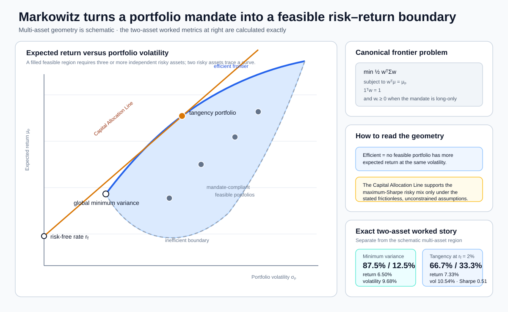
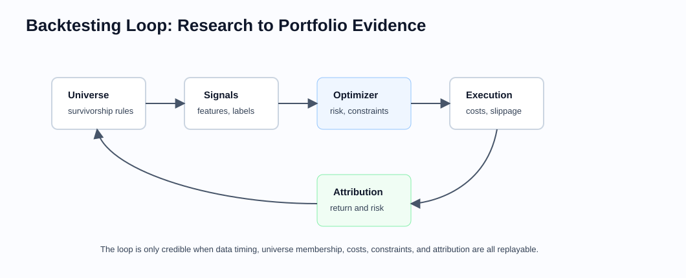

# Portfolio Construction and Backtesting

Related chapters: [03-equities.md](03-equities.md), [11-market-data.md](11-market-data.md), [12-pricing-architecture.md](12-pricing-architecture.md), [13-risk-and-pnl.md](13-risk-and-pnl.md), [14-testing-and-validation.md](14-testing-and-validation.md), [44-robust-portfolio-and-research-validation.md](44-robust-portfolio-and-research-validation.md), and [48-factor-models-and-systematic-signals.md](48-factor-models-and-systematic-signals.md).

## What This Domain Covers
Portfolio construction is where a view becomes a set of positions.

Backtesting is where that process is replayed against history to ask whether the idea might have worked. Both are easy to do badly. A signal can look strong before costs, a portfolio can hide factor bets, and a backtest can accidentally use information that was not available at the time.

For a quant developer, the hard part is rarely one optimizer call. The hard part is making the full workflow consistent: adjusted data, benchmark definitions, factor risk, constraints, turnover, transaction costs, rebalance timing, and reproducible research.

## Product Taxonomy and Market Structure
Start with the mandate: what kind of portfolio is being built and what is it measured against?

- Long-only and long-short portfolios
- Benchmark-relative and absolute-return mandates
- Markowitz mean-variance, minimum-variance, and benchmark-relative optimizers
- Black-Litterman allocation and view blending
- Risk parity and general risk-budgeting portfolios
- Kelly and fractional-Kelly growth allocation
- Hierarchical Risk Parity (HRP) and cluster-aware allocation
- Factor-aware and sector-neutral portfolios
- Signal-driven rebalancing strategies
- Event-driven and schedule-driven backtests

This chapter is mostly equity-oriented because that is where portfolio engineering language is most explicit, but the same patterns reappear in multi-asset allocation, overlay portfolios, and desk-level risk allocation tools.

## Quoting and Market Conventions
- Portfolio weights may be gross, net, or fully invested; do not treat them as interchangeable.
- Benchmark-relative analytics require an explicit benchmark definition, rebalance schedule, and constituent history.
- Total-return and price-return series answer different questions; backtests must declare which one they use.
- Turnover, slippage, commissions, borrow cost, and financing cost are part of the strategy definition, not after-the-fact adjustments.
- Rebalance timing matters: close-to-close, next-open, and end-of-day official marks produce different results.

Useful benchmark-relative definitions:

```math
w^{\text{active}} = w - w^{\text{bench}}
```

```math
\text{Tracking Error} = \sqrt{(w - w^{\text{bench}})^\top \Sigma (w - w^{\text{bench}})}
```

If a report says "active risk" without specifying benchmark, covariance horizon, and annualization convention, the number is not a stable interface.

## Core Pricing Framework
The optimizer is only one step in a larger investment process.

The canonical portfolio-construction problem is an optimization under risk and implementation constraints:

```math
\min_w \frac{1}{2} w^\top \Sigma w - \lambda \mu^\top w + C(w, w_{\text{prev}})
```

subject to funding, leverage, concentration, factor, and turnover limits.

In practice:
- $\mu$ is expected return, score, alpha forecast, or sometimes an implied equilibrium return.
- $\Sigma$ is the portfolio covariance estimate, often factor-based rather than pure sample covariance.
- $C(\cdot)$ captures transaction costs, slippage, turnover penalties, or market-impact approximations.

Factor models are often the right engineering abstraction:

```math
\Sigma = B \Sigma_f B^\top + D
```

where:
- $B$ is the asset-by-factor exposure matrix,
- $\Sigma_f$ is the factor covariance matrix,
- $D$ is the diagonal matrix of asset-specific return variances.

This matters because portfolio tools are usually built around exposures, active bets, and risk budgets rather than pairwise asset covariances alone.

### Markowitz Mean-Variance Optimization

Markowitz optimization makes the expected-return/risk trade-off explicit. Equivalent formulations maximize expected return for a risk budget, minimize risk for a return target, or maximize a quadratic utility:

```math
\max_w
\mu^\top w-\frac{\delta}{2}w^\top\Sigma w-C(w,w_{\text{prev}}).
```

The mathematical optimum is highly sensitive to $\mu$. A stable production process normally shrinks expected returns and covariance, limits leverage and concentration, and reports how much each constraint changes the unconstrained answer.

For a target expected return $\mu_p$, the canonical minimum-variance frontier problem is:

```math
\begin{aligned}
\min_w\quad & \frac{1}{2}w^\top\Sigma w \\
\text{subject to}\quad
& w^\top\mu=\mu_p, \\
& \mathbf{1}^\top w=1, \\
& w_i\geq0\quad\text{when the mandate is long-only}.
\end{aligned}
```

Each constraint-consistent weight vector is feasible. Its expected return is $w^\top\mu$ and its volatility is $\sqrt{w^\top\Sigma w}$. The efficient frontier is the upper boundary of feasible risky portfolios: at a given volatility, a portfolio is efficient only when no other feasible portfolio offers a higher expected return. Constraints can introduce corners and kinks, so the feasible region and frontier belong to the mandate, not just to $\mu$ and $\Sigma$.



#### Worked Markowitz Story: From Feasible Portfolios To A Decision

Suppose Asset A has expected return $6\%$ and volatility $10\%$, while Asset B has expected return $10\%$ and volatility $20\%$. Their correlation is $0.25$, so the covariance matrix is:

```math
\Sigma=
\begin{bmatrix}
0.010 & 0.005\\
0.005 & 0.040
\end{bmatrix}.
```

With weights summing to one and no shorting, every convex combination of A and B is feasible. The minimum-variance choice is $87.5\%$ in A and $12.5\%$ in B. It has expected return $6.5\%$ and volatility about $9.68\%$. That is the leftmost feasible point in expected-return/volatility space. The upper branch beginning there is efficient: for each attainable volatility on that branch, no other feasible mix has higher expected return.

Now add a $2\%$ cash rate. Under the same single-period horizon and a frictionless assumption that cash can be borrowed or lent at that rate, the maximum-Sharpe risky mix is proportional to $\Sigma^{-1}(\mu-r_f\mathbf 1)$, which normalizes to $66.7\%$ in A and $33.3\%$ in B. Its expected return is about $7.33\%$, volatility $10.54\%$, and estimated Sharpe ratio $0.51$. The Capital Allocation Line from cash tangent to the risky-asset frontier identifies this mix in the unconstrained model. Borrowing spreads, leverage, shorting, concentration, or turnover constraints can move the optimum and create a kinked boundary for which this closed form no longer applies.

The story ends with a control, not the optimizer: those weights are only as credible as the return, covariance, cash-rate, shorting, leverage, and cost assumptions. A desk should perturb the inputs, inspect binding constraints, add transaction and liquidity costs, and compare the target with the holdings it can actually execute.

### Sharpe Ratio: Is The Extra Return Worth The Ride?

Suppose two funds each have an expected annual arithmetic return of 10%, while cash earns 2%. Fund A has annual volatility of 10%; Fund B has 20%. Both offer eight percentage points of expected excess return, but B takes twice the volatility to get there. Their Sharpe ratios are 0.8 and 0.4 respectively. A's higher ratio means more expected excess return per unit of variability under these assumptions. It does not mean A earns more money, cannot lose money, or is automatically suitable for every investor.

For observed returns, first subtract the cash return earned over each matching observation interval, then calculate:

```math
x_t = r_{p,t}-r_{f,t},
\qquad
\widehat{SR}=\frac{\bar{x}}{s_x},
\qquad
s_x=\sqrt{\frac{1}{n-1}\sum_{t=1}^{n}(x_t-\bar{x})^2}.
```

Here $\bar{x}$ is the arithmetic mean excess return and $s_x$ is its sample standard deviation. Use total portfolio returns in one currency, aligned cash returns, and a stated gross or net cost basis. Do not substitute CAGR for the mean in this sample formula or divide daily excess returns by annual volatility. With varying cash rates, compute the excess-return series before taking its volatility. Zero sample volatility makes the ratio undefined; it is not evidence of infinite investment skill.

#### From Daily Or Monthly To Annual

The conventional scaling is $\widehat{SR}_{annual}\approx\sqrt{m}\,\widehat{SR}_{period}$, where $m$ might be 252 daily trading observations or 12 monthly observations per year. State your calendar and sampling convention. This scaling assumes stable moments and no serial correlation for additive excess returns; compounding adds another approximation. Overlapping returns, stale marks, or autocorrelation can invalidate it. With stationary autocovariances $\gamma_k$, the variance of an $m$-period sum is $m\gamma_0+2\sum_{k=1}^{m-1}(m-k)\gamma_k$, which exposes the missing dependence terms.

#### Read The Number Before Ranking The Strategy

A positive historical Sharpe means the sample average beat cash; a negative one means it did not. For negative excess returns, increasing volatility can make the ratio less negative without improving the economics. There is no universal threshold that proves a strategy is good. Compare the same horizon, currency, cash convention, and cost basis, and distinguish an expected model ratio from an observed sample estimate.

Then ask what the number hides: drawdowns, rare jump losses, illiquidity, changing leverage, financing costs, and how many backtests were tried before choosing the winner. Sharpe penalizes upside and downside variability alike and can miss severe tail exposure. Report it beside drawdown and stress-loss measures, net performance, sample length, and out-of-sample evidence. See [research selection controls](44-robust-portfolio-and-research-validation.md) for the consequences of selecting among many trials.

Reproduce the arithmetic and cost effect in the [Sharpe worked example](examples/sharpe-ratio-and-costs.md). Primary reference: William F. Sharpe, [*The Sharpe Ratio* (1994)](https://web.stanford.edu/~wfsharpe/art/sr/SR.htm), including its discussion of differential returns and time dependence.

### Black-Litterman

Black-Litterman starts from equilibrium excess returns rather than treating a noisy alpha estimate as certain. A common reverse-optimization prior is:

```math
\Pi=\delta\Sigma w_{\text{mkt}},
```

where $w_{\text{mkt}}$ is a reference market portfolio and $\delta$ is risk aversion. Views are represented by $P$, view returns $q$, and view-error covariance $\Omega$. With prior uncertainty scale $\tau$, a common posterior mean is:

```math
\mu_{\text{BL}}
=
\left[(\tau\Sigma)^{-1}+P^\top\Omega^{-1}P\right]^{-1}
\left[(\tau\Sigma)^{-1}\Pi+P^\top\Omega^{-1}q\right].
```

The formula does not remove judgment. Portfolio definition, risk aversion, $\tau$, view units, relative-versus-absolute view rows, and $\Omega$ determine the result. Confidence must be encoded as uncertainty, not as an informal label disconnected from the calculation.

### Risk Parity And Risk Budgets

For portfolio volatility $\sigma_p=\sqrt{w^\top\Sigma w}$, asset $i$'s contribution to volatility is:

```math
RC_i
=
w_i\frac{(\Sigma w)_i}{\sigma_p}.
```

Equal-risk-contribution risk parity targets the same $RC_i$ for each included asset. General risk budgeting targets fractions $b_i$ that sum to one. Inverse-volatility weights are a useful heuristic, but they are not generally risk parity because they ignore correlation. Risk parity also does not mean equal tail risk, equal scenario loss, or economic diversification.

### Kelly And Fractional Kelly

Kelly allocation maximizes expected logarithmic wealth:

```math
\max_w\ E[\log(1+w^\top r)].
```

The feasible domain must satisfy $1+w^\top r>0$ for every return outcome given positive modeled probability; otherwise log wealth is undefined. In finite-scenario code this is an explicit scenario constraint, while unbounded return models require a leverage or loss-support treatment consistent with the model.

For small returns under a quadratic approximation, the unconstrained solution resembles:

```math
w_{\text{Kelly}}\approx\Sigma^{-1}\mu.
```

That answer can be dangerously levered when $\mu$ is noisy, returns are non-normal, losses are discontinuous, or trading is constrained. Fractional Kelly scales the estimate, but the fraction is not a substitute for scenario limits, liquidity controls, or uncertainty analysis.

### Hierarchical Risk Parity

HRP converts correlation to a distance such as:

```math
d_{ij}=\sqrt{\frac{1-\rho_{ij}}{2}},
```

then clusters assets, orders them by the hierarchy, and recursively allocates between clusters using their estimated variances. It avoids directly inverting the full covariance matrix and can produce more stable weights in ill-conditioned problems. It is still sensitive to the return window, distance definition, linkage method, cluster ordering, and covariance estimator.

No method dominates in every mandate:

| Method | Primary input | Main benefit | Main failure mode |
| --- | --- | --- | --- |
| Markowitz | Expected return and covariance | Explicit return/risk trade-off | Noisy means create extreme weights |
| Black-Litterman | Equilibrium prior and uncertain views | Disciplined view blending | Hidden confidence and unit choices |
| Risk parity | Covariance and risk budgets | Diversifies local volatility contribution | Can lever low-volatility assets and miss tails |
| Kelly | Full return opportunity or mean/covariance approximation | Long-run growth objective | Estimation error and drawdown |
| HRP | Dependence and volatility | Cluster-aware, no full inverse | Unstable hierarchy or false diversification |

### Worked Allocation Example: Two-Asset Risk Parity

Assume two uncorrelated assets have annualized volatility $10\%$ and $20\%$. With no shorting and weights summing to one, inverse-volatility weights are:

```math
w_1
=
\frac{1/0.10}{1/0.10+1/0.20}
=
\frac{2}{3},
\qquad
w_2=\frac{1}{3}.
```

Each standalone weighted volatility is $6.67\%$, so the two assets contribute equally in this simple diagonal-covariance case. Portfolio volatility is:

```math
\sqrt{(2/3)^2(0.10)^2+(1/3)^2(0.20)^2}
\approx9.43\%.
```

With larger universes and heterogeneous correlations, solve the risk-budget equations using the full covariance matrix rather than assuming inverse-volatility weights are sufficient. The arithmetic is reproduced in [examples/portfolio-risk-budgeting.md](examples/portfolio-risk-budgeting.md).

### Visual Backtesting Reference



The research loop is only credible when universe membership, signal timing, optimization constraints, costs, execution assumptions, and attribution can be replayed exactly.

## Key Risk Measures and Sensitivities
- Portfolio volatility and marginal risk contribution
- Tracking error and active share
- Factor exposures and factor contribution to risk
- Marginal and component risk contributions versus declared risk budgets
- Posterior-return and weight sensitivity to Black-Litterman view confidence
- Kelly leverage and expected growth under parameter and tail perturbations
- Cluster and weight stability across HRP distance, linkage, and window choices
- Beta to benchmark or market factor
- VaR / expected shortfall for portfolio loss views
- Drawdown, downside deviation, and tail metrics
- Concentration, liquidity, and capacity indicators
- Turnover and implementation shortfall

The important distinction is between pre-trade and post-trade risk:
- pre-trade risk answers what the target portfolio would look like,
- post-trade risk answers what was actually held after fills, drift, and costs.

## Required Data, Curves, Surfaces, and Calibration Objects
- Adjusted and unadjusted historical prices with explicit adjustment policy
- Benchmark histories, constituent mappings, and classification data
- Factor return series and exposure inputs
- Covariance estimates, shrinkage policies, and annualization conventions
- Equilibrium portfolio, risk-aversion estimate, Black-Litterman view matrix, view returns, and view uncertainty
- Risk-budget vector, leverage policy, Kelly fraction, and HRP clustering specification
- Volume, ADV, spread, and liquidity proxies for cost estimation
- Corporate actions, borrow costs, and financing assumptions
- Rebalance calendars, holiday calendars, and market-close definitions
- Portfolio and trade ledgers sufficient to replay positions through time

## Numerical and Implementation Approaches
- Separate signal generation, risk estimation, optimization, execution-cost modelling, and portfolio accounting into explicit stages.
- Keep benchmark definition and rebalance rules versioned alongside the strategy configuration.
- Prefer factor covariance models when the asset universe is large relative to the available history.
- Store both target weights and realized holdings; drift between them is analytically meaningful.
- Make turnover and cost calculations deterministic and visible in the output schema.
- Use rolling-window estimation carefully; estimation horizon, lagging, and overlapping windows can change results materially.
- Treat optimization configuration as versioned data: objective, solver, tolerances, bounds, constraints, covariance, forecasts, and fallback.
- Compare several defensible input perturbations rather than trusting one point estimate. Report weight instability and binding constraints.
- Keep local covariance allocation separate from named stress and liquidity limits; a covariance optimizer does not see a locked market or discontinuous gap unless those controls are added.

Useful workflow split:
- research inputs,
- cleaned market data,
- portfolio objective and constraints,
- rebalance engine,
- cost model,
- performance and attribution report.

## Production Pitfalls and Sanity Checks
- Look-ahead bias from using data that would not have been available on the rebalance date.
- Survivorship bias from backtesting only today's investable universe.
- Mixing adjusted prices for signal generation with unadjusted quantities for holdings replay.
- Benchmark files changing historically without versioning.
- Silent weight renormalization masking missing assets or failed constraints.
- Ignoring turnover and slippage until after optimization, then discovering the strategy is untradeable.
- Reporting realized performance from target weights rather than executed positions.
- Presenting inverse-volatility weights as exact risk parity without calculating contributions from the full covariance matrix.
- Encoding Black-Litterman confidence inconsistently across views or mixing percent and decimal return units.
- Running full Kelly on unstable expected returns or treating a Kelly fraction as a drawdown guarantee.
- Calling HRP robust without checking cluster stability across windows and linkage rules.

Minimum checks:
- weights satisfy funding and exposure constraints within tolerance,
- backtest holdings can be replayed exactly from trades and prices,
- reported turnover matches actual holdings changes,
- benchmark-relative metrics reconcile to the benchmark series used in the run,
- cost assumptions are parameterized and visible in the output,
- small changes in estimation window or rebalance date do not create implausibly discontinuous results.

## Illustrative Code
```python
import numpy as np
import pandas as pd


def fully_invested_minimum_variance_weights(covariance: np.ndarray) -> np.ndarray:
    covariance = np.asarray(covariance, dtype=float)
    if covariance.ndim != 2 or covariance.shape[0] != covariance.shape[1]:
        raise ValueError("covariance must be a square matrix")
    if not np.isfinite(covariance).all() or not np.allclose(covariance, covariance.T):
        raise ValueError("covariance must be finite and symmetric")
    if np.linalg.eigvalsh(covariance).min() <= 0.0:
        raise ValueError("covariance must be positive definite")
    ones = np.ones(covariance.shape[0])
    raw_weights = np.linalg.solve(covariance, ones)
    return raw_weights / raw_weights.sum()


def fully_invested_tangency_weights(
    expected_returns: np.ndarray,
    covariance: np.ndarray,
    cash_rate: float,
) -> np.ndarray:
    expected_returns = np.asarray(expected_returns, dtype=float)
    covariance = np.asarray(covariance, dtype=float)
    if expected_returns.ndim != 1 or covariance.shape != (
        expected_returns.size,
        expected_returns.size,
    ):
        raise ValueError("return vector and covariance dimensions must match")
    if not np.isfinite(expected_returns).all() or not np.isfinite(cash_rate):
        raise ValueError("return inputs must be finite")
    if not np.isfinite(covariance).all() or not np.allclose(covariance, covariance.T):
        raise ValueError("covariance must be finite and symmetric")
    if np.linalg.eigvalsh(covariance).min() <= 0.0:
        raise ValueError("covariance must be positive definite")
    excess_returns = expected_returns - cash_rate
    raw_weights = np.linalg.solve(covariance, excess_returns)
    if raw_weights.sum() <= 1e-12:
        raise ValueError(
            "conventional long-funded tangency weights require a positive raw sum"
        )
    return raw_weights / raw_weights.sum()


def active_weights(weights: pd.Series, benchmark: pd.Series) -> pd.Series:
    if not weights.index.is_unique or not benchmark.index.is_unique:
        raise ValueError("weight labels must be unique")
    if not np.isfinite(weights.to_numpy(dtype=float)).all():
        raise ValueError("portfolio weights must be finite")
    if not np.isfinite(benchmark.to_numpy(dtype=float)).all():
        raise ValueError("benchmark weights must be finite")
    aligned_weights = weights.reindex(weights.index.union(benchmark.index), fill_value=0.0)
    aligned_benchmark = benchmark.reindex(aligned_weights.index, fill_value=0.0)
    return aligned_weights - aligned_benchmark


def factor_covariance(exposures: pd.DataFrame, factor_cov: pd.DataFrame, specific_var: pd.Series) -> pd.DataFrame:
    if not exposures.index.is_unique or not exposures.columns.is_unique:
        raise ValueError("exposure asset and factor labels must be unique")
    if not factor_cov.index.is_unique or not factor_cov.columns.is_unique:
        raise ValueError("factor covariance labels must be unique")
    if not specific_var.index.is_unique:
        raise ValueError("specific-variance asset labels must be unique")
    factors = exposures.columns
    if set(factor_cov.index) != set(factors) or set(factor_cov.columns) != set(factors):
        raise ValueError("factor covariance labels must match exposure factors")
    aligned_factor_cov = factor_cov.reindex(index=factors, columns=factors)
    aligned_specific = specific_var.reindex(exposures.index)
    arrays = (
        exposures.to_numpy(dtype=float),
        aligned_factor_cov.to_numpy(dtype=float),
        aligned_specific.to_numpy(dtype=float),
    )
    if any(not np.isfinite(array).all() for array in arrays):
        raise ValueError("covariance inputs must be finite and complete")
    if not np.allclose(arrays[1], arrays[1].T):
        raise ValueError("factor covariance must be symmetric")
    if np.linalg.eigvalsh(arrays[1]).min() < -1e-12:
        raise ValueError("factor covariance must be positive semidefinite")
    if (aligned_specific < 0.0).any():
        raise ValueError("specific variances must be non-negative")
    common = arrays[0] @ arrays[1] @ arrays[0].T
    total = common + np.diag(arrays[2])
    return pd.DataFrame(total, index=exposures.index, columns=exposures.index)


def gross_two_way_turnover(prev_weights: pd.Series, new_weights: pd.Series) -> float:
    """Return sum(abs(delta weight)) across all named holdings."""
    if not prev_weights.index.is_unique or not new_weights.index.is_unique:
        raise ValueError("weight labels must be unique")
    if not np.isfinite(prev_weights.to_numpy(dtype=float)).all():
        raise ValueError("previous weights must be finite")
    if not np.isfinite(new_weights.to_numpy(dtype=float)).all():
        raise ValueError("new weights must be finite")
    aligned_prev = prev_weights.reindex(new_weights.index.union(prev_weights.index), fill_value=0.0)
    aligned_new = new_weights.reindex(aligned_prev.index, fill_value=0.0)
    return float((aligned_new - aligned_prev).abs().sum())


def inverse_volatility_weights(volatility: pd.Series) -> pd.Series:
    if volatility.empty or not volatility.index.is_unique:
        raise ValueError("volatility inputs require unique, non-empty labels")
    if not np.isfinite(volatility.to_numpy(dtype=float)).all():
        raise ValueError("volatility inputs must be finite")
    if (volatility <= 0).any():
        raise ValueError("volatility inputs must be positive")
    inverse = 1.0 / volatility
    return inverse / inverse.sum()


def volatility_risk_contributions(weights: pd.Series, covariance: pd.DataFrame) -> pd.Series:
    if weights.empty or not weights.index.is_unique:
        raise ValueError("weights require unique, non-empty labels")
    if not covariance.index.is_unique or not covariance.columns.is_unique:
        raise ValueError("covariance labels must be unique")
    if (
        set(covariance.index) != set(weights.index)
        or set(covariance.columns) != set(weights.index)
    ):
        raise ValueError("covariance labels must match weight labels")
    aligned_covariance = covariance.reindex(
        index=weights.index,
        columns=weights.index,
    )
    weight_values = weights.to_numpy(dtype=float)
    covariance_values = aligned_covariance.to_numpy(dtype=float)
    if (
        not np.isfinite(weight_values).all()
        or not np.isfinite(covariance_values).all()
    ):
        raise ValueError("weights and covariance must be finite")
    if not np.allclose(covariance_values, covariance_values.T):
        raise ValueError("covariance must be symmetric")
    if np.linalg.eigvalsh(covariance_values).min() < -1e-12:
        raise ValueError("covariance must be positive semidefinite")
    marginal_variance = covariance_values @ weight_values
    portfolio_variance = float(weight_values @ marginal_variance)
    if portfolio_variance <= 0:
        raise ValueError("portfolio variance must be positive")
    portfolio_volatility = portfolio_variance**0.5
    return pd.Series(
        weight_values * marginal_variance / portfolio_volatility,
        index=weights.index,
    )


worked_covariance = np.array([[0.010, 0.005], [0.005, 0.040]])
worked_returns = np.array([0.06, 0.10])
minimum_variance = fully_invested_minimum_variance_weights(worked_covariance)
tangency = fully_invested_tangency_weights(worked_returns, worked_covariance, 0.02)
assert np.allclose(minimum_variance, [0.875, 0.125])
assert np.allclose(tangency, [2.0 / 3.0, 1.0 / 3.0])
assert abs(float(minimum_variance @ worked_returns) - 0.065) < 1e-12
assert abs(float(np.sqrt(minimum_variance @ worked_covariance @ minimum_variance)) - 0.09682458) < 1e-8
```

The two analytical weight functions enforce only the net budget constraint; they do not enforce long-only or other portfolio bounds and can therefore return negative component weights. They also require a positive-definite covariance matrix. A singular positive-semidefinite estimate needs a documented regularization, pseudoinverse policy, or constrained solver. The worked case happens to satisfy the long-only constraint because both computed weights are positive.

This is deliberately small. `gross_two_way_turnover` returns the sum of absolute weight changes. Halving that number to report "one-way turnover" is valid only for a cash-neutral, fully invested rebalance whose buys and sells match; subscriptions, withdrawals, leverage changes, shorts, and residual cash require buy, sell, and gross activity to be reported separately. A production implementation would also version data snapshots, account for trading calendars and execution timing, and distinguish target weights from executed holdings.

## References and Further Reading
- Grinold and Kahn. *Active Portfolio Management*
- Markowitz. *Portfolio Selection*.
- Black and Litterman on global portfolio optimization and view blending.
- Kelly. *A New Interpretation of Information Rate*.
- Maillard, Roncalli, and Teiletche on equal-risk-contribution portfolios.
- López de Prado on Hierarchical Risk Parity.
- Meucci. *Risk and Asset Allocation*
- Kissell. *The Science of Algorithmic Trading and Portfolio Management*
- Practitioner material on factor models, benchmark-relative risk, and transaction-cost modelling
