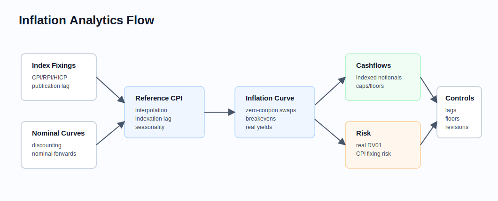

# Inflation Products

Related chapters: [05-fixed-income.md](05-fixed-income.md), [06-interest-rates.md](06-interest-rates.md), [11-market-data.md](11-market-data.md), [13-risk-and-pnl.md](13-risk-and-pnl.md), and [21-regulatory-margin-capital.md](21-regulatory-margin-capital.md).

## What This Domain Covers
Inflation products transfer exposure to changes in a published price index such as CPI, RPI, or HICP. The implementation challenge is not only modelling inflation. It is handling index publication lags, interpolation, seasonality, base index levels, real yields, and instrument-specific floor conventions.

## Product Taxonomy and Market Structure
- Inflation-linked bonds with principal or coupon indexation.
- Zero-coupon inflation swaps exchanging fixed inflation for realized index growth.
- Year-on-year inflation swaps and caps/floors.
- Inflation-linked notes and structured payoffs.
- Breakeven trades between nominal and inflation-linked bonds.

## Quoting and Market Conventions
- Inflation swaps are often quoted as fixed inflation rates.
- Published indices have observation lags; the index used for a payment may refer to a month several months before the payment date.
- Some markets interpolate between monthly index fixings; others use a lagged monthly value directly.
- Inflation-linked bonds may include deflation floors, index ratios, and accrued inflation treatment.
- Seasonality matters because monthly inflation is not uniform through the year.

## Core Pricing Framework
For a simple zero-coupon inflation swap with start index $I_0$ and maturity reference index $I_T$, the realized inflation leg is:

$$
\frac{I_T}{I_0} - 1
$$

The fair fixed inflation rate is the rate that makes the present value of the fixed inflation leg equal the expected indexed payoff under the chosen discounting convention.

### Visual Inflation Reference



Inflation pricing depends on both nominal discounting and inflation-index mechanics. Treat the reference-index calculation as a first-class model component, not as a date-formatting detail.

## Worked Instrument Example: Zero-Coupon Inflation Swap
Assume:
- start reference CPI: 250.00,
- maturity reference CPI: 280.00,
- maturity: 5 years.

The realized cumulative inflation is:

$$
\frac{280}{250} - 1 = 12\%
$$

The annualized inflation rate is approximately:

$$
\left(\frac{280}{250}\right)^{1/5} - 1 \approx 2.29\%
$$

Production systems must define exactly which CPI observations form the start and maturity reference values.

## Key Risk Measures and Sensitivities
- Inflation DV01 or real-rate DV01.
- Sensitivity to nominal discount curves.
- CPI fixing risk for near-dated known or partially known periods.
- Seasonality risk and interpolation risk.
- Breakeven spread risk between nominal and inflation-linked instruments.

## Required Data, Curves, Surfaces, and Calibration Objects
- Published CPI/RPI/HICP fixing history and release calendar.
- Indexation lag and interpolation rules by market.
- Nominal discount curves and real-yield or inflation-forward curves.
- Inflation swap quotes, linker prices, and breakeven inputs.
- Seasonality adjustments and revision policy.
- Bond-specific index ratios, floor terms, and coupon schedules.

## Numerical and Implementation Approaches
- Build a reference-index service that handles lags, interpolation, missing fixings, and publication dates.
- Separate nominal discounting from inflation projection.
- Version seasonality assumptions because they can materially affect short-dated instruments.
- Reconcile inflation-linked bond pricing to clean price, dirty price, accrued interest, and accrued inflation.

## Production Pitfalls and Sanity Checks
- Using payment date instead of reference month for index lookup.
- Treating all inflation markets as if they use the same interpolation convention.
- Ignoring deflation floors in linker pricing.
- Mixing quoted annual inflation rates with cumulative index ratios.
- Allowing revised or late fixings to change historical reports without versioning.

## Illustrative Code
```python
def realized_cumulative_inflation(start_index: float, end_index: float) -> float:
    return end_index / start_index - 1.0


def annualized_inflation(start_index: float, end_index: float, years: float) -> float:
    return (end_index / start_index) ** (1.0 / years) - 1.0
```

## References and Further Reading
- Inflation-linked bond and inflation swap market documentation.
- Central-bank and statistics-office index methodology notes.
- Links: [05-fixed-income.md](05-fixed-income.md), [06-interest-rates.md](06-interest-rates.md), [11-market-data.md](11-market-data.md)
