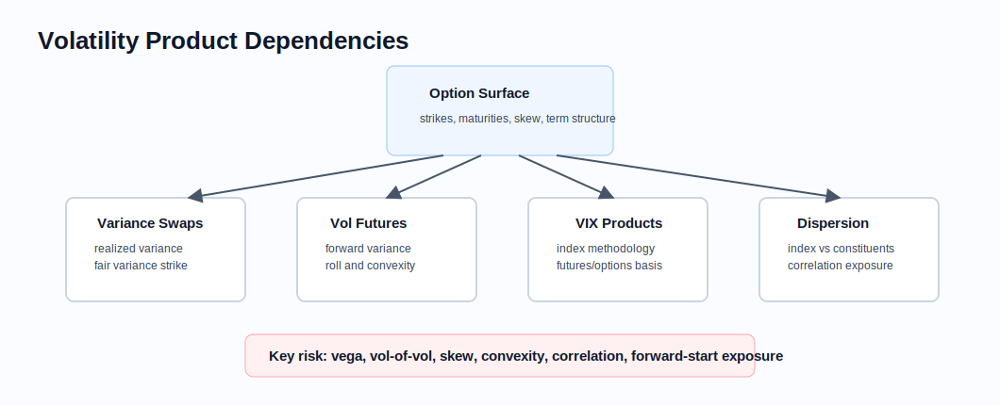
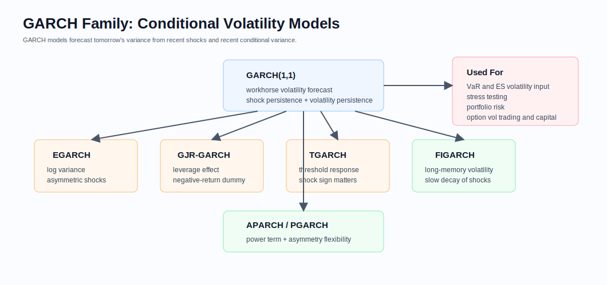
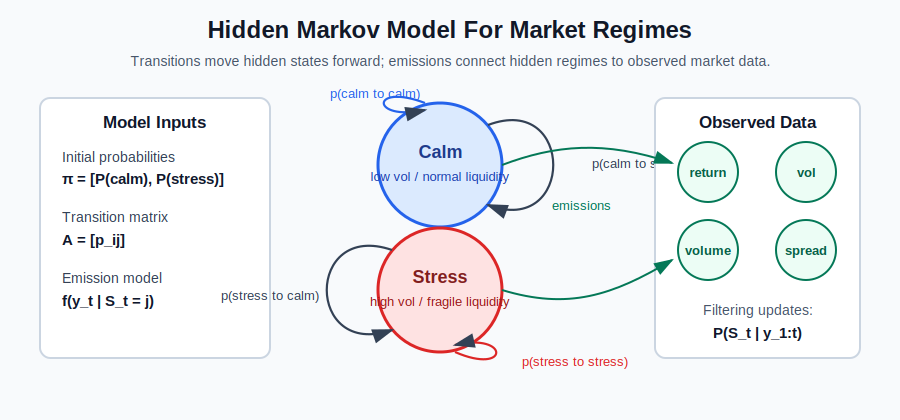
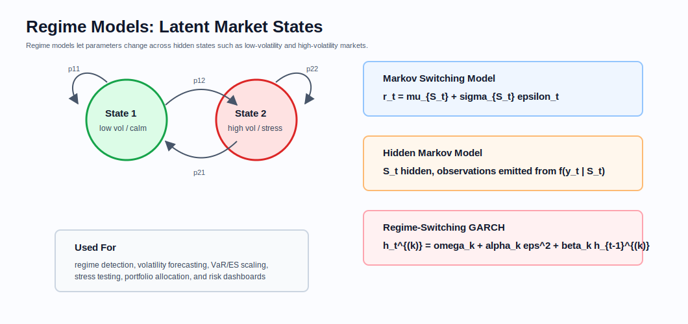
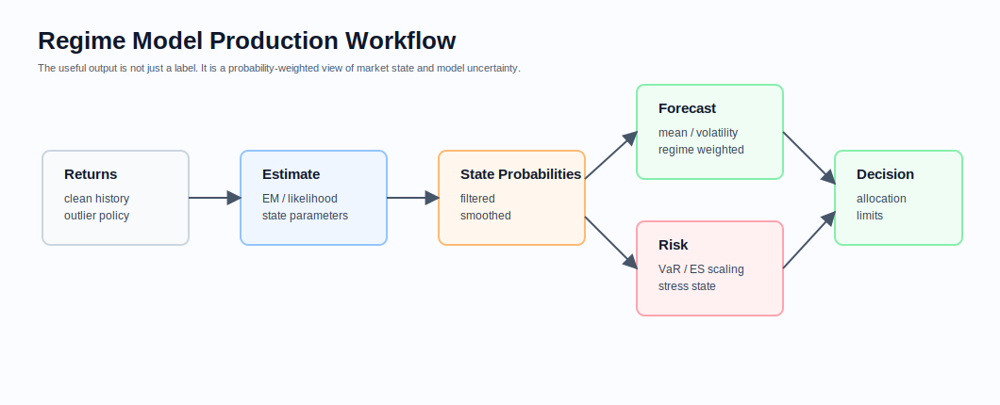
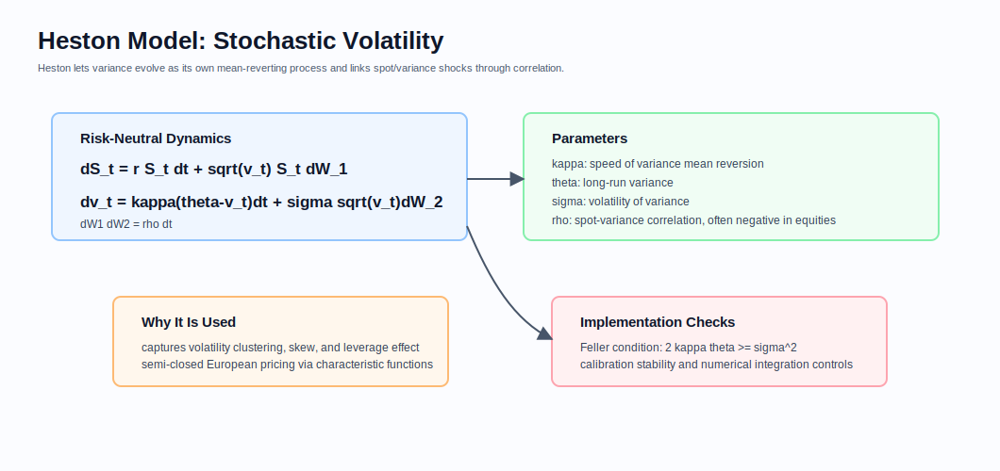

# Volatility Products

Related chapters: [01-options.md](01-options.md), [09-cross-asset.md](09-cross-asset.md), [10-numerical-methods.md](10-numerical-methods.md), [11-market-data.md](11-market-data.md), and [13-risk-and-pnl.md](13-risk-and-pnl.md).

## What This Domain Covers
Volatility products trade the size and shape of uncertainty.

An equity position mainly cares whether spot goes up or down. A volatility position cares how violently the market moves, how the option surface is shaped, how realized variance is measured, and how correlation behaves under stress.

This chapter connects option-surface intuition to traded volatility: variance swaps, volatility indices, dispersion, GARCH forecasts, regime models, and stochastic volatility. The thread is distributional risk, not simple direction.

## Product Taxonomy and Market Structure
Start by asking which part of volatility the product is isolating.

- Variance swaps and volatility swaps.
- VIX futures, VIX options, and volatility-index linked notes.
- Forward-starting variance and options.
- Dispersion trades between index volatility and constituent volatility.
- Corridor variance, gamma swaps, and other realized-volatility payoffs.

## Quoting and Market Conventions
- Variance is volatility squared; quoting in volatility points while settling variance creates unit risk.
- Variance swaps are usually quoted by variance strike or volatility strike, but the payoff is on realized variance.
- VIX products reference a specific index methodology, not generic implied volatility.
- Dispersion trades embed index-constituent correlation exposure.
- Realized variance definitions depend on sampling frequency, close source, holidays, and corporate-action handling.

## Core Pricing Framework
Variance products make the unit problem explicit: volatility and variance are not the same object.

A simplified variance swap payoff is:

$$
N_{\text{var}}(\sigma_{\text{realized}}^2 - K_{\text{var}})
$$

The fair variance strike can be related to a strip of options across strikes under idealized assumptions. In production, the practical problem is building an arbitrage-aware surface and applying the correct index methodology.

### Visual Volatility Reference



Volatility products depend on the option surface, but each product extracts a different exposure: realized variance, forward variance, index methodology, or correlation.

## GARCH-Family Volatility Forecasting
GARCH models are time-series models for conditional volatility. They do not price volatility products directly in the same way an option surface does, but they are widely used to forecast realized volatility, scale risk scenarios, feed VaR and ES models, stress portfolios, and compare realized volatility against implied volatility.

The basic GARCH(1,1) structure models variance as a dynamic process:

$$
\sigma_t^2 = \omega + \alpha \epsilon_{t-1}^2 + \beta \sigma_{t-1}^2
$$

where $\epsilon_{t-1}$ is the previous return shock, $\alpha$ controls the impact of new shocks, and $\beta$ controls volatility persistence. A common stationarity condition is:

$$
\alpha + \beta < 1
$$

### Visual GARCH Reference



Common variants:
- GARCH(1,1): the workhorse model for volatility forecasting and risk management.
- EGARCH: models log variance and captures asymmetric effects without requiring the same non-negativity constraints as standard GARCH.
- GJR-GARCH: adds a leverage-effect term so negative shocks can increase volatility more than positive shocks.
- TGARCH: allows positive and negative returns to affect future volatility differently through thresholds.
- APARCH / PGARCH: introduces a power parameter and flexible asymmetry.
- FIGARCH: captures long-memory behavior where volatility shocks decay slowly.

Practical uses:
- Volatility forecasting for trading, hedging, and risk limits.
- VaR and ES modelling through volatility-scaled return distributions.
- Stress testing by amplifying volatility regimes after large shocks.
- Portfolio risk management through conditional covariance or factor-volatility inputs.
- Option and volatility trading by comparing model-implied realized volatility forecasts against market-implied volatility.
- Regulatory capital calculations where conditional volatility affects risk estimates or stress calibration.

Implementation cautions:
- Return frequency, calendar treatment, outlier handling, and missing data materially change fitted parameters.
- Heavy-tailed residual distributions are often more realistic than normal residuals.
- Parameter stability should be checked across rolling windows and market regimes.
- A high $\alpha + \beta$ implies persistent volatility; values too close to 1 can make forecasts slow to mean-revert.
- GARCH forecasts conditional volatility, not full market risk; jump risk, liquidity, correlation breaks, and nonlinear exposures still need separate treatment.

## Regime Models and Regime-Switching Volatility
Regime models are now covered in this chapter because they sit naturally between volatility forecasting, VaR/ES scaling, stress testing, and portfolio allocation. The key idea is that market behavior can switch between latent states such as calm markets, high-volatility markets, crisis markets, or liquidity-stressed markets.

### Markov Switching Model
A Markov switching model lets return parameters depend on an unobserved state $S_t$:

$$
r_t = \mu_{S_t} + \sigma_{S_t}\epsilon_t
$$

The state follows a Markov chain with transition probabilities:

$$
P(S_t = j \mid S_{t-1} = i) = p_{ij}
$$

This is useful when mean, volatility, or correlation changes across regimes.

### Hidden Markov Model
An HMM also treats the state as hidden, but emphasizes the observation model:

$$
y_t \mid S_t = i \sim f(y_t \mid \theta_i)
$$

The model estimates state probabilities from observed data. In practice, this is useful for regime classification, time-varying risk estimates, and dashboards that show the probability of being in a stress state rather than forcing a hard label.

An HMM is usually specified by:
- hidden states $S = \{s_1,\ldots,s_N\}$, such as calm, trend, high-volatility, or stress regimes,
- initial state probabilities $\pi_i = P(S_0 = s_i)$,
- transition matrix $A = [a_{ij}]$, where $a_{ij} = P(S_t=s_j \mid S_{t-1}=s_i)$,
- emission or observation model $B$, such as $f(y_t \mid S_t=s_j)$ for returns, realized volatility, volume, bid-ask spreads, or factor moves.



Common HMM tasks:
- Filtering estimates $P(S_t \mid y_1,\ldots,y_t)$ using only information available at time $t$.
- Smoothing estimates $P(S_t \mid y_1,\ldots,y_T)$ using the full sample; it is useful for research diagnostics but not live trading decisions.
- Decoding infers the most likely state path, often with the Viterbi algorithm.
- Estimation fits transition and emission parameters, often with expectation-maximization / Baum-Welch.

Trading and risk uses:
- regime probability dashboards for market state awareness,
- volatility and correlation scaling by filtered regime probability,
- de-risking or exposure caps when stress-regime probability rises,
- feature engineering for portfolio construction and execution models.

Implementation cautions:
- The model does not discover "bull" or "bear" states by name; humans label states after inspecting emissions and behavior.
- Gaussian emissions are convenient but can understate tail risk; heavy-tailed or multivariate emissions may be more realistic.
- More hidden states can improve in-sample fit while making the model unstable and hard to interpret.
- Filtered probabilities are live-usable; smoothed probabilities use future data and can create look-ahead bias.
- Regime signals should be tested after transaction costs, turnover, capacity, and delayed execution.

### Regime-Switching GARCH
Regime-switching GARCH combines latent states with regime-specific volatility dynamics:

$$
h_t^{(k)} = \omega_k + \alpha_k \epsilon_{t-1}^2 + \beta_k h_{t-1}^{(k)}
$$

Each regime $k$ has its own GARCH parameters. That makes the model more flexible than a single GARCH process when volatility clustering changes across calm and stressed markets.





Practical uses:
- Market regime detection and regime probability dashboards.
- Volatility forecasting when market dynamics change across states.
- VaR and ES models that scale risk differently in calm and stressed regimes.
- Stress testing by conditioning on high-volatility or crisis states.
- Portfolio allocation and de-risking rules driven by state probabilities.
- Regulatory capital and clearing risk models where turbulent-market behavior matters.

Implementation cautions:
- Regime labels are model outputs, not observable truths.
- State probabilities are often more useful than hard state assignments.
- More regimes can overfit and become hard to interpret.
- Transition probabilities should be monitored for stability.
- Backtests must avoid using smoothed future information in live-style decisions.
- Regime-switching GARCH can be fragile to initialize and computationally expensive to calibrate.

## Heston Stochastic Volatility Model
The Heston model is a stochastic-volatility model used for option pricing and volatility-surface calibration. Unlike Black-Scholes, it lets variance move through time as its own mean-reverting process. This helps represent volatility clustering, skew, and the equity leverage effect.

Under a risk-neutral measure, a common Heston specification is:

$$
dS_t = rS_tdt + \sqrt{v_t}S_tdW_{1,t}
$$

$$
dv_t = \kappa(\theta - v_t)dt + \sigma\sqrt{v_t}dW_{2,t}
$$

$$
dW_{1,t}dW_{2,t} = \rho dt
$$

where:
- $v_t$ is instantaneous variance,
- $\kappa$ is the speed of mean reversion,
- $\theta$ is long-run variance,
- $\sigma$ is volatility of variance, often called vol-of-vol,
- $\rho$ is correlation between spot and variance shocks.



Key features:
- Captures volatility clustering through a persistent variance process.
- Allows negative spot-volatility correlation, which helps fit equity skew.
- Has semi-closed European option pricing through characteristic functions and Fourier integration.
- Requires careful calibration controls because parameters can be unstable across sparse or noisy option surfaces.

Implementation cautions:
- The Feller condition $2\kappa\theta \geq \sigma^2$ helps keep variance positive in the continuous-time process, but calibration may violate it in practice.
- Numerical integration, branch handling, and parameter bounds can materially affect prices.
- Heston is a model for volatility dynamics, not a guarantee of correct smile extrapolation or jump behavior.
- For American options, Heston usually needs numerical methods such as PDEs, trees with extra state variables, or simulation/regression approaches.

## Worked Instrument Example: Variance Swap
Assume:
- variance notional: USD 50,000 per variance point,
- realized volatility: 24%,
- strike volatility: 20%.

The payoff uses squared volatility:

$$
50{,}000 \times (24^2 - 20^2) = 8{,}800{,}000
$$

This example uses volatility points, a common market shorthand. A production implementation must be explicit about whether volatility is represented as percent points or decimals.

## Key Risk Measures and Sensitivities
- Vega and variance vega.
- Gamma and realized-volatility exposure.
- Skew and smile sensitivity.
- Vol-of-vol and convexity.
- Correlation exposure for dispersion.
- Forward variance and roll-down exposure.

## Required Data, Curves, Surfaces, and Calibration Objects
- Option chains across strikes and maturities.
- Interest-rate, dividend, borrow, and forward inputs.
- Volatility index methodology inputs.
- Realized return series with sampling and corporate-action policies.
- Clean return series for GARCH estimation, including outlier and missing-data policy.
- Regime-model inputs such as return series, state count, transition constraints, and estimation window.
- Stochastic-volatility calibration inputs such as option surfaces, parameter bounds, correlation assumptions, and numerical integration settings.
- Constituent weights and correlation data for dispersion.
- Surface calibration and no-arbitrage controls.

## Numerical and Implementation Approaches
- Keep variance, volatility, and volatility points as distinct units in code.
- Treat GARCH models as forecasting models with explicit data windows, residual distributions, and refit schedules.
- Treat regime models as probabilistic classifiers; persist filtered probabilities, transition matrices, and model versions.
- Treat Heston and other stochastic-volatility models as calibrated models with explicit parameter constraints, objective functions, and fallback rules.
- Use robust interpolation and extrapolation controls for option surfaces.
- Validate option-strip replication against listed variance or volatility quotes where available.
- For VIX-style products, implement the official index methodology as a separate tested component.

## Production Pitfalls and Sanity Checks
- Squaring decimal volatility in one module and percent volatility in another.
- Treating VIX futures as spot VIX.
- Ignoring jump and close-to-close sampling effects in realized variance.
- Using a GARCH forecast as if it captures liquidity, jump, and correlation-break risk.
- Using smoothed regime states in a backtest when those states would not have been known at trade time.
- Over-interpreting Heston parameters when the calibration surface is sparse, stale, or arbitrage-inconsistent.
- Reporting dispersion risk without exposing correlation sensitivity.
- Calibrating a smooth surface that violates static no-arbitrage constraints.

## Illustrative Code
```python
def variance_swap_payoff(var_notional: float, realized_vol_points: float, strike_vol_points: float) -> float:
    return var_notional * (realized_vol_points ** 2 - strike_vol_points ** 2)


def garch_11_variance(omega: float, alpha: float, beta: float, prev_shock: float, prev_variance: float) -> float:
    return omega + alpha * prev_shock ** 2 + beta * prev_variance


def two_state_next_probability(current_prob_state_1: float, p11: float, p21: float) -> float:
    return current_prob_state_1 * p11 + (1.0 - current_prob_state_1) * p21
```

## References and Further Reading
- Gatheral. *The Volatility Surface*
- Demeterfi, Derman, Kamal, and Zou on variance swaps.
- Bollerslev on generalized autoregressive conditional heteroskedasticity.
- Hamilton on regime-switching time-series models.
- Exchange methodology documents for volatility indices.
