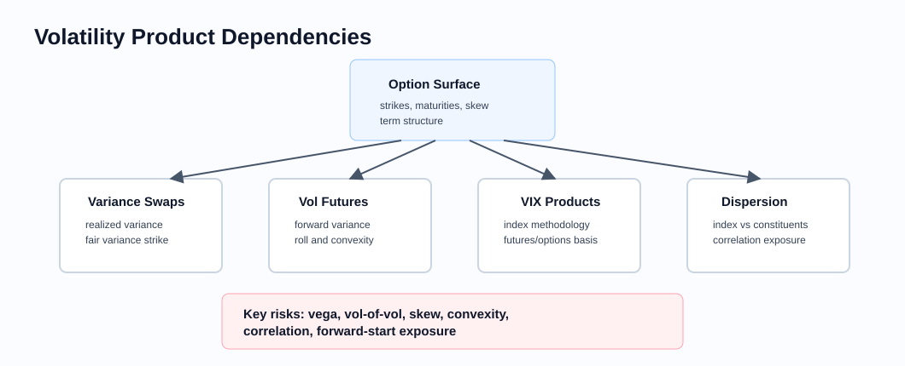
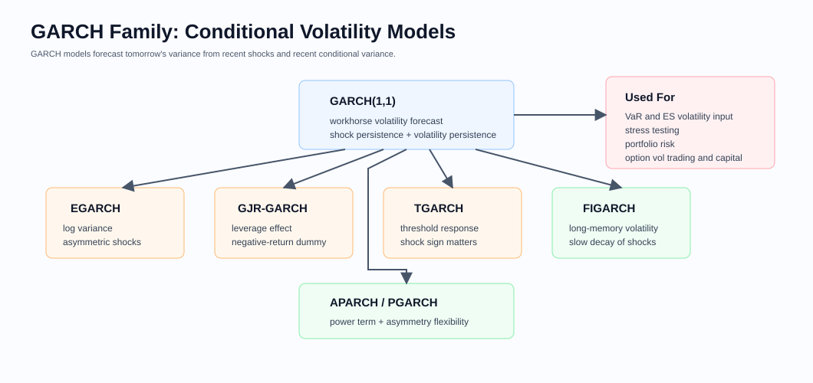
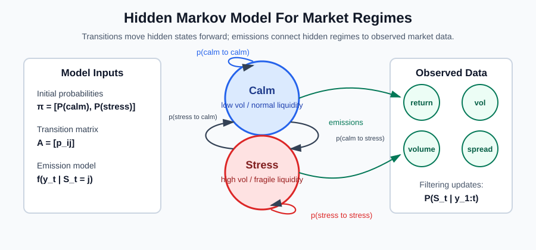
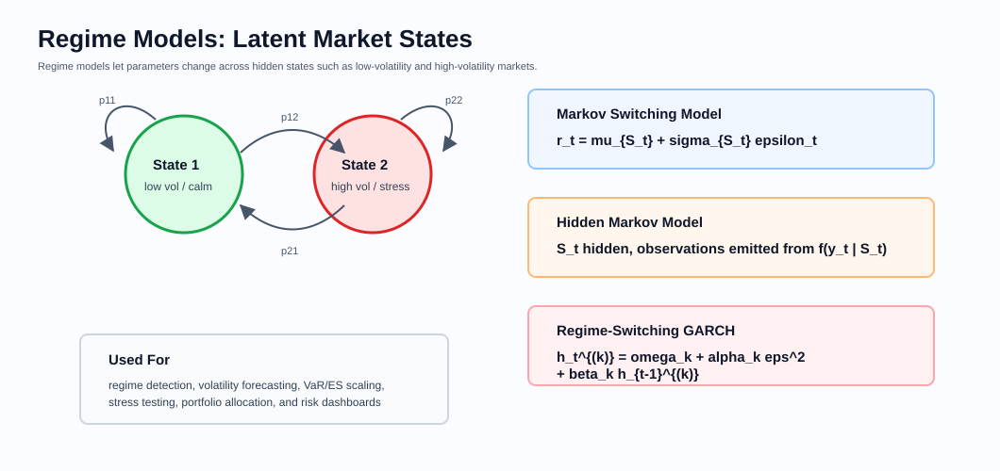
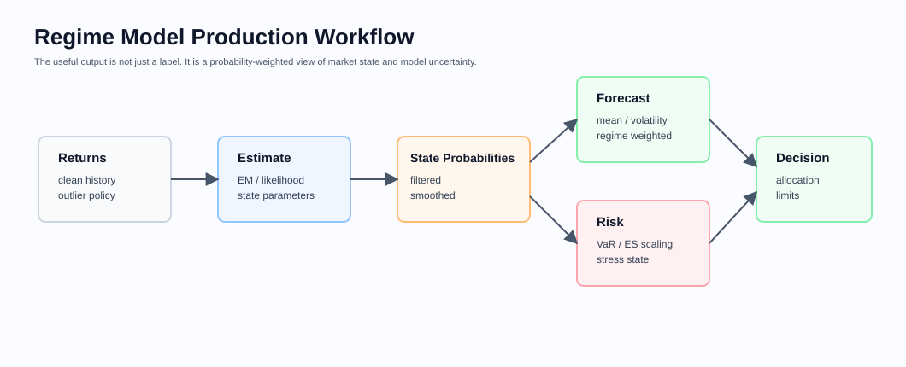
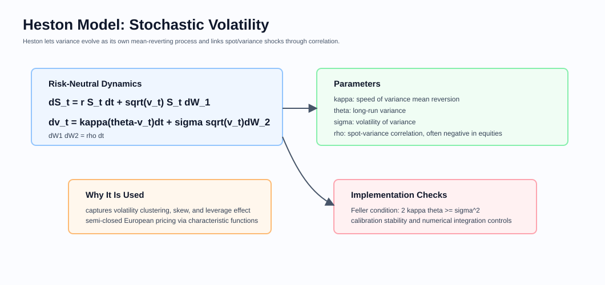

# Volatility Products

Related chapters: [01-options.md](01-options.md), [09-cross-asset.md](09-cross-asset.md), [10-numerical-methods.md](10-numerical-methods.md), [11-market-data.md](11-market-data.md), [13-risk-and-pnl.md](13-risk-and-pnl.md), and [45-time-series-forecasting-and-state-space-models.md](45-time-series-forecasting-and-state-space-models.md).

## What This Domain Covers
Volatility products trade the size and shape of uncertainty.

An equity position mainly cares whether spot goes up or down. A volatility position cares how violently the market moves, how the option surface is shaped, how realized variance is measured, and how correlation behaves under stress.

This chapter connects option-surface intuition to traded volatility: variance swaps, volatility indices, dispersion, GARCH forecasts, regime models, and stochastic volatility. The thread is distributional risk, not simple direction.

## Product Taxonomy and Market Structure
Start by asking which part of volatility the product is isolating.

- Variance swaps and volatility swaps.
- VIX futures, VIX options, and volatility-index linked notes.
- Forward-starting variance and options.
- Dispersion trades between index volatility and constituent volatility.
- Corridor variance, gamma swaps, and other realized-volatility payoffs.

## Quoting and Market Conventions
- Variance is volatility squared; quoting in volatility points while settling variance creates unit risk.
- Variance swaps are usually quoted by variance strike or volatility strike, but the payoff is on realized variance.
- VIX products reference a specific index methodology, not generic implied volatility.
- Dispersion trades embed index-constituent correlation exposure.
- Realized variance definitions depend on sampling frequency, close source, holidays, and corporate-action handling.

## Core Pricing Framework
Variance products make the unit problem explicit: volatility and variance are not the same object.

A simplified variance swap payoff is:

```math
N_{\text{var}}(\sigma_{\text{realized}}^2 - K_{\text{var}})
```

The fair variance strike can be related to a strip of options across strikes under idealized assumptions. In production, the practical problem is building an arbitrage-aware surface and applying the correct index methodology.

### Visual Volatility Reference



Volatility products depend on the option surface, but each product extracts a different exposure: realized variance, forward variance, index methodology, or correlation.

## GARCH-Family Volatility Forecasting
GARCH models are time-series models for conditional volatility. They do not price volatility products directly in the same way an option surface does, but they are widely used to forecast realized volatility, scale risk scenarios, feed VaR and ES models, stress portfolios, and compare realized volatility against implied volatility.

The basic GARCH(1,1) structure models variance as a dynamic process:

```math
\sigma_t^2 = \omega + \alpha \epsilon_{t-1}^2 + \beta \sigma_{t-1}^2
```

where $\epsilon_{t-1}$ is the previous return shock, $\alpha$ controls the impact of new shocks, and $\beta$ controls volatility persistence. For the standard parameterization with $\omega>0$ and $\alpha,\beta\geq0$, the familiar condition for a finite unconditional variance, also called covariance or weak stationarity here, is:

```math
\alpha + \beta < 1
```

### Visual GARCH Reference



Common variants:
- GARCH(1,1): the workhorse model for volatility forecasting and risk management.
- EGARCH: models log variance and captures asymmetric effects without requiring the same non-negativity constraints as standard GARCH.
- GJR-GARCH: adds a leverage-effect term so negative shocks can increase volatility more than positive shocks.
- TGARCH: allows positive and negative returns to affect future volatility differently through thresholds.
- APARCH / PGARCH: introduces a power parameter and flexible asymmetry.
- FIGARCH: captures long-memory behavior where volatility shocks decay slowly.

Practical uses:
- Volatility forecasting for trading, hedging, and risk limits.
- VaR and ES modelling through volatility-scaled return distributions.
- Stress testing by amplifying volatility regimes after large shocks.
- Portfolio risk management through conditional covariance or factor-volatility inputs.
- Option and volatility trading by comparing model-implied realized volatility forecasts against market-implied volatility.
- Regulatory capital calculations where conditional volatility affects risk estimates or stress calibration.

Implementation cautions:
- Return frequency, calendar treatment, outlier handling, and missing data materially change fitted parameters.
- Heavy-tailed residual distributions are often more realistic than normal residuals.
- Parameter stability should be checked across rolling windows and market regimes.
- A high $\alpha + \beta$ implies persistent volatility; values too close to 1 can make forecasts slow to mean-revert.
- GARCH forecasts conditional volatility, not full market risk; jump risk, liquidity, correlation breaks, and nonlinear exposures still need separate treatment.

## EWMA and Realized-Volatility Forecasting
GARCH is not the only defensible volatility baseline. An exponentially weighted moving average (EWMA) updates conditional variance as:

```math
h_t=\lambda h_{t-1}+(1-\lambda)r_{t-1}^2,\qquad 0<\lambda<1.
```

The weight on an observation $k$ periods old is $(1-\lambda)\lambda^{k-1}$. Its variance-weight half-life is:

```math
\text{half-life}=\frac{\log(0.5)}{\log(\lambda)}.
```

EWMA is transparent, fast, and often a useful benchmark. In its basic form it has no separate long-run variance, so a multi-step forecast remains at the current variance rather than mean-reverting. A value of $\lambda$ is inseparable from sampling frequency: a daily decay parameter cannot be moved to intraday bars without conversion and validation.

When reliable high-frequency observations are available, daily realized variance can be estimated from intraday returns:

```math
RV_t=\sum_{j=1}^{M_t}r_{t,j}^2.
```

The heterogeneous autoregressive realized-volatility model (HAR-RV) uses daily, weekly, and monthly components:

```math
RV_{t+1}
=\beta_0+\beta_d RV_t
+\beta_w\overline{RV}_{t,5}
+\beta_m\overline{RV}_{t,22}
+\epsilon_{t+1}.
```

In practice, modelling $\log RV$ can keep forecasts positive and reduce skew, but retransformation requires care because $\exp(\mathbb E[\log RV])\neq\mathbb E[RV]$. Robust realized measures such as realized kernels, subsampled variance, or pre-averaging can reduce microstructure-noise bias. Overnight returns, market closures, and changing numbers of intraday observations need an explicit policy.

Implementation contract:
- identify whether the target is next-period variance, volatility, or annualized volatility;
- persist the bar definition, sampling grid, timezone, and overnight treatment;
- fit decay parameters and HAR coefficients using training data only;
- publish the forecast origin, target date, horizon, units, and forecast interval;
- compare against rolling standard deviation, constant variance, and other simple baselines on identical forecast origins.

## Regime Models and Regime-Switching Volatility
Regime models are now covered in this chapter because they sit naturally between volatility forecasting, VaR/ES scaling, stress testing, and portfolio allocation. The key idea is that market behavior can switch between latent states such as calm markets, high-volatility markets, crisis markets, or liquidity-stressed markets.

### Markov Switching Model
A Markov switching model lets return parameters depend on an unobserved state $S_t$:

```math
r_t = \mu_{S_t} + \sigma_{S_t}\epsilon_t
```

The state follows a Markov chain with transition probabilities:

```math
P(S_t = j \mid S_{t-1} = i) = p_{ij}
```

This is useful when mean, volatility, or correlation changes across regimes.

### Hidden Markov Model
An HMM also treats the state as hidden, but emphasizes the observation model:

```math
y_t \mid S_t = i \sim f(y_t \mid \theta_i)
```

The model estimates state probabilities from observed data. In practice, this is useful for regime classification, time-varying risk estimates, and dashboards that show the probability of being in a stress state rather than forcing a hard label.

An HMM is usually specified by:
- hidden states $S = \{s_1,\ldots,s_N\}$, such as calm, trend, high-volatility, or stress regimes,
- initial state probabilities $\pi_i = P(S_0 = s_i)$,
- transition matrix $A = [a_{ij}]$, where $a_{ij} = P(S_t=s_j \mid S_{t-1}=s_i)$,
- emission or observation model $B$, such as $f(y_t \mid S_t=s_j)$ for returns, realized volatility, volume, bid-ask spreads, or factor moves.



Common HMM tasks:
- Filtering estimates $P(S_t \mid y_1,\ldots,y_t)$ using only information available at time $t$.
- Smoothing estimates $P(S_t \mid y_1,\ldots,y_T)$ using the full sample; it is useful for research diagnostics but not live trading decisions.
- Decoding infers the most likely state path, often with the Viterbi algorithm.
- Estimation fits transition and emission parameters, often with expectation-maximization / Baum-Welch.

Trading and risk uses:
- regime probability dashboards for market state awareness,
- volatility and correlation scaling by filtered regime probability,
- de-risking or exposure caps when stress-regime probability rises,
- feature engineering for portfolio construction and execution models.

Implementation cautions:
- The model does not discover "bull" or "bear" states by name; humans label states after inspecting emissions and behavior.
- Gaussian emissions are convenient but can understate tail risk; heavy-tailed or multivariate emissions may be more realistic.
- More hidden states can improve in-sample fit while making the model unstable and hard to interpret.
- Filtered probabilities are live-usable; smoothed probabilities use future data and can create look-ahead bias.
- Regime signals should be tested after transaction costs, turnover, capacity, and delayed execution.

### Gaussian-Mixture Regimes
A finite Gaussian mixture represents an unconditional return or feature distribution as:

```math
f(y_t)=\sum_{k=1}^{K}\pi_k
\mathcal N(y_t\mid\mu_k,\Sigma_k),
\qquad \sum_{k=1}^{K}\pi_k=1.
```

Mixtures can separate low-variance and high-variance clusters without imposing Markov transitions. That makes them a useful descriptive baseline, but an ordinary mixture is not a temporal regime model: conditional on its parameters, each observation's component assignment does not depend on the previous assignment. An HMM adds that persistence through a transition matrix.

Mixture fitting is sensitive to scaling, initialization, outliers, covariance regularization, and the selected number of components. Likelihood can become unbounded when a component collapses around an observation, so minimum covariance floors and fit diagnostics are required. Component numbers have no intrinsic economic label and can permute between refits; production mapping should sort or match components using documented emission characteristics rather than raw component IDs.

### Bayesian Change-Point Detection
Change-point methods ask whether the data-generating parameters have shifted rather than assuming a fixed transition matrix. In Bayesian online change-point detection, the run length $r_t$ is the number of observations since the most recent change. The algorithm recursively updates:

```math
P(r_t,y_{1:t})
=
\sum_{r_{t-1}}
P(y_t\mid r_{t-1},y_{1:t-1})
P(r_t\mid r_{t-1})
P(r_{t-1},y_{1:t-1}),
```

where the transition term includes a hazard rate governing prior change probability. Useful outputs are the posterior change probability and the distribution of run length, not a guaranteed crisis call.

The hazard, predictive distribution, prior, and treatment of outliers materially affect detections. A fat-tailed observation model is often necessary to avoid declaring every large return a permanent structural break. Online posteriors use information through $t$; retrospective segmentation conditions on later data and must not be substituted into a live-style backtest.

### Regime-Switching GARCH
Regime-switching GARCH combines latent states with regime-specific volatility dynamics:

```math
h_t^{(k)} = \omega_k + \alpha_k \epsilon_{t-1}^2 + \beta_k h_{t-1}^{(k)}
```

Each regime $k$ has its own GARCH parameters. The displayed recursion is schematic: a complete Markov-switching GARCH specification must also say how lagged variance is carried across an unobserved regime transition. Gray-, Klaassen-, and path-dependent formulations make different choices and are not interchangeable. The extra flexibility can help when volatility clustering changes across calm and stressed markets, but it also creates additional state and estimation uncertainty.





Practical uses:
- Market regime detection and regime probability dashboards.
- Volatility forecasting when market dynamics change across states.
- VaR and ES models that scale risk differently in calm and stressed regimes.
- Stress testing by conditioning on high-volatility or crisis states.
- Portfolio allocation and de-risking rules driven by state probabilities.
- Regulatory capital and clearing risk models where turbulent-market behavior matters.

Implementation cautions:
- Regime labels are model outputs, not observable truths.
- State probabilities are often more useful than hard state assignments.
- More regimes can overfit and become hard to interpret.
- Transition probabilities should be monitored for stability.
- Backtests must avoid using smoothed future information in live-style decisions.
- Regime-switching GARCH can be fragile to initialize and computationally expensive to calibrate.

### Fitting and Live-State Discipline
Regime models are particularly vulnerable to hindsight. Keep these objects distinct:

- **Fitted parameters:** estimated from a documented window and information set.
- **Predicted state probability:** propagated from the previous filtered probability before seeing the new observation.
- **Filtered probability:** updated using observations available through the current decision time.
- **Smoothed probability:** recomputed using observations after the historical date.
- **Decoded path:** a most-likely joint state sequence, often produced retrospectively.

Expectation-maximization can converge to local optima, so multiple deterministic starts, likelihood checks, covariance floors, and state-occupancy checks are normal controls. A state containing only a few crisis observations may be economically interesting but statistically fragile. Live refits can also relabel or split states; archive the model version and state-mapping rule with every signal.

For fair validation, refit or update the model at each scheduled historical origin, use only the filtered state available then, and charge the trading delay and turnover caused by probability revisions. A full-sample fit followed by full-sample smoothing is useful for explaining history, not for estimating a deployable strategy's performance.


## Heston Stochastic Volatility Model
The Heston model is a stochastic-volatility model used for option pricing and volatility-surface calibration. Unlike Black-Scholes, it lets variance move through time as its own mean-reverting process. This helps represent volatility clustering, skew, and the equity leverage effect.

Under a risk-neutral measure, a common Heston specification for an asset with continuous carry or dividend yield $q$ is:

```math
dS_t = (r-q) S_t\,dt + \sqrt{v_t} S_t\,dW_{1,t}
```

```math
dv_t = \kappa(\theta - v_t)\,dt + \sigma\sqrt{v_t}\,dW_{2,t}
```

```math
dW_{1,t}dW_{2,t} = \rho dt
```

where:
- $v_t$ is instantaneous variance,
- $\kappa$ is the speed of mean reversion,
- $\theta$ is long-run variance,
- $\sigma$ is volatility of variance, often called vol-of-vol,
- $\rho$ is correlation between spot and variance shocks.



Key features:
- Captures volatility clustering through a persistent variance process.
- Allows negative spot-volatility correlation, which helps fit equity skew.
- Has semi-closed European option pricing through characteristic functions and Fourier integration.
- Requires careful calibration controls because parameters can be unstable across sparse or noisy option surfaces.

Implementation cautions:
- With $v_0>0$, the Feller condition $2\kappa\theta \geq \sigma^2$ makes the zero boundary unattainable in the continuous-time square-root process. Without it, the process remains non-negative under the exact model but may reach zero; naive discretizations can still produce negative numerical values.
- Numerical integration, branch handling, and parameter bounds can materially affect prices.
- Heston is a model for volatility dynamics, not a guarantee of correct smile extrapolation or jump behavior.
- For American options, Heston usually needs numerical methods such as PDEs, trees with extra state variables, or simulation/regression approaches.

## Worked Instrument Example: Variance Swap
Assume:
- variance notional: USD 50,000 per unit of **decimal variance**,
- realized volatility: 24% = 0.24,
- strike volatility: 20% = 0.20.

The payoff uses squared decimal volatility:

```math
50{,}000 \times (0.24^2 - 0.20^2) = 880
```

This deliberately uses decimal variance. Market systems may instead quote a variance notional per variance point; the conversion must be stored explicitly. A production implementation must never combine decimal inputs with percentage-point notionals silently.

## Key Risk Measures and Sensitivities
- Vega and variance vega.
- Gamma and realized-volatility exposure.
- Skew and smile sensitivity.
- Vol-of-vol and convexity.
- Correlation exposure for dispersion.
- Forward variance and roll-down exposure.
- Forecast error and interval coverage by horizon.
- Sensitivity to EWMA decay, HAR window definitions, model refit date, and realized-measure construction.
- Regime probability, change probability, state occupancy, and transition-parameter stability.

## Required Data, Curves, Surfaces, and Calibration Objects
- Option chains across strikes and maturities.
- Interest-rate, dividend, borrow, and forward inputs.
- Volatility index methodology inputs.
- Realized return series with sampling and corporate-action policies.
- Intraday prices or returns with timestamp, timezone, auction, bad-tick, sampling-grid, and overnight policies for realized measures.
- Clean return series for GARCH estimation, including outlier and missing-data policy.
- EWMA decay or half-life and HAR-RV daily, weekly, and monthly window definitions.
- Regime-model inputs such as return series, state count, transition constraints, change-point hazard, priors, and estimation window.
- Point-in-time fitted parameters, filtered state probabilities, model versions, and forecast-origin snapshots.
- Stochastic-volatility calibration inputs such as option surfaces, parameter bounds, correlation assumptions, and numerical integration settings.
- Constituent weights and correlation data for dispersion.
- Surface calibration and no-arbitrage controls.

## Numerical and Implementation Approaches
- Keep variance, volatility, and volatility points as distinct units in code.
- Treat EWMA, HAR-RV, and GARCH models as forecasting models with explicit targets, data windows, residual distributions, forecast horizons, and refit schedules.
- Validate volatility forecasts with rolling origins; fit parameters and any realized-measure transformations inside each training window.
- Treat regime models as probabilistic classifiers; persist predicted and filtered probabilities, transition matrices, component-mapping rules, and model versions.
- Use smoothed probabilities and retrospective change points only for labelled research diagnostics, never as live historical features.
- Treat Heston and other stochastic-volatility models as calibrated models with explicit parameter constraints, objective functions, and fallback rules.
- Use robust interpolation and extrapolation controls for option surfaces.
- Validate option-strip replication against listed variance or volatility quotes where available.
- For VIX-style products, implement the official index methodology as a separate tested component.

## Production Pitfalls and Sanity Checks
- Squaring decimal volatility in one module and percent volatility in another.
- Treating VIX futures as spot VIX.
- Ignoring jump and close-to-close sampling effects in realized variance.
- Comparing a close-to-close forecast with an intraday-only realized target.
- Applying a daily EWMA decay to a different sampling frequency without conversion and revalidation.
- Building HAR-RV regressors from overlapping windows that cross a validation boundary.
- Using a GARCH forecast as if it captures liquidity, jump, and correlation-break risk.
- Using smoothed regime states in a backtest when those states would not have been known at trade time.
- Treating Gaussian-mixture component IDs as stable economic labels across refits.
- Calling an offline, retrospectively located change point an online warning.
- Over-interpreting Heston parameters when the calibration surface is sparse, stale, or arbitrage-inconsistent.
- Reporting dispersion risk without exposing correlation sensitivity.
- Calibrating a smooth surface that violates static no-arbitrage constraints.

Minimum forecast checks:
- the realized target and every model output share units, annualization, and sampling coverage;
- the same forecast origins and missing-value policy are used for every benchmark;
- adding observations after a historical forecast origin does not alter its stored inputs or filtered state;
- empirical prediction-interval coverage is reported by horizon and regime;
- state occupancy, transition probabilities, covariance floors, and parameter boundaries are monitored after each refit.

## Illustrative Code
```python
def variance_swap_payoff(var_notional: float, realized_vol_points: float, strike_vol_points: float) -> float:
    return var_notional * (realized_vol_points ** 2 - strike_vol_points ** 2)


def garch_11_variance(omega: float, alpha: float, beta: float, prev_shock: float, prev_variance: float) -> float:
    return omega + alpha * prev_shock ** 2 + beta * prev_variance


def two_state_next_probability(current_prob_state_1: float, p11: float, p21: float) -> float:
    return current_prob_state_1 * p11 + (1.0 - current_prob_state_1) * p21


def ewma_variance(previous_variance: float, previous_return: float, decay: float) -> float:
    if previous_variance < 0:
        raise ValueError("variance cannot be negative")
    if not 0.0 < decay < 1.0:
        raise ValueError("decay must be between zero and one")
    return decay * previous_variance + (1.0 - decay) * previous_return ** 2


def har_rv_forecast(
    intercept: float,
    beta_daily: float,
    beta_weekly: float,
    beta_monthly: float,
    daily_rv: float,
    weekly_rv: float,
    monthly_rv: float,
) -> float:
    forecast = (
        intercept
        + beta_daily * daily_rv
        + beta_weekly * weekly_rv
        + beta_monthly * monthly_rv
    )
    if forecast < 0:
        raise ValueError("linear HAR-RV forecast is negative; define a floor or log specification")
    return forecast
```

## References and Further Reading
- Gatheral. *The Volatility Surface*
- Demeterfi, Derman, Kamal, and Zou on variance swaps.
- RiskMetrics technical documentation on EWMA volatility.
- Corsi on the HAR model of realized volatility.
- Adams and MacKay on Bayesian online change-point detection.
- Bollerslev on generalized autoregressive conditional heteroskedasticity.
- Hamilton on regime-switching time-series models.
- Heston. [*A Closed-Form Solution for Options with Stochastic Volatility with Applications to Bond and Currency Options*](https://doi.org/10.1093/rfs/6.2.327).
- Exchange methodology documents for volatility indices.
- Links: [45-time-series-forecasting-and-state-space-models.md](45-time-series-forecasting-and-state-space-models.md) and [examples/ewma-har-rv-forecast.md](examples/ewma-har-rv-forecast.md).
