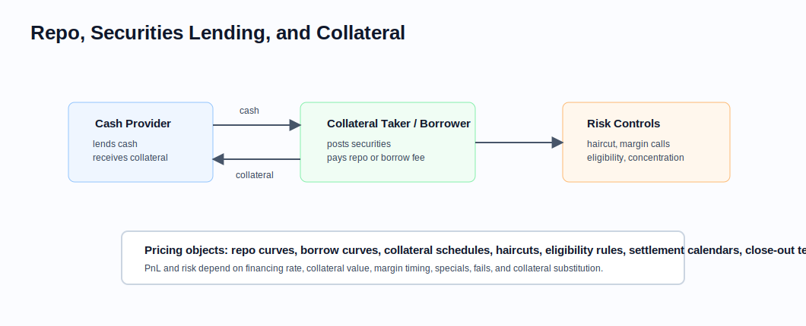

# Financing, Repo, and Securities Lending

Related chapters: [02-futures.md](02-futures.md), [03-equities.md](03-equities.md), [05-fixed-income.md](05-fixed-income.md), [09-cross-asset.md](09-cross-asset.md), and [21-regulatory-margin-capital.md](21-regulatory-margin-capital.md).

## What This Domain Covers
Financing analytics explain the cost and availability of balance sheet, collateral, cash, and securities. Repo and securities lending are not back-office details for quant systems: they affect forward prices, shorting costs, bond futures, collateral valuation, margin, and PnL.

## Product Taxonomy and Market Structure
- Repo and reverse repo.
- Securities lending and stock borrow.
- Total return swaps and synthetic financing.
- Prime-broker margin financing.
- Collateral transformation and optimization.
- Fails, specials, and hard-to-borrow securities.

## Quoting and Market Conventions
- Repo is quoted as an interest rate on cash against collateral.
- Haircuts reduce the cash advanced against collateral value.
- Securities lending may quote a borrow fee or rebate.
- Open trades, term trades, and evergreen structures have different optionality.
- Settlement calendars, collateral eligibility, substitution rights, and margin frequency are part of the trade economics.

## Core Pricing Framework
For a simple repo:

$$
\text{repurchase price} = \text{cash proceeds} \times \left(1 + r_{\text{repo}} \times \text{year fraction}\right)
$$

For equities and futures, financing and borrow assumptions feed forward pricing:

$$
F \approx S e^{(r - q + b)T}
$$

where $b$ can represent borrow or financing spread depending on the setup.

### Visual Financing Reference



Financing analytics must model both economic cashflows and collateral mechanics: haircut, margin calls, eligibility, substitution, close-out, and settlement.

## Worked Instrument Example: Repo Cash Proceeds
Assume:
- collateral market value: USD 100m,
- haircut: 2%,
- repo rate: 5%,
- term: 30 days on ACT/360.

Cash advanced is:

$$
100m \times (1 - 2\%) = 98m
$$

Repo interest is:

$$
98m \times 5\% \times \frac{30}{360} \approx 408{,}333
$$

## Key Risk Measures and Sensitivities
- Repo-rate DV01 and financing carry.
- Borrow fee sensitivity.
- Collateral value and haircut sensitivity.
- Liquidity and roll risk.
- Wrong-way risk between counterparty quality and collateral value.
- Specialness risk for scarce securities.

## Required Data, Curves, Surfaces, and Calibration Objects
- Repo curves by collateral class and tenor.
- Borrow availability, fee, and rebate data.
- Collateral schedules, eligibility rules, and haircuts.
- Settlement calendars and fails data.
- Legal agreement terms, netting sets, and margin frequency.
- Bond deliverable basket and implied repo inputs where relevant.

## Numerical and Implementation Approaches
- Represent financing assumptions explicitly rather than burying them in generic carry.
- Track collateral balances and margin calls as dated cashflows.
- Separate clean market value from collateral value after haircut.
- Version borrow and financing curves because changes can explain material PnL.

## Production Pitfalls and Sanity Checks
- Pricing short equity exposure without borrow cost.
- Ignoring specials in bond futures analytics.
- Applying one generic repo curve to collateral with different eligibility and liquidity.
- Missing settlement fails and corporate-action impacts on borrowed securities.
- Treating margin as only a risk-control process when it also creates cashflows.

## Illustrative Code
```python
def repo_cash_advanced(collateral_value: float, haircut: float) -> float:
    return collateral_value * (1.0 - haircut)


def simple_repo_interest(cash: float, repo_rate: float, year_fraction: float) -> float:
    return cash * repo_rate * year_fraction
```

## References and Further Reading
- Securities financing market practice notes.
- Bond futures implied repo documentation.
- Prime-broker and collateral-management methodology documents.
