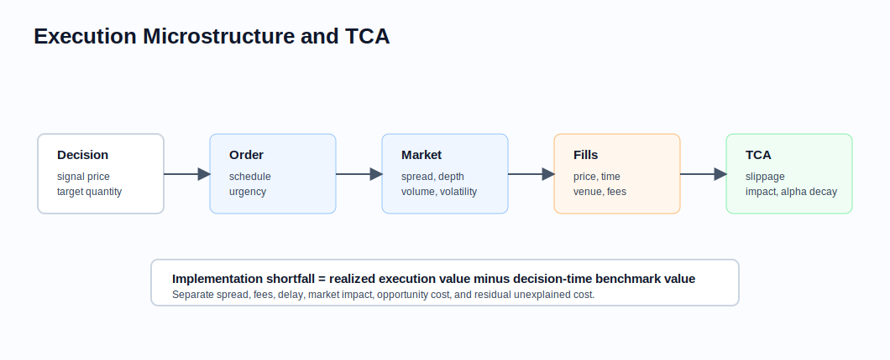

# Execution Microstructure and Transaction-Cost Analysis

Related chapters: [03-equities.md](03-equities.md), [11-market-data.md](11-market-data.md), [13-risk-and-pnl.md](13-risk-and-pnl.md), [15-performance-and-production.md](15-performance-and-production.md), and [16-portfolio-construction-and-backtesting.md](16-portfolio-construction-and-backtesting.md).

## What This Domain Covers
Execution analytics connect portfolio decisions to realized trades. A strategy can look profitable before costs and fail after spread, impact, delay, borrow, fees, and incomplete fills. Transaction-cost analysis makes those costs measurable and reproducible.

## Product Taxonomy and Market Structure
- Lit venues, dark pools, auctions, RFQ, and OTC execution.
- Market, limit, stop, VWAP, TWAP, participation, and implementation-shortfall algorithms.
- Pre-trade cost models and post-trade TCA.
- Venue analysis, fill-quality analysis, and broker scorecards.
- Slippage, spread cost, impact, delay cost, and opportunity cost.

## Quoting and Market Conventions
- Bid, ask, mid, last, official close, and arrival price answer different questions.
- TCA benchmark choice must match the execution objective.
- Fees, rebates, taxes, and borrow costs may be venue-specific.
- Volume curves and market sessions matter for participation strategies.
- Corporate actions and symbol changes must not break historical execution analysis.

## Core Pricing Framework
Implementation shortfall compares executed value to the decision-time benchmark:

$$
\text{shortfall} = \sum_i q_i(p_i - p_0)
$$

for a buy order, where $p_0$ is the decision or arrival price. A complete TCA decomposes shortfall into spread, impact, delay, fees, and opportunity cost.

### Visual Execution Reference



TCA is useful when it connects decisions, order instructions, market conditions, realized fills, and model feedback.

## Worked Instrument Example: Buy Order Shortfall
Assume:
- decision price: USD 50.00,
- executed quantity: 100,000 shares,
- average execution price: USD 50.08.

Implementation shortfall is:

$$
100{,}000 \times (50.08 - 50.00) = 8{,}000
$$

The number is only interpretable if the benchmark, side, fees, partial fills, and currency are defined.

## Key Risk Measures and Sensitivities
- Spread cost and effective spread.
- Market impact and participation-rate sensitivity.
- Delay cost and alpha decay.
- Opportunity cost from unfilled quantity.
- Venue fill quality and adverse selection.
- Capacity and liquidity limits.

## Required Data, Curves, Surfaces, and Calibration Objects
- Order and execution ledgers with timestamps.
- Market data around decision, route, fill, and close times.
- Venue, broker, fee, rebate, and tax schedules.
- Volume curves, spread history, volatility, and ADV.
- Corporate-action adjusted identifiers.
- Strategy signal timestamps to detect look-ahead and delay.

## Numerical and Implementation Approaches
- Store decision price, arrival price, fill price, and benchmark price separately.
- Keep side-aware formulas; buy and sell slippage signs differ.
- Decompose costs before aggregating so model errors are visible.
- Calibrate impact models by liquidity bucket, volatility, urgency, and participation rate.
- Feed post-trade results back into pre-trade cost estimates.

## Production Pitfalls and Sanity Checks
- Measuring slippage to close when the execution objective was arrival price.
- Ignoring unfilled quantity and reporting only completed shares.
- Using post-trade market data in pre-trade models.
- Aggregating buys and sells with inconsistent sign conventions.
- Reporting backtests without realistic turnover, spread, and impact assumptions.

## Illustrative Code
```python
def buy_shortfall(quantity: float, decision_price: float, average_fill_price: float) -> float:
    return quantity * (average_fill_price - decision_price)


def sell_shortfall(quantity: float, decision_price: float, average_fill_price: float) -> float:
    return quantity * (decision_price - average_fill_price)
```

## References and Further Reading
- Kissell. *The Science of Algorithmic Trading and Portfolio Management*
- Market microstructure and execution-algorithm methodology notes.
- Broker and venue TCA documentation.
