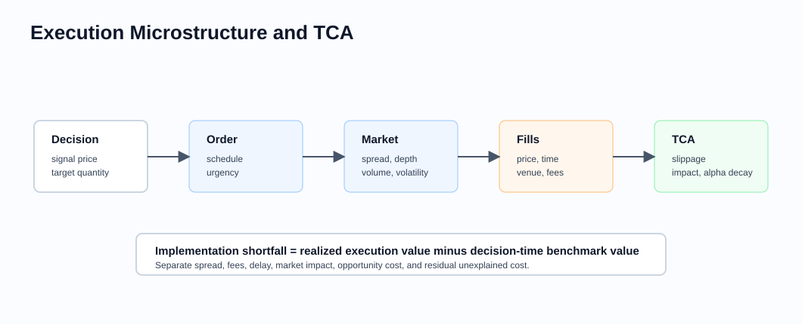
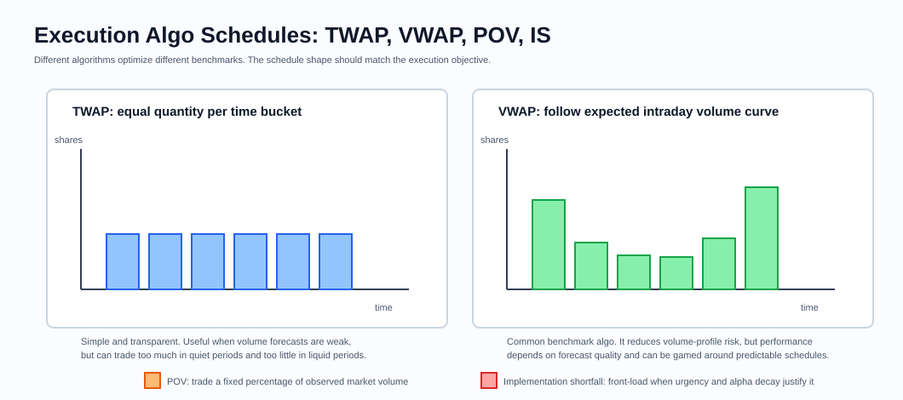
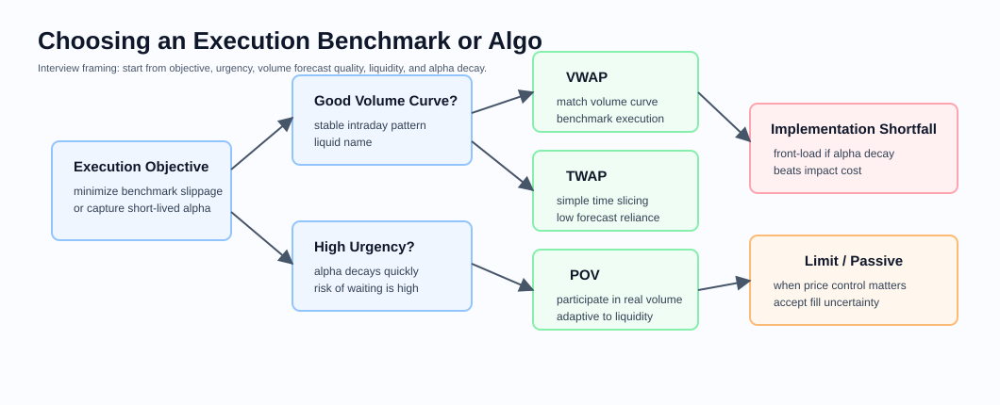
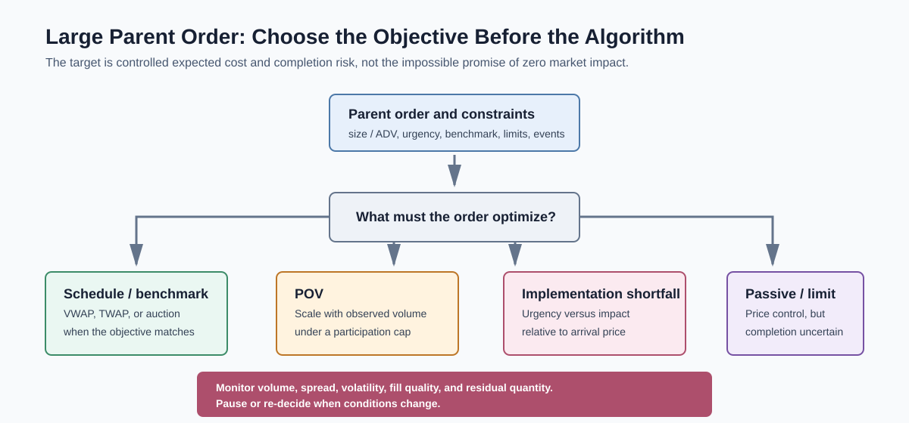

# Execution Microstructure and Transaction-Cost Analysis

Related chapters: [03-equities.md](03-equities.md), [11-market-data.md](11-market-data.md), [13-risk-and-pnl.md](13-risk-and-pnl.md), [15-performance-and-production.md](15-performance-and-production.md), [16-portfolio-construction-and-backtesting.md](16-portfolio-construction-and-backtesting.md), and [47-reinforcement-learning-for-trading-and-execution.md](47-reinforcement-learning-for-trading-and-execution.md).

## What This Domain Covers
Execution is where a portfolio decision meets the market.

Before execution, a strategy can look clean: buy this, sell that, rebalance here. After execution, the real result includes spread, market impact, delay, partial fills, fees, taxes, borrow costs, and opportunity cost. Transaction-cost analysis turns that messy reality into something measurable.

This chapter follows the trade from decision price to order instructions to fills to post-trade analysis.

## Product Taxonomy and Market Structure
Start by asking how the order is intended to interact with liquidity.

- Lit venues, dark pools, auctions, RFQ, and OTC execution.
- Market, limit, stop, VWAP, TWAP, participation, and implementation-shortfall algorithms.
- Pre-trade cost models and post-trade TCA.
- Venue analysis, fill-quality analysis, and broker scorecards.
- Slippage, spread cost, impact, delay cost, and opportunity cost.

## Quoting and Market Conventions
- Bid, ask, mid, last, official close, and arrival price answer different questions.
- TCA benchmark choice must match the execution objective.
- Fees, rebates, taxes, and borrow costs may be venue-specific.
- Volume curves and market sessions matter for participation strategies.
- Corporate actions and symbol changes must not break historical execution analysis.

## Core Pricing Framework
The central execution question is simple: how much did trading cost relative to the benchmark that mattered?

Implementation shortfall compares executed value to the decision-time benchmark:

$$
\text{shortfall} = \sum_i q_i(p_i - p_0)
$$

for a buy order, where $p_0$ is the decision or arrival price. A complete TCA decomposes shortfall into spread, impact, delay, fees, and opportunity cost.

### Visual Execution Reference



TCA is useful when it connects decisions, order instructions, market conditions, realized fills, and model feedback.

### Kyle Lambda And Signed Order Flow

A simple Kyle-style price-impact relationship is:

$$
\Delta p_t = \lambda q_t+\epsilon_t,
$$

where \(q_t\) is signed net order flow and \(\lambda\) measures the price response per unit of signed flow. The model formalizes the link between informed trading, market-maker inference, and liquidity. An empirical “Kyle lambda” must state whether \(q_t\) is shares, currency notional, contracts, or percent of volume; whether price change is currency, return, or basis points; how trade signs are inferred; and what interval is used.

The regression slope is not automatically a causal or permanent-impact estimate. Public news, autocorrelated flow, spread bounce, hidden liquidity, venue fragmentation, and sign-classification errors can all move it.

### Almgren-Chriss Execution Scheduling

The Almgren-Chriss framework divides an order into child trades while balancing expected impact cost against price risk. If \(x_k\) is remaining inventory at time \(k\), then child quantity is \(n_k=x_k-x_{k+1}\). A common objective is:

$$
\min_{\{n_k\}}
E[C] + \lambda_A\operatorname{Var}(C),
\qquad
\sum_k n_k=Q,
$$

where \(C\) is implementation cost and \(\lambda_A\) is execution risk aversion. Temporary impact penalizes aggressive child orders; permanent impact shifts the price path; inventory risk penalizes waiting with \(x_k\) exposed.

The model produces a schedule under explicit impact, volatility, time, and risk-aversion assumptions. It does not guarantee fills or concealment. Real implementations add spread, discrete lots, participation caps, auctions, queue position, limit prices, halts, venue choice, and recalibration when live volume or volatility differs from forecast.

The widely used square-root impact heuristic,

$$
\frac{\Delta p}{p}
\approx
Y\sigma\sqrt{\frac{Q}{V}},
$$

relates impact to volatility \(\sigma\) and order size \(Q\) relative to volume \(V\). It is an empirical scaling law, not the same model as Almgren-Chriss, and \(Y\), horizon, and volume definition must be calibrated to the relevant market.

### Order-Book Imbalance

At the best displayed level, a simple order-book imbalance is:

$$
I_t
=
\frac{Q^{\text{bid}}_t-Q^{\text{ask}}_t}
{Q^{\text{bid}}_t+Q^{\text{ask}}_t}.
$$

It ranges from \(-1\) to \(1\) when the denominator is positive. Positive imbalance means more displayed bid than ask quantity under the chosen snapshot; it is not by itself a buy instruction. Variants weight several levels by price distance, use order-flow imbalance from additions/cancellations/trades, or model queue depletion in event time.

Displayed size can cancel, replenish, or sit behind hidden liquidity. Feed sequencing, venue coverage, crossed/locked books, auction states, lot conventions, and latency determine whether two systems calculate the same feature. Evaluate imbalance at the decision horizon after fees, adverse selection, queue position, and message-to-trade latency.

## VWAP, TWAP, POV, and Implementation Shortfall
VWAP and TWAP belong in this repo because they are the simplest bridge between trading strategy, microstructure, and measurable execution quality. They also come up often in interviews because they test whether a candidate understands benchmarks, schedules, volume curves, and cost trade-offs rather than only formulas.

### VWAP
Volume-weighted average price measures the average traded price weighted by market volume:

$$
\text{VWAP} = \frac{\sum_i p_i v_i}{\sum_i v_i}
$$

A VWAP execution algorithm tries to trade in line with the expected intraday volume curve. If 12% of the day's volume usually trades in the first interval, a VWAP schedule may target roughly 12% of the parent order in that interval. VWAP is useful when the objective is to perform near the market's volume-weighted benchmark and avoid being too visible relative to normal liquidity.

### TWAP
Time-weighted average price slices an order evenly through time:

$$
\text{TWAP} = \frac{1}{n}\sum_i p_i
$$

A TWAP execution schedule is simple: trade the same quantity every time bucket. It is easy to explain and does not require a strong volume forecast, but it can overtrade quiet periods and undertrade liquid periods.

### POV and Implementation Shortfall
Percentage-of-volume (POV) trades a target participation rate of observed market volume. If market volume accelerates, the order trades faster; if market volume dries up, the order slows down. Implementation shortfall algorithms use the decision or arrival price as the benchmark and typically balance market impact against alpha decay and timing risk.





Interview framing:
- VWAP: "match the market's volume profile and benchmark to volume-weighted price."
- TWAP: "slice evenly through time when simplicity matters or volume forecasts are weak."
- POV: "participate in real-time liquidity at a controlled participation rate."
- Implementation shortfall: "trade faster when waiting risk and alpha decay matter more than impact cost."
- Limit or passive execution: "control price, but accept fill uncertainty and opportunity cost."

Common mistakes:
- Comparing a VWAP algo to arrival price and calling it bad even though it optimized a different benchmark.
- Using TWAP for an illiquid name without checking whether equal time slices exceed available liquidity.
- Forgetting that VWAP is only known after the trading window finishes.
- Ignoring partial fills, fees, spread, and market impact when comparing algorithms.
- Treating a broker's algo label as enough; the actual schedule, constraints, and venue behavior still matter.

## Executing A Large Parent Order
A large order cannot be made invisible merely by dividing it into smaller tickets. The objective is to minimize expected trading cost while controlling the risk that the market moves away before the order is complete. The right choice depends on order size relative to liquidity, urgency, benchmark, volatility, spread, expected intraday volume, and information leakage risk.



The usual implementation is a **parent order** with controlled **child orders**. A parent order might buy 400,000 shares; the execution algorithm decides how much to send, where, and when. A round lot is the exchange-defined standard trading unit for a market and is not a measure of safe order size. What matters is the parent order's participation in available volume and displayed or hidden liquidity.

### Choosing The Objective

- **VWAP**: appropriate when the mandate is to perform near the session's volume-weighted benchmark and there is time to follow a volume forecast.
- **TWAP**: appropriate when the order should be distributed evenly through a defined time window and a reliable volume forecast is unavailable or unnecessary.
- **POV**: appropriate when trading should scale with observed market activity. The trader sets a maximum participation rate, then the algorithm slows down when the market is quiet.
- **Implementation shortfall (IS)**: appropriate when the decision or arrival price matters and delaying the trade risks losing alpha or increasing portfolio risk. It trades the impact-versus-timing trade-off directly.
- **Passive limit / liquidity seeking**: appropriate when price control matters more than certainty of completion. It reduces crossing cost but accepts adverse selection and opportunity cost.
- **Open or close auction**: appropriate when the benchmark, index event, or available liquidity is concentrated in that auction. Auction participation still carries imbalance and price uncertainty.

No algorithm guarantees that a large trade will not move the price. A good execution plan chooses an explicit trade-off, sets participation and price limits, watches live conditions, and is willing to pause or change course when conditions diverge from the pre-trade model.

### Market Impact And Order Size

For a buy order, implementation shortfall can be separated conceptually into spread, temporary impact, permanent information component, delay, fees, and opportunity cost. The decomposition is model-dependent, but it prevents one number from hiding several causes.

If $Q$ shares were intended, $q_i$ shares were executed at prices $p_i$, and $q_u$ shares remain unfilled and are valued at an end-of-window price $p_T$, a simple buy-side implementation-shortfall representation is:

$$
\text{IS} = \sum_i q_i(p_i-p_0) + q_u(p_T-p_0) + \text{fees},
\qquad Q = \sum_i q_i + q_u
$$

The first term captures executed slippage. The second makes the opportunity cost of the unfilled residual visible. A production TCA must state the chosen end-of-window price and sign convention.

Order size is often normalized by average daily volume:

$$
\text{ADV participation} = \frac{\text{parent order quantity}}{\text{average daily volume}}
$$

This is only a first screen. A 10% ADV order may be manageable in a deep, stable name over a full day, yet highly disruptive if concentrated in a short interval, during a news event, or in a stock with a wide spread and little displayed depth. Pre-trade analysis should use intraday volume curves, volatility, spread, event calendar, borrow status for sells, and a capacity limit by venue.

## Worked Instrument Example: A Buy Program With A Participation Limit
Assume a manager must buy 400,000 shares. Historical ADV is 4,000,000 shares, so the parent order is 10% of ADV. The manager has no immediate alpha-decay concern and chooses a VWAP-style schedule with a maximum 10% participation rate.

If the first two hours are forecast to contain 25% of daily volume, the forecast volume is 1,000,000 shares. The schedule may target no more than:

$$
10\% \times 1{,}000{,}000 = 100{,}000\text{ shares}
$$

in that window, subject to spread, volatility, price, and real-time volume checks. If actual volume is lower than forecast, the algorithm reduces child-order quantity rather than forcing the schedule. If the trade is not complete, the residual is a real decision: continue, increase urgency, use an auction, cross liquidity, or leave the position partly unfilled. It should never be hidden inside a single average fill price.

## Worked Instrument Example: Buy Order Shortfall
Assume:
- decision price: USD 50.00,
- executed quantity: 100,000 shares,
- average execution price: USD 50.08.

Implementation shortfall is:

$$
100{,}000 \times (50.08 - 50.00) = 8{,}000
$$

The number is only interpretable if the benchmark, side, fees, partial fills, and currency are defined.

## Worked Instrument Example: Impact Versus Inventory Risk
Suppose a 200,000-share buy order is divided across four equal time buckets. Compare:

- an even schedule of \(50{,}000\) shares per bucket;
- a front-loaded schedule of \(80{,}000,\ 60{,}000,\ 40{,}000,\ 20{,}000\).

Under a simplified temporary-impact term proportional to \(\sum_k n_k^2\), measured in thousands of shares:

$$
50^2+50^2+50^2+50^2=10{,}000,
$$

while the front-loaded schedule gives:

$$
80^2+60^2+40^2+20^2=12{,}000.
$$

The front-loaded schedule has \(20\%\) more temporary-impact penalty under this toy model, but less inventory remains exposed to subsequent price moves. Choosing between them requires the impact coefficient, volatility, urgency, alpha decay, spread, and fill constraints; the sum-of-squares comparison alone is not an optimal schedule.

If the displayed best bid is 120,000 shares and the best ask is 80,000 shares, snapshot imbalance is:

$$
\frac{120{,}000-80{,}000}{120{,}000+80{,}000}=0.20.
$$

That observation may affect child-order urgency or limit placement only after validating feed state, persistence, queue position, and out-of-sample predictive value. The calculations are reproduced in [examples/order-book-impact-tradeoff.md](examples/order-book-impact-tradeoff.md).

## Key Risk Measures and Sensitivities
- Spread cost and effective spread.
- Market impact and participation-rate sensitivity.
- VWAP, TWAP, POV, and arrival-price slippage.
- Delay cost and alpha decay.
- Opportunity cost from unfilled quantity.
- Venue fill quality and adverse selection.
- Capacity and liquidity limits.
- Parent-order participation, residual quantity, and completion risk.
- Kyle lambda and impact-curve sensitivity by interval, venue, side, liquidity bucket, and volatility regime.
- Remaining-inventory risk, temporary and permanent impact, and schedule sensitivity to execution risk aversion.
- Order-book and order-flow imbalance, queue depletion, cancellation rate, fill probability, and post-fill adverse selection.

## Required Data, Curves, Surfaces, and Calibration Objects
- Order and execution ledgers with timestamps.
- Market data around decision, route, fill, and close times.
- Venue, broker, fee, rebate, and tax schedules.
- Volume curves, spread history, volatility, ADV, and intraday participation constraints.
- Order-book or liquidity proxies, auction schedules, corporate-event calendar, and parent-order urgency constraints.
- Sequenced depth and trade events with venue, side, price, displayed quantity, order identifiers where available, and exchange timestamps.
- Trade-sign classification, signed-flow aggregation, queue state, cancellations, hidden-liquidity indicators, halts, limit states, and feed-gap diagnostics.
- Corporate-action adjusted identifiers.
- Strategy signal timestamps to detect look-ahead and delay.

## Numerical and Implementation Approaches
- Store decision price, arrival price, fill price, and benchmark price separately.
- Keep side-aware formulas; buy and sell slippage signs differ.
- Match the evaluation benchmark to the algorithm objective: VWAP to VWAP, TWAP to time schedule, implementation shortfall to arrival or decision price.
- Decompose costs before aggregating so model errors are visible.
- Calibrate impact models by liquidity bucket, volatility, urgency, and participation rate.
- Feed post-trade results back into pre-trade cost estimates.
- Record the parent-order objective, constraints, schedule changes, and residual-order decisions so TCA can explain them.
- Estimate impact with side-aware, horizon-specific and out-of-sample methods; retain uncertainty and residual diagnostics rather than only one coefficient.
- Normalize order-book events into deterministic event time before constructing imbalance or queue features.
- Re-optimize or fall back safely when live spread, volatility, volume, book state, or venue availability breaches the calibration regime.

## Production Pitfalls and Sanity Checks
- Measuring slippage to close when the execution objective was arrival price.
- Ignoring unfilled quantity and reporting only completed shares.
- Using post-trade market data in pre-trade models.
- Aggregating buys and sells with inconsistent sign conventions.
- Reporting backtests without realistic turnover, spread, and impact assumptions.
- Treating a fixed participation rate or a round-lot size as proof that an order will be non-disruptive.
- Treating a Kyle-style slope as invariant, causal, or directly comparable across different flow and price units.
- Applying a continuous Almgren-Chriss schedule without lot, participation, auction, halt, or limit-price constraints.
- Using book snapshots with duplicated, dropped, or out-of-sequence messages.
- Treating displayed imbalance as durable liquidity or ignoring spoof-like cancellations and hidden replenishment.
- Tuning an imbalance horizon on the final test sample or evaluating fills without queue position and latency.

## Illustrative Code
```python
import math


def buy_shortfall(quantity: float, decision_price: float, average_fill_price: float) -> float:
    if not all(
        math.isfinite(value)
        for value in (quantity, decision_price, average_fill_price)
    ):
        raise ValueError("shortfall inputs must be finite")
    if quantity < 0.0:
        raise ValueError("buy quantity must be non-negative")
    return quantity * (average_fill_price - decision_price)


def sell_shortfall(quantity: float, decision_price: float, average_fill_price: float) -> float:
    if not all(
        math.isfinite(value)
        for value in (quantity, decision_price, average_fill_price)
    ):
        raise ValueError("shortfall inputs must be finite")
    if quantity < 0.0:
        raise ValueError("sell quantity must be non-negative")
    return quantity * (decision_price - average_fill_price)


def vwap(prices: list[float], volumes: list[float]) -> float:
    if not prices or len(prices) != len(volumes):
        raise ValueError("VWAP requires equally sized, non-empty inputs")
    if any(not math.isfinite(value) for value in prices + volumes):
        raise ValueError("VWAP inputs must be finite")
    if any(volume < 0.0 for volume in volumes):
        raise ValueError("VWAP volumes cannot be negative")
    traded_volume = sum(volumes)
    if traded_volume <= 0.0:
        raise ValueError("VWAP requires positive total volume")
    return sum(price * volume for price, volume in zip(prices, volumes)) / traded_volume


def twap(prices: list[float]) -> float:
    if not prices:
        raise ValueError("TWAP requires at least one price")
    if any(not math.isfinite(price) for price in prices):
        raise ValueError("TWAP prices must be finite")
    return sum(prices) / len(prices)


def order_book_imbalance(bid_quantity: float, ask_quantity: float) -> float:
    if not math.isfinite(bid_quantity) or not math.isfinite(ask_quantity):
        raise ValueError("displayed quantities must be finite")
    total = bid_quantity + ask_quantity
    if bid_quantity < 0 or ask_quantity < 0 or total <= 0:
        raise ValueError("displayed quantities must be non-negative with positive total")
    return (bid_quantity - ask_quantity) / total


def temporary_impact_exposure(child_quantities: list[float]) -> float:
    if any(not math.isfinite(quantity) for quantity in child_quantities):
        raise ValueError("child quantities must be finite")
    if any(quantity < 0 for quantity in child_quantities):
        raise ValueError("use non-negative quantities for a one-sided schedule")
    return sum(quantity**2 for quantity in child_quantities)


def kyle_lambda(price_changes: list[float], signed_flow: list[float]) -> float:
    if len(price_changes) != len(signed_flow) or len(price_changes) < 2:
        raise ValueError("aligned price changes and signed flow are required")
    if any(
        not math.isfinite(value)
        for value in price_changes + signed_flow
    ):
        raise ValueError("Kyle inputs must be finite")
    flow_mean = sum(signed_flow) / len(signed_flow)
    price_mean = sum(price_changes) / len(price_changes)
    denominator = sum((flow - flow_mean) ** 2 for flow in signed_flow)
    if denominator <= 0:
        raise ValueError("signed flow must vary")
    numerator = sum(
        (flow - flow_mean) * (price - price_mean)
        for flow, price in zip(signed_flow, price_changes)
    )
    return numerator / denominator
```

## References and Further Reading
- Kissell. *The Science of Algorithmic Trading and Portfolio Management*
- Kyle. *Continuous Auctions and Insider Trading*.
- Almgren and Chriss. *Optimal Execution of Portfolio Transactions*.
- Hasbrouck on empirical market microstructure and price impact.
- Gould et al. on the limit order book and its empirical properties.
- Market microstructure and execution-algorithm methodology notes.
- Broker and venue TCA documentation.
