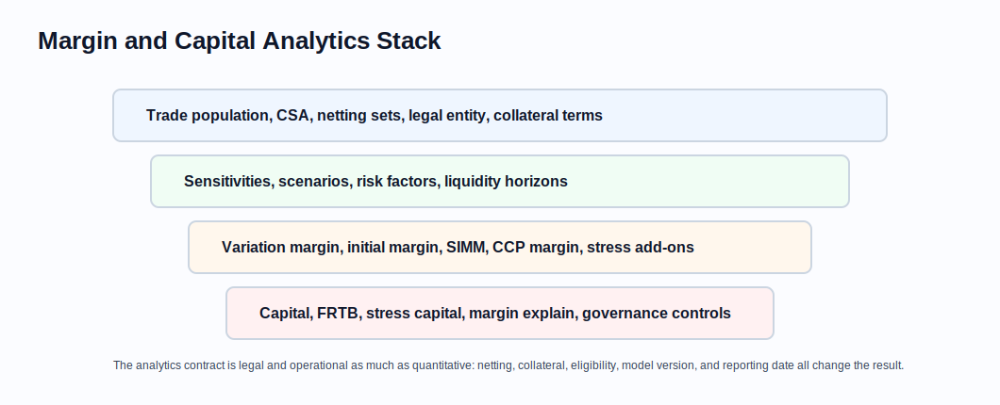

# Regulatory Margin and Capital Analytics

Related chapters: [09-cross-asset.md](09-cross-asset.md), [13-risk-and-pnl.md](13-risk-and-pnl.md), [14-testing-and-validation.md](14-testing-and-validation.md), [19-financing-repo-and-securities-lending.md](19-financing-repo-and-securities-lending.md), and [22-model-governance-and-ipv.md](22-model-governance-and-ipv.md).

## What This Domain Covers
Regulatory margin and capital analytics turn trade populations, risk factors, legal terms, and model rules into required collateral, margin, capital, and explain reports. The output is sensitive to netting, eligibility, legal entity, model version, and reporting date.

## Product Taxonomy and Market Structure
- Variation margin and initial margin.
- ISDA SIMM and schedule-based margin.
- CCP margin models.
- FRTB market-risk capital and standardized approaches.
- Stress capital, liquidity add-ons, concentration add-ons, and margin explain.
- XVA-adjacent capital and funding analytics.

## Quoting and Market Conventions
- Margin is not quoted like a price, but the calculation has a strict convention contract.
- Netting set, CSA, product class, risk bucket, and legal entity determine aggregation.
- Sensitivities must use the prescribed risk-factor definitions and units.
- Liquidity horizons and risk weights are rule-driven, not desk preferences.
- Model approvals and regulatory versions are part of the calculation input.

## Core Pricing Framework
Many margin and capital models reduce to:

$$
\text{requirement} = f(\text{trades}, \text{sensitivities}, \text{risk weights}, \text{correlations}, \text{netting rules}, \text{add-ons})
$$

The hard part is reproducibility. Two runs should differ only because an input, rule version, or market state changed.

### Visual Margin Reference



Margin analytics sit on top of legal data, market risk, collateral terms, model rules, stress assumptions, and governance controls.

## Worked Instrument Example: Simple Initial Margin Add-On
Assume:
- delta sensitivity: USD 2m per 1% market move,
- prescribed risk weight: 15%.

A simplified weighted sensitivity is:

$$
2m \times 15\% = 300k
$$

Real models aggregate across buckets, correlations, product classes, tenors, netting sets, and add-ons. This example is only the unit intuition.

## Key Risk Measures and Sensitivities
- Initial margin and variation margin.
- Margin VaR, stress loss, and liquidity horizon contribution.
- Sensitivity by regulatory bucket.
- Netting benefit and concentration add-on.
- Margin explain from trade changes, market moves, and model/rule changes.
- Capital consumption and return on capital.

## Required Data, Curves, Surfaces, and Calibration Objects
- Trade population and legal entity mappings.
- CSA, netting set, collateral eligibility, and margin terms.
- Sensitivities by prescribed risk factor.
- Regulatory rule version, bucket definitions, risk weights, and correlations.
- Market data snapshots and stress scenarios.
- Prior run results for explain.

## Numerical and Implementation Approaches
- Treat rule version as an immutable input.
- Build deterministic aggregation with transparent intermediate outputs.
- Store trade-to-netting-set mappings and sensitivity lineage.
- Separate market moves, new trades, lifecycle events, and rule changes in margin explain.
- Reconcile margin inputs to official risk and finance systems.

## Production Pitfalls and Sanity Checks
- Aggregating trades under the wrong netting set or legal entity.
- Unit mismatches in sensitivities submitted to a prescribed model.
- Reporting total margin without explaining drivers.
- Allowing rule updates to restate old reports without versioning.
- Ignoring collateral eligibility and concentration limits.

## Illustrative Code
```python
def weighted_sensitivity(sensitivity: float, risk_weight: float) -> float:
    return sensitivity * risk_weight
```

## References and Further Reading
- ISDA SIMM methodology.
- Basel Committee FRTB documentation.
- CCP margin methodology documents.
