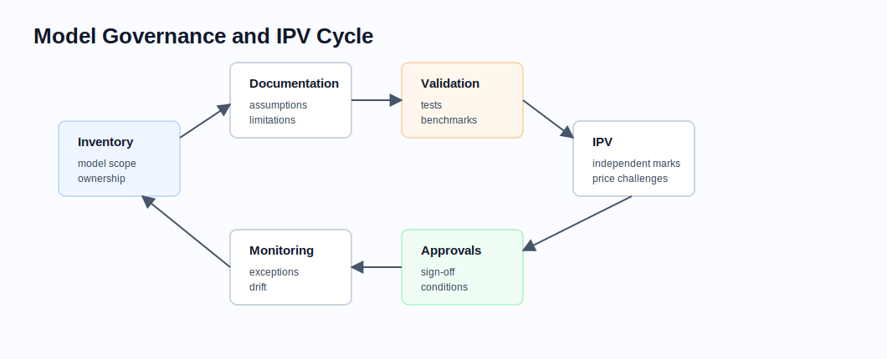

# Model Governance and Independent Price Verification

Related chapters: [11-market-data.md](11-market-data.md), [12-pricing-architecture.md](12-pricing-architecture.md), [13-risk-and-pnl.md](13-risk-and-pnl.md), [14-testing-and-validation.md](14-testing-and-validation.md), and [21-regulatory-margin-capital.md](21-regulatory-margin-capital.md).

## What This Domain Covers
Model governance and independent price verification (IPV) make pricing and risk outputs defensible. They define what models are approved for, how limitations are documented, how independent marks are sourced, and how valuation uncertainty is escalated.

## Product Taxonomy and Market Structure
- Model inventory and ownership.
- Model documentation and validation.
- Approval conditions and model limitations.
- IPV, price testing, reserves, and valuation adjustments.
- Ongoing monitoring, exception management, and periodic review.
- Model change governance and release control.

## Quoting and Market Conventions
- A model is approved for a scope, not universally approved for every trade that can technically run.
- IPV marks must be independent of the front-office marks they challenge.
- Price-testing tolerances depend on liquidity, observability, product complexity, and materiality.
- Reserve methodology should be documented, repeatable, and explainable.
- Governance artifacts need version control just like code and market data.

## Core Pricing Framework
Governance wraps the pricing stack:

$$
\text{official value} = \text{model value} + \text{valuation adjustments} + \text{approved reserves}
$$

The control question is not only whether the model computes a value. It is whether the value is appropriate for the trade, market observability, data quality, and approved model scope.

### Visual Governance Reference



IPV is a recurring cycle: inventory, documentation, validation, independent marks, approvals, reserves, monitoring, and remediation.

## Worked Instrument Example: Price Testing
Assume:
- official model price: 101.25,
- independent broker or consensus mark: 100.90,
- tolerance: 0.20.

The price-testing difference is:

$$
101.25 - 100.90 = 0.35
$$

Since 0.35 exceeds the 0.20 tolerance, the position requires investigation, adjustment, reserve, or documented acceptance.

## Key Risk Measures and Sensitivities
- Price-testing difference and reserve requirement.
- Model limitation severity.
- Observable vs unobservable input contribution.
- Stale mark and consensus dispersion.
- Validation exception counts and remediation age.
- Model change impact on price, risk, and PnL explain.

## Required Data, Curves, Surfaces, and Calibration Objects
- Model inventory with scope, owner, version, and approval status.
- Model documentation and validation evidence.
- Independent market marks, broker quotes, consensus data, and observable inputs.
- Price-testing tolerance rules and materiality thresholds.
- Reserve methodology and adjustment ledger.
- Change history and release approvals.

## Numerical and Implementation Approaches
- Make model selection explicit and auditable per trade.
- Store calibration inputs and derived parameters with lineage.
- Compare official marks to independent sources at the right product granularity.
- Separate market-data disputes from model methodology disputes.
- Track remediation actions to closure.

## Production Pitfalls and Sanity Checks
- Letting unsupported trades fall through to a generic model path.
- Treating broker marks as independent without source controls.
- Applying one tolerance to liquid vanilla trades and illiquid structured trades.
- Losing historical model documentation when code changes.
- Failing to explain reserve moves between reporting periods.

## Illustrative Code
```python
def price_testing_exception(official_price: float, independent_price: float, tolerance: float) -> bool:
    return abs(official_price - independent_price) > tolerance
```

## References and Further Reading
- Internal model-risk policy and valuation-control methodology.
- Independent price verification and valuation adjustment policy documents.
- Links: [14-testing-and-validation.md](14-testing-and-validation.md), [21-regulatory-margin-capital.md](21-regulatory-margin-capital.md)
