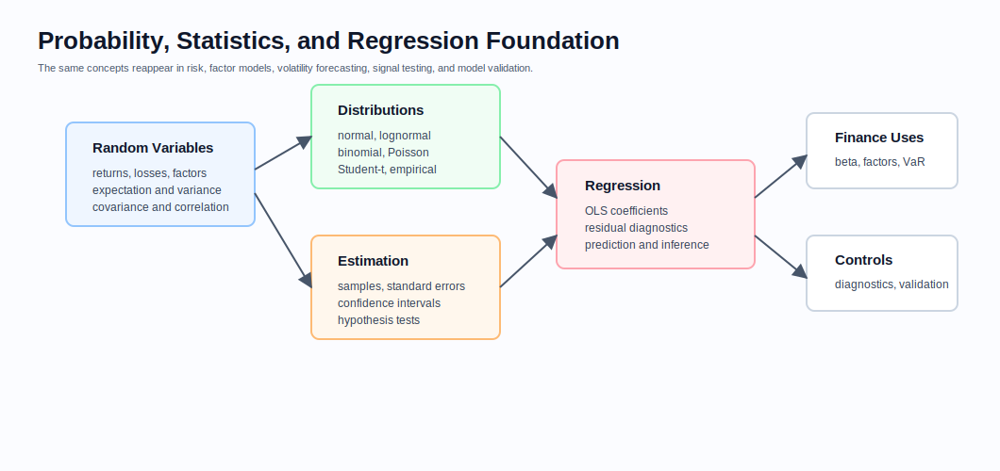
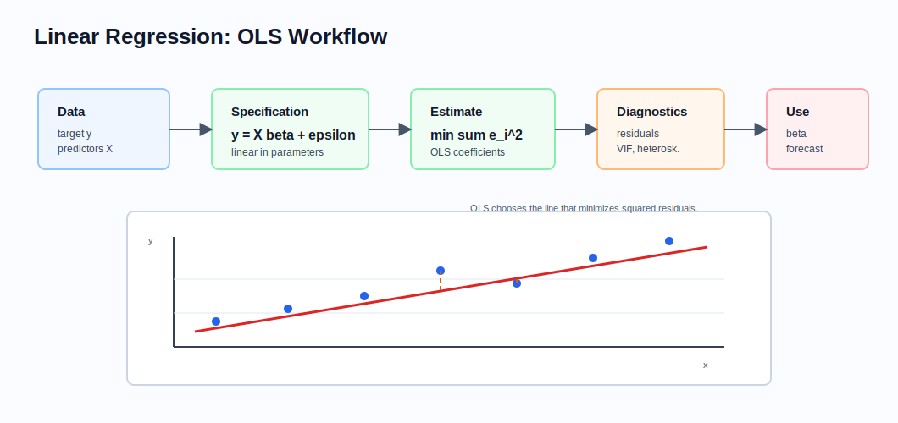
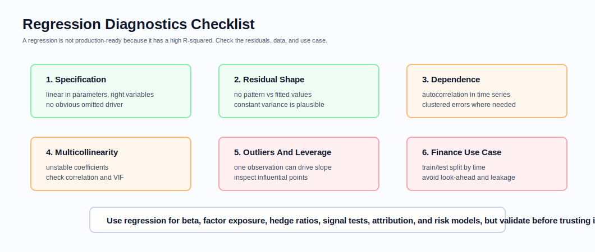

# Probability, Statistics, and Regression

Related chapters: [10-numerical-methods.md](10-numerical-methods.md), [13-risk-and-pnl.md](13-risk-and-pnl.md), [16-portfolio-construction-and-backtesting.md](16-portfolio-construction-and-backtesting.md), [18-volatility-products.md](18-volatility-products.md), and [14-testing-and-validation.md](14-testing-and-validation.md).

## What This Domain Covers
Probability, statistics, and regression are the language quant developers use when the future is uncertain and the data is noisy.

They show up everywhere: beta estimation, factor models, VaR and Expected Shortfall, volatility forecasting, signal testing, backtesting, model validation, execution analytics, and PD scorecards. The point is not to replace a statistics textbook. The point is to make the concepts explicit enough that a quant developer can implement, diagnose, and explain statistical models safely.

The story to keep in mind is simple: define the random variable, estimate something from data, measure uncertainty around that estimate, and avoid fooling yourself with leakage, unstable relationships, or economically meaningless significance.

## Product Taxonomy and Market Structure
Think of this chapter as the foundation under the rest of the library.

- Probability objects: random variables, distributions, expectations, variance, covariance, and correlation.
- Statistical inference: samples, estimators, standard errors, confidence intervals, and hypothesis tests.
- Linear models: simple regression, multiple regression, OLS, residual diagnostics, and prediction.
- Finance applications: beta, hedge ratios, factor exposure, signal testing, attribution, and risk-model calibration.

## Quoting and Market Conventions
- Returns may be arithmetic, log, price return, or total return; do not mix them silently.
- Volatility and correlation estimates depend on sampling frequency, window length, calendar treatment, and annualization.
- Regression coefficients depend on units. A beta estimated from percent returns should match the units used in risk and reporting.
- Time-series train/test splits must preserve time order; random splits often create leakage.
- Statistical significance is not the same as economic significance.

## Core Pricing Framework
The basic objects are small, but they appear everywhere in portfolio and risk systems.

The basic probability objects are expectation, variance, covariance, and correlation:

$$
E[X], \quad Var(X) = E[(X - E[X])^2]
$$

$$
Cov(X,Y) = E[(X - E[X])(Y - E[Y])]
$$

$$
\rho_{X,Y} = \frac{Cov(X,Y)}{\sigma_X \sigma_Y}
$$

### Visual Probability And Statistics Reference



For linear regression, the model is:

$$
y_i = \beta_0 + \beta_1 x_{i,1} + \cdots + \beta_p x_{i,p} + \epsilon_i
$$

In matrix form:

$$
y = X\beta + \epsilon
$$

Ordinary least squares estimates coefficients by minimizing the sum of squared residuals:

$$
\min_\beta \sum_i (y_i - \hat{y}_i)^2
$$

When $X^\top X$ is invertible, the OLS estimator is:

$$
\hat{\beta} = (X^\top X)^{-1}X^\top y
$$

### Visual Regression Reference



## Worked Instrument Example: Beta Regression
Assume a stock return is regressed on market return:

$$
r_{\text{stock}} = \alpha + \beta r_{\text{market}} + \epsilon
$$

If the estimated slope is 1.25, the stock has estimated beta of 1.25 to the benchmark. A 1% market move corresponds to an expected 1.25% stock move, before residual/idiosyncratic effects.

This feeds directly into equity VaR and factor risk:

$$
\Delta V_{\text{market}} \approx \text{position value} \times \beta \times \Delta r_m
$$

Regression is useful here, but only if the benchmark, return definition, sampling frequency, window, and residual behavior are documented.

## Key Risk Measures and Sensitivities
- Mean, variance, volatility, covariance, and correlation.
- Standard error and confidence interval for estimated quantities.
- Regression coefficients, t-statistics, p-values, and residual variance.
- R-squared and adjusted R-squared.
- MAE, MSE, RMSE, and out-of-sample prediction error.
- Beta, factor exposure, hedge ratio, and residual/idiosyncratic risk.

## Required Data, Curves, Surfaces, and Calibration Objects
- Clean time series with explicit return construction.
- Calendar alignment, missing-data policy, and outlier policy.
- Train, validation, and test periods that respect time order.
- Predictor matrix, target series, and feature definitions.
- Benchmark and factor definitions.
- Diagnostic outputs: residuals, fitted values, leverage, standard errors, and cross-validation results.

## Numerical and Implementation Approaches
- Start with clear definitions for target, predictors, sampling frequency, and window.
- Use OLS for baseline linear relationships, beta estimation, and hedge ratios.
- Use robust or heteroskedasticity-consistent standard errors when residual variance is not constant.
- Check multicollinearity when coefficients are unstable or predictors are highly correlated.
- For time series, check autocorrelation and use lagged features carefully.
- Evaluate out-of-sample performance before using a model for trading or risk.

### Regression Diagnostics



## Production Pitfalls and Sanity Checks
- Look-ahead bias from using future data in features, normalization, or regime labels.
- Multicollinearity making coefficients unstable even when predictions look good.
- Heteroskedastic residuals making naive standard errors misleading.
- Autocorrelated residuals in time-series regressions.
- Overfitting from too many predictors relative to data history.
- Treating high R-squared as proof of a tradable signal.
- Ignoring economic significance, turnover, costs, capacity, and robustness.

## Illustrative Code
```python
def simple_ols_slope(xs: list[float], ys: list[float]) -> float:
    if len(xs) != len(ys) or len(xs) < 2:
        raise ValueError("xs and ys must have the same length with at least two observations")
    x_bar = sum(xs) / len(xs)
    y_bar = sum(ys) / len(ys)
    numerator = sum((x - x_bar) * (y - y_bar) for x, y in zip(xs, ys))
    denominator = sum((x - x_bar) ** 2 for x in xs)
    if denominator == 0:
        raise ValueError("cannot estimate slope when x has zero variance")
    return numerator / denominator


def rmse(actual: list[float], predicted: list[float]) -> float:
    if len(actual) != len(predicted) or not actual:
        raise ValueError("actual and predicted must have the same non-zero length")
    return (sum((a - p) ** 2 for a, p in zip(actual, predicted)) / len(actual)) ** 0.5
```

## References and Further Reading
- Wooldridge. *Introductory Econometrics*
- Hastie, Tibshirani, and Friedman. *The Elements of Statistical Learning*
- Links: [13-risk-and-pnl.md](13-risk-and-pnl.md), [16-portfolio-construction-and-backtesting.md](16-portfolio-construction-and-backtesting.md), [18-volatility-products.md](18-volatility-products.md)
