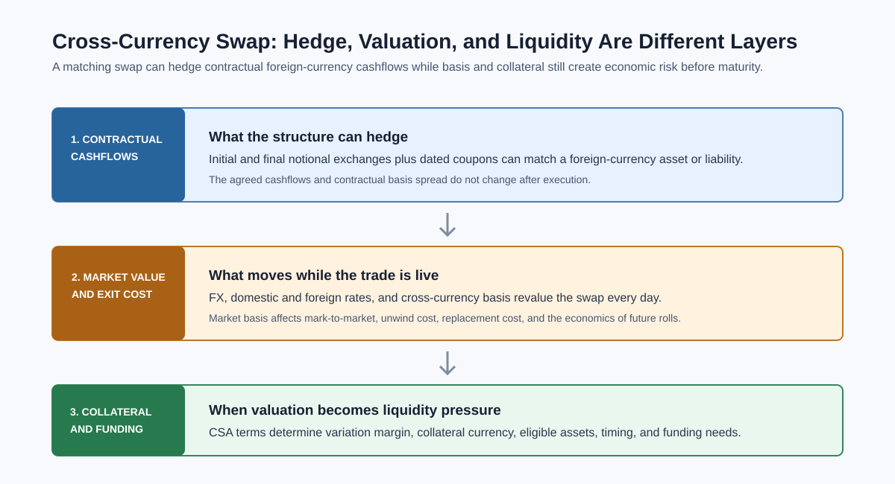

# Cross-Currency Swaps

Related chapters: [04-fx.md](04-fx.md), [06-interest-rates.md](06-interest-rates.md), [09-cross-asset.md](09-cross-asset.md), [11-market-data.md](11-market-data.md), and [19-financing-repo-and-securities-lending.md](19-financing-repo-and-securities-lending.md).

## What This Domain Covers
A cross-currency swap exchanges funding exposure across currencies.

The simple story is two parties exchange notionals in different currencies, pay interest in those currencies, and often exchange notionals back at maturity. The practical story is richer: collateral currency, basis spreads, resettable notionals, FX fixings, curve construction, and funding stress all matter.

Cross-currency swaps are core instruments for funding, asset-liability management, and multi-currency derivatives pricing. They connect FX, rates, collateral, and basis curves.

## Product Taxonomy and Market Structure
Start by identifying notional exchange and coupon style.

- Fixed-fixed cross-currency swaps.
- Fixed-floating cross-currency swaps.
- Floating-floating cross-currency basis swaps.
- Mark-to-market or resettable notional swaps.
- Non-deliverable cross-currency swaps in restricted currencies.

## Quoting and Market Conventions
- Quotes often appear as basis spreads added to one floating leg.
- Initial and final notional exchanges may be included or excluded.
- Resettable swaps update one notional using FX fixings.
- Collateral currency affects discounting.
- Payment calendars, fixing lags, day counts, and spot lags differ by currency.

## Core Pricing Framework
A cross-currency swap is valued as two currency cashflow legs converted through FX and discounted under the collateral convention.

At a high level:

```math
PV = PV_{\text{domestic leg}} - FX_0 \times PV_{\text{foreign leg}}
```

The basis spread is the spread that makes the two legs balance under market quotes.

In practice, pricing requires a curve stack: domestic discount curve, foreign projection curve, collateral discounting assumptions, FX spot, FX forwards or basis curve, and fixing data.

### What The Hedge Removes, And What It Leaves Behind

When the swap's notional exchanges and coupon schedule match a foreign-currency asset or liability, it can hedge the contractual FX cashflows. That is useful, but it is not the same as removing every source of economic volatility.



The cross-currency basis is a market spread embedded in the quoted swap. Once a trade is executed, its contractual basis spread is fixed. Subsequent moves in market basis change the trade's mark-to-market and therefore its unwind, replacement, and hedge-roll cost; they do not rewrite the spread in the signed confirmation. A hedge can therefore be effective against the underlying cashflows while still producing material balance-sheet and collateral volatility before maturity.

Collateral is part of this distinction. Under a margining agreement, variation margin can turn a mark-to-market move into a real funding requirement. The collateral currency, thresholds, minimum transfer amount, eligible collateral, independent amount, and settlement timing all affect the liquidity profile. Posting collateral in a currency different from the entity's functional or funding currency can introduce an additional FX funding exposure.

## Worked Instrument Example: Notional Exchange
Assume:
- EUR notional: EUR 10m,
- EUR/USD spot: 1.1000,
- USD notional exchanged: USD 11m.

At inception one party pays EUR 10m and receives USD 11m. Over time, each side pays coupons in its own currency. At maturity, the notionals are exchanged back unless the structure omits final exchange or uses resettable notionals.

If the swap is resettable, the USD notional may be updated using FX fixings so FX exposure is reduced but not eliminated from operations and settlement.

## Key Risk Measures and Sensitivities
- FX delta and FX fixing risk.
- Domestic and foreign curve PV01.
- Cross-currency basis sensitivity.
- Collateral currency and funding sensitivity.
- Mark-to-market, unwind, and replacement-cost sensitivity to basis moves.
- Variation-margin and liquidity stress under rates, FX, and basis scenarios.
- Reset and settlement risk.
- Counterparty and wrong-way risk.

## Required Data, Curves, Surfaces, and Calibration Objects
- FX spot, FX forwards, and cross-currency basis quotes.
- Domestic and foreign discount/projection curves.
- Coupon schedules, calendars, day counts, and fixing rules.
- Initial/final exchange flags and resettable notional rules.
- CSA and collateral currency terms.

## Numerical and Implementation Approaches
- Represent each currency leg explicitly.
- Keep notional exchanges as cashflows, not annotations.
- Build basis curves with clear collateral assumptions.
- Reconcile FX forwards implied by curves against market FX swap and basis quotes.
- Treat resettable notionals as lifecycle events.
- Report contractual cashflows separately from current exit value and collateral requirements.
- Stress basis widening, counterparty limits, and collateral-currency funding together for long-dated hedges.

## Production Pitfalls and Sanity Checks
- Discounting both legs with the wrong collateral curve.
- Missing final exchange of notionals.
- Treating resettable notional as eliminating all FX risk.
- Treating a live contractual basis spread as if it reprices with the market, or ignoring the separate risk of an unwind or future roll.
- Mixing FX spot date and trade date.
- Applying one calendar to both currency legs.
- Reporting PV without currency decomposition.

## Illustrative Code
```python
def convert_foreign_pv_to_domestic(foreign_pv: float, fx_spot_domestic_per_foreign: float) -> float:
    return foreign_pv * fx_spot_domestic_per_foreign
```

## References and Further Reading
- Andersen and Piterbarg. *Interest Rate Modeling*
- Henrard. *Interest Rate Modelling in the Multi-Curve Framework*
- Dealer cross-currency basis swap convention guides
