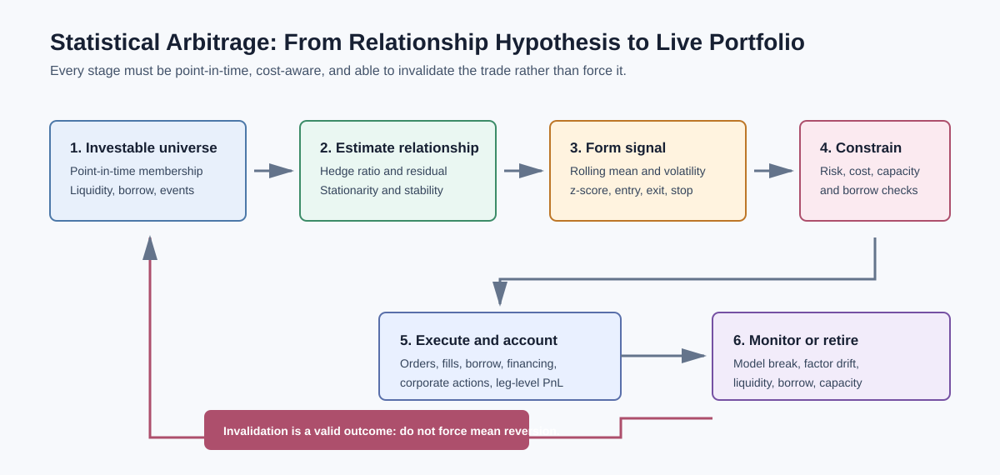
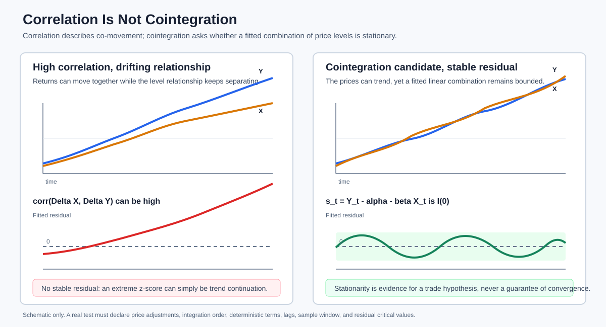
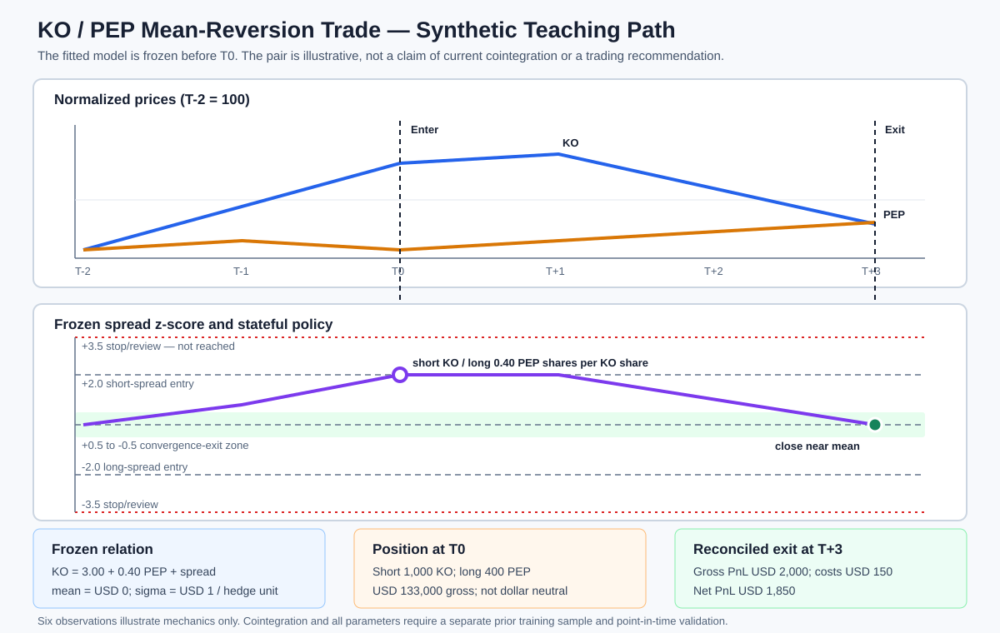

# Statistical Arbitrage and Pairs Trading

Related chapters: [03-equities.md](03-equities.md), [11-market-data.md](11-market-data.md), [13-risk-and-pnl.md](13-risk-and-pnl.md), [16-portfolio-construction-and-backtesting.md](16-portfolio-construction-and-backtesting.md), [20-execution-microstructure-and-tca.md](20-execution-microstructure-and-tca.md), [23-probability-statistics-and-regression.md](23-probability-statistics-and-regression.md), and [45-time-series-forecasting-and-state-space-models.md](45-time-series-forecasting-and-state-space-models.md).

## What This Domain Covers
Statistical arbitrage turns a measured relationship into a tradeable portfolio.

The name can be misleading. It is not a risk-free arbitrage. It is a hypothesis that a relative relationship is stable enough to trade after costs, financing, borrow, and imperfect execution. A pairs trade is the clearest example: buy one asset, sell another, and expect their correctly hedged spread to revert after a temporary dislocation.

The useful mental model is a chain: define an investable universe, estimate a relationship using only information available at the time, turn its residual into a signal, trade it with realistic constraints, and monitor whether the relationship has stopped being economically meaningful.

## Product Taxonomy and Market Structure
Statistical-arbitrage strategies differ mainly by what creates the relative relationship and how quickly the portfolio must trade.

- Pairs trading in equities, ETFs, futures, or ADR/local listings.
- Cointegration and basket mean reversion across related securities.
- Factor-neutral residual portfolios.
- Index, ETF, and futures relative-value trades.
- Cross-sectional signals that rank many securities rather than trade one pair.
- Market-making and short-horizon relative value, where microstructure matters more than long-run equilibrium.

Pairs trading is often equity-oriented, but the workflow also applies to rates curve spreads, FX relative value, commodity calendar spreads, and credit basis trades. The instrument convention, liquidity, and funding mechanics change; the research discipline does not.

## Quoting and Market Conventions
- Use tradable bid/ask prices, not only mid prices, when turning a research signal into a trade.
- A long-short portfolio needs a defined gross exposure, net exposure, beta convention, and base currency.
- Short availability, borrow fee, recall risk, dividends, and corporate actions are economic inputs.
- Price, total-return, and excess-return series answer different questions. A spread must use a consistent choice.
- Entry and exit thresholds, rebalance time, delay, order type, and execution benchmark are strategy parameters, not implementation detail.

## Core Pricing Framework
The first question is not whether two prices move together. Correlation measures co-movement; it does not guarantee that a price spread is stable. A common pairs framework estimates a hedge ratio and studies the residual:

$$
s_t = y_t - \alpha - \beta x_t
$$

where $y_t$ and $x_t$ are aligned log-price series or economically comparable value series, and $s_t$ is the spread or residual. A strategy needs evidence that this residual is stationary, or at least sufficiently mean-reverting over the intended holding horizon.

The signal is often standardized with a rolling mean and volatility:

$$
z_t = \frac{s_t - \mu_t}{\sigma_t}
$$



If $z_t$ is high, the residual is rich relative to its recent distribution; a simple rule might short $y$, buy $\beta$ units of $x$, and wait for the residual to normalize. If $z_t$ is low, the direction reverses. The rule is only a starting point: the hedge ratio, lookback window, thresholds, and exit logic must be chosen and validated out of sample.

### Correlation, Cointegration, and Mean Reversion

High correlation alone is not enough. Two trending assets can be highly correlated while their raw price difference keeps drifting. Cointegration asks whether a linear combination of non-stationary price series is stationary. It is often more relevant for a long-horizon pairs thesis, but it is still an estimated relationship that can fail.



The concepts answer different questions:

| Concept | Object being studied | What it establishes | What it does not establish |
| --- | --- | --- | --- |
| Correlation | Usually contemporaneous returns | Whether two series tend to move together | A stable price-level spread or future convergence |
| Cointegration | A fitted combination of non-stationary levels | Whether common stochastic trends cancel to leave a stationary residual | Profitability, stable parameters, or a particular convergence time |
| Mean reversion | Dynamics of the fitted residual | Whether deviations tend to decay toward an estimated equilibrium | That every deviation will close before costs, stops, or structural change |
| Pairs trade | Executable long-short position | A portfolio intended to monetize residual convergence | Risk-free arbitrage or automatic market neutrality |

The standard term is **mean reversion**, not “reverse mean.” The trade is contrarian with respect to the fitted residual: sell the residual after an unusually positive deviation and buy it after an unusually negative deviation. It is not necessarily contrarian with respect to either stock's standalone return.

Formally, if $x_t$ and $y_t$ are each integrated of order one, written $I(1)$, but

$$
s_t=y_t-\alpha-\beta x_t
$$

is $I(0)$, then the levels are cointegrated with normalized vector $(1,-\beta)$. The stationary object is the fitted residual $s_t$—not automatically the raw difference $y_t-x_t$, the price ratio, or the return difference. A residual-test rejection is evidence for a historical relationship under a declared specification; it is not proof that the next observed divergence is mispricing.

Useful checks include:
- residual plots and rolling distribution checks;
- Augmented Dickey-Fuller or related stationarity tests, interpreted with their assumptions and limited power;
- rolling hedge-ratio stability;
- mean-reversion half-life estimates used as a holding-horizon diagnostic, not as a promise;
- factor, sector, currency, and market-beta exposures after hedge construction.

### Engle-Granger and Johansen Cointegration
The Engle-Granger two-step procedure is a practical starting point for two or a few series:

1. verify that the level series have a compatible integration order;
2. estimate the long-run relation $y_t=\alpha+\beta x_t+u_t$;
3. test the fitted residual $\hat u_t$ for a unit root;
4. if supported, represent short-run dynamics with an error-correction term.

A two-series error-correction model can be written:

$$
\Delta y_t
=c+\lambda\left(y_{t-1}-\alpha-\beta x_{t-1}\right)
+\sum_i\gamma_i\Delta y_{t-i}
+\sum_j\delta_j\Delta x_{t-j}
+\epsilon_t.
$$

For convergence, the adjustment coefficient $\lambda$ should have the sign implied by the spread definition. The residual unit-root test uses Engle-Granger critical values, not the ordinary Dickey-Fuller critical values for an observed series, because the residual was estimated. Results depend on intercept/trend specification, lag selection, sample window, and which variable is normalized on the left-hand side.

Johansen's method treats an $n$-series system jointly through a VECM:

$$
\Delta\mathbf y_t
=\alpha\beta^{\mathsf T}\mathbf y_{t-1}
+\sum_{i=1}^{p-1}\Gamma_i\Delta\mathbf y_{t-i}
+\boldsymbol\epsilon_t.
$$

Trace and maximum-eigenvalue tests provide evidence about cointegration rank. The estimated columns of $\beta$ define stationary baskets and $\alpha$ describes adjustment. This is useful for baskets with more than one equilibrium relation, but it adds material degrees of freedom. Lag order, deterministic terms, finite-sample corrections, and rolling rank stability must be explicit.

Neither procedure is a pair-selection oracle. Testing thousands of candidate pairs creates multiple-testing and selection bias; universe formation and false-discovery controls belong inside the walk-forward process. A cointegrating vector can also be statistically stable but economically untradeable after factor exposure, borrow, turnover, and breaks.

### Ornstein-Uhlenbeck Spread Dynamics
A mean-reverting spread is often approximated by an Ornstein-Uhlenbeck (OU) process:

$$
ds_t=\kappa(\theta-s_t)\,dt+\sigma\,dW_t,\qquad \kappa>0.
$$

Over interval $\Delta$, the exact conditional mean is:

$$
\mathbb E[s_{t+\Delta}\mid s_t]
=\theta+(s_t-\theta)e^{-\kappa\Delta},
$$

and the conditional variance is:

$$
\operatorname{Var}(s_{t+\Delta}\mid s_t)
=\frac{\sigma^2}{2\kappa}\left(1-e^{-2\kappa\Delta}\right).
$$

The corresponding AR(1) coefficient is $\phi=e^{-\kappa\Delta}$ and the model half-life is:

$$
t_{1/2}=\frac{\log 2}{\kappa}
=-\frac{\Delta\log 2}{\log\phi}.
$$

Estimate the process on the spread produced by a point-in-time hedge model, not on a retrospectively re-hedged series. The half-life is a model diagnostic, not an expected trade duration: threshold crossing, stops, costs, discrete sampling, and parameter breaks change the realized holding period. If $\phi$ is close to one, small estimation changes create large half-life changes; if $\phi\leq0$ or $\phi\geq1$, the simple positive mean-reversion interpretation does not apply.

### Kalman Dynamic Hedge Ratios
A state-space model allows the intercept and hedge ratio to evolve:

$$
y_t=\alpha_t+\beta_t x_t+\epsilon_t,\qquad
\epsilon_t\sim\mathcal N(0,R),
$$

$$
\begin{bmatrix}\alpha_t\\\beta_t\end{bmatrix}
=
\begin{bmatrix}\alpha_{t-1}\\\beta_{t-1}\end{bmatrix}
+\boldsymbol\eta_t,\qquad
\boldsymbol\eta_t\sim\mathcal N(0,Q).
$$

The Kalman filter predicts $(\alpha_t,\beta_t)$ from the previous filtered state, measures the innovation in $y_t$, and updates the state and its covariance. It naturally represents hedge uncertainty and can accommodate missing observations, but “time-varying” does not automatically mean “more accurate.”

The process covariance $Q$ controls how quickly the hedge can move; the observation variance $R$ controls how much of a price change is treated as noise. An overly large $Q$ lets the hedge chase the latest observation and mechanically compresses the residual. An overly small $Q$ is nearly a fixed hedge. Tune these values within ordered training folds using forecast or portfolio loss, and archive predicted and filtered states separately. Smoothed states use later observations and are not admissible historical signals.

A trading decision made after observing the current close may use the current filtered hedge if the full operational delay is represented. A decision made before that close must use the predicted hedge based on the prior information set. Position sizing should reflect state-covariance uncertainty, not only the point estimate $\hat\beta_t$.

### PCA-Based Statistical Arbitrage
Principal-component statistical arbitrage estimates common return factors from a standardized return matrix:

$$
R_t=Bf_t+\varepsilon_t.
$$

The leading principal components approximate dominant common variation. Residual returns can be accumulated over a documented horizon, tested for mean reversion, and converted into cross-sectional signals. This scales beyond hand-selected pairs and can expose market, sector, or style-neutral opportunities.

A production workflow:

1. form a point-in-time liquid universe and robustly standardize returns inside the training window;
2. fit PCA loadings using only that window;
3. choose factor count using ordered validation plus economic exposure checks;
4. compute residual returns without refitting on the evaluation observation;
5. estimate residual mean reversion and form constrained portfolio weights;
6. neutralize intended factors and charge turnover, impact, borrow, and crowding.

PCA maximizes explained variance, not tradable predictability. Loadings can rotate or change sign, especially when eigenvalues are close. Missing observations, volatility scaling, sector concentration, and a single crisis window can dominate the components. Match components across refits by exposure similarity when interpretation matters, but construct the hedge from the full loading space rather than relying on component names.

## Practitioner Workflow: From Candidate Pair to Closed Trade

Pairs and basket mean reversion are common building blocks in quantitative equity-market-neutral and statistical-arbitrage funds. It is not accurate to say that most hedge funds use cointegration: hedge funds span many unrelated strategies, actual models are proprietary, and production statistical-arbitrage portfolios usually diversify across many relationships rather than depend on one pair.

### 1. Form an Economically Defensible Candidate Universe

A statistical search should start from securities that can plausibly share a long-run driver:

- same industry, product market, supply chain, regulation, geography, or share class;
- matching currency, trading calendar, timestamp, and corporate-action treatment;
- adequate liquidity and compatible execution hours;
- reliable short availability, acceptable borrow fee, and manageable recall risk;
- no unresolved merger, spin-off, accounting change, index event, or other structural break.

Economic similarity creates a candidate, not a trade. Two beverage companies may share consumer, foreign-exchange, packaging, and commodity exposures while differing materially in product mix, margins, capital allocation, or geography. Those differences are possible causes of spread repricing rather than noise to average down against.

### 2. Estimate and Test Point in Time

At every historical formation date:

1. freeze the investable universe and adjusted research data known at that time;
2. verify compatible integration orders and deterministic-term assumptions;
3. estimate the hedge relation only on the formation window;
4. test the fitted residual with residual-based cointegration critical values;
5. inspect subperiod stability, hedge-ratio drift, residual variance, and autocorrelation;
6. estimate OU or AR dynamics and a noisy half-life range;
7. apply multiple-testing or false-discovery controls across every candidate and specification tried;
8. freeze the accepted model before calculating signals in the trading window.

The pair-selection decision, left-hand-side normalization, lag choice, trend/intercept choice, training window, threshold grid, and retirement rule are all part of the search. Hiding any of them understates data snooping.

### 3. Translate the Cointegrating Vector into Positions

The meaning of $\beta$ depends on the fitted variables:

| Fitted relation | Local hedge interpretation |
| --- | --- |
| Price levels: $P_Y=\alpha+\beta P_X+s$ | One share of $Y$ against $\beta$ shares of $X$ |
| Log prices: $\log P_Y=\alpha+\beta\log P_X+s$ | Approximately USD 1 of $Y$ against USD $\beta$ of $X$ for a small move |
| Total-return indices | Research hedge only; convert separately into executable shares and cashflows |

For a log-price long-spread portfolio with gross budget $G$ and $\beta>0$, a gross-normalized starting point is:

$$
N_Y=\frac{G}{1+|\beta|},
\qquad
N_X=-\frac{\beta G}{1+|\beta|}.
$$

The signs reverse for a short-spread position. Convert notionals to shares at executable prices, then evaluate dollar, beta, sector, style, volatility, currency, liquidity, and borrow exposures. The cointegration hedge is not automatically neutral under any of those other definitions.

### 4. Run a Stateful Mean-Reversion Policy

A z-score threshold is not enough; the rule needs position state and hysteresis:

- **Flat and $z_t\geq z_{entry}$:** enter short residual—short $Y$, long its fitted $X$ hedge.
- **Flat and $z_t\leq-z_{entry}$:** enter long residual—long $Y$, short its fitted $X$ hedge.
- **Open and residual returns to the exit band:** close for convergence.
- **Residual widens in the adverse direction:** stop or move to mandatory review; do not mechanically average down.
- **Maximum holding period reached:** close or re-underwrite rather than silently extend the horizon.
- **Model, data, borrow, liquidity, or event check fails:** disable the pair and close according to the emergency execution policy.

Entry is normally triggered by a threshold crossing from an eligible prior state, not simply because an already-stale signal remains extreme. A position that gaps through the mean should close rather than wait for $|z|$ to return to the exit band from the other side.

### 5. Apply the Cost Gate, Size, and Execute Both Legs

Expected convergence must exceed round-trip spread, fees, impact, borrow, financing, dividend exposure, hedge rebalance, and a model-error buffer. Size from a loss budget and stressed spread widening, not from the largest leverage allowed by a small historical residual variance.

Execution normally uses linked or basket orders with:

- locate confirmation before committing the short;
- maximum legging time and loss if only one leg fills;
- participation and impact limits on both instruments;
- a policy for partial fills, rejects, halts, and auction states;
- target-versus-executed hedge and factor exposure monitoring.

The PnL ledger must reconcile long-leg price PnL, short-leg price PnL, dividends received and paid, borrow, financing, execution costs, corporate actions, FX, hedge rebalances, and residual unexplained PnL.

### 6. Monitor, Invalidate, and Retire

An open pair should be reviewed for residual volatility jumps, hedge-ratio drift, loss of stationarity, half-life extension, factor-exposure drift, earnings or corporate events, borrow recall, crowding, and liquidity deterioration. A low historical cointegration p-value must never override current economic evidence.

Pair retirement is a normal model outcome. Retain the final model snapshot, signal, orders, fills, reason code, and PnL attribution. Re-entry requires the documented cooldown or a newly completed formation process; it should not happen because a broken spread becomes even more statistically extreme.

## Worked Instrument Example: Coca-Cola and PepsiCo

The Coca-Cola Company (`KO`) and PepsiCo (`PEP`) are recognizable companies with overlapping beverage and consumer-demand exposures, so their securities make an intuitive teaching candidate. They are not identical businesses—PepsiCo also has a substantial convenient-food business—which is exactly why economic similarity cannot substitute for testing and ongoing structural review.

The companies do not themselves “follow” a pairs strategy. A fund or trading desk chooses whether to research and trade their securities. This example asserts no current cointegration, hedge-fund position, or investment opportunity; all prices and model outputs are synthetic.



Assume a model fitted and frozen before the displayed trading interval estimates:

$$
P_t^{KO}=3.00+0.40P_t^{PEP}+s_t,
\qquad \mu_s=0,
\qquad \sigma_s=1.
$$

At T0, KO is USD 69.00 and PEP is USD 160.00:

$$
s_{T0}=69-3-0.40(160)=2,
\qquad z_{T0}=2.
$$

KO is rich relative to the fitted relation, so the illustrative trade shorts 1,000 KO shares and buys 400 PEP shares. The entry portfolio is USD 133,000 gross and USD 5,000 net short. At T+3, KO is USD 67.60 and PEP is USD 161.50, making the residual zero. Short-KO PnL is USD 1,400, long-PEP PnL is USD 600, and gross convergence PnL is USD 2,000. After an illustrative USD 150 of all-in costs, net PnL is USD 1,850.

This favorable path teaches accounting, not expected performance. The complete table, both signal directions, stop/time/model-break states, and dependency-free executable code are in [examples/cointegrated-pair-trade-lifecycle.md](examples/cointegrated-pair-trade-lifecycle.md). The smaller arithmetic-only signal example remains in [examples/pairs-trading-spread-signal.md](examples/pairs-trading-spread-signal.md).

## Key Risk Measures and Sensitivities
- Spread z-score, residual volatility, and residual drawdown.
- Hedge-ratio, beta, sector, factor, currency, and market-neutrality exposure.
- Cointegration-rank, residual-stationarity, OU-speed, and half-life stability by window.
- Kalman state covariance and sensitivity to process and observation noise.
- PCA loading, eigenvalue-gap, factor-count, and universe-composition sensitivity.
- Gross and net exposure, leverage, concentration, and pair overlap.
- Borrow availability, borrow fee, recall, dividend, and corporate-action exposure.
- Liquidity, ADV participation, bid-ask spread, and execution shortfall.
- Model-break, parameter-instability, and regime sensitivity.
- Capacity and crowding risk, especially when many portfolios trade similar residuals.

## Required Data, Curves, Surfaces, and Calibration Objects
- Point-in-time universe membership, identifiers, delisting history, and corporate actions.
- Adjusted and unadjusted price series with a documented adjustment policy.
- Bid/ask, volume, ADV, spread, volatility, and trading-calendar data.
- Short availability, borrow fee, rebate, financing, dividends, and recall data.
- Market, sector, style-factor, currency, and benchmark exposures.
- Rolling Engle-Granger or Johansen specifications, hedge estimates, stationarity diagnostics, cointegration rank, and deterministic-term choices.
- OU parameter estimates, innovations, fitting interval, and holding-horizon convention.
- Kalman predicted and filtered states, state covariance, process covariance, observation covariance, and initialization.
- Point-in-time PCA universe, scaling parameters, loadings, eigenvalues, factor count, and component-matching metadata.
- Signal history, training window, forecast origin, and model version.
- Order, fill, position, and cash ledgers sufficient to replay the strategy exactly.

## Numerical and Implementation Approaches
- Separate pair selection, hedge estimation, signal calculation, portfolio construction, execution, and accounting into explicit stages.
- Use walk-forward or rolling estimation. Never estimate a hedge ratio with observations that were not available at the decision time.
- Re-estimate parameters on a documented schedule and retain the historical parameter snapshot used for each trade.
- Select cointegration lags, deterministic terms, rank, OU form, Kalman noise parameters, and PCA factor count inside each training fold.
- Use Engle-Granger critical values for estimated residuals and treat Johansen rank as a window-dependent estimate.
- In dynamic-hedge models, publish the state timestamp and whether a hedge is predicted, filtered, or smoothed.
- Refit PCA on the scheduled training window, align its universe point in time, and compute evaluation residuals from frozen loadings.
- Use robust regression or factor-neutral residual construction when one outlier or a common factor dominates the relationship.
- Model transaction costs, borrow, financing, and fill uncertainty before selecting thresholds.
- Size positions from residual volatility and liquidity while respecting portfolio-level gross, net, factor, and concentration limits.
- Add a trading halt or review state for material data changes, corporate actions, delistings, borrow recalls, and model-break alerts.

An explicit research contract should identify:

```text
universe_as_of, market_data_as_of, fit_start, fit_end, decision_time,
hedge_method, hedge_state_type, residual_definition, signal_window,
entry_and_exit_policy, target_exposures, cost_model_version
```

The residual used for signal generation must be exactly reproducible from those objects. If a hedge is updated while a position is open, define whether the portfolio rebalances immediately, on a schedule, or only after a threshold; otherwise a backtest can obtain a frictionless benefit that the live strategy cannot.

## Production Pitfalls and Sanity Checks
- Selecting pairs from the full sample and presenting the result as an out-of-sample discovery.
- Using correlation as proof of cointegration or assuming a stationary residual will remain stationary.
- Applying ordinary ADF critical values to an Engle-Granger residual or choosing deterministic terms after seeing the test result.
- Treating a rolling Johansen rank or cointegrating vector as stable without monitoring sign, normalization, and subspace changes.
- Converting a noisy AR coefficient near one into a precise OU half-life.
- Letting Kalman process noise compress residuals in sample, then ignoring the turnover required to follow the moving hedge.
- Backtesting with Kalman-smoothed states or PCA loadings fitted on the full sample.
- Treating PCA component numbers or signs as stable economic identities across refits.
- Building a spread from split-adjusted price history but replaying an unadjusted position ledger.
- Ignoring borrow cost, borrow recall, dividends paid on a short, financing, and hard-to-borrow constraints.
- Treating a z-score as a timing signal without checking stale prices, asynchronous closes, or a corporate-action event.
- Re-estimating a hedge ratio after the fact and applying it to a historical trade ledger.
- Aggregating pairs that are individually neutral into a portfolio with a large hidden sector, factor, or liquidity bet.
- Optimizing entry and exit thresholds until noise looks like alpha.

Minimum checks:
- each signal can be reproduced from a point-in-time market-data and parameter snapshot;
- long and short legs reconcile to executed quantities, prices, financing, and corporate-action cashflows;
- the reported spread PnL reconciles to leg-level PnL and costs;
- exposure limits hold after fills and price drift, not only at target weights;
- estimated residual behavior remains credible under frozen rather than retrospectively updated hedge parameters;
- cointegration, OU, Kalman, and PCA choices are re-selected only at scheduled historical fit dates;
- parameter uncertainty and dynamic-hedge turnover are reflected in size and stress tests;
- performance remains credible under delayed fills, wider spreads, higher borrow cost, and pair retirement.

## Illustrative Code
```python
import math


def z_score(value: float, mean: float, std_dev: float) -> float:
    if not all(math.isfinite(item) for item in (value, mean, std_dev)):
        raise ValueError("z-score inputs must be finite")
    if std_dev <= 0.0:
        raise ValueError("standard deviation must be positive")
    return (value - mean) / std_dev


def pair_action(
    z: float,
    state: str,
    entry: float = 2.0,
    exit: float = 0.5,
    stop: float = 3.5,
    model_valid: bool = True,
) -> str:
    if not all(math.isfinite(item) for item in (z, entry, exit, stop)):
        raise ValueError("signal inputs must be finite")
    if state not in {"flat", "long_residual", "short_residual", "disabled"}:
        raise ValueError("unknown pair state")
    if not 0.0 <= exit < entry < stop:
        raise ValueError("thresholds must satisfy exit < entry < stop")
    if state == "disabled":
        return "remain_disabled"
    if not model_valid:
        return "disable_and_close" if state != "flat" else "disable"
    if state == "flat":
        if z >= entry:
            return "enter_short_residual"
        if z <= -entry:
            return "enter_long_residual"
        return "remain_flat"
    if state == "short_residual":
        if z >= stop:
            return "stop_exit"
        return "convergence_exit" if z <= exit else "hold"
    if z <= -stop:
        return "stop_exit"
    return "convergence_exit" if z >= -exit else "hold"


def residual(y_log_price: float, x_log_price: float, alpha: float, beta: float) -> float:
    if not all(
        math.isfinite(item)
        for item in (y_log_price, x_log_price, alpha, beta)
    ):
        raise ValueError("residual inputs must be finite")
    return y_log_price - alpha - beta * x_log_price


def ou_half_life(ar1_phi: float, sampling_interval: float = 1.0) -> float:
    if not math.isfinite(ar1_phi) or not math.isfinite(sampling_interval):
        raise ValueError("OU inputs must be finite")
    if not 0.0 < ar1_phi < 1.0 or sampling_interval <= 0.0:
        raise ValueError("OU mapping requires an AR(1) coefficient between zero and one")
    return -sampling_interval * math.log(2.0) / math.log(ar1_phi)


def scalar_dynamic_beta_update(
    prior_beta: float,
    prior_variance: float,
    x: float,
    y: float,
    process_variance: float,
    observation_variance: float,
) -> tuple[float, float, float]:
    """One filtered update for y = beta*x + noise with beta a random walk."""
    values = (
        prior_beta, prior_variance, x, y,
        process_variance, observation_variance,
    )
    if not all(math.isfinite(value) for value in values):
        raise ValueError("Kalman inputs must be finite")
    if prior_variance < 0 or process_variance < 0 or observation_variance <= 0:
        raise ValueError("invalid covariance")

    predicted_variance = prior_variance + process_variance
    innovation = y - prior_beta * x
    innovation_variance = x * x * predicted_variance + observation_variance
    gain = predicted_variance * x / innovation_variance
    filtered_beta = prior_beta + gain * innovation
    filtered_variance = (1.0 - gain * x) * predicted_variance
    return filtered_beta, filtered_variance, innovation
```

## References and Further Reading
- Gatev, Goetzmann, and Rouwenhorst. [*Pairs Trading: Performance of a Relative-Value Arbitrage Rule*](https://www.nber.org/papers/w7032); published version [DOI 10.1093/rfs/hhj020](https://doi.org/10.1093/rfs/hhj020).
- Vidyamurthy. *Pairs Trading: Quantitative Methods and Analysis*.
- Avellaneda and Lee. [*Statistical Arbitrage in the U.S. Equities Market*](https://doi.org/10.1080/14697680903124632).
- Engle and Granger. [*Co-Integration and Error Correction: Representation, Estimation, and Testing*](https://doi.org/10.2307/1913236).
- Johansen. [*Statistical Analysis of Cointegration Vectors*](https://doi.org/10.1016/0165-1889(88)90041-3).
- Elliott, van der Hoek, and Malcolm on pairs trading with state-space models.
- Company context for the teaching pair: The Coca-Cola Company [2025 Form 10-K](https://www.sec.gov/Archives/edgar/data/21344/000162828026010047/ko-20251231.htm) and PepsiCo [2025 Form 10-K](https://www.sec.gov/Archives/edgar/data/77476/000007747626000007/pep-20251227.htm).
- Links: [16-portfolio-construction-and-backtesting.md](16-portfolio-construction-and-backtesting.md), [20-execution-microstructure-and-tca.md](20-execution-microstructure-and-tca.md), [23-probability-statistics-and-regression.md](23-probability-statistics-and-regression.md), [45-time-series-forecasting-and-state-space-models.md](45-time-series-forecasting-and-state-space-models.md), [examples/pairs-trading-spread-signal.md](examples/pairs-trading-spread-signal.md), [examples/cointegrated-pair-trade-lifecycle.md](examples/cointegrated-pair-trade-lifecycle.md), and [examples/kalman-filter-dynamic-hedge-ratio.md](examples/kalman-filter-dynamic-hedge-ratio.md).
