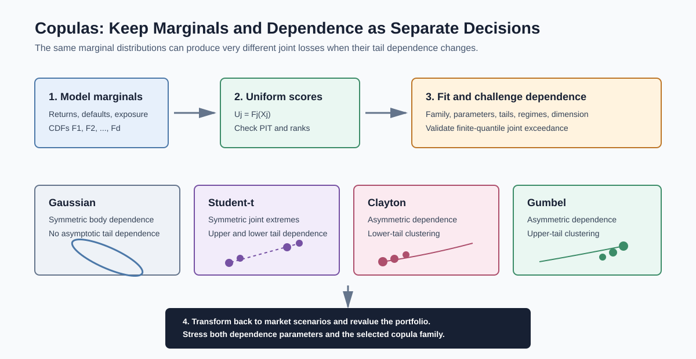

# Dependence Modelling and Copulas

Related chapters: [07-credit.md](07-credit.md), [09-cross-asset.md](09-cross-asset.md), [10-numerical-methods.md](10-numerical-methods.md), [13-risk-and-pnl.md](13-risk-and-pnl.md), [18-volatility-products.md](18-volatility-products.md), [23-probability-statistics-and-regression.md](23-probability-statistics-and-regression.md), and [24-structured-credit-and-securitization.md](24-structured-credit-and-securitization.md).

## What This Domain Covers
Dependence modelling asks what happens when several uncertain quantities move together.

Correlation is a useful first summary, but it cannot describe every joint distribution. Two portfolios can have the same linear correlation and very different probabilities of suffering simultaneous large losses. Copulas provide a way to model the marginal behaviour of each variable separately from the structure that joins them.

The practical story is: model each risk factor on its own scale, transform it to a common probability scale, choose and validate a dependence model, then transform joint scenarios back to market units. The result is useful only if the marginals, dependence family, calibration window, and stress behaviour are all credible.

## Product Taxonomy and Market Structure
Copulas are modelling components rather than traded instruments. They appear where a joint distribution changes valuation or risk.

- Portfolio loss aggregation and multi-asset scenario generation.
- Structured credit, default baskets, and tranche loss distributions.
- Counterparty exposure and wrong-way risk.
- Insurance and operational-risk aggregation.
- Cross-asset derivatives and basket options.
- Multivariate financial time-series and volatility models.

For high-dimensional portfolios, a single unrestricted copula can become difficult to estimate. Factor copulas and vine copulas build dependence from lower-dimensional components, but they introduce their own structural and selection risk.

## Quoting and Market Conventions
Dependence inputs need conventions just as prices and volatilities do.

- Pearson correlation measures linear association and is sensitive to outliers and marginal behaviour.
- Kendall's tau and Spearman's rho are rank-based dependence summaries and are often more natural for copula calibration.
- Lower-tail dependence describes joint low-quantile events; upper-tail dependence describes joint high-quantile events. Whether a market loss lives in the lower or upper tail depends on the sign convention of the modelled variable.
- Calibration horizon, sampling frequency, filtering model, missing-data policy, and regime window must be stated.
- A copula parameter is family-specific. Equal parameter values across Gaussian, Student-t, Clayton, or Gumbel copulas do not imply equal dependence.

## Core Pricing Framework
Sklar's theorem supplies the separation between marginals and dependence. For a joint distribution $H$ with marginal distributions $F_1,\ldots,F_d$, there is a copula $C$ such that:

```math
H(x_1,\ldots,x_d)
= C\left(F_1(x_1),\ldots,F_d(x_d)\right)
```

If the marginals are continuous, the copula is unique. With discrete marginals, including default indicators, uniqueness and estimation require extra care.

For a continuous, correctly specified marginal model:

```math
U_j = F_j(X_j) \sim U(0,1)
```

The copula joins the uniform variables $U_1,\ldots,U_d$. Simulation reverses the process:

```math
(U_1,\ldots,U_d) \sim C,
\qquad X_j = F_j^{-1}(U_j)
```



### Tail Dependence
For two continuous variables with copula $C$, lower-tail dependence is:

```math
\lambda_L
= \lim_{u\downarrow 0}\Pr(U_2 \leq u \mid U_1 \leq u)
= \lim_{u\downarrow 0}\frac{C(u,u)}{u}
```

Upper-tail dependence is:

```math
\lambda_U
= \lim_{u\uparrow 1}\Pr(U_2 > u \mid U_1 > u)
= \lim_{u\uparrow 1}\frac{1-2u+C(u,u)}{1-u}
```

These are asymptotic quantities. A model with zero asymptotic tail dependence can still show meaningful co-exceedance at finite quantiles, so validation should inspect the actual probability levels relevant to the portfolio.

### Common Copula Families

| Family | Dependence Shape | Tail Behaviour | Typical Use And Limitation |
| --- | --- | --- | --- |
| Gaussian | Symmetric elliptical dependence | No asymptotic tail dependence when correlation is below one in magnitude | Fast and scalable, but can underrepresent joint extremes |
| Student-t | Symmetric elliptical dependence with degrees of freedom | Symmetric upper and lower tail dependence | Useful for joint extremes, but still imposes radial symmetry |
| Clayton | Asymmetric Archimedean dependence | Lower-tail dependence for positive parameter; no upper-tail dependence | Useful when joint downside is the focus; orientation must match the loss convention |
| Gumbel | Asymmetric Archimedean dependence | Upper-tail dependence; no lower-tail dependence | Useful for joint upper extremes; does not represent arbitrary asymmetry |
| Frank | Symmetric dependence in the body | No asymptotic tail dependence | Flexible around the centre, weak for extreme co-movement |
| Vine or factor copula | High-dimensional structure assembled from simpler components | Depends on selected pair or factor copulas | Flexible, but selection, ordering, and estimation risk increase quickly |

For a bivariate Student-t copula with correlation parameter $\rho$ and $\nu$ degrees of freedom, symmetric tail dependence is:

```math
\lambda_L = \lambda_U
= 2t_{\nu+1}\left(
-\sqrt{\frac{(\nu+1)(1-\rho)}{1+\rho}}
\right)
```

where $t_{\nu+1}$ is the Student-t CDF. Lower degrees of freedom generally create stronger tail dependence, holding $\rho$ fixed.

## Worked Instrument Example: Clayton Lower-Tail Dependence
For a Clayton copula with parameter $\theta>0$:

```math
\lambda_L = 2^{-1/\theta},
\qquad \lambda_U = 0
```

If $\theta=2$:

```math
\lambda_L = 2^{-1/2} \approx 0.7071
```

This does **not** mean that two assets have a 70.71% probability of crashing. It means that, in the asymptotic limit, the conditional probability that one transformed variable is in its lower tail given that the other is in the same lower tail approaches 70.71%. The interpretation depends on the variables, their marginal models, and whether low transformed values represent losses.

## Key Risk Measures and Sensitivities
- Pearson correlation, Kendall's tau, and Spearman's rho.
- Upper- and lower-tail dependence coefficients.
- Joint exceedance and co-exceedance probabilities at portfolio-relevant quantiles.
- Portfolio VaR, Expected Shortfall, tranche loss, or exposure sensitivity to copula parameters.
- Dependence stress, including correlation, degrees of freedom, family, and regime shocks.
- Parameter uncertainty and model-selection sensitivity.

## Required Data, Curves, Surfaces, and Calibration Objects
- Clean, synchronized time series or cross-sectional observations.
- Explicit marginal models, fitted parameters, residuals, and probability-integral-transform values.
- Point-in-time filters for volatility, autocorrelation, seasonality, and structural breaks.
- Copula family, parameter constraints, calibration window, and optimization configuration.
- Rank-based pseudo-observations, often $R_{ij}/(n+1)$, when using empirical margins.
- Default histories, recovery assumptions, exposure data, or tranche quotes for credit applications.
- Out-of-sample joint scenarios and stress periods for validation.

## Numerical and Implementation Approaches
The implementation should make the separation of marginals and dependence visible.

1. Specify and validate each marginal model.
2. Transform observations to uniform scores using fitted CDFs or ranks.
3. Inspect rank dependence, finite-quantile co-exceedance, asymmetry, and regime stability.
4. Fit candidate copulas using full maximum likelihood, inference functions for margins, or rank-based pseudo-likelihood.
5. Compare in-sample fit with out-of-sample likelihood, probability-integral-transform diagnostics, tail fit, scenario behaviour, and economic outputs.
6. Simulate uniforms from the selected copula and invert the marginal CDFs.
7. Revalue the portfolio and report both parameter and family sensitivity.

For time series, first model serial dynamics and conditional volatility where appropriate. Fitting a static copula directly to raw heteroskedastic returns can confuse changing marginal volatility with changing cross-sectional dependence.

## Production Pitfalls and Sanity Checks
- Treating correlation as a complete dependence model.
- Choosing a copula because it fits the centre while ignoring the portfolio-relevant tail.
- Using low returns as losses in one system and high positive loss values in another without reversing tail interpretation.
- Fitting marginals poorly, then attributing marginal misspecification to the copula.
- Assuming a static dependence model survives volatility regimes, crises, or market-structure changes.
- Calibrating many pair-copulas or factor loadings with too little tail data.
- Using smoothed or full-sample parameters in a point-in-time backtest.
- Reporting one precise VaR or tranche price without copula-family and parameter stress.
- Treating a historical crisis outcome as proof of one universal future dependence structure.

Minimum checks:
- transformed marginal scores are close to uniform and do not retain avoidable serial structure;
- the simulated rank dependence matches the calibrated target within tolerance;
- finite-quantile co-exceedance is checked in addition to asymptotic coefficients;
- the correlation or factor matrix is valid and numerically stable where required;
- risk outputs are compared across plausible copula families and stressed dependence parameters.

## Illustrative Code
```python
from random import expovariate, gammavariate


def clayton_lower_tail_dependence(theta: float) -> float:
    if theta <= 0:
        raise ValueError("theta must be positive")
    return 2.0 ** (-1.0 / theta)


def sample_clayton_uniforms(theta: float, dimensions: int = 2) -> list[float]:
    if theta <= 0 or dimensions < 2:
        raise ValueError("theta must be positive and dimensions must be at least two")
    common_factor = gammavariate(1.0 / theta, 1.0)
    exponentials = [expovariate(1.0) for _ in range(dimensions)]
    return [(1.0 + value / common_factor) ** (-1.0 / theta) for value in exponentials]
```

The sampler uses the frailty representation of a positive-parameter Clayton copula. Production code should use tested statistical libraries, controlled random streams, numerical diagnostics, and explicit parameter conventions.

## References and Further Reading
- Nelsen. *An Introduction to Copulas*.
- McNeil, Frey, and Embrechts. *Quantitative Risk Management*.
- Embrechts, McNeil, and Straumann. *Correlation and Dependence in Risk Management: Properties and Pitfalls*.
- Demarta and McNeil. *The t Copula and Related Copulas*.
- Patton. *Copula-Based Models for Financial Time Series*.
