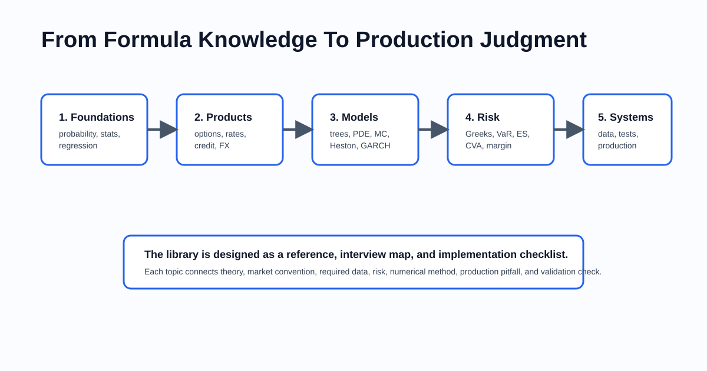

# Building An A+ Quantitative Developer Reference Library

I have been building the **Quantitative Developer Reference Library** as a practical, Markdown-first resource for quant developers.

The goal is simple: bridge the gap between knowing a formula and being able to build, validate, operate, and explain a real quantitative analytics system.

Most quant finance resources are either highly mathematical or highly fragmented. A textbook might explain a model, a code snippet might price a single product, and a desk wiki might document a convention. What is harder to find is a reference that keeps all of the following in the same frame:

- product mechanics,
- market conventions,
- pricing models,
- required data,
- numerical methods,
- risk measures,
- implementation pitfalls,
- validation checks,
- production architecture.

That is what this library is trying to become.

## What The Library Covers

The repo now has broad first-pass coverage across the main areas a quant developer is expected to understand.

### Foundations
- probability,
- statistics,
- linear regression,
- OLS diagnostics,
- beta estimation,
- model evaluation.

### Core Products
- options,
- futures and forwards,
- equities,
- FX,
- fixed income,
- interest rates,
- credit,
- commodities,
- inflation products,
- volatility products,
- financing, repo, and securities lending.

### Models And Numerical Methods
- Black-Scholes,
- binomial and trinomial trees,
- finite difference methods,
- Longstaff-Schwartz Monte Carlo,
- Heston stochastic volatility,
- GARCH-family volatility forecasting,
- Markov switching and hidden Markov models,
- Vasicek, CIR, Hull-White, and Libor Market Model style rates models,
- Monte Carlo, PDEs, trees, interpolation, calibration, and convergence checks.

### Risk And Portfolio Workflow
- Greeks,
- VaR and Expected Shortfall,
- beta and factor exposure,
- CVA and the wider xVA stack,
- regulatory margin and capital,
- portfolio construction,
- backtesting,
- VWAP, TWAP, POV, and transaction-cost analysis.

### Engineering And Controls
- market data,
- pricing architecture,
- testing and validation,
- performance and production,
- model governance,
- independent price verification,
- contribution rules,
- examples,
- validation tooling and CI.

## Why This Matters

Quant development is not only about deriving formulas.

In production, the hard problems are often hidden in details:

- day-count conventions,
- quote units,
- curve construction,
- surface interpolation,
- exercise dates,
- contract multipliers,
- dividend and borrow assumptions,
- calibration stability,
- stale market data,
- risk shock conventions,
- missing lifecycle events,
- unexplained PnL,
- benchmark leakage in backtests,
- inconsistent execution benchmarks.

A good quant developer needs to understand both the model and the system around it.

That is why every chapter in the library follows a practical contract:

- what the domain covers,
- product taxonomy and market structure,
- quoting and conventions,
- core pricing or modelling framework,
- worked examples,
- risk measures,
- required data,
- numerical and implementation approaches,
- production pitfalls,
- illustrative code,
- references and further reading.

## The Learning Path

A natural way to use the library is:

1. Start with probability, statistics, regression, and notation.
2. Learn product mechanics across options, rates, credit, FX, equities, and commodities.
3. Understand models and numerical methods.
4. Connect prices to risk, PnL explain, VaR, ES, CVA, and margin.
5. Learn the engineering layer: market data, architecture, testing, production, and governance.

The repo is also useful for interview prep because it now includes common topics that come up often:

- linear regression and beta,
- Black-Scholes and Greeks,
- American option pricing methods,
- option strategy payoffs,
- Heston and stochastic volatility,
- GARCH and regime models,
- interest-rate models,
- VaR and Expected Shortfall,
- CVA and xVA,
- VWAP, TWAP, POV, and implementation shortfall.

## What Makes It Different

The library is not trying to be a textbook.

It is trying to be a practitioner reference.

That means it does not stop at "what is the formula?" It also asks:

- What does the desk actually quote?
- What data does the engine need?
- What convention can silently change the result?
- What risk measure should be reported?
- How should this be tested?
- What breaks in production?
- How would you explain the number to a trader, risk manager, validator, or interviewer?

For example, the Heston section does not just list equations. It explains variance mean reversion, vol-of-vol, spot-vol correlation, the Feller condition, calibration stability, and numerical integration concerns.

The CVA section does not just define the acronym. It breaks the calculation into exposure, default probability, loss given default, discounting, netting, collateral, wrong-way risk, and the wider xVA stack.

The VWAP/TWAP section does not just give definitions. It explains benchmark choice, schedule shape, volume curves, participation, alpha decay, and implementation shortfall.

That is the level of practical connection I want the repo to maintain.

## Project Infrastructure

The project now includes more than chapters:

- `INDEX.md` for topic navigation,
- `READING-PATHS.md` for guided study,
- `INTERVIEW-GUIDE.md` for interview-oriented review,
- `GLOSSARY.md` for definitions and acronyms,
- `examples/` for compact worked examples,
- `CONTRIBUTING.md` and `CHAPTER-TEMPLATE.md` for consistency,
- `scripts/validate_docs.py` for local checks,
- GitHub Actions for documentation validation.

This matters because a reference library is only useful if it stays navigable and maintainable as it grows.

## Current Status

The library is now an all-round reference across:

- foundations,
- products,
- models,
- risk,
- execution,
- portfolio engineering,
- market data,
- architecture,
- validation,
- production,
- governance.

There is still room to deepen individual examples and add more calibration case studies, but the broad map is now in place.

## Closing Thought

Quant finance has no shortage of complexity.

The challenge is structure.

This repository is my attempt to create that structure: a practical reference that helps quant developers move from theory to implementation, from implementation to validation, and from validation to production confidence.

That is the standard I want the library to meet.

---

## Short Version

I built a **Quantitative Developer Reference Library**: a practical, Markdown-first resource covering probability, regression, options, rates, credit, FX, equities, commodities, volatility, risk, xVA, execution, portfolio construction, market data, pricing architecture, testing, production, and governance.

It is designed to bridge the gap between "I know the formula" and "I can build, validate, and operate this correctly."
