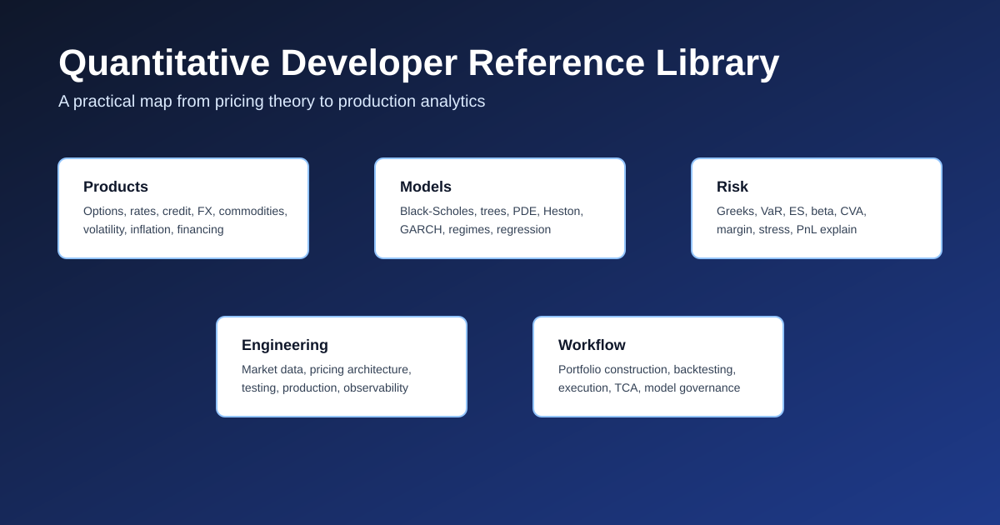

# From Map to Maintained Reference: The Quant Developer Library, Three Months Later

*Historical project article: descriptions and counts refer to the version discussed here. Use the [current README](README.md) and [documentation review](DOCUMENTATION-REVIEW.md) for current scope and validation.*

*The library now contains 32 subject chapters, 21 standalone worked examples, and 61 SVG visuals. More importantly, it has acquired the structure and quality controls needed to remain coherent as it grows.*

In April, I wrote about [why I was building the Quantitative Developer Reference Library](https://thundaxsoftware.blogspot.com/2026/04/building-quant-developer-reference.html).

At the time, I was deliberately sharing it early. The repository contained an overview and 15 subject chapters: enough to establish the shape of the project, but still very much a foundation.

A few months later, the most important change is not simply that the repository is larger.

It now has a repeatable standard for what each chapter should explain, worked examples that connect formulas to implementation checks, clearer routes through the material, and a maintenance process for keeping the content and diagrams consistent.

The project has moved from being a map of quant development to becoming a maintained working reference.

You can explore the [Quantitative Developer Reference Library on GitHub](https://github.com/JordiCorbilla/Quantitative-Developer-Reference-Library).

## What Changed

| Area | April launch | Today |
|---|---:|---:|
| Numbered documents | 16, including the overview | 33: one overview and 32 subject chapters |
| Repository SVG visuals | 0 | 61 |
| Standalone worked examples | 0 | 21 |
| Navigation | Main README | Index, reading paths, interview guide, and glossary |
| Project structure | Individual chapters | Chapter template, contribution guide, and changelog |
| Quality controls | Manual review | Automated documentation validation on pushes and pull requests |

The numbers show the expansion, but they do not fully describe it.

The original product and engineering chapters are still there, covering options, futures, equities, FX, fixed income, rates, credit, commodities, numerical methods, market data, pricing architecture, risk, and production engineering.

Around them, the library now includes subjects such as volatility products, inflation, financing and securities lending, structured credit, convertibles, total return swaps, cross-currency swaps, rates options, execution and transaction-cost analysis, regulatory capital, model governance, trade lifecycle, statistical arbitrage, and dependence modelling.

Several of the original chapters have also become considerably deeper. Options now extend into American exercise methods, strategy payoffs, practical Greeks, and Heston dynamics. Risk coverage includes VaR, Expected Shortfall, and factor-based interpretation. Rates and credit material reaches into model families, CVA, and xVA. The modelling sections include GARCH, regime-switching models, Hidden Markov Models, and probability-of-default workflows.

## Three Additions That Show the Direction

Rather than catalogue every chapter, three additions capture what I want the library to become.

### Dependence Beyond Correlation

The [dependence-modelling chapter](32-dependence-modelling-and-copulas.md) looks at copulas, tail dependence, and the difference between linear correlation and the actual joint behaviour of losses.

One correlation number cannot describe every joint loss distribution.

That matters in portfolios where apparently modest dependencies can become much stronger during stressed markets. The chapter therefore connects the mathematical construction to model choice, calibration, validation, and the danger of treating a fitted parameter as a complete description of risk.

### Large-Order Execution

The [execution and TCA chapter](20-execution-microstructure-and-tca.md) follows a parent order beyond simple VWAP or TWAP definitions.

A large order cannot be made harmless just by splitting it into smaller orders. The implementation still has to balance market impact, participation constraints, information leakage, completion risk, and opportunity cost.

An acceptable average fill can conceal the fact that too much of the order remained unexecuted while the market moved away.

That is the kind of distinction the library should capture: not only how a benchmark is calculated, but how it behaves inside a real decision process.

### The Full Trade Lifecycle

A theoretically correct price is only one stage of a successful trade.

The trade still has to move through capture, enrichment, confirmation, settlement, reconciliation, and control processes. Failures in identifiers, conventions, cashflows, or lifecycle events can invalidate an otherwise correct valuation.

Adding [trade-lifecycle and operational coverage](30-trade-lifecycle-and-operations.md) was therefore important. Quantitative development does not end when a pricing function returns a number.

## A Common Contract for Every Chapter

As the library expanded, consistency became a problem of its own.

A chapter can look detailed while quietly omitting the information an implementer actually needs. To reduce that risk, subject chapters now follow a common structure:

- product taxonomy and market structure;
- quoting and market conventions;
- core pricing framework;
- risk measures and sensitivities;
- required data, curves, surfaces, and calibration objects;
- numerical and implementation approaches;
- production pitfalls and sanity checks;
- illustrative code;
- references for deeper study.

This makes the repository easier to navigate and exposes gaps more clearly.

If a chapter discusses a formula but says nothing about its inputs, conventions, risks, or validation, the missing pieces are now obvious.

## Worked Examples as Sanity-Check Scaffolding

The repository now includes [21 standalone worked examples](examples/README.md).

They cover calculations such as:

- historical VaR and Expected Shortfall;
- a Heston variance update;
- a simplified CVA calculation;
- swap valuation and FX swap forward points;
- GARCH and regime-probability updates;
- pairs-trading signals;
- convertible parity;
- copula tail dependence;
- VWAP, TWAP, and participation-limited execution.

These are deliberately small.

They are not intended to be production-ready pricing libraries. They provide reviewable calculations that connect an equation to an implementation shape and a basic sanity check. Production systems still need conventions, calendars, data lineage, calibration controls, tolerances, and robust error handling.

## Visual Quality Is Technical Quality

The repository has also become much more visual. It now contains 59 technical SVG assets and two supporting blog visuals.

That created another maintenance problem: a diagram can be syntactically valid and still be technically misleading.

A clipped label, an arrow attached to the wrong boundary, or two overlapping shapes is not merely cosmetic when the diagram represents dependencies, cashflows, state transitions, or execution logic.

During the latest visual-quality pass, I reviewed all 61 SVGs at their native dimensions and revised 32 of them for layout, clipping, overlap, connector routing, and alignment issues.

The automated validator was also strengthened to check both visual directories, parse the SVG XML, and require dimensions, a `viewBox`, roles, and accessible title and description metadata.

Automation can catch structural defects. It cannot reliably determine whether an arrow communicates the intended relationship. That still requires visual inspection.

## Treating Documentation Like Software

The project now has its own documentation validation workflow.

On every push and pull request, the repository checks:

- local links and image references;
- required chapter sections;
- duplicate or missing top-level headings;
- SVG XML validity;
- essential SVG sizing and accessibility metadata.

The repository also has a [central index](INDEX.md), [guided reading paths](READING-PATHS.md), an [interview guide](INTERVIEW-GUIDE.md), a glossary, a chapter template, and contribution guidance.

These additions may look less interesting than a new pricing model, but they are what allow a technical reference to grow without turning into another collection of disconnected notes.

## How I Would Use the Library Today

There are now several useful entry points.

If you are moving into quantitative development, start with the [reading paths](READING-PATHS.md) and follow one product area from market structure through pricing, risk, and implementation.

If you are preparing for an interview, use the [interview guide](INTERVIEW-GUIDE.md) to identify the expected depth, then follow its links into the relevant chapters and worked examples.

If you are solving a specific engineering problem, use the [index](INDEX.md) to find the product or workflow, review its conventions and failure modes, and then use the examples as calculation scaffolding.

The repository is designed to be entered from the problem you are facing. It still does not need to be read linearly.

## What It Is and What It Is Not

The library now provides broad first-pass coverage across the field, but I do not consider it finished or exhaustive.

It is a practitioner-oriented reference, implementation checklist, and learning map.

It is not a substitute for specialist textbooks, official market documentation, production pricing libraries, or the control framework of a real institution.

That distinction matters. A useful public reference should make its limitations visible rather than hiding them behind the appearance of completeness.

## Where It Goes Next

The next phase is depth.

The priorities are:

- more end-to-end workflows connecting market data, calibration, valuation, risk, and PnL;
- deeper calibration case studies;
- broader stress-testing examples;
- more code-oriented implementations;
- stronger cross-links between products, models, and operational workflows.

Digital assets may eventually become another area of coverage, but deepening the existing material comes first.

## Closing Thought

When I published the first article, the project was a statement of intent.

It now has enough breadth to be useful as a genuine reference and enough structure to be maintained as one.

The goal is not to declare it complete. The goal is to keep making it more precise, practical, and trustworthy.

If you work in quantitative development, pricing, risk, execution, or analytics engineering, take a look at the [repository](https://github.com/JordiCorbilla/Quantitative-Developer-Reference-Library).

Use it, challenge it, and point out the assumptions, conventions, and production failure modes that deserve better coverage.

That is how a public reference becomes a useful one.
